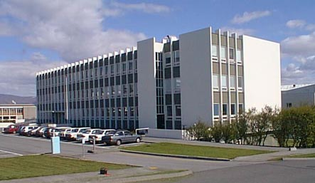

Title: Sagnfræðinám við Háskóla Íslands stokkað upp
Slug: sagnfraedinam-vid-haskola-islands-stokkad-upp
Date: 2005-11-28 20:07:00
UID: 22
Lang: is
Author: Guðmundur Jónsson
Author URL: 
Category: Sagnfræði, Í umræðunni
Tags: nám, Háskóli Íslands, sagnfræðiskor

Námsskipan í sagnfræðiskor hefur staðið að mestu óhögguð síðan henni var komið á fyrir um 30 árum. Margt hefur breyst síðan innan og utan sagnfræðinnar sem kallar á endurskoðun námsins. Gífurlegar breytingar hafa orðið í fræðigreininni sjálfri á alþjóðavísu, m.a. eru viðfangsefnin orðin miklu fjölbreyttari og landfræðilegur sjóndeildarhringur hefur víkkað. Í mörgum löndum hefur vegur alþjóðlegrar sögu aukist og samþætting þjóðarsögu og alþjóðlegrar sögu orðin miklu algengari en áður var. Samvinna hefur aukist milli háskóla og milli landa og stuðlað að meiri samlögun náms, einkum innan ríkja Evrópusambandsins. Þá hafa viðteknar forsendur og viðhorf til sagnfræði verið teknar til endurskoðunar á undanförnum áratugum og víðtæk umræða farið fram um eðli hennar sem fræðigreinar. Þessi umræða endurspeglast í auknu námi í söguheimspeki, þekkingarfræði, sagnaritun, aðferðum og kenningum í sagnfræði víða um heim. Stórstígar breytingar við öflun og miðlun þekkingar hafa kallað á nýjar hugmyndir um kennslu á háskólastigi sem leggja minni áherslu á utanbókarlærdóm en meiri á kennslu sem auðveldar nemendum að leita þekkingar, örvar þá til greiningar á viðfangsefnum og þjálfar almenna hæfileika þeirra.

Aðstæður sagnfræðinnar við Háskóla Íslands hafa líka breyst mikið. Sagnfræðin er orðin ein af fjölmennari greinum skólans með 12 fasta kennara og á þriðja hundrað nemendur. Fjölgunin er auðvitað jákvæð en hefur sína fylgikvilla, ekki síst stóra nemendahópa í skyldunámskeiðum og því er brýnt að endurskoða kennsluhættina. MA-námið hefur hins vegar ekki eflst til jafns við BA-námið og er nauðsynlegt að stokka það upp. Þrátt fyrir fjölgun nemenda hefur fjárhagur sagnfræðiskorar verið slæmur síðan nýtt fjármálakerfi var tekið upp í Háskólanum fyrir u.þ.b. sex árum og er sýnt að sagnfræðin verður að aðlaga sig að breyttu fjármálaumhverfi.

### Markmið með endurskoðun á námsskipan

Á haustmisseri 2004 skipaði sagnfræðiskor starfshóp til að endurskoða námsskipan og námsframboð í sagnfræði. Lagði hópurinn fram tillögur síðastliðið vor og hafa þær verið til umræðu innan sagnfræðskorar sem stefnir að því að koma á veigamiklum breytingum á bæði BA- og MA-stigi á næsta háskólaári. Í tillögum starfshópsins þurfti að taka tillit til margra sjónarmiða, bæði þeirra sem lúta að námsgreininni sjálfri, nemendum og fjárhagslegu umhverfi. Tillögurnar miða í stuttu máli að því að styrkja faglegan og fjárhagslegan grundvöll sagnfræðinnar, og er markmið þeirra nánar tiltekið að:

* Auka kennslu um hugtök, aðferðir og starfshætti sagnfræðinnar í því skyni að efla skilning nemenda á sérkennum sagnfræðinnar sem fræðigreinar. Jafnframt er tillögunum ætlað að auka færni nemenda til að safna og vinna úr heimildum, greina þær og setja í samhengi, rökræða og miðla þekkingu. Í þessu skyni er „aðferðanámskeiðum“ fjölgað og markvissari þjálfun tekin upp í „efnisnámskeiðum.“

* Gera námið heildstæðara og markvissara með því að taka upp skýrari framvindu (e. progression) í námi og binda námskeið við ákveðin ár. Slík námsskipan stuðlar að meiri festu og tekur meira tillit til getu nemenda. Aðferðanámskeiðin eiga að mynda samfellu og byggja hvert á öðru. Námskröfur eru auknar eftir því sem lengra líður á námið. Skyldunám er mest á fyrsta ári en síðan fjölgar valnámskeiðum þegar ofar dregur.

* Auka fjölbreytni og sveigjanleika í námi með því að draga úr vægi skyldunámskeiða. Með því að fækka yfirlitsnámskeiðum skapast meira svigrúm fyrir annars konar nám.

* Aðlaga kennsluhætti örri fjölgun nemenda.

* Ná meiri hagkvæmni í rekstri skorarinnar í samræmi við breytt starfsumhverfi innan Háskólans.

### Helstu breytingar

Hér verður stuttlega getið helstu breytinga sem ráðgerðar eru á BA-náminu, en rétt er að taka fram að nýja námsskipanin er enn í mótun. Vinnan við nýskipan MA-námsins er skemmra á veg komin og því bíður betri tíma að gera grein fyrir henni.

Ein stærsta breytingin á BA-náminu er sú að námskeið verða framvegis bundin ákveðnum misserum eða árum til að tryggja festu og stígandi í framvindu námsins. Á meðfylgjandi mynd [sjá töfluna neðst á síðu] má sjá hvernig námskeiðum er komið fyrir í nýju námsskipuninni. Í stað átta yfirlitsnámskeiða um megintímabil sögunnar, fjögurra um Íslandssögu og fjögurra um mannkynssögu, koma fjögur námskeið sem öll eru kennd á fyrsta ári. Inntak aðferðanámskeiðanna verður endurskoðað og koma nú þrjú námskeið í stað tveggja áður: Sagnfræðileg vinnubrögð (áður Aðferðir I), Sagnaritun og söguspeki (áður Aðferðir II) og nýtt námskeið, Hugtök og miðlun sögu, verður kennt á þriðja ári. Í heildina fækkar skyldunámskeiðum úr tíu í sjö og því verður val nemenda meira. Brautakerfið svokallaða verður lagt niður en nemendum á öðru ári gert að velja sérsvið í sagnfræði þar sem þeir kynnast viðfangsefnum, aðferðum og álitamálum á afmörkuðum sviðum.

Ýmsar aðrar hugmyndir eru í deiglunni, m.a. um inntak yfirlitsnámskeiða, kennsluhætti og þátttöku doktorsnema í kennslu, sem hér gefst ekki rúm til að ræða um. Það er því deginum ljósara að kennarar í sagnfræðiskor munu ekki staðnæmast við breytingar á sjálfu námsskipulaginu heldur eru tilbúnir til að endurskoða aðra þætti náms og kennslu sem líklegir eru til þess að gera sagnfræðinámið enn betra en það er í dag.

### BA-nám til 90 eininga

* #### 1. ár
  * 1\. misseri:
    * Sagnfræðileg vinnubrögð
    * Heimssaga fram um 1815
    * Íslandssaga fram um 1815
  * 2\. misseri:
    * Valnámskeið
    * Heimssaga eftir 1815
    * Íslandssaga eftir 1815
* #### 2. ár
  * 3\. misseri:
    * Sagnaritun og söguspeki, Forspjallsvísindi
    * Valnámskeið
    * Valnámskeið
  * 4\. misseri:
    * Sérsvið í sagnfræði: a. stjórnmálasaga / b. hugmynda- og menningarsaga / c. félags- og hagsaga
    * Valnámskeið
    * Valnámskeið
* #### 3. ár
  * 5\. misseri:
    * Hugtök og miðlun sögu
    * Valnámskeið
    * Valnámskeið
  * 6\. misseri:
    * Valnámskeið
    * Ritgerð, 10 ein.
