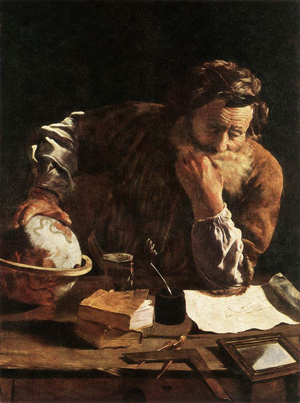

Title: Samastaður í tilverunni
Slug: samastadur-i-tilverunni
Date: 2007-05-08 15:59:00
UID: 156
Lang: is
Author: Unnur María Bergsveinsdóttir
Author URL: http://unnur.klaki.net
Category: Í umræðunni
Tags: 

Í JL-húsinu við Hringbraut er hægt að kaupa gulrætur og kartöflur, tilbúinn mat, frosinn kjúkling, höfuðverkjatöflur, plástra og hægðalyf. Þröngur stigagangurinn gengt innganginum lætur ekki mikið yfir sér og það er auðvelt að ganga inn og út úr Nóatúni, inn og út úr apótekinu án þess að leiða hugann að því hvað fari fram á efri hæðum hússins. Þeir sem í gær áttu leið um anddyrið hefðu hinsvegar getað látið undurfagra tóna lúðra og klingjandi kampavínsglasa lokka sig upp þrepin alla leið upp á fjórðu hæð þar sem þeim hefði mætt brosandi hópur prúðbúins fólks, akademónar í afmælisstuði. 

Í gær fagnaði [ReykjavíkurAkademían](http://www.akademia.is/) 10 ára afmæli sínu. ReykjavíkurAkademían er samfélag sjálfstætt starfandi fræðimanna, frjáls og óháð hvað pólítíska hugmyndafræði varðar.  Á þeim tíu árum sem liðin eru frá stofnun hennar hafa um 280 manns haft aðstöðu í húsnæði hennar í JL-húsinu við Hringbraut, mestmegnis hug- og félagsvísindafólk en einnig rithöfundar, listamenn og allra handa spekúlantar. Auk þess að sinna rannsóknum tekur Akademían ásamt félögum hennar að sér verkefni fyrir ríki og sveitarfélög, stofnanir og einstaklinga, stendur fyrir málþingum og útgáfustarfssemi fræðirita og á í samstarfi við ýmis fræðasetur og háskólastofnanir, bæði innlendar og erlendar. Innan veggja ReykjavíkurAkademíunnar starfa fjölmörg félög og eru þau meðal annars Hagþenkir, Kviksaga, heimildamyndamiðstöð, Vefritin Kistan, Hugsandi og Glíman, Miðstöð einsögurannsókna, Leikminjasafn Íslands, Markmál, NN fjölmiðlaþjónusta, Penna sf., Lestrarsetur Rannveigar Lund, Hoffmannsgallerí, Náttúruverndarsamtök Íslands, Jafnréttisstofa, Rannsóknarstofnun um mannlegt atferli, Mirra, miðstöð innflytjendarannsókna og Varp, miðlunardeild RA. Þá hefur Viðskiptaháskólinn á Bifröst einnig aðstöðu í húsinu og þar er, í samstarfi við stéttarfélagið Eflingu, rekið bókasafn Dagsbrúnar. 

Mikilvægi ReykjavíkurAkademíunnar felst þó ekki í því að hún sjái fræðafólki fyrir góðri og ódýrri vinnuaðstöðu heldur fyrst og fremst í því að þar koma saman fræðimenn úr ólíkum áttum. Reykjavíkurakademían er ekki bara staður heldur fyrst og fremst öflugt og fjölbreytt samfélag. Hér er um raunverulegan þverfaglegan vettvang að ræða, ólíkan hefðbundnu háskólasamfélagi þar sem samgangur á milli deilda er ekki almennur. 

Ég var tekin inn í ReykjavíkurAkademíuna haustið 2004. Félagi minn leigði á einni skrifstofunni eitt fjögurra borða í félagi við ungan sagnfræðing. Sá síðarnefndi ætlaði í burtu í nokkra mánuði og vildi framleigja hálfa borðið sitt. Ég sló til og til að gera langa sögu stutta ílengdist ég í ReykjavíkurAkademíunni í rúm tvö ár og endaði með fínasta prívatkontór uppi á fimmtu hæð með útsýni yfir Akrafjallið, Skarðsheiðina og upplifði hinn fjólubláa draum fræðimannsins. 

Við inntöku var ég komin um það bil hálfa leið í gegnum meistaranám í sagnfræði og til að byrja með var ég frekar feimin við allt það merkilega fólk sem þarna gekk um gangana og drakk kaffi á kaffistofunni. Ég man líka að mér fannst það pínulítið vandræðalegt að segja frá því að ég væri að leigja mér skrifstofu til að stunda námið mitt í. Ég hafði þó þá sæmilega skotheldu afsökun að á þeim tíma bjó ég í litlu leiguherbergi þar sem var tæplega pláss fyrir rúmið mitt, hvað þá meira og þar sem ég borgaði einnig hlut í leigu fyrir æfingahúsnæði sneri ég afsökuninni oft upp í brandara um það að í raun og veru leigði ég heila íbúð sem væri bara dreifð í pörtum um Reykjavík. Stundum dinglaði ég húsvarðarlegri lyklakippunni orðum mínum til áhersluauka. 

Ég komst fljótt að því að þeir lyklar á kippunni sem gengu að ReykjavíkurAkademíunni gengu að mun meiru en bara þeim fermetrum sem skrifborðið mitt stóð á. Þessir tveir silfruðu lyklar opnuðu fyrir mér heilt samfélag. Í hádeginu var kaffistofan þéttsetin fræðafólki af öllum aldri og af öllum sortum sem umhverfis langborð ræddu saman um hin ólíkustu málefni. Enginn er eyland, sagði einhver einhverntíman og á það sérdeilis vel við um þá sem leggja stund á akademísk fræði. Fyrir manneskju sem hafði tekið stefnuna á langt nám var það sérstakt happ að komast í beina tengingu við samfélag á borð við ReykjavíkurAkademíuna. Í ReykjavíkurAkademíunni er umræðan lifandi og frjó og þar hafa áhugaverðir rannsóknarhópar orðið til. Dæmi um slíka sellu er hópurinn Ísland og ímyndir norðursins sem stóð í fyrra fyrir [samnefndri ráðstefnu](http://www.akademia.is/imagesofthenorth/NORTHWORKSHOP/icelandic/INDEX.htm). Hópurinn hlaut í ár öndvegisstyrk Rannís og er hann vel að þeim heiðri kominn. 

Í slíku húsi er ómögulegt að læðast með veggjum og eftir því sem leið á dvöl mína í ReykjavíkurAkademíunni fór ég að verða áræðnari. Ég tók að spyrja þá sem ég hitti í kaffistofunni spurninga, hóf að taka þátt í umræðum og því fleiri spurninga sem ég spurði, því fleiri umræðum sem ég tók þátt í því minna leið mér eins og laumufarþega um borð í hinu akademíska skipi. Því fór jafnvel að hvarfla að mér að mögulega væri jafnvel eitthvað vit í hinu og þessu sem ég var að spá og spekúlera. Í samræðum á kaffistofunni skildi ég líka fyrst hvílík dyggð eljusemin er. 

Jafnframt því að fá innsýn inn í líf fræðafólks sem ég leit upp til heyrði ég sögur af því hvernig ReykjavíkurAkademían hefði orðið til. Hvernig stofnfélagar hefðu tekið húsnæðið í gegn, slegið upp milliveggjum, lagt gólfefni, málað og dregið í. Hér höfðu ekki verið kallaðir til arkítektar eða fengshui spesíalistar heldur var ReykjavíkurAkademían bókstaflega byggð á sameiginlegri hugsjón, af hörku, svita og með mörðum fræðimannafingrum. 

Sérstaða ReykjavíkurAkademíunnar er meiri en margir gera sér grein fyrir. Hún er óvenjulegt fyrirbæri og sú djörfung sem stofnendur hennar sýndu fyrir tíu árum er sjaldgæf. Samfélög fræðafólks í hug- og félagsvísindum eru flest mynduð utan um háskóladeildir eða aðrar stofnanir. Sherril Grace, prófessor við University of British Columbia og forseti Hugvísindadeildar "The Royal Society of Canada sagði um ReykjavíkurAkademíuna: _"Í Kanada eru stofnanir af sama tagi (og RA) til innan raunvísinda, læknisfræði og hagfræði — þar eru þær nefndar "hugveitur" — en ekki á sviði hugvísinda. Starfsemi ykkar er einstök og því er þeim mun meiri ástæða til að dást að hugrekki ykkar, frumkvæði og árangri."_.  

Það er við hæfi að óska ReykjavíkurAkademíunni til hamingju með afmælið og þann glæsilega árangur sem hún hefur náð, - að skapa sjálfstætt starfandi fræðimönnum vettvang og samastað í tilverunni. 

