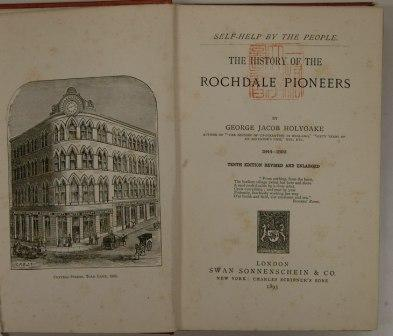
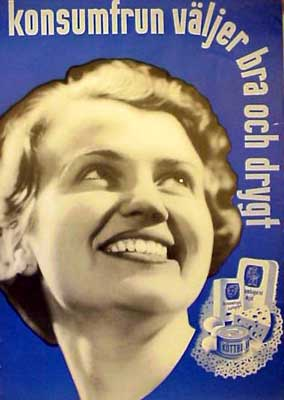
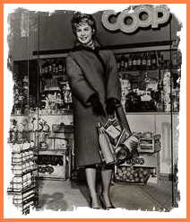

Title: Samvinnuhreyfingin og neyslubyltingin
Slug: samvinnuhreyfing
Date: 2007-09-18 10:53:00
UID: 176
Lang: is
Author: Magnús Sveinn Helgason
Author URL: 
Category: Neyslusamfélagið, Sagnfræði
Tags: Co-op, samvinnuhreyfing, neysla, neytendasamvinnufélag, Peter Gurney, Consumers against Capitalism?, Ellen Furlough, Martin Purvis, verkalýðssaga, E.P. Thompson, Car Strickwerda, neyslusamfélag, kaupfélag, Scale and Scope, The Cooperative Wholesale Society, Rochdale, samvinna, verslun, viðskipti, CWS, hagræðing, Taylorismi, Victoria de Grazia

Fram til þessa hafa sagnfræðingar sýnt samvinnuhreyfingunni og neytendasamvinnufélögum fádæma áhugaleysi.[^1]  Breski sagnfræðingurinn Peter Gurney talar í þessu sambandi um „the marginalization of this subject within academic discourse“. Saga hreyfingarinnar hefur nánast alfarið verið afgreidd í hátíðarritum, gefnum út af hreyfingunni sjálfri. Eins og Peter Gurney bendir á hefur saga samvinnuhreyfingarinnar því verið frekar hlutdræg og uppskrúfuð, og í mörgum tilfellum hefur einnig skort á sagnfræðileg vinnubrögð.[^2]

Á síðustu árum hefur þó orðið vakning meðal sagnfræðinga þegar kemur að sögu evrópskar samvinnuhreyfingar. Að vísu er þessi vakning enn frekar takmörkuð en hún er engu að síður mikilvæg. Hér ber fyrst að nefna bókina _Consumers against Capitalism?_ sem er greinasafn um sögu evrópskra samvinnuhreyfinga, en inngangskafli þess er ein fyrsta tilraunin til að skoða sögu evrópsku neytendasamvinnuhreyfingarinnar sem eina heild.

Auk _Consumers against Capitalism_ eru mikilvægustu framlögin til rannsókna á sögu neytendasamvinnufélaga bók Ellen Furlough um sögu frönsku samvinnuhreyfingarinnar og rannsóknir Peter Gurney og Martin Purvis á Bresku samvinnuhreyfingunni.[^3]  Flestar þessara rannsókna hafa verið skrifaðar sem framlag til verkalýðssögu, enda bendir Gurney á að hún varpi ljósi á menningarsögu verkalýðsins og Furlough talar um að saga neytendasamvinnufélaga opni okkur „glugga í sögu verkalýðsstéttarinnar“. Áhuga verkalýðssögufræðinga á samvinnuhreyfingunni má rekja til „föður“ nútíma verkalýðs- og félagssögu, E.P. Thompson, sem greindi í samvinnuhreyfingunni leifar af efnahagslegri siðferðiskennd alþýðunnar:

The breathrough of the new political economy of the free market was also the breakdown of the old moral economy of provision. ... The moral economy of the crowd took longer to die: it is picked up by the early co-operative flour mills, by some Owenite socialists, and it lingered on for years somewhere in the bowels of the Co-operative Wholesale Society.[^4]

Í inngangi _Consumers against Capitalism_ benda Furlough og Carl Strickwerda einnig á að saga samvinnuhreyfingarinnar geti varpað ljósi á sögu neyslusamfélagsins. Því miður er þó enn langt í land að neyslusögufræðingar hafi veitt samvinnuhreyfingunni nægilega athygli. Kaupfélaga er sjaldan minnst, hvað þá að tilraun hafi verið gerð til að meta kerfisbundið hlutverk þeirra í myndun fjöldaneyslusamfélagsins.[^5]  Sömu leiðis hafa viðskiptasögufræðingar og sagnfræðingar sem rannsakað hafa myndun stórfyrirtækja litið framhjá samvinnuhreyfingunni. Í _Scale and Scope_, sem fjallar um myndun stórfyrirtækja í Bandaríkjunum, Bretlandi og Þýskalandi, minnist Alfred Chandler Jr. til dæmis varla á breska samvinnusambandið, _The Cooperative Wholesale Society_, CWS, þó það hafi verið eitt stærsta fyrirtæki Bretlands.[^6]

Hefð er fyrir því að telja fyrsta kaupfélagið stofnað í Rochdale, Englandi 1844. Tilgangur félagsins var tvíþættur. Annarsvegar háleit hugsjónamennska: Samvinnumenn stefndu að stofnun „samvinnuríkisins“ (_the cooperative commonwealth_), samfélagi þar sem verslunarhagnaður og allur gróði hefði verið afnuminn, framleiðsla væri í höndum samvinnufélaga og hefði það markmið eitt að fullnægja þörfum neytenda. Hins vegar hafði samvinnuhugsjónin einföld og „praktísk“ markmið: að sjá heimilum verkamanna fyrir ódýrum og ósviknum nauðsynjum, matvælum og öðrum neysluvörum.

Þörfin eða eftirspurnin virðist hafa verið fyrir hendi, því samvinnuhugsjónin breiddist hratt út og kaupfélög spruttu upp, fyrst í Englandi en síðan á meginlandinu. Kaupfélög settu svip sinn á verkamannahverfi stórborga, náma og verksmiðjubæi. Gurney og Furlough lýsa mikilvægi kaupfélaga fyrir götumynd og menningarlíf verkamannahverfa í Frakklandi og Englandi, þar sem þau þjónuðu sem miðstöðvar pólítísks starfs og menningarlífs. Kaupfélög voru einnig mikilvægasta gátt verkamanna og fátækari neytenda að vaxandi neyslumöguleikum iðnaðar og borgarsamfélagsins. Samtíðarmenn töluðu um þau sem _grand magasin_ verkalýðsins.[^7]

Það þarf ekki að leita lengi að ástæðum þessarar velgengni. Smásöluverslun og matvælaverslun var víðast hvar í höndum smákaupmanna og torgsölumanna sem skorti yfirleitt bæði rekstrarfé og eiginfé. Verslunarhúsnæði var því oft lélegt og hreinlæti mjög ábótavant. Þá virðist það hafa verið algengt að skemmdur eða svikinn varningur hafi verið seldur — óprúttnir kaupmenn notuðu falskar vogir, mjöl var oft blandað kalkdufti og kaffi var blandað með sagi. Þessir viðskiptahættir voru ekki síst afleiðing fátæktar og efnahagslegs óöryggis smákaupmanna sem höfðu ekki efni á að fylgja bestu viðskiptaháttum. Tíðni gjaldþrota var mjög há, en fjöldi verslana var engu að síður slíkur að hugtakið „kaupmaðurinn á horninu“ átti við: Samkvæmt tölum frá Malmö í Svíþjóð þjónaði hver matvöruverslun að meðaltali aðeins 30-40 heimilum.[^8]  Í sumum náma og verksmiðjubæjum stóðu verkamenn síðan frammi fyrir öðrum vanda: í „fyrirtækisbæjum“ var engin samkeppni í verslunarrekstri heldur þurftu verkamenn að gera öll innkaup í verslun atvinnurekandans.

Samvinnuhreyfingin óx hratt á fyrstu áratugum aldarinnar og fræðimenn eru á einu máli um að „gullöld“ evrópskra samvinnuhreyfinga hafi verið á millistríðsárunum. Enska samvinnuhreyfingin var tvímælalaust sú stærsta, en áætlað hefur verið að á þriðja áratugnum hafi þriðja hver fjölskylda í Englandi verið meðlimir í samvinnufélagi. Smákaupmenn upplifðu þennan vöxt samvinnuhreyfingarinnar sem alvarlega ógn við afkomu sína og börðust fyrir því að sett væru lög sem takmörkuðu vöxt jafnt samvinnufélaga og verslunarkeðja. Þessi andstaða smákaupmanna gegn samvinnuhreyfingunni varð sérstaklega einbeitt í Weimar-Þýskalandi.

Samvinnufélögin og samvinnusambönd sem stofnuð voru undir lok 19. aldar komu sér upp eigin iðnrekstri og framleiddu unnin matvæli og aðrar ódýrar neysluvörur. Árið 1939 rak CWS 182 verksmiðjur þar sem störfuðu yfir 60.000 verkamenn. Mikið af vörum sem seldar voru í kaupfélögum voru því seld undir merki hreyfingarinnar. Í Englandi komu um 60% af öllum vörum sem kaupfélög seldu frá samvinnusambandinu, mikið af þeim í pakkningum merktum vörumerkjum sambandsins. Annarstaðar var þetta hlutfall nokkuð lægra, en þó mjög hátt. Í Svíþjóð var þetta hlutfall t.d. um 40%. Þessu fylgdu samræmdar markaðssetningarherferðir á landsvísu.

Vöxtur hreyfingarinnar virðist því i auknu mæli hafa verið knúinn áfram af samvinnusamböndunum. Þó kaupfélög hafi verið sjálfstæðar einingar urðu þau í vaxandi mæli nánast að útsölustöðum fyrir samvinnusamböndin sem tóku stöðugt ákveðnari skref til að samræma starf kaupfélaganna.

Samvinnuhreyfingin var brautryðjandi í rekstri verslunarkeðja og stórverslana í smásöludreifingu. Fastur liður í áróðri samvinnumanna var að skipulag smásöluversluninarinnar væri óhagkvæmt og órökvíst — verslanir væru of margar og smáar, sem aftur leiddi til óeðlilega hás vöruverðs. Hagræðing og stærðarhagkvæmni voru lykilhugtök í málflutningi hreyfingarinnar, og smærri kaupfélög voru hvött til að sameinast og mynda stærri rekstrareiningar sem hefðu lægri rekstrarkostnað. Önnur mikilvæg ástæða fyrir að kaupfélög voru hvött til að sameinast, var að leiðtogum hreyfingarinnar þótti skorta á samstöðu og samvinnu milli einstaka samvinnufélaga. Samkeppni milli kaupfélaga var einnig vandamál.

Með því að fækka litlum sjálfstæðum kaupfélögum mætti líka betur samhæfa krafta hreyfingarinnar fyrir auglýsinga- og ároðursherferðir og skapa hreyfingunni samræmda ímynd. Samvinnusambönd Svíþjóðar og Frakklands lögðu á millistríðsárunum mikið upp úr því  að samræma bæði innra og ytra útlit kaupfélaga. Sænska samvinnusambandið rak arkitektaskrifstofu sem hannaði nýjar verslanir og nútímalegar og „rökréttar“ innréttingar fyrir eldri verslanir.

Samvinnumenn voru með áköfustu talsmönnum „hagræðingarstefnunnar“ á millistríðsárunum. Samvinnumenn héldu því fram að sóun og óhagkvæmni væru ekki aðeins alvarlegt vandamál í framleiðslu og vörudreifingu — heimilin yrðu líka að taka sig á. Neytendur, sérstaklega húsmæður, yrðu að tileinka sér hugsanagang Taylorismans og læra „rökrétta“ neysluhætti. Konur voru hvattar til að skipuleggja matarútgjöld viku fram í tímann, huga að næringargildi matvæla og ná fram tímasparnaði með því að skipuleggja vinnu sína.

Hagræðingar&shy;heimspekin, fjölda&shy;markaðs&shy;setning, stærri smásölu&shy;einingar og staðlaðar verslunar&shy;keðjur voru allt mikilvæg einkenni fjölda&shy;neyslu&shy;samfélagsins sem var að taka á sig mynd á milli&shy;stríðs&shy;árunum. Í því sambandi hefur Victoria de Grazia talað um að á milli&shy;stríðs&shy;árunum hafi „borgaralegt“ neyslu&shy;samfélag nítjándu aldar, sem einkenndist af smákaup&shy;mönnum, óstöðluðum og stað&shy;bundnum vörum, tekið að víkja fyrir „Taylorísku“ fjölda&shy;neyslu&shy;sam&shy;félagi. Svo virðist sem sam&shy;vinnu&shy;félög neytenda hafi leikið mikilvægt hlutverk í þessari umbreytingu.[^9]

Eftir stríð héldu samvinnu&shy;hreyfingar Norðurlanda, Bretlands og Austurríkis ekki aðeins áfram að vaxa, heldur höfðu þær áfram markaðsforystu á mörgum sviðum. Neytendasamvinnufélög héldu einnig áfram að vera í fylkingarbrjósti þegar kom að því að innleiða nýjungar og nútímalega verslunarhætti, eins og sjálfsafgreiðslu og stórmarkaði. Í lok sjötta áratugarins voru t.d. 90% allra sjálfsafgreiðsluverslana í Bretlandi í eigu samvinnuhreyfingarinnar.

Samvinnuhreyfingin virðist þó hafa misst damp á eftirstríðsárunum og á níunda og tíunda áratugnum stóðu flestar samvinnuhreyfingar Evrópu frammi fyrir alvarlegri kreppu. Fræðimenn greinir á um orsakirnar. Margir virðast telja að hreyfingin hafi ekki getað aðlagast hröðum breytingum á fjöldaneyslusamfélagi eftirstríðsáranna og hafi orðið undir í samkeppni við verslunarmiðstöðvar og stöðugt stærri stórmarkaði í nýjum úthverfum. Ellen Furlough heldur því þannig fram að samvinnuhreyfingin hafi ekki getað keppt við „draumaveröld“ kapítalískrar fjöldaneyslu. Aðrir telja að samvinnuhugsjónin, sem knúði hreyfinguna áfram á 19. öld og fyrri hluta 20. aldar, hafi glatast þegar hreyfingin reyndi að hafa við stórkaupmönnum.

Hver sem skýringin er virðist óumdeilanlegt að saga og örlög samvinnuhreyfingarinnar eru samofin framþróun og sögu neyslusamfélagsins og breytinga á neysluháttum almennings. Saga hennar hefur hins vegar verið skrifuð sem saga baráttu verkalýðsins gegn kapítalískum framleiðsluháttum og saga neyslusamfélagsins hefur verið skrifuð nánast alfarið út frá sögu keppinauta samvinnuhreyfingarinnar. Framlag samvinnuhreyfingarinnar til þróunar neyslusamfélagsins hefur því fengið litla sem enga athygli.

---

__15. desember 2007:__ Höfundur óskar að tekið sé fram: Þessi grein er fyrstu drög að stærra verki sem er í vinnslu.

[^1]: Ég mun einskorða mig við neytendasamvinnufélög — evrópska samvinnuhreyfingin var fyrst og fremst neytendahreyfing. Íslensku og dönsku samvinnuhreyfingarnar sem voru að uppistöðu samvinnufélög framleiðenda heyrðu til undantekninga.

[^2]: Peter Gurney, _Co-Operative Culture and the Politics of Consumption in England, 1870-1930_ (Manchester 1996), bls. 3 og Peter Gurney, „Labor’s Great Arch: Cooperation and Cultural Revolution in Britain, 1795-1926“, _Consumers against Capitalism? Consumer Co-Operation in Europe, North America, and Japan, 1840-1990_. Ritstj. Ellen Furlough og Carl Strikwerda (Lanham 1999), bls. 135-172, tilvitnun bls. 140.

[^3]: Peter Gurney, _Co-Operative Culture_. — Ellen Furlough, _Consumer Cooperation in France. The Politics of Consumption, 1834-1930_. (Ithaca, NY, 1991). — _Consumers against Capitalism? Consumer Co-Operation in Europe, North America, and Japan, 1840-1990_. Ritstj. Ellen Furlough og Carl Strikwerda (Lanham 1999). — Martin Purvis, „Societies of consumers and consumer societies: co-operation, consumption and politics in Britain and continental Europe c. 1850—1920“,_Journal of Historical Geography_ 24:2 (jan. 1998), bls. 147—169. — Martin Purvis, „Crossing urban deserts: consumers, competitors and the protracted birth of metropolitan co-operative retailing“,_The International Review of Retail, Distribution and Consumer Research_ 9:3 (júlí 1999), bls. 225—243. — Victoria Kelley, „The Equitable Consumer: Shopping at the Co-Op in Manchester“,_Journal of Design History_ 11:4 (1998), bls. 295-310.

[^4]: E.P. Thompson, “The Moral Economy of the English Crowd in the Eighteenth Century” _Past and Present_ 50 (feb. 1971), bls. 76-136, tilvitnun á bs. 89.

[^5]: Þannig er hlutur kaupfélaga mjög lítill í bók Victoria de Grazia, _Irresistibe Empire. America’s advance through twentieth-century Europe_ (Cambridge, Mass. 2005), sem er líklega metnaðarfyllsta tilraunin til að skrifa sögu evrópsks neyslusamfélags á 20. öld. Hlutur kaupfélaga er enn rýrri í mikilvægustu greinarsöfnunum um evrópsk neyslusamfélög, _The Sex of Things. Gender and Consumption in Historical Perspective_. Ritstj. Victoria De Grazia og Ellen Furlough (Berkeley 1996) og _The Politics of Consumption: Material Culture and Citizenship in Europe and America_. Ritstj. M J Daunton og Matthew Hilton (Oxford 2001). Samvinnufélög ber á góma í greinarsafninu _The Expert Consumer. Associations And Professionals in the Consumer Society_. Ritstj. Alain Chatriot, Marie-Emmanuelle Chessel og Matthew Hilton (Aldershot 2006) þó enginn höfunda reyni kerfisbundið að meta sögulegt mikilvægi þeirra. Mikilvægasta undantekningin virðist vera bók Matthew Hilton um breskt neyslusamfélag, _Consumerism in Twentieth Century Britain, the Search for a Historical Movement_ (Cambridge 2003). Hilton skoðar samvinnuhreyfinguna þó fyrst og fremst út frá pólítískum áhrifum hennar, en ekki áhrifum hennar á mótun bresks neyslusamfélags.

[^6]: Alfred D., Jr. Chandler, _Scale and Scope: The Dynamics of Industrial Capitalism_ (Cambridge, Mass. 1990). Þróun CWS eru gerð skil í G.D.H. Cole, _A Century of Co-operation_, (Manchester 1945).

[^7]: Ellen Furlough, _Consumer Cooperation in France_, bls. 1. Vöruhúsin hafa verið talin mikilvægasta einkenni neyslusamfélags 19 aldar, sjá Rosalind H. Williams, _Dream worlds. Mass Consumption in Late Nineteenth-Century France_ (Berkeley 1982). Þeim er lýst í skáldsögu Emile Zola, _Au bonheur des dames_ (The ladies’ delight). Ritstj. og þýð. Robin Buss (London 2001). Frægasta vöruhús Parísar, _Bon Marché_ hefur verið gerð skil af Michael B. Miller, _The Bon Marché. Bourgeois Culture and the Department Store, 1869-1920_ (Princeton, N.J. 1981).

[^8]: Katarina Friberg, _The workings of co-operation. A comparative study of consumer co-operative organization in Britain and Sweden, 1860 to 1970_ (Göteborg 2005), bls. 154.

[^9]:  Victoria De Grazia, „Changing Consumption Regimes in Europe, 1930—1970: Comparative Perspectives on the Distribution Problem“,_Getting and Spending: European and American Consumer Societies in the Twentieth Century_. Ritstj. Susan Strasser, Charles McGovern og Matthias Judt (Cambridge 1998), bls. 59—84.

