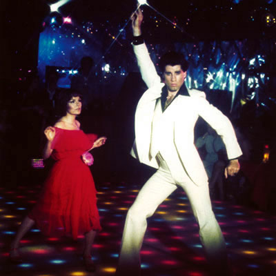
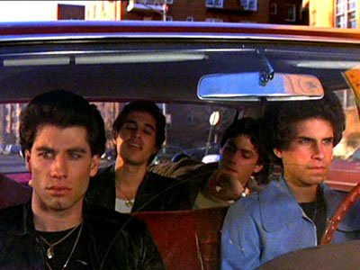

Title: Saturday Night Fever
Subtitle: Kynhlutverk diskódraumsins
Slug: saturday-night-fever-kynhlutverk-diskodraumsins
Date: 2008-03-13 14:05:00
UID: 228
Lang: is
Author: Vala Jónsdóttir
Author URL: 
Category: Tónlist
Tags: Saturday Night Fever, John Travolta, Tony Manero, Hollywood, New Yorker Magazine, diskó, diskótek, ungmenni, Saturday Night Fever The Orignial Soundtrack, Bee Gees, Stayin' Alive, Night Fever, How Deep is your love, You should be dancing, Brooklyn, dans, Annette, Stephanie Mangano, Manhattan, Menntaskólinn við Hamrahlíð

Myndin _Saturday Night Fever_ kom út í desember árið 1977 og var John Travolta þar í aðalhlutverki sem ungi maðurinn Tony Manero. John Travolta var ein skærasta stjarna Hollywood á þessum árum. Naut hann sérlega mikillar hylli hjá unglingum og var hann eitt helsta átrúnaðargoð þeirra. Handrit myndarinnar var unnið út frá blaðagrein er birtist í _New Yorker Magazine_ í júlí árið 1976, en greinin fjallar um lífstíl æsku þess tíma. Samkvæmt greininni strituðu flest ungmenni alla virka daga en slepptu sér lausum á laugardagskvöldum og dönsuðu á diskótekum.[^1]

Myndin sló í gegn þegar hún kom út.[^2]  Mánuði áður en _Saturday Night Fever_ var frumsýnd kom tónlistin úr myndinni út á breiðskífu, en um tónlistina sáu m.a. hljómsveitin Bee Gees, sem var gífurlega vinsæl diskóhljómsveit. _Saturday Night Fever The Original Soundtrack_ hljómplatan er mest selda kvikmyndatónlistarplata í heimi og inniheldur m.a. lög sem flestir kannast við í dag, eins og „Stayin' Alive“, „Night Fever“, „How Deep Is Your Love“ og „You Should Be Dancing“ en öll þessi lög eru með Bee Gees. Með útkomu myndarinnar og plötunnar varð gífurleg aukning á vinsældum diskó tónlistar, en fyrir útkomu _Saturday Night Fever_ naut diskóið aðeins vinsælda hjá þröngum hópi ungs fólks.[^3]

Söguþræði myndarinnar er ætlað að endurspegla samfélag unga fólksins á þessum tíma. Myndin fjallar um Tony Manero, ungan mann sem vinnur í málningarverslun. Hann býr í Brooklyn hjá móður sinni, föður og systur og eru þau frekar fátæk. Tony hefur hinsvegar mikla danshæfileika og fer á hverju laugardagskvöldi í aðalklúbbinn í Brooklyn þar sem diskóið er að sjálfsögðu allsráðandi í klæðnaði, tónlist og dansi. Þar eyðir hann kvöldinu sem konungur dansgólfsins. Kvöld eitt á klúbbnum ákveður Tony að reyna fyrir sér á dansbrautinni og að taka þátt í danskeppni til að sýna fram á hæfileika sína.[^4]

Vegna geysilegra áhrifa sem myndin hafði, og þá sérstaklega á unga fólkið, er athyglisvert að velta fyrir sér hlutverkum kvenna í myndinni. Það eru þrjár konur í lífi Tonys í þessari mynd; móðir hans, stúlkan Annette sem er ástfangin af Tony og reynir allt til að ná hylli hans og síðast en ekki síst Stephanie Mangano sem Tony verður ástfangin af. Mamma Tonys er frekar lítt spennandi persóna, hún er heimavinnandi húsmóðir, mjög trúrækin en virðist ekki vera sérstaklega hamingjusöm. Móðir Tonys er að sjálfsögðu sett í hlutverk hinnar sínöldrandi móður, sem krefst of mikils af börnum sínum og ógerlegt er að gera til geðs.[^5]

Ef hlutverk Annette er skoðað, þá er hún yfir sig ástfangin af Tony. Þau dansa saman í byrjun myndarinnar en Tony er afskaplega leiðinlegur og dónalegur við hana á milli dansa. Annette gerir allt sem í hennar valdi stendur til að reyna að ná hylli Tonys, hún gengur á eftir honum á allan hugsanlegan hátt en það gengur ekki upp. Vegna þess hve langt Annette gengur í tilraunum sínum til að heilla Tony sýnir hann henni mikla lítilsvirðingu. Annette kemur ekki fyrir sem sérlega klár persóna. Þegar henni er loksins orðið ljóst að Tony vill hana alls ekki er það eina sem henni dettur í hug, til að ná sér niður á honum, að drekka sig mjög ölvaða og sofa hjá vini Tonys.[^6]

Stephanie er stúlkan sem Tony er skotinn í. Hún vinnur á Manhattan og er að flytja þangað frá Brooklyn. Þykir henni Tony ekki merkilegur pappír í samanburði við ríku strákana á Manhattan. Stephanie er hinsvegar góður dansari og því samþykkir hún boð Tonys er hann biður hana um að vera dansfélagi sinn í danskeppninni. Tony var þegar byrjaður að æfa með Annette en hann hikar ekki við að láta hana fjúka fyrir Stephanie. Stephanie er hinsvegar of upptekin af glamúrlífinu á Manhattan til að vilja mann eins og Tony. Hinsvegar leyfir hún honum að snúast í kringum sig, hún biður hann hjálpa sér með ýmis verkefni, leyfir honum að bjóða sér út að borða og síðast en ekki síst lætur hún hann bíða eftir sér. Tony virðist ekki vera eini maðurinn á þessum forsendum í lífi Stephanie og fær maður það á tilfinninguna við áhorf myndarinnar að Stephanie sé aðeins of viss um eigið ágæti. Þegar líða fer á myndina fer Stephanie hinsvegar smám saman að láta undan gífurlegum töfrum Tonys. Stephanie er hinsvegar ekki tilbúin til að sofa hjá Tony. Reynir hann að þvinga hana til samfara með valdi.  Stephanie tekst að víkja sér undan Tony og hleypur á brott. Morguninn eftir fer Tony heim til Stephanie til að biðjast afsökunar og Stephanie tekur beiðninni fagnandi, gengur að Tony og kyssir hann á kinnina og endar myndin þannig.[^7]

Mér finnst merkilegt að hugsa til þess hvað konurnar í myndinni eru klisjukenndar og leiðinlegar persónur. Ótrúlegt er að myndin skuli enda á því að Stephanie taki því eins og ekkert sé að maðurinn sem hún er búin að vera að hitta skuli hafa reynt að nauðga henni. Mér finnst skelfilegt að senda þessi skilaboð til fólks, því á þennan hátt kemur það út sem að nauðgun sé ekki neitt sérlega alvarlegur glæpur. Konurnar í myndinni eru veikgeðja og það er ekkert sérstakt í persónuleika þeirra sem heillar eins og t.d. í persónuleika Tonys. Tony er góður dansari, hann er töffari og vinamargur, klæðir sig vel og þorir að gera það sem hann vill. Annette virðist ekki hafa neitt sérstakt til brunns að bera, fyrir utan að vera sæt og ágætur dansari. Stephanie er góður dansari og farsæl í vinnu. Hinsvegar er það ekki hún sem velur Tony, heldur er það Tony sem velur hana þrátt fyrir að hann sé hálfgerður ónytjungur. Tony hefur það fram yfir stúlkurnar að vera litríkur karakter meðan þær eru ósjálfbjarga og daufar. Gæti maður jafnvel dregið þá ályktun að myndin gefi í skyn að það sé allt í lagi fyrir karlmenn að vera hálfgerðir ónytjungar svo lengi sem þér eru myndarlegir töffarar og hlutverk kvenna sé að laga sig að þeim. Sést á þessum lýsingum hve gífurlegur munurinn er á milli kynja í myndinni og virðast karlar hafa alla yfirburði.

Mér var sérlega skemmt við að sjá örla á áhrifum frá boðskap hippa um frjálsar ástir og kynlíf í myndinni, því að Tony og vinir hans hika ekki við að hafa samfarir við ungar dömur, sem þeir hitta á dansklúbbnum, í bíl sem lagt er í stæði við klúbbinn. Fylgjast þeir þar að auki stundum með kynlífsiðkunum hvers annars í umræddum bíl, sérstaklega ef einhver þeirra er of lengi inn í bílnum að áliti hinna og næsta par er orðið óþolinmótt að fá að komast inn og hefja ástarleiki. Gangandi vegfarendur virðast ekki kippa sér mikið upp við þetta og virðist sem ungu stúlkunum sem Tony og vinir hans hafa með sér í bílinn þyki þetta athæfi ofur eðlilegt. Einnig virðist sem ekki þyki mikið mál að hafa samfarir í þessum margumtalaða bíl þó svo að hann sé þéttsetinn af fólki og á fleygiferð.[^8]  Hinsvegar þótti mér dapurt að sjá að Tony og vinum hans virtist þykja ungu dömurnar til lítils annars nothæfar en til að bregða sér með út í bíl og undirstrikar það ennfremur hve staða konunnar er bág í þessari mynd.

---

<small class="blurb">
Grein þessi er afrakstur samstarfsverkefnis Hugsandi og sögukennara við Menntaskólann í Hamrahlíð. Greinin er skrifuð af nemanda í rokksöguáfanga.
</small>

[^1]: Suzanne Munshower, _Bókin um John Travolta_, bls. 85 (Reykjavík, 1978, Setberg).

[^2]: Suzanne Munshower, _Bókin um John Travolta_, bls. 91.

[^3]: „Saturday Night Fever Original Soundtrack“ [Allmusic](””),  http://www.allmusic.com/cg/amg.dll?p=amg&token=&sql=10:gnfyxqe5ldae

[^4]: John Badham, _Saturday Night Fever_ (Bandaríkin, 1977, Paramount Pictures).

[^5]: John Badham, _Saturday Night Fever_.

[^6]: John Badham, _Saturday Night Fever_.

[^7]: John Badham, _Saturday Night Fever_.

[^8]: John Badham, _Saturday Night Fever_.
