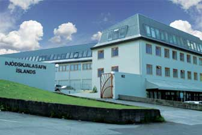

Title: Símhleranir og skjalasöfn
Subtitle: Nokkur orð um opinbera stefnumótun í skjalamálum
Slug: simhleranir-og-skjalasofn
Date: 2006-09-21 11:54:00
UID: 95
Lang: is
Author: Bragi Þorgrímur Ólafsson
Author URL: 
Category: Í umræðunni
Tags: 

Umræðan um aðgang að gögnum um símhleranir yfirvalda hefur vakið mikla athygli frá því að málið kom fram á Söguþingi í maí síðastliðnum. Ef málið er sett í samhengi við opinbera stefnumótun um skjalamál má greina áhugaverða þróun. Hér verða tekin tvö dæmi um ólíkar áherslur á aðgengi og umbúnað skjalamála eftir því hvort stjórnvöld eða almenningur eiga í hlut.

### Dæmi 1: Þjóðmenningarhús og Þjóðskjalasafn

Árið 1996 samþykkti ríkisstjórnin að gamla safnahúsið á Hverfisgötu yrði gert að þjóðmenningarhúsi, sýningarhúsi fyrir ýmsar gersemar þjóðarinnar tengdar sögu þess, stjórnskipan og bókmenntaarfi. Húsið var þá orðið mjög lélegt, svo að ráðist var í miklar viðgerðir og endurbætur þar sem áhersla var lögð á að allar breytingar og lagfæringar yrðu sem vandaðastar. Húsið var svo opnað fjórum árum síðar og þá var húsið orðið glæsilegt jafnt að innan sem utan.[^1]

Ólafur Rastrick sagnfræðingur hefur skrifað um þessa endurnýjun hússins í tímaritinu _NýSaga_ árið 2000. Þar telur hann að tilgangurinn með hinu nýja hlutverki hússins sé að skapa því sama sess og öðrum táknum þjóðríkisins á borð við skjaldarmerkið, fánann, Þingvelli og þjóðsönginn, og efla þannig þjóðerniskennd landsmanna og hvetja til þjóðareiningar.[^2]

Þjóðskjalasafn, sem var áður til húsa í Þjóðmenningarhúsinu, var flutt í gömlu mjólkurstöðina á Laugavegi. Það er ekki hægt að segja að safnið hafi fengið eins góða yfirhalningu eins og Þjóðmenningarhúsið, aðstaða þeirra sem vilja kynna sér gögn safnsins er fábrotin og ekkert í líkingu við það sem er í Þjóðmenningarhúsinu. Til safnsins leita bæði fræðimenn og almenningur; fræðimenn vinna með söguleg gögn frá ýmsum stofnunum þjóðarinnar, almenningur leitar gagna um uppruna sinn, réttindamál og fleira. Augljóst er að safnið hefur ekki fengið næga fjármuni til að opna sómasamlegan lestrarsal fyrir almenning, og það má telja að hann sé í raun ekki fullkláraður.[^3]  Þá hamlar fjárskortur einnig skjalaumbúnaði því einungis hluti af skjölum safnsins eru varðveitt í eldvörðum skápum, mestur hluti safnsins er í lagerhillum eða í hrúgum á vörubrettum, um 1400 talsins.[^4]  Oft er reynt að vekja athygli ráðamanna á fjárskorti safnsins, nú síðast í júní síðastliðnum.[^5]

Stórhugur yfirvalda gagnvart Þjóðmenningarhúsinu vakti einnig nokkra athygli hjá forstöðumönnum annarra safna þegar fréttist af áformunum um nýtt hlutverk þess, því á sama tíma þurftu þau að sætta sig við niðurskurð á fjárlögum.[^6]

Hér er um áberandi misræmi að ræða. Það tók einungis fjögur ár að lagfæra gamla safnahúsið og breyta því á glæsilegan hátt í Þjóðmenningarhús, þar sem hin opinbera saga þjóðríkisins er til sýnis. Aftur á móti býr húsið þar sem fræðimenn rannsaka þjóðarsöguna og almenningur kemur til að leita að upplýsingum, við áberandi lakari kost. 

Nú nýlega kom upp mál sem er athyglisvert að skoða í samhengi við þennan aðstöðumun — símhlerunarmálið svokallaða sem snýr að aðgengi að skjalasöfnum.

### Dæmi 2: Aðgangur að skjalasöfnum

Í maí síðastliðnum komu fram upplýsingar um að yfirvöld hefðu stundað símhleranir á árunum 1949-1968. Guðni Th. Jóhannesson sagnfræðingur hafði fengið aðgang að úrskurðum sakadóms þar sem þessar upplýsingar komu fram, gegn því að gæta nafnleyndar. Þessar upplýsingar vöktu eðlilega mikla athygli og í kjölfarið óskuðu nokkrir aðilar eftir því að fá aðgang að þessum gögnum og öðrum sem tengdust málinu. 

Öll vinnubrögð yfirvalda eftir þetta einkennast af handahófskenndum vinnubrögðum. Þannig sendi Ragnar Aðalsteinsson lögfræðingur bréf í lok maí til dómsmálaráðuneytisins, Þjóðskjalasafns og Héraðsdóms Reykjavíkur þar sem hann óskaði eftir öllum gögnum um símhleranirnar. Dómsmálaráðuneytið svaraði bréfinu stuttu síðar og neitaði að taka afstöðu til kröfu Ragnars vegna þess að þá var nýbúið að leggja fyrir Alþingi þingsályktunartillögu um að ríkisstjórnin skipi nefnd til að skoða gögn sem snerta öryggismál Íslands á tímabilinu 1945-1991, og eigi nefndin að ákvarða aðgang fræðimanna að þessum gögnum. Ragnar sendi ráðuneytinu þá annað bréf þar sem hann benti á að tilvísun í fyrirhugaða skipun þingnefndar væri ekki lögfræðilegur rökstuðningur. Bréfinu var svarað á sama hátt og áður. Ragnar sendi þá þriðja bréfið þar sem krafan var ítrekuð. Því bréfi var svarað á þann hátt að í ráðuneytinu séu ekki lengur að finna umrædd gögn, því þau hafi verið send á Þjóðskjalasafn nokkrum dögum áður.[^7]

Þegar Ragnar leitaði til Þjóðskjalasafns fékk hann ekki aðgang að gögnunum á þeim forsendum að ekki væri hægt að taka afstöðu til erindisins fyrr en reglugerð kæmi frá menntamálaráðherra. Beðið hefur verið eftir þeirri reglugerð í tólf ár, eða frá árinu 1994.[^8]

Fréttamaður NFS óskaði einnig eftir aðgangi að gögnunum en þeirri beiðni var hafnað. Fréttamaðurinn kærði þá höfnun til úrskurðanefndar um upplýsingamál.[^9]  Í samtali við _Morgunblaðið_ 18. september sl. sagðist formaður úrskurðanefndarinnar bíða þess að fá viðhorf dómsmálaráðuneytisins til kærunnar áður en að hægt sé að úrskurða um hana. Þá bíður fyrrnefnd nefnd um kaldastríðsgögn einnig eftir útspili stjórnvalda, því sú nefnd þarf lagaumboð til að kanna umrædd gögn og einnig umboð til að aflétta þagnarskyldu af mönnum sem hlut eiga að máli.[^10]  Loks sagði Eiríkur Tómasson, lagaprófessor að tómarúm sé í lögum sem snúa að gögnum sem verða til við rannsóknir opinberra mála og taldi þörf á að láta reyna á málið fyrir dómstólum.[^11]

Hér verður að líta svo á að stjórnvöld hafi einfaldlega ekki verið reiðubúin að fást við mál af þessu tagi því að undirbúningsvinna vegna þessara gagna hafi legið á hakanum. Allt þetta mál er sérstaklega athyglisvert í ljósi þess að nú eru liðin fimmtán ár frá því að skjalasöfn í Austur-Evrópu voru opnuð við fall múrsins og mikið átak var gert til að bæta aðgengi að opinberum skjalasöfnum og þeim gögnum sem þar voru varðveitt. Í Þýskalandi voru þannig samþykkt lög í desember 1991 sem kváðu um að fórnarlömb Stasi, öryggislögreglu Austur-Þýskalands, gátu fengið aðgang að gögnum sem vörðuðu þau persónulega.[^12]  Hér hefðu stjórnvöld á Íslandi getað fylgst með þessari þróun og sett strax á fót nefnd til að kanna skjöl sem snerta öryggismál landsins undanfarna áratugi og sett reglur um aðgang að þeim, í stað þess að bíða eftir því að gögnin komi óvænt fram í dagsljósið og grípa þá til aðgerða eins og nú hefur gerst.[^13] 

Þetta mál passar ágætlega við greiningu Gunnars Helga Kristinssonar, prófessors í stjórnmálafræði við Háskóla Íslands, en í bók sinni, _Embættismenn og stjórnmálamenn_ kemst hann svo að orði um opinbera stefnumótun á Íslandi:

> Opinber stefnumótun, á sviðum þar sem rannsóknir liggja fyrir, einkennist af lítilli heildarsýn og 	miklum áhrifum skammtímaþátta. Stefna er oft ekki mótuð í mikilvægum málum fyrr en utanaðkomandi þættir þrýsta á um úrlausn mála og þá ráða skammtímasjónarmið fremur en fyrirhyggja iðulega meiru en efni standa til.[^14]

Gunnar heldur áfram og vitnar í rannsókn Þórðar Ægis Óskarssonar á íslenskri utanríkisstefnu:

> Um mótun utanríkisstefnu segir Þórður Ægir Óskarsson, svo annað dæmi sé tekið, að hún sýnist „ … oft handahófskennd og gjarnan vera fremur andsvar við óþægilegum og tilviljunakenndum atburðum.“[^15]

Bók Gunnars Helga er frá árinu 1994 og hann vitnar í rannsókn Þórðar sem er frá árinu 1989. Þó liðin séu þetta mörg ár frá rannsóknum Þórðar og Gunnars Helga, má segja að niðurstöður þeirra eigi ágætlega við símhlerunarmálið — stefna er ekki mótuð fyrr en utanaðkomandi þættir þrýsta á um úrlausn.

### Samlagning

Þegar þessi tvö dæmi eru skoðuð eru nokkur atriði sem vekja athygli: 

Fyrsta atriðið snýr að ólíkum aðbúnaði Þjóðmenningarhúss og Þjóðskjalasafns, sérstaklega þeirri staðreynd að það tók aðeins fjögur ár að endurnýja Þjóðmenningarhúsið og reisa sögu þjóðríkisins þannig glæsilegan minnisvarða, en lestrarsalur almennings á Þjóðskjalasafni er að kalla má ófrágenginn, mörgum árum eftir opnun hans, og að auki býr safnið við augljósan fjárskort sem hamlar starfsemi þess.

Annað atriði snýr að aðgengi að skjalasöfnum. Þegar stjórnvöld minnast viðburða í stjórnmálasögunni eru oft dregin fram skjöl sem tengjast viðkomandi atburði og lögð er áhersla á að þau séu sýnileg og aðgengileg, t.d. fundargerðin frá þjóðfundinum 1851 í Þjóðmenningarhúsinu.[^16]  Sýnileiki og aðgengi virðast hins vegar ekki hafa verið höfð að leiðarljósi þegar setja á fyrrnefnda reglugerð um aðgang að skjalasöfnum, en hennar hefur verið beðið í tólf ár eins og fyrr segir, og hennar er enn beðið. Að sama skapi hafa yfirvöld ekki gripið önnur tækifæri í skjalamálum — þannig hefði verið heppilegt að setja á fót nefnd um öryggisskjöl landsins fyrir fimmtán árum, þegar þessi mál voru í brennidepli á meginlandinu, en ekki haustið 2006, eftir að búið er að kynna efni þeirra á opinberum vettvangi. Hér markast opinber stefnumótun af utanaðkomandi þrýstingi, en ekki af eigin frumkvæði.

Þessi atriði virðast leiða að sama marki. Handtök og stefnumótun stjórnvalda eru snögg og framsækin þegar nota á skjöl í þágu þjóðríkisins. En þegar almenningur þarf að rannsaka gögn sem lúta að sögu sinni, er aðbúnaður hans settur aftarlega í forgangsröðina (sbr. lestrarsal Þjóðskjalasafns) og stjórnsýsluleg viðbrögð eru sein og handahófskennd eins og símhlerunarmálið ber vott um. 

Væri ekki æskilegt að þarfir almennings um aðgang og aðstöðu á skjalasöfnum væru settar á jafn háan stall og söguleg minnismerki þjóðríkisins?

----

<small class="blurb">Höfundur situr í stjórn Sagnfræðingafélags Íslands.</small>

[^1]: Ég hef áður fjallað um áherslumuninn á aðstöðu Þjóðmenningarhúss og Þjóðskjalasafns, sjá: [Bragi Þorgrímur Ólafsson, ,,Þjóðmenningarhús og Þjóðskjalasafn. Ólíkar áherslur." ](http://www.kistan.is/efni.asp?n=3395&f=15&u=94)

[^2]: Ólafur Rastrick, „Hús með sál — þjóðarsál. Lesið í sköpun Þjóðmenningarhúss.“ _NýSaga_ 12 (2000), bls. 82-88.

[^3]: Ég fjallaði um aðstöðuna á lestrarsalnum í fyrrnefndri grein, „Þjóðmenningarhús og Þjóðskjalasafn. Ólíkar áherslur.“

[^4]: „Sómi og gagn allrar þessarar þjóðar.“ _Morgunblaðið_ 1. febrúar 2001.

[^5]: „Þjóðskjalasafn þarf meiri mannafla.“ Frétt Ríkisútvarpsins 4. júní 2006. Hægt er að skoða þessar fréttir Ríkisútvarpsins sem vitnað er til í þessari grein með fréttaleit á <a href=“http://www.ruv.is“>www.ruv.is</a>.

[^6]: „Þjóðargersemar í Þjóðmenningarhúsi árið 2000.“ _Morgunblaðið_ 1. október 1996.

[^7]: „Lögfræðingur fær ekki gögn um símhleranir.“ Frétt Ríkisútvarpsins 3. ágúst 2006.

[^8]: „Synjunin ekki rökstudd.“ _Morgunblaðið_ 18. september 2006.

[^9]: „Synjunin ekki rökstudd.“ _Morgunblaðið_ 18. september 2006.

[^10]: „Símhleranamál í pattstöðu.“ Frétt Ríkisútvarpsins 18. september 2006.

[^11]: „Fráleitt að meina Kjartani um aðgang að hlerunargögnum.“ Frétt Ríkisútvarpsins 16. september 2006.

[^12]: „Stasi í Austur-Þýskalandi. Fórnarlömb fá aðgang að skjölunum.“ Morgunblaðið 15. nóvember 1991. Neðri deild þingsins samþykkti lögin í nóvember 1991 og efri deild í desember það ár. Sjá [http://www.bstu.bund.de/](http://www.bstu.bund.de/) Um miðjan apríl 1992 höfðu rúmlega 900.000 manns óskað eftir aðgangi að safninu. Sjá: „Skjalasafn Stasi: hátt í milljón umsóknir til Berlínar.“ _Morgunblaðið_ 15. apríl 1992.

[^13]: Þá hefði e.t.v. mátt skoða þessi mál þegar upplýsingalögin voru sett árið 1996 (lög nr. 50/1996).

[^14]: Gunnar Helgi Kristinsson, _Embættismenn og stjórnmálamenn. Skipulag og vinnubrögð í íslenskri stjórnsýslu_ (Reykjavík, 1994), bls. 24.

[^15]: Gunnar Helgi Kristinsson, _Embættismenn og stjórnmálamenn_, bls. 24.

[^16]: Ólafur Rastrick fjallar um þetta á áhugaverðan hátt í grein sinni. Ólafur Rastrick, „Hús með sál - þjóðarsál“', bls. 84-85.

