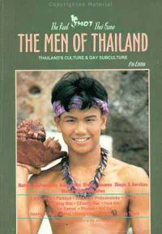

Title: Sjálfhverfan kvödd
Slug: sjalfhverfan-kvoedd
Date: 2006-03-21 08:51:00
UID: 57
Lang: is
Author: Hrafnkell Lárusson
Author URL: 
Category: Samfélag, Fjölmiðlar
Tags: 

Hnattvæðing, ferðalög til fjarlægra landa og aukin samskipti milli ólíkra menningarhópa auka nauðsyn á skilningi og þekkingu á hugsunarhætti og bakgrunni annars fólks sem og áhuga á því sem er frábrugðið nánasta umhverfi. „Hinir“ sem áður voru fjarlægir og framandi eru nú nær „okkur“ en þeir voru fyrir 5, 10, eða 20 árum síðan. Því virðist óumflýjanlegt að „heimsmenningin“ (þ.m.t. íslenskri menning) víkki sjóndeildarhringurinn og við reynum að skilja hagi og reynslu annarra. 

Hugarfarsleg sjálfhverfni — það að láta orð sín og verk nær eingöngu snúast um sjálfan sig og reyna að sveigja heiminn að eigin persónu í stað þess að víkka skilning sinn — er á undanhaldi enda þreytandi, einhæf og innantóm. Sjálfhverfnin hefur þó verið sterk og nokkuð áberandi í íslensku menningarlífi og víðar undangengin ár. Tilhneigingin til að varpa ljósi á eigin persónu hefur t.d. orðið höfuðeinkenni margra sem skrifa eða tjá sig í sjónvarpi og útvarpi. Hvort sem er á sviði dægurmenningar, bókmennta eða fræða hefur ekki þurft að leita lengi að persónum sem eru tilbúnar að leggja töluvert á sig til þess að halda athygli á sjálfum sér, athyglinnar vegna. 

Í fjölmiðlum eru álitsgjafar reglulega kallaðir til leiks. Þetta eru fáeinir nafntogaðir einstaklingar sem flestir voru plássfrekir í fjölmiðlum fyrir, en til að rödd þeirra ómi enn sterkar, gefa þeir sig að því að gefa álit í tíma og ótíma — um hitt og þetta. Gildir einu hvort þeir hafa nokkra þekkingu umfram hvern annan íbúa landsins á því sem þeir eru beðnir að tjá sig um. Álitsgjafarnir mæta vopnaðir sannfæringunni um að þeir hafi vit á því sem um er spurt, sama hvað það er. Pistlahöfundar, í sama anda, hafa líka stigið fram með sjálhverfum og uppskrúfuðum þönkum um lítil, engin eða í besta falli mjög hversdagsleg efni. Orð þeirra eru jafnan skreytt vísunum sem þurfa ekki endilega að tengjast umræðuefninu. Hlutverk þeirra er að varpa ljóma á þann sem talar og undirstrika hversu greindur hann er og mikill heimsborgari. Að baki vaðalsins er stundum meðvitað tómarúm sem á bæði að vera gáfulegt og fyndið. Þessir spekingar samtímans gagnrýna gagnrýni á gagnrýni, um málefni sem allir hafa gleymt hvað var, og svara athugasemdum með því að sá sem þær gerir skilji ekki spaugið. Sé ekki nógu lærður (lesist = hafi ekki lesið sömu bækur og spekingurinn). Þessi menningar- og samfélagsrýni virðist hafa þann tilgang einan að vekja athygli á þeim sem setur hana fram en hún bíður ekki upp á lausnir eða leiðir sem hægt er að taka alvarlega. 

Spjallþættir eru uppáhaldsvettvangur þeirra sem elska að heyra eigin rödd og vita af öðrum vera að horfa á sig. Augun eru enda sterkasta skynfæri samtímans og að þeim beinast jafnan þeir kraftar sem vilja fá okkur til að sinna skyldum okkar sem neytendur. Í spjallþáttum er best að vera stjórnandi. Nokkrir fyrrverandi og núverandi þáttastjórnendur í íslensku sjónvarpi hafa tileinkað sér þann stíl (sem er fjarri því íslensk uppfinning) að vera helst meira með orðið og meira í mynd en viðmælendurnir. Viðmælendurnir verða því á tíðum eins og borðskraut í stúdíóinu á meðan stjórnandinn eys af óþrjótandi brunni athyglissýki sinnar.

Augu neytenda (því öll erum við jú fyrst og fremst neytendur) eru beisluð með öðrum hætti á ritvellinum. Mikið notað stílbragð þar er ákveðin útfærsla persónusköpunar. Hún felst í að skapa sjálfum sér aukasjálf sem verður eins og vangasvipur höfundarins. Aðeins öðruvísi en samt sama persónan. Síðan er hin sjálfhverfa einræðuhefð klædd í búning samræðna milli „persónananna“ tveggja. Úr verður lítið ljóð, saga eða leikrit þar sem sami einstaklingurinn, klæddur í mismunandi búninga, keppist við að tala við sjálfan sig. 

Sú einblíni á einstaklinginn sem svo mjög hefur látið fyrir sér fara í íslenskri menningu hefur leitt til sellumyndunar og þrengingar á sjóndeildarhring. Það er vís vegur til andlegrar stöðnunar að umgangast einlitan hóp fólks. Gildir þá einu hvort hópurinn er togarasjómenn, FM-hnakkar eða fræðilega þenkjandi kaffihúsarottur í Hundrað og einum, svo tilviljunarkennd dæmi séu tekin. Í samlitum og þröngum hópum er sú hætta yfirvofandi að sameiginlega einkenni hópsins séu hafin upp sem hin einu réttu viðmið. Þar getur verið um að ræða lífsýn, bókmenntasmekk, pólitískar skoaðnir, o.s.frv. En þetta getur einnig fallið í þann farveg að (for)dómar hópsins beinist að ákveðnum hópum samfélagsins sem verða þannig annað hvort „inn“ eða „út“ og eru atyrtir eða lofaðir í samræmi við það. Svipað getur hent þá sem fylgja leiðtogum í blindi. Þeim sem láta andlega leiðtoga (t.d. pólitíska eða fræðilega) stjórna hugsun sinni og beina henni í kvíar. Þeir sem velja þá leið kunna að græða eitthvað á spektinni en þeir taka í leiðinni upp bábiljur leiðtogans og framlengja líf þeirra. Þannig geta fordómar og meinlokur öðlast framhaldslíf.

Í ljósi atburða í samtímanum, t.d. deilunnar vegna múhameðsmyndanna, er augljóst að við megum ekki við því að lokast frekar inn í þröngum heimi okkar eigin sjálfs, í vestræna (of)neyslusamfélaginu okkar. Við verðum að sjá út fyrir það og nánasta umhverfi þess. Það er tímabært að hætta að góna af innilegri aðdáun á eigin spegilmynd og beina skilningarvitunum að því sem er framandi. Hætta að láta augun og síbylju talaðrar dægurmenningar stjórna hugsun okkar heldur virkja sem flest skilningarvit og horfast í augu við það að sú menning sem við þekkjum er hvorki æðri né merkilegri (eða óæðri og ómerkilegri) en menning annarra. 

Framtíðin er ekki meiri sambræðsla eða endurvinnsla ólíkrar menningar, frá ólíkum svæðum og tímum, heldur skilningur á sérkennum ólíkrar menningar og aukin viðurkenning á nauðsyn þess að sérkennin haldist. Eftir andlegan doða tímabils endurvinnslu og markaðssettra menningarkokkteila höfum við þörf fyrir sköpun byggða á skilningi á því sem er framandi. Ég bind vonir við að framundan sé tímabil þar sem fólk eyðir meiri tíma og orku í að skapa og byggja eigin persónuleika og sjálfsmynd, út frá þekkingu á högum, menningu og reynslu annarra. Þann tíma og orku mætti taka frá því að básúna og „stjarngera“ hversdagsleika eigin tilveru og halda fram sem tímamótaviðburði. 

