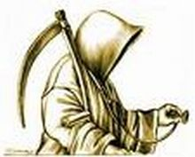

Title: Sjálfsvíg í sögulegu ljósi
Slug: sjalfsvig-i-sogulegu-ljosi
Date: 2007-01-09 11:06:00
Part: 1/5
UID: 122
Lang: is
Author: Hrafnkell Lárusson
Author URL: 
Category: Sagnfræði, Trúarbrögð
Tags: 

Sjálfsvíg hafa verið fylgifiskur mannlegrar tilveru um aldir.[^1]  Ævafornar heimildir geta einstaklinga sem féllu fyrir eigin hendi og enn í dag eru sjálfsvíg tíð. Gildir þá einu þó að innan útbreiddra trúarbragð (t.d. kristni) og stórra menningarhópa hafi þetta athæfi löngum mætt andúð, skilningsleysi og jafnvel almennri fordæmingu. 

Í frumkristni var viðhorfið til sjálfsvíga á flökti, jafnvel jákvætt vegna áhrifa frá Stóumönnum. _Biblían_ er þögul um sjálfsvíg (þ.e. um verknaðinn sjálfan) þó greint sé frá tilvikum þar sem ævi manna lauk með því. Um sjálfsvíg er fjallað í _Biblíunni_ sem hver önnur dauðsföll. Tilvikin eru ekki mörg og eiga það sammerkt að vera tilkomin vegna yfirvofandi eða orðinnar niðurlægingar einstaklings sem valdi dauðann fremur en að lifa í skömm. Guðrún Eggertsdóttir segir að hvergi komi fram í _Biblíunni_ að minning þeirra sem styttu sér aldur hafi orðið að þola vansæmd. Þvert á móti hafi greftrun sjálfsvegenda verið með eðlilegum hætti. Textarnir séu samhljóma og ekkert í neinum þeirra bendi til að sjálfsvíg sé synd. Verknaðurinn sem slíkur sé hvergi fordæmdur.

Það breyttist með tilkomu Ágústínusar kirkjuföðurs (f. árið 354). Í kjölfar hans varð veruleg og varanleg breyting á viðhorfum til sjálfsvíga. Ágústínus lagði út af fimmta boðorðinu („Þú skalt ekki mann deyða“) og heimfærði það á sjálfsvíg. Að svipta sig lífi væri synd gegn Guði. Með skrifum sínum setti hann sjálfsvegendur á stall með morðingjum því fimmta boðorðið fyrirbyði mönnum að taka mannslíf. Einnig sitt eigið. Það var nokkur tvískinnungur í þessu fólgin því að á sama tíma og Ágústínus var uppi voru margir af helstu dýrlingum kirkjunnar menn sem höfðu dáið píslarvættisdauða, m.a. með því að stytta sér aldur. Því urðu sumir að dýrlingum en aðrir að glæpamönnum fyrir sama verknað.

Tómas Aquinas (1224-1274) var sammála Ágústínusi um að sjálfsvíg væru synd gegn Guði en hann bætti um betur og kallaði þau eina vítaverðustu synd kristinnar trúar. Sjálfsvíg væru synd gegn náttúrunni og samfélaginu. Guð hefði skapað lífið og hann einn réði því. Sá sem tæki eigið líf dræpi ekki aðeins líkama sinn heldur sál sína líka. Martin Lúther leit öðrum augum á sjálfsvíg en Ágústínus og Tómas Aquinas. Lúther taldi þau verk Satans. Við sjálfsvíg gæti frjáls vilji manneskju ekki verið að verki. Þetta þýddi að sá sem framdi sjálfsvíg gat orðið sáluhólpinn. Guð gæti frelsað alla meira að segja sjálfsvegendur. Á móti kom að Lúther taldi sjálfsvíg hafa hræðilegar afleiðingar fyrir samfélagið og því ættu yfirvöld að hræða borgarana frá því að fremja þau. 

Kirkjan og guðfræðingar hennar hafa í gegnum tíðina mótað viðhorf hins kristna heims til sjálfsvíga. Ekki síst með því að taka upp fyrrgreind viðhorf um að sjálfsvíg væri dauðasynd. Álit kirkjuleiðtoga lituðu síðan lagasetningar og hvort tveggja hafði áhrif á viðhorf almennings og átti þannig sinn þátt í því að viðhalda skömm og sektarkennd hjá aðstandendum þeirra sem styttu sér aldur.

Sú fordæming gagnvart sjálfsvígum sem náð hafði rótfestu meðal kristinna manna á fyrsta árþúsundinu skilaði sér inn í forn íslensk lög. Í _Kristnirétti hinum gamla_ sem er frá 12. öld, og kenndur er við biskupana Þorlák og Ketil, er stuttleg vikið að því hverjir teljist ekki kirkjugræfir. Þar segir að þeir flokkar manna sem ekki fái leg í vígðri mold séu óskírðir menn, skógarmenn, bannfærðir menn og hver sá sem vinni

> á sér verk þau er honum verða að bana svo að hann vildi unnið hafa, nema hann fái iðran síðan og gangi hann til skriftar við prest og skal þá grafa lík hans að kirkju, og þótt eigi nái hann prests fundi, og segi hann ólærðum mönnum til að hann iðrast og svo þótt hann megi eigi mæla og gjöri hann þær jartegnir að hann finni að hann iðrast í huganum þótt hann komi eigi tungunni til, og skal þá grafa að kirkju líkið.[^2]

Þetta viðhorf er nokkuð frjálslynt og bíður upp á að ef sjálfsvegendur fá hægt andlát og nái að iðrast (eða aðrir telji þá hafa iðrast) geti þeir orðið sáluhólpnir. Hvort menn iðrast eður ei skilur hér á milli því fordæmingin á verknaðinum er veik. 

Í _Kristnirétti hinum nýja_ sem einnig er frá 12. öld, og kenndur er við Árna biskup, er afdráttarlaust tekið fram að kristna menn skuli jarða í kirkjugarði. Undantekningarnar eru þó til staðar og sá hópur sem ekki fær leg í kirkjugarði er orðinn stærri og betur skilgreindur en í gamla kristniréttinum. Þeir sem ekki hljóta leg í kirkjugarði eru kallaðir einu nafni „Ódáðamenn“. Til ódáðamanna teljast: Drottinssvikarar, morðingjar, tryggrofar, griðníðingar, (dæmdir) þjófar, flugumenn, opinberir ránsmenn og bannfærðir menn. Einnig þeir sem deyja í forboði kirkju, opinberir okurkarlar, trúvillingar, menn eða börn sem ná ekki skírn fyrir dauða „og þeir sem leggja hendur á sig og týna með því sjálfum sér, nema voðaverk verði.“[^3] Hér er hert á gagnvart sjálfsvegendum því samkvæmt þessu skyldu allir þeir sem féllu fyrir eigin hendi vera grafnir utan kirkjugarðs nema um slys væri að ræða. 

_Kristniréttur hinn nýi_ var lífseigur í íslenskri löggjöf og ýmis ákvæði hans lifðu af siðaskiptin í kringum árið 1550. Undir lok 17. aldar voru lögtekin í danska ríkinu hin svokölluðu _Norsku lög Kristjáns konungs fimmta_. Þau tóku einnig gildi á Íslandi. Í manndrápskafla laganna er skýrt tekið fram hver staða sjálfsvegenda sé gagnvart kirkjulegri greftrun. 21. grein þessa kafla laganna hljómar svo: „Sá sem fyrirfer sjálfum sér, hafi forbrotið höfuðlóð sína til síns húsbónda, og má hvorki grafast í kirkju né kirkjugarði, utan hann hafi gjört það af sjúkdómi og vitleysi.“[^4] Hér er ekki lengur talað um iðrun sem mögulegt einstigi til himnaríkis. Nú er það aðeins sjúkdómur eða dómgreindarskortur sem getur hamlað gegn því að sá sem tekur líf sitt þurfi að liggja í óvígðri mold. Ekki er sérstaklega tilgreint að sá sjúkleiki sem hrjáð hafi sjálfsvegandann hafi orðið að vera af andlegum toga. 

Þessi lagagrein hefur boðið upp á mjög persónulega túlkun yfirvalda á hverjum tíma varðandi það hverjir teldust veikir og hverjir ekki. Geðveiki sjálfsvegenda kann að hafa verið augljós og ótvíræð í sumum tilfellum en háð mati eftir andlát viðkomandi í öðrum. Þetta gat því boðið upp á að menn (t.d. hátt settir einstaklingar í samfélaginu) sem fyrirfóru sér væru úrskurðaðir geðveikir eftirá og síðan jarðsettir í kirkjugarði. Þó að sjálfsvegendur næðu legi í kirkjugarði fengu þeir ekki sömu meðferð þar og aðrir því prestum var bannað að kasta mold á og halda líkræðu yfir þeim sem höfðu stytt sér aldur. Hér var einnig um fjármuni að tefla. Því erfingjar geðsjúks manns sem stytti sér aldur erfðu hann líkt og hann hefði látist af viðurkenndum orsökum, en væri sjálfsvegandinn talinn vera heill á geðsmunum var hætta á að aðstandendur yrðu gerðir arflausir.

Árið 1863 kom út Íslenskur kirkjuréttur, saman tekinn af Jóni Péturssyni. Ritið var samantekt lagaákvæða sem þá voru í gildi varðandi málefni kirkjunnar. Í því kemur fram að samkvæmt _Kristnirétti hinum nýja_ hafi ekki átti að grafa sakamenn í kirkjugarði en það var þó jafnan verið gert með aðra en þjófa og morðingja. Tilskipun frá 1838 mildaði þetta þannig að grafa mátti aftekna glæpamenn og sjálfsvegendur í kyrrþey í kirkjugarði. Hér á landi hefur þetta aðeins átt við um sjálfsvegendur því síðasta aftaka var framkvæmd árið 1830.

Þrátt fyrir þessa tilskipun þurfti leyfi amtmanns eða viðkomandi sýslumanns til að sjálfsvegendur fengju leg í kirkjugarði. Það leyfi mátti samkvæmt lögum ekki veita nema ástæða væri 

> til að efast um, að maðurinn hafi verið með öllum mjalla, er hann fargaði sér, og á það að vera þannig lagað, að grafa megi sjálfsmorðingjann í kirkjugarði, en á afviknum stað, og án þess að prestur kasti moldum á hann, þó má leyfið og hljóða þannig, ef sérleg atvik mæla með því, að grafa megi í kirkjugarði, og presturinn kasta moldum á hann, en þó í kyrrþey; en jarðarförin má samt aldrei framfara með söngum, hljóðfæraslætti né hringingum, og presturinn enga líkræðu halda, og engin hátíðleg líkfylgd eiga sér stað.[^5]

Enn á leg í kirkjugarði að vera bundið við sjálfsvegendur sem ekki voru taldir heilir á geði. En hér er vert að vekja athygli á orðalagi. Því samkvæmt ofangreindum texta þurfti sá sem stytti sér aldur ekki að vera „sannanlega geðveikur“ heldur virðist sem efi um geðheilbrigði hans á þeirri stund er hann batt enda á líf sitt vera nægur til að hann öðlist leg í vígðri mold. Aðstandendur hafa þó eftir sem áður átt mikið undir valdsmönnum því það var þeirra að ákvarða hvers konar greftrun skyldi fara fram.

Árið 1870 gengu í gildi á Íslandi almenn hegningarlög. Með þeim hurfu ýmis ákvæði eldri laga, þ.m.t. ákvæði um greftrun sjálfsvegenda utan kirkjugarðs, og öllum var veitt leg í vígðum reit. Það eina sem var eftir sem áður ólöglegt viðvíkjandi sjálfsvígum var ef maður aðstoðaði annan mann við að stytta sér aldur.

---

#### Heimildir

* Guðrún Eggertsdóttir: _Sjálfsvíg! ... hvað svo? Sálgæsla eftir sjálfsvíg._ Munin bókaútgáfa, Íslendingasagnaútgáfan. [Án útgáfurstaðar] 1997.
* Jóhann Björnsson: _Sjálfsvíg._ Ritgerð til B.A. prófs í heimspeki. Háskóli Íslands. Reykjavík 1992.
* Jón Pétursson: Íslenzkur kirkjuréttur. Reykjavík 1863.
* _Kóngs Kristjáns þess fimmta norsku lög á íslensku útlögð._ Hrappsey 1779.	
* _Kristniréttur hinn gamli eða Þorláks og Ketils biskupa._ Kaupmannahöfn 1776.
* _Kristniréttur hinn nýi eða Árna biskups._ Kaupmannahöfn 1777.
* _Lovsamling for Island. 20. bindi_ (1868-1870). Kaupmannahöfn 1887.

[^1]: Þessi grein er byggð á verkefni sem ég vann sumarið 2005 og styrkt var af Nýsköpunarsjóði námsmanna. Verkefnið bar heitið: „Viðhorf til sjálfsvíga og sjálfsvígstilrauna á Íslandi 1400-1900.“ Niðurstöður verkefnisins voru teknar saman í skýrslu en efni hennar hefur ekki verið birt opinberlega.
[^2]: _Kristniréttur hinn gamli eða Þorláks og Ketils biskupa._ Bls. 36-38.
[^3]: _Kristniréttur hinn nýi eða Árna biskups._ Bls. 62. 
[^4]: _Kóngs Kristjáns þess fimmta norsku lög á íslensku útlögð._ Bls. 677-678. 
[^5]: Jón Pétursson: Íslenzkur kirkjuréttur. Bls. 130-131. 
