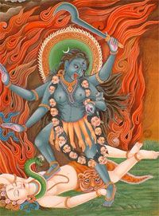

Title: Sjálfsvíg í sögulegu ljósi
Slug: sjalfsvig-i-sogulegu-ljosi
Date: 2007-01-16 09:35:00
UID: 124
Part: 2/5
Lang: is
Author: Hrafnkell Lárusson
Author URL: 
Category: Sagnfræði, Trúarbrögð
Tags: 

Vitundin um sífellda nálægð dauðans varð með tímanum að svipu í hendi presta sem nýttu hana til að berja guðsótta í almúgann. Menn áttu að lifa guðrækilegu lífi því almættið gat kallað þá til sín fyrirvaralaust og þá gat verið of seint að gera yfirbót vegna misgjörða sinna. 

Á miðöldum var dauðastundin sjálf álitin mikilvæg og menn gátu einnig gert yðrun og yfirbót á gamalsaldri fyrir misgjörðir sínar fyrr á ævinni. Sumir töldu sig þá greina dauðann þegar hann nálgaðist. Á endurreisnartímanum fóru menn að hugsa um dauðann sem eitthvað sem gat komið fyrirvaralaust án þess að nokkur ætti von á honum. Því varð að haga lífinu í samræmi við það og lifa í eilífri óvissu um hvenær dauðinn kæmi. Undirbúningur dauðans var því ævistarf til að eiga raunhæfa von um betra líf eftir hann. Menn urðu ávallt að vera viðbúnir komu dauðans. Því var e.t.v. ekki óeðlilegt að almennt væri álitið að betra væri að fá hægt andlát en skyndilegt. Hægt andlát gaf færi á iðrun og lausn frá syndum sínum. 

Á 15. öld kom fram í Evrópu ný tegund trúarrita. Þau fjölluðu um listina að deyja. Gefnar voru út handbækur og kom ein slík út hér á landi í þýðingu Guðbrands Þorlákssonar. Það rit nefndist _Manuale_ og var eftir mann að nafni Martin Möller. Í því er lesendum m.a. veitt ráð um hvernig þeir eigi að verjast freistingum Satans. Einnig er þeim bent á að þeir viti aldrei hvenær Guð kalli sál þeirra burt. Því sé mikilvægt að gera yðrun og yfirbót á hverjum degi og kosta kapps við að hafa góða samvisku.

Þegar dauðinn vofði sífellt yfir og helvítiskenningar voru fyrirferðarmiklar í trúarlífinu hefur óttinn við dauðann verið mikill. Í þriðja bindi _Kristni á Íslandi_ segir Loftur Guttormsson: „Lúthersk kenning var til þess fallin að auka á óvissu og kvíða hins trúaða yfir því hvort hann mundi öðlast á efsta degi náð Guðs og eilífa himnavist … Líklegt er að ótti manna við dauðann hafi ágerst á rétttrúnaðartímanum þegar ekkert var sparað til þess að útmála ógnir vítis fyrir kristnum söfnuði.“ Það var ekki að ástæðulausu sem þetta var gert því: „Dauðabeygnum átti líka að fylgja stöðug hvatning til að ástunda guðrækilegt líferni; í þessum skilningi taldist hræðslan við dauðann uppbyggileg.“[^1]  

Af þessu má sjá hversu mikil áhersla var lögð á dauðann á síðmiðöldum og eftir siðaskipti og mikilvægi þess að vera undirbúinn fyrir komu hans. Sjálfsvíg stangaðist með ýmsum hætti á við „eðlileg“ viðhorf til dauðans. Sjálfsvígið var skyndilegur dauði án iðrunar. Dauðavitundin átti að fá menn til að hugleiða syndir sínar. Dauðastundin og hegðun dauðvona manns skiptu miklu máli. Iðrun og yfirbót, meðtaka sakramentis og bænir áttu að gefa hinum deyjandi von um himnaríkisvist.

Í greinasafninu _Eitt sinn skal hver deyja_ er fjallað um dauðann frá ýmsum hliðum. Einn greinarhöfunda í ritinu, Sigurður Gylfi Magnússon, gerir að umtalsefni kenningar franska sagnfræðingsins Philippe Ariés, sem rannsakað hefur dauðahugtakið í sögu Vesturlanda. Ariés heldur því fram að íbúar þessa heimshluta hafi gengið í gegnum fjögur stig viðhorfa til dauðans frá miðöldum til samtímans.

> Í fyrsta lagi heldur hann því fram að á miðöldum hafi fólk umgengist dauðann á yfirvegaðan hátt og sett sér að hafa hemil á tilfinningum sínum (tamed death). Viðhorf fólks á þessu stigi fólst í undirstrikun þeirrar staðreyndar að það ætti fyrir öllum að liggja deyja. Með öðrum orðum, dauðinn var meðhöndlaður sem eðlilegur hluti af tilvera manna. 
Annað stig í þróun dauðahugtaksins var þegar einstaklingurinn sjálfur varð miðdepilll dauðans (one’s own death).
> 
> Þetta gerðist á síðmiðöldum að dómi Ariés og í brennidepli var sú hugmynd að vegferð manna stæði frammi fyrir dómi á dauðastundinni og andleg og veraldleg verðmæti hins dauðvona manns yrðu lögð á vogarskálarnar. Þriðja stigið sem blómstraði á sextándu til nítjándu öld þrengdi hring þeirra sem tóku þátt í sorginni og gerði viðbrögð þeirra sem eftir lifðu mun ákafari (thy death). Á þessu tímabili mótuðust ýmsir siðir og hættir í kringum greftrun hins látna sem gerðu minningu hans hátt undir höfði og hjálpaði þeim sem eftir lifðu að horfast í augu við dauðann.
>
Fjórða og síðasta þrepið í þessari þróun dauðahugtaksins í menningarheimi Vesturlandabúa var hinn svo kallaði „óæskilegi dauði“ (forbidden death) sem er það viðhorf sem nútímamaðurinn hefur til hans. Á þessu stigi hafi athöfnin í kringum dauðann enn verið dregin saman þannig að sorgin fékk lítið rúm og dauðinn sjálfur varð bæði framandi og óhugnanlegt fyrirbæri í augum flestra.[^2] 

Aðeins annað og þriðja stig kenninga Ariés vísa til þess tíma sem þetta verkefni snýst um (árin 1400-1800). Þó má leiða rök að því að fyrsta stigið eigi líka við á Íslandi á þeim öldum sem hér um ræðir vegna sífelldrar nálægðar við dauðann. Meðalævilengd var stutt, drepsóttir tíðar, barnadauði viðvarandi og nær engin læknishjálp var fyrir hendi, lengi fram eftir öldum. Auk fyrrtalins var dauði af slysförum afar algengur, t.d. drukknanir í sjó, ám og vötnum. Slíkir þættir hafa mótað viðhorf til dauðans. Trúarvitund skipti líka miklu máli og einnig má greina af þjóðsögum hve dauðinn var mönnum ofarlega í huga.

Í bók _sinni Íslenskir þjóðhættir_ fjallar Jónas Jónasson um siði tengda dauðanum. Miðast þessari siðir vitanlega við „hefðbundinn“ og hægan dauða, en ekki slys eða sjálfsvíg. Jónas segir að fastar serimoníur hafi átt að viðhafast við dauðann. Sá sem var að deyja átti að deyja hægt og taka þrjú andvörp fyrir dauðann (andast á þriðja). Hvorki fleiri né færri. Þegar hinn deyjandi hefði gefið upp andann var nauðsynlegt að opna út svo sálin kæmist burt. 

Við og eftir andlát var fylgt ákveðnum reglum varðandi umgengni og frágang á líkinu fram að kistulagningu. Ýmsir þessir siðir voru ansi hjátrúarkenndir og báru merki ótta um að viðkomandi gengi aftur. Um viðhorf Íslendinga til dauðans á tímabilinu frá siðaskiptum til upplýsingar (ca. 1550-1800) segir Loftur Guttormsson að þau feli í sér „blöndu kristilegs rétttrúnaðar og þjóðtrúar.“ Viðhorfið til dauðans hafi breyst með aukinni einstaklingshyggju í evrópskri menningu við lok miðalda. „Vitund manna skerpist fyrir aðskilnaði líkama og sálar á dauðastund þar sem holdið tekur að leysast upp ... en sálin að öðlast eilíft líf. Skarpari sjálfsvitund gaf mönnunum næmari tilfinningu fyrir „dauðans óvissa tíma“ og fyrir hinum sársaukafulla aðskilnaði frá jarðvistinni sem dauðinn markaði.“[^3]  

Sterk tilfinning fyrir sálinni og útbreidd og sterk draugatrú voru hvort tveggja heiðnar leifar í íslenskri þjóðtrú. Því var trúað að allir gætu gengið aftur. Fastar venjur í umgengi við dauðvona fólk og lík hefur trúlega slegið á óttann um að viðkomandi gengi aftur og aukið þannig vonir um að sál hans væri hólpin. Auðmýkt gagnvart óumflýjanlegum dauða var álitin nauðsyn. Afturgöngutrúin  var sterk þrátt fyrir kenningar kirkjunnar um lausn sálar og líkama. Skyndileg dauðsföll vegna slysa eða sjálfsvíga, þar sem hinn látni gat ekki eða vildi ekki iðrast, hafa því verið til þess fallin að auka ótta um að þeir einstaklingar sem þannig létu lífið gengju aftur og sæktu að eftirlifendum.

Forlagahyggja virðist hafa verið haldreipi margra á tímum sínálægs dauða, sem reglulega hjó skörð í hóp nánustu ættingja fólks. Forlagahyggjan gekk í stuttu máli út á að allt lífshlaup fólks væri fyrirfram ákveðið af Guði. Hún var ákveðin varnarháttur og með vísan í hana var hægt að skýra hátt hlutfall dauðsfalla vegna slysa og sjúkdóma. En var forlagahyggjan það sterk að hún næði yfir sjálfsvegendur, þ.e. að þeirra örlög væru líka tilkomin vegna vilja Guðs? Nær örugglega ekki. Að viðbættum ástvinamissi þurfti aðstandendur sjálfsvegandans að búa við vitneskjuna um að hinn látni væri útskúfaður úr Guðsríki. Kirkjan veitti enga huggun og lík sjálfsvegandans var jafnvel vanvirt. Í bók sinni _Sjálfsvíg ... Hvað svo?_ segir Guðrún Eggertsdóttir: 

> Ýmis lagaákvæði gegn þeim sem fyrirfóru sér og fjölskyldum þeirra höfðu komist á í aldanna rás og juku á sorg eftirlifenda, þeir urðu fyrir barðinu á ómannúðlegum siðum samfélagsins, útskúfun og stimplun. Öldum saman var sjálfsvígi mætt með þungum og ströngum refsingum. Allar eignir fórnarlambsins voru gerðar upptækar til ríkisins. Eftirlifandi fjölskylda var skilin eftir heimilis- og bjargarlaus.[^4]

Eignaupptakan hefur ef til vill vegið þyngst vegna þess að henni fylgdi enn frekari vanvirðing. Ekki aðeins hafði ástvinur framið verknað sem samfélagið leit hornauga heldur var fjárhagslegi skaðinn sem af hlaust líklegur til að leiða aðstandendur út í að verða fjárhagslega upp á aðra komnir. Hefur jafnvel neytt þá á vergang. Að lenda í þeirri aðstöðu jók enn á andúð samfélagsins á viðkomandi.

----

#### Heimildir

* Guðrún Eggertsdóttir: _Sjálfsvíg! ... hvað svo? Sálgæsla eftir sjálfsvíg._ Munin bókaútgáfa, Íslendingasagnaútgáfan. [Án útgáfurstaðar] 1997.
* Gunnar Þór Bjarnason: „„En þegar dauðinn kemur svo sem ein voldug hetja.“ Um viðhorf til dauðans á síðari öldum.“ _Ný saga. Tímarit Sögufélags._ 1. árg. 1987. Bls. 30-42.
* Jónas Jónasson: _Islenzkir þjóðhættir._ Einar Ól. Sveinsson bjó til prentunar. Ísafoldarprentsmiðja. Reykjavík 1934.
* Loftur Guttormsson. _Kristni á Íslandi. Frá siðaskiptum til upplýsingar._ 3. bindi. Ritstjóri Hjalti Hugason. Alþingi. Reykjavík 2000.
* Margrét Eggertsdóttir: „Listin að deyja.“ _Eitt sinn skal hver deyja. Dauðinn í íslenskum veruleika._ Mokka-press. Reykjavík 1996. Bls. 150-154.
* Martin Möller: _Manuale. Það er handbókarkorn, hvernig maður eigi að lifa kristilega , og deyja guðlega._ Þýtt af Guðbrandi Þorlákssyni. Hólar 1753. [1. útg. 1611]
* Sigurður Gylfi Magnússon: „„Dauðinn er lækur, en lífið er strá.“ Líf og dauði á 19. öld.“ _Eitt sinn skal hver deyja. Dauðinn í íslenskum veruleika._ Mokka-press. Reykjavík 1996. Bls. 128-142.

[^1]: Loftur Guttormsson: _Kristni á Íslandi._ 3. bindi. Bls. 281-282. 
[^2]: Sigurður Gylfi Magnússon: „„Dauðinn er lækur, en lífið er strá.“ Líf og dauði á 19. öld.“ 129-130. — Byggir einkum á bók Philippe Ariés: _Western Attitudes Toward Death From the Middle Ages to the Present._ Þýdd af Patriciu M. Ranum (1974). 
[^3]: Loftur Guttormsson: _Kristni á Íslandi._ 3. bindi. Bls. 280. 
[^4]: Guðrún Eggertsdóttir: _Sjálfsvíg! ... hvað svo?_ Bls. 36.

