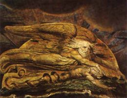

Title: Sjálfsvíg í sögulegu ljósi
Slug: sjalfsvig-i-sogulegu-ljosi
Date: 2007-02-22 08:36:00
Part: 4/5
UID: 135
Lang: is
Author: Hrafnkell Lárusson
Author URL: 
Category: Sagnfræði, Trúarbrögð
Tags: 

Aðeins er getið um greftrun sjálfsveganda í 15 af þeim 266 tilvikum sem ég rannsakaði. Af þessum 15 tilvikum eru fimm á 17. öld en tíu á 18. öld. Eitt tilvikið á 17. öld er tvítekið. Sjálfs&shy;vegendurnir eru þrjár konur (látast árin 1630, 1651 og 1675) og einn karl (árið 1676). Karlinn er nafngreindur en ekki er getið um nöfn kvennanna. Konurnar sem látast árin 1651 og 1675 og karlinn voru öll grafin utan kirkjugarðs. Um tvö þeirra er sagt að þau hafi verið dysjuð þar sem þau fundust látin. Um konuna sem svipti sig lífi árið 1630 gegnir hins vegar öðru máli. Henni er veitt aflausn eftir andlátið og hún grafin í kirkjugarði vegna þungrar sorgar dóttur hennar, sem virðist hafa orðið til að yfirvöld gáfu eftir og veittu konunni leg í vígðri mold. Þetta verður enn merkilegra í ljósi þess að ekki er getið um að konan hafi verið veik á geði. Á hinn bóginn er það skýrt tekið fram að önnur kona í þessum hóp (sú sem lést 1675) hafi verið geðveik og verið búin að vera það lengi. Sú kona var hins vegar grafin utan kirkjugarðs.

Af tilvikunum tíu sem hér eru til umfjöllunar frá 18. öld eiga þrjú þeirra við sama manninn, Nikulás Magnússon sýslumann sem drekkti sér á Þingvöllum árið 1742. Hann var eftir andlát sitt færður í kirkju og grafinn í kirkjugarðinum á Þingvöllum. Ákveðinnar hneykslunar gætir hjá einum annálaritara vegna greftrunarstaðarins. Hann segir: „[Nikulás] var samt grafinn í kirkjugarði og erfður á erfingjum.“[^1] Orðið „samt“ skiptir hér öllu máli því notkun þess bendir til að annálsritari telji þessa breytni óeðlilega og ganga í berhögg við viðteknar venjur. Þó kemur fram í flestum þeim annálum sem fjalla um sjálfsvíg Nikulásar að hann hafi verið vanheill á geði. 

Hin tilvikin sjö eiga við um jafnmörg sjálfsvíg. Í þeim hópi eru fjórir karlar (létust árin 1702, 1726, 1772 og 1787) og þrjár konur (létust árin 1724, 1725 og 1787). Af þessu fólki eru þrír karlar af fjórum nafngreindir (árin 1702, 1726 og 1787) og tvær af þremur konum (árin 1724 og 1725), önnur þó aðeins með skírnarnafni. Fjórar af þessum manneskjum (karlarnir árin 1702, 1726 og 1772 og konan árið 1787) voru grafin utan kirkjugarðs, en fram kemur að karlarnir voru allir grafnir í námunda við kirkjugarð. Um konuna (1787) er sagt að hún hafi verið dysjuð, en ekki er sagt hvar. Þó bendir texti heimildarinnar til að hún hafi verið dysjuð á víðavangi. Það styrkir þá tilgátu að eftir dauða konunnar var lík hennar vanvirt af manni sem hún hafði haft í heitingum við fyrir dauða sinn. Hann hjó af henni höfuðið og setti við þjóinn, en samkvæmt þjóðtrúnni átti slík meðferð á líki að fyrirbyggja að hinn látni gengi aftur. Það sem maðurinn hafði upp úr athæfi sínu var hins vegar hörð refsing fyrir að vanvirða líkið.

Einn karl og tvær konur úr þessum hóp (að Nikulási Magnússyni frátöldum) fengu að hvíla í vígðri mold. Karlinn var Jón Eiríksson konferensráð sem lést árið 1787 eftir að hafa stokkið fram af brú í Kaupmannahöfn og látist vegna höfuðáverka sem hann hlaut í fallinu. Um greftrun hans segir: „Hann var grafinn heiðurlega í Vorfrúarkirkju [í Kaupmannahöfn].“[^2] Jón fékk því ekki aðeins leg í vígðri mold heldur einnig viðhafnarútför. Það er athyglisvert að ritari þeirrar heimildar sem greinir frá greftrun Jóns Eiríkssonar kinokar sér við að nefna það að hann hafi svipt sig lífi. Því er hins vegar haldið blákalt fram í öðrum heimildum og er þunglyndi Jóns tilgreint sem ástæða sjálfsvígsins í einni þeirra.

Tengsl kvennanna tveggja sem fengu leg í kirkjugarði eru sérstök. Þær bjuggu báðar á Arnarstapa á Snæfellsnesi og fyrirfóru sér með árs millibili (árin 1724 og 1725). Þær voru síðan báðar grafnar í Laugabrekkukirkjugarði. Önnur þeirra virðist hafa verið forstandshúsfreyja en hin er aðeins tilgreind með skírnarnafni og bendir það til að hún hafi verið almúgakona. Ekki er tilgreint í heimildum að konurnar hafi verið geðveikar. Því virðist í fljótu bragði sem yfirvöld á svæðinu hafi verið mildari gagnvart sjálfsvegendum en ætlast var til af þeim. 

Umfjöllun um sjálfsvíg í annálum er í flestum tilfellum stutt. Lítur hinu knappa formi sem viðhaft er í þeim flestum og er því undir sömu sök selt og annað efni. Af 266 skráðum sjálfsvígum eru aðeins 89 sem fá umfjöllun sem er meira en tvær línur að lengd. Aðeins tíu tilvik fá tíu línur eða meira í umfjöllun. Lengst af þeim er frásögn Íslands Árbókar af sjálfsvígi Jóns Eiríkssonar konferensráðs. Sú umfjöllun teygir sig á þrjár blaðsíður (er alls 60 línur). Þegar greint er frá því í stuttu máli (1-2 línur) að manneskja hafi svipt sig lífi inniheldur slík frásögn jafnan afar litlar upplýsingar. Algengastar þeirra eru: kyn sjálfsveganda, í hvaða landshluta hann bjó (stundum líka sveit eða hérað) og hvaða aðferð hann notaði við verknaðinn. Ágætt dæmi um svona færslu er í Fitjaannál. Þar segir: „Maður hengdi sig í Önundarfirði.“  Í stuttum færslum (1-2 línur) fylgir á stundum nafn þess sem stytti sér aldur og nafn þess bæjar sem hann var frá, en aðrar upplýsingar en þær sem hér hafa verið tilgreindar eru afar sjaldséðar í þeim. Í lengri færslum verða upplýsingarnar fyllri, eins og gefur að skilja. Allt það sem kemur fram í stuttu færslunum er þar jafnan að finna en að auki er oft greint frá aðdraganda sjálfsvígsins og reynt um leið að varpa ljósi á ástæður þess. Í allra lengstu færslunum má svo sjá frásagnir af lífshlaupi sjálfsvegandans sem og lýsingar á sálarástandi hans.

[^1]: „Djáknaannálar.“ _Annálar 1400-1800._ 6. bindi. Bls. 54. 
[^2]: „Djáknaannálar.“ Bls. 296.

