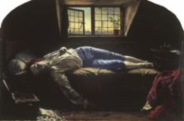

Title: Sjálfsvíg í sögulegu ljósi
Slug: sjalfsvig-i-sogulegu-ljosi
Date: 2007-02-23 09:31:00
Part: 5/5
UID: 136
Lang: is
Author: Hrafnkell Lárusson
Author URL: 
Category: Sagnfræði, Trúarbrögð
Tags: 

Eftir að hafa farið í gegnum annálana og gert samanburð kom í ljós að undir tilvikunum 266 leynast nokkuð færri sjálfsvíg. Ástæðan er sú að sagt er frá sömu sjálfsvígunum í fleiri en einum annál sem gerir það að verkum að skráðum tilvikum fjölgar. Að loknum samanburði varð niðurstaðan sú að fjöldi sjálfsvíga sem sagt er frá í annálunum sé 153. Ekki er alltaf augljóst, vegna fáorðra lýsinga og takmarkaðra upplýsinga, hvort sjálfsvíg sem sagt er frá í tveimur eða fleiri annálum, og áttu sér stað t.d. sama árið og í sama landshluta, séu sami verknaðurinn. Oft er vafinn mikill og er því mögulegt að raunfjöldi tilvika sé lægri en 153. 

Reglan sem ég notaði við að meta fjöldann er varfærin. Hún gekk út á láta vafann ráða, þ.e. ef mannsnafn, bæjarnafn eða sveitarnafn vantaði þá var tilvik látið standa áfram sem einstakt. Væri sveitarnafnið eitt til að byggja á og það bar saman í tíma við annað/önnur skráð sjálfsvíg var það nóg (ef ekkert annað mælti á móti) til að ég áliti að um tvítekingu væri að ræða. Ég læt það duga vegna þess að telja verður miklar líkur á að í fámennum sveitum landsins hafi varla verið framin mörg sjálfsvíg á ári. Ef svo hefði verið má líklega slá því föstu að annálaritarar hefðu gert því sérstaklega skil.

<table>
<caption>Skráð tilvik</caption>
<thead>
<tr class="th"><th>Öld</th><th>Fjöldi</th><th>Endurtekningar</th></tr>
</thead>
<tbody>
<tr><td>1401 - 1500</td><td class="num">0</td><td class="num">0</td></tr>
<tr><td>1501 - 1600</td><td class="num">1</td><td class="num">(3)</td></tr>
<tr><td>1601 - 1700</td><td class="num">69</td><td class="num">(118)</td></tr>
<tr><td>1701 - 1800</td><td class="num">83</td><td class="num">(145)</td></tr>
<tr class="total"><td>Alls:</td><td class="num">153</td><td class="num">(266)</td></tr>
</tbody>
</table>

Þau 153 tilvik sem eftir standa þegar endurtekningar hafa verið felldar út skiptast sem hér segir (tölurnar í svigunum eiga við allt mengið, þ.e. með endurtekningum). Skráð sjálfsvíg á 18. öld eru heldur fleiri en á 17. öld. Það þarf þó ekki að segja neitt um tíðni sjálfsvíga, aðeins um skrásetninguna. Telja má líklegt að sú staðreynd hve margir annálanna voru skráðir á 18. öld geri það að verkum að tilvik frá henni séu fleiri en á 17. öld þar eð atburðir njóti góðs af nálægð í tíma. Af töflunni sést að hlutfall þeirra tilvika sem skráð eru oftar en einu sinni er nánast það sama milli aldanna eða um 42% (69 á 17. öld (á 118 stöðum) og 83 á 18. öld (á 145 stöðum)).

Kynjahlutfall þeirra sem fyrirfara sér er áþekkt milli aldanna. Munurinn milli kynjanna er þó heldur meiri á 17. öld (2,6 karlar á móti 1 konu (50-19)) en á 18. öld (2,2 karlar á móti 1 konu (56-26)). Sjálfsvíg karla virðast hins vegar hafa að jafnaði verið heldur fréttnæmari. En af þeim 266 tilvikum sjálfsvíga sem skráð eru í annálana er 191 sinni talað um sjálfsvíg 107 karla en 73 sinnum um 45 sjálfsvíg kvenna. Þetta þýðir hlutfallið (2,6 karlar á móti 1 konu). Í samtímanum eru kynjahlutföll skráðra sjálfsvíga „víða þrír karlar á móti einni konu.“[^1] 

Við gerð næstu töflu var höfð til hliðsjónar „Alþjóðaflokkun sjúkdóma, áverka, eitrana og dánarmeina.“[^2] Í því kerfi eru dauðsföllum raðað í flokka sem tilgreindir eru með tölustöfum, 1-999. Meginhluti hluti talnanna (1-799) falla undir sama flokkinn, þ.e. ýmis afbrigði eðlilegs dauða. Slys er næst stærsti flokkurinn (800-949). Sjálfsvíg eru næsti flokkur þar á eftir (950-959). Afganginn af flokkunum fylla svo ýmsar gerðir „óeðlilegs“ dauða. 

Innan sjálfsvígsflokksins eru eftirfarandi undirflokkar: Eitranir (950), Gas (952), Henging (953), Drukknun (954), Skotáverki (955), Stungusár (956), Fall (957), Annað (958) og Síðkomin eftirköst (959). Við gerð töflunnar hér að neðan sleppi ég þeim flokkum sem ekkert tilvik í heimildunum sem ég vann með fellur undir (Eitranir, Gas, Skotáverki og Síðbúin eftirköst) og breyti flokknum „Annað“ í „Óvíst/ótilgreint“.

<table>
<caption>Aðferð við sjálfsvíg</caption>
<thead>
<tr><th>Kyn</th><th>Karlar</th><th>Konur</th><th>Samtals</th>
</thead>
<tbody>
<tr><td>Henging</td><td class="num">38</td><td class="num">6</td><td class="num">44</td></tr>
<tr><td>Drukknun</td><td class="num">27</td><td class="num">16</td><td class="num">43</td></tr>
<tr><td>Stunga/skurður</td><td class="num">32</td><td class="num">14</td><td class="num">46</td></tr>
<tr><td>Fall</td><td class="num">2</td><td class="num">3</td><td class="num">5</td></tr>
<tr><td>Óvíst/ótilgreint</td><td class="num">8</td><td class="num">6</td><td class="num">14</td></tr>
<tr class="total"><td>Alls:</td><td class="num">107</td><td class="num">45</td><td class="num">152</td></tr>
</tbody>
</table>

Eins og sést í töflunni notuðu karlar einkum þrjár aðferðir (drukknun, hengingu eða skurð/stungu) við sjálfsvíg. Hengingin var algengust, en þó ekki afgerandi. Í tilviki kvennanna voru tvær aðferðir (drukknun og stunga/skurður) áberandi mest notaðar. Miklu fátíðara virðist hafa verið að konur hengdu sig. Þróunin hjá körlunum var sú að henging er áberandi algengasta aðferðin sem þeir beittu við sjálfsvíg á 17. öld. Á 18. öld er misjafnara hvaða aðferð er beitt en þó urðu drukknanir mun algengari. Skurðir/stungur dreifast nokkuð jafnt yfir tímabilið. Hjá konunum sjást engar ákveðnar sveiflur í aðferðum við sjálfsvíg.

Þau lög sem giltu um sjálfsvegendur á Íslandi fram til ársins 1870 voru mörkuð af fordæmingu á sjálfsvígum. Fordæmingu sem átti sér djúpar rætur í heimspeki fyrri alda, bæði klassískri og kristinni. Frá því að _Kristniréttur hinn gamli_ og _Kristniréttur hinn nýi_ tóku gildi voru ávallt ákvæði í lögunum um greftrun sem buðu upp á sjálfstæða túlkun þeirra með hliðsjón af hverju tilviki. Mat yfirvalda á aðstæðum á hverjum stað gat því ráðið meiru, en bókstafur laganna, um endanlegan legstað sjálfsveganda. Af dæmum sem hafa verið rakin í þessum greinaflokk virðist ljóst að á 17. og 18. öld hafi engin ákveðin regla verið á því hverjir úr hópi sjálfsvegenda fengu legstað í vígðri mold og hverjir ekki. Geðsjúkir jafnt sem andlega heilir lentu ýmist innan garðs eða utan. 

Helst virðast vera vísbendingar um að samfélagsleg staða hafi skipt máli þegar kom að greftrun sjálfsvegenda. Lögin buðu uppá að þeim sem áttu við geðsjúkdóma að stríða væri veitt leg í kirkjugarði. En hvernig átti að sanna eða afsanna geðsjúkdóm einstaklings sem var látinn? Hafi nýlátinn einstaklingur átt virðingu samborgara sinna í lifanda lífi er ekki ólíklegt að ýmsir hafi verið tilbúnir að bera vitni um geðtruflanir viðkomandi, svo hann mætti öðlast leg í kirkjugarði og ná að verða sáluhólpinn. Því virðist sem aukin einstaklingshyggja sem birtist í meira persónulegri venjum í kringum andlát og greftrun hafi á endanum náð að ýta til hliðar forboðum kirkjunnar gagnvart iðrunarlausum dauða sjálfsvegenda. Ást fólks á sínum nánustu varð sterkari en ástin á Guði.

Með hliðsjón af lögum og kristnum kenningum voru sjálfsvíg opinberlega fordæmd og almennt álitið að þeir sem þannig enduðu líf sitt færu fjandans til eftir dauðann, þar eð þeir brytu gegn vilja Guðs. Við þetta vaknar ákveðin spurning: Hvers vegna skrásettu íslenskir annálaritarar upplýsingar um sjálfsvíg? Flestir þeir sem skráðu annála voru ýmist hærra settir í íslensku samfélagi (t.d. sýslumenn eða prestar) eða störfuðu undir handarjaðri háttsettra manna, ýmist úr stétt veraldlegra og andlegra embættismanna. Þetta voru þær stéttir sem maður skyldi ætla að stæðu næst lögunum, þ.e. þeir menn sem áttu meiri möguleika en aðrir í samfélaginu á að móta lögin í gegnum túlkanir þeirra og framkvæmd. 

Lögin kváðu á um að sjálfsvegendur væru að ýmsu leyti á sömu hillu og glæpamenn, einkum varðandi greftrun. Í annálunum má greina áhuga á glæpum í því formi að sagt er frá stærri glæpamálum, manndrápum og stórþjófnuðum. Af mörgum annálunum má líka greina sterkan áhuga skrásetjara á örlögum fólks. Um það vitna  mýmörg tilvik þar sem fjallað eru um það efni. Tilkynningar um dauðsföll merkismanna eru fastir liðir í flestum annálunum. Þau falla þó á stundum í skuggann af örlögum almúgamanna sem fórust með voveiflegum hætti; létust í slysum, urðu úti, drukknuðu, hurfu sporlaust eða styttu sér aldur. Með þennan áhuga á andlátum og glæpum í huga er ekki skrítið að fjallað sé um sjálfvíg í annálunum. Þau sameinuðu þetta tvennt. Sjálfsvíg voru álitin glæpur og jafnframt voru þau voveiflegur og dularfullur dauðdagi.

Á tímum þegar dauðinn var sínálægur voru fréttir af honum greinilega taldar meðal þess sem helst væri vert að skrásetja. Líklega var það svo að það sem mönnum hryllti við og var leyndardómsfullt átti greiðari leið inn í annálana en hversdagslegir hlutir sem menn skyldu. Þó var ekki um að ræða að átt hafi að nota annálanna til að hræða fólk frá sjálfsvígum. Að rita annála virðist hafa verið iðja sem skrásetjarar héldu fyrir sjálfa sig (og e.t.v. þröngan hóp) en var ekki ætlað til almennrar birtingar. Innihald annálanna var því tæpast á almanna vitorði á þeim tíma sem þeir voru skráðir. Á hinn bóginn er líklegt að stór hluti þess sem skrásett var hafi komist almanna vitorð.

[^1]: _Könnun á tíðni og orsökum sjálfsvíga á Íslandi og tillögur til úrbóta. Skýrsla nefndar um könnun á tíðni og orsökum sjálfsvíga á Íslandi._ Reykjavík 1996. Bls. 27.

[^2]: _Könnun á tíðni og orsökum sjálfsvíga á Íslandi og tillögur til úrbóta._ Bls. 23.

