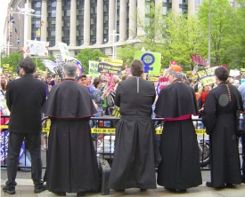

Title: Sjálfsvirðing, sæmd og andstaða
Slug: sjalfsvirding-saemd-og-andstada
Date: 2006-01-19 00:22:00
UID: 37
Lang: is
Author: Hrafnhildur Ragnarsdóttir
Author URL: 
Category: Félagsfræði, Mannfræði
Tags: 

Okkar eigin sjálfsmynd byggist að miklu leyti á því hvernig aðrir sjá okkur. Við leitum eftir viðurkenningu frá öðrum einstaklingum, hópum, og jafnvel þjóð&shy;félaginu öllu, og byggjum okkar eigið sjálf að miklu leyti á því hvernig þjóð&shy;félagið endurspeglar okkur. Sjálfsmynd okkar er þó ekki einungis undir öðrum komin. Við getum haft áhrif á hvernig aðrir líta á okkur, til dæmis með því hvernig við segjum sögur af sjálfum okkur. En sjálfs&shy;mynd okkar byggist að verulegu leyti á því hvernig okkur er tekið meðal annars fólks. Hvort að við fáum viður&shy;kenningu frá öðrum. 

Ef þinni eigin sjálfsmynd er hafnað af öðru fólki, hvernig bregstu þá við? Ætlar þú að sætta þig við slíka höfnun og vinna harðar að því að verða sú manneskja sem aðrir sjá þig sem eða neita að trúa því sem aðrir segja þér og berjast gegn því? Kýst þú að samsama þig því sem ráðandi hópur hefur skilyrt þig sem eða kýst þú andstöðu?

Ýmsir heimspekingar og rithöfundar hafa skilgreint virðingu og sæmd og komist að ólíkum niðurstöðum. Við sem manneskjur finnum sæmd í ólíkum hlutum. Fyrir einni er það að geta tjáð sig á eigin tungu. Fyrir annarri er það að komast í daglegt bað. Og enn annarri að geta valið sér maka af hvoru kyninu sem hún kýs. Tzvetan Todorov skrifaði áhugaverða bók, _Facing the Extreme_, sem fjallar einmitt um virðingu og sæmd. Todorov er húmanisti sem sér hið fallega í mannverunum. Hann skrifar m.a. um samstöðu, vilja og reisn fanga í útrýmingar&shy;búðum nasista. Todorov segir frá því hvernig fangar útrýmingar&shy;búðanna reyndu að halda sjálfs&shy;virðingunni með því að lítillækka sig ekki í eigin augum. Það að þvo sér í framan á hverjum degi, greiða á sér hárið og pússa skóna sína á hverju kvöldi voru leiðir sem margt fólk kaus til að þrauka frá degi til dags og halda sjálfs&shy;virðingunni á sama tíma.

James C. Scott, sem hefur skrifað margar áhugaverðar bækur á sviði félagsvísinda, tekur í svipaðan streng í bók sinni _Dominance and the Art of Resistance_, þar sem hann fjallar um daglega andstöðu kúgaðra hópa, sæmd og samhug. Scott skrifar meðal annars um andstöðu blökkumanna sem hnepptir höfðu verið í þrældóm af hvítum mönnum. Þrælarnir þóttust jafnan ekki kunna ýmis verk til að þurfa ekki að vinna þau. Þeir unnu lítil skemmdar&shy;verk á bæjunum, brutu verkfæri, sungu söngva á tungu sem þræla&shy;haldarinn skildi ekki, sögðu sögur og brandara um herrana og mynduðu þannig samstöðu. Þrælarnir neituðu að sætta sig við þá sjálfsmynd sem ráðandi þjóðfélagshópur þröngvaði upp á þá, mynduðu samhug og samstöðu sín á milli, sem aftur veitti þeim þeirra eigin sjálfsmynd, byggða á viður&shy;kenningu innan þræla&shy;sam&shy;félagsins. Út frá þeirri sjálfsmynd spruttu uppreisnir gegn þræla&shy;höldurunum þar sem þrælarnir börðust fyrir sjálfs&shy;virðingu sinni, sæmd og rétti. Það er því hin daglega andstaða og samkennd sem er upphafið að hverri uppreisn og byltingu, þó að dagleg andstaða leiði ekki alltaf til uppreisnar.

Ekki einungis hinir kúguðu setja upp grímu, heldur líka kúgararnir. Þeir sem hafa valdið verða jafnan að halda uppi ýmsum þjóðsögum um sjálfa sig. Þeir verða að gæta þess hvernig þeir tala fyrir framan hina kúguðu, fela veikleika sína og halda grímunni á meðan þeir halda að enginn sjái til þeirra. Spillingu innan kirkjunnar verður að fela fyrir hinum trúuðu svo kirkjan teljist áfram heilög og svo framvegis. En gríman fellur alltaf á endanum.

Það er nokkuð sjálfgefið að smán og vanvirðing skaðar hinar jákvæðu hliðar sjálfsmyndar okkar. Niðurlægjandi athugasemdir brjóta niður okkar jákvæða sjálfsskilning og sjálfsmynd, sem sýnir enn og aftur hversu sjálfsmynd okkar er undir öðrum komin. Félagsfræðingurinn Alex Honneth skiptir slíkri vanvirðingu við sjálfið í þrjá flokka: Sú fyrsta, og alvarlegasta, er líkamleg niðurlæging. Þegar manneskja hefur ekki lengur stjórn yfir eigin líkama, hættir hún að treysta heiminum og missir trú á sjálfri sér. Þetta er hin algera niðurlæging, og skaðar ekki aðeins hina andlegu sjálfsmynd, heldur einnig hina líkamlegu. Í öðru lagi er það kerfisbundin útilokun frá vissum réttindum innan þjóðfélags, sem sendir manneskjunni þau skilaboð að hún hafi ekki það sem þarf til að taka siðferðislegar ákvarðanir, jafnt á við aðra þjóðfélagsþegna.

Í þriðja og síðasta lagi er það félagsleg niðurlæging, þar sem manneskjan er ekki viðurkennd sem fullgildur þjóðfélagsþegn, vegna kynferðis, lífstíls, menningar, trúarbragða, eða hvers annars sem valdið gæti slíkri vansæmd. Félagsleg niðurlæging rænir manneskjuna þannig tækifæri til að öðlast félagslegt gildi. Afleiðingar allra þessara þátta segir Honneth vera sálrænan og félagslegan dauða, og hann telur okkur þurfa stanslausa viðurkenningu frá öðrum til að halda sjálfsmynd okkar. Það sem aftur á móti veitir fólki sjálfsvirðingu og reisn, er ást, réttindi og samkennd. Kúguð manneskja, segir hann, líkt og Scott, getur einungis öðlast hátt sjálfsmat í gegnum samstöðu með öðrum sem lifa við sömu kúgun.

Í öllum uppreisnum eru hinir kúguðu að berjast fyrir rökstuddum málstað, sem og að berjast fyrir því að viðhalda sjálfsvirðingu sinni og sæmd. Einungis baráttan fyrir sjálfsvirðingu og sæmd getur útskýrt uppreisnina í Alsír frá 1954 til 1962 gegn yfirráðum Frakka. Og einungis baráttan fyrir sjálfs&shy;virðingu og sæmd getur útskýrt þræla&shy;uppreisnir, kvenna&shy;hreyfingar og baráttu samkynhneigðra. Ég er sammála skil&shy;greiningu heimspekingsins Ernst Bloch, sem segir okkur ná að lifa lífi okkar með sæmd, einungis með því að fá vernd gegn niðurlægingu og vansæmd. Með slíkri verndun skapast tækifæri til að byggja upp eigin sjálfsmynd og öðlast viðurkenningu frá öðrum. Okkur ber því siðferðisleg skylda að tryggja öllum innan þjóðfélagsins slíka vernd. 

Sjálfsvirðing, sæmd og andstaða tengjast þannig sterkum böndum. Vald skilgreinir þig upp á nýtt. Í stað þess að lifa eftir því hvernig aðrir lýsa þér og viðurkenna ekki þína eigin sjálfsmynd, veitir þú valdinu andstöðu með því að neita að lifa eftir þeirra lýsingu og þjóðfélagsreglum. Þú tekur þér vald til að lýsa þér sjálf og lifa eftir því. Hornsteinn sjálfsvirðingar og sæmdar er því að hafa val til að lýsa sér sjálf sem manneskju og geta valið sjálfstætt þann farveg sem líf þitt tekur.

----

#### Heimildir

* Bloch, Ernst: _The Principle of Hope_, Cambridge 1995.
* Honneth, Alex: _The Struggle for Recognition: The Moral Grammar for Social Conflicts_, Cambridge 1996. 
* Scott, James C: _Dominance and the Art of Resistance: Hidden Transcribts_, Yale 1990.
* Todorov, Tzvetan: _Facing the Extreme: Moral Life in Concentration Camps_, New York 1996.

