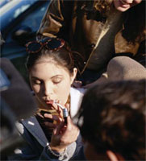

Title: Skila fíkniefnaforvarnir tilætluðum árangri?
Slug: skila-fikniefnaforvarnir-tilaetludum-arangri
Date: 2007-03-06 16:04:00
UID: 139
Lang: is
Author: Karl Jóhann Jóhannsson
Author URL: 
Category: Samfélag, Sálfræði
Tags: 

Fíkniefnaforvarnir hafa verið í gangi í mörg ár, eða allt frá því að skaði fíkniefna og áhrif þeirra á samfélagið varð almennilega ljós. Fáir efast um að þessar forvarnir geri gagn, færri efast hvort allar þessar herferðir gegn notkun vímuefna hafi nokkur áhrif yfirleitt og jafnvel enn færri telja að herferðirnar hafi neikvæð áhrif. En börn og unglingar eru mjög sérstakt fólk sem getur verið erfitt að ná til. Það er jafnframt fjarstæða að ætla að ná til allra þessara ólíku unglinga og er því ómögulegt fyrir fíkniefnaforvarnir, í núverandi mynd allavega, að skila meira en sáralitlum árangri. En hver er þá góður árangur í fíkniefnaforvörnum? Þó svo að aðeins örfáum yrði bjargað frá þeirri böl sem eiturlyfjafíkn er væri þá forvörnin ekki peninganna virði? Það má eflaust deila lengi um þessar spurningar en eins og flestir vita þá eru peningar af skornum skammti og því auðvitað best að eyða þeim í áhrifaríkustu forvörnina.

### Aðferðir við forvarnir

Herferðir hafa ólík markmið, á vefsíðunni _forvarnir.is_ er „aðgerðum í fíkniefnamálum“ skipt í þrjá flokka – forvarnir, íhlutun og meðferð – þar sem áhersla er ýmist lögð á að auka þekkingu á fíkniefnum, seinka byrjun notkunar (herferðir eins og t.d. „Ég ætla að bíða“), minnka neyslu þeirra sem þegar eru í neyslu, minnka almenna notkun eða minnka skaða af notkun.[^1] Forvörn getur sem sagt verið beint að þeim sem þegar nota eiturlyf, en þá er markmiðið ýmist að fá þau til að hætta eða þá að nota efnin skynsamlega. Þetta er ekki beint _forvörn_ gegn fíkniefnum heldur gegn frekari skaða af þeirra völdum.

Nú til dags er vinsælt að kenna börnum þá félagsfærni sem talið er þurfa til að forða þeim frá eiturlyfjum, en þó er einnig hamrað á því að öll eiturlyf séu skaðleg. Það er gert ráð fyrir að börn sem neyta eiturlyfja eigi við félagsleg vandamál að stríða, þó svo að fá gögn styðji þá tilgátu og rannsóknir styðji frekar að þeir sem fikta við eiturlyf séu í félagslega betra jafnvægi en þeir sem fikta ekki eða þeir sem eru í mikilli neyslu.[^2] 

Það er almennt litið svo á að forvarnir séu besta leiðin til þess að laga eiturlyfjavandamálið í samfélaginu, en í raun virðast þær hafa lítil sem engin áhrif.[^3] Sem dæmi þá sá níundi áratugurinn mikinn vöxt í fjárlögum Bandaríkjanna til forvarna og einnig minnkandi neyslu. En áður en vöxtur í fjárlögum jókst var eiturlyfjanotkun þegar byrjuð að minnka meðal unglinga, svo niðursveiflan var, að því er virðist, óháð forvörnum. Þrátt fyrir að fjármagn til forvarna jókst enn meira í byrjun tíunda áratugarins jókst neysla einnig þá og undarlega nokk þá jókst hún í samræmi við fjármagnið sem notað var til forvarna.

Það má vel vera að í raun hafi forvarnarherferðin sem notast var við á níunda áratugnum verið afar vel heppnuð en þessi á tíunda áratugnum hafi verið svo illa heppnuð að áhrif hennar voru þveröfug við ætlun forsvarsmanna hennar. En það má jafnvel velta því fyrir sér hvort forvarnir hafi þá neikvæð áhrif; fræðsla um efnin valdi kannski bara forvitni hjá krökkum. Krakkar sem neyta eiturlyfja gera sér oft vel grein fyrir skaðsemi þeirra, þó þau  hugsi kannski ekki út í það að neysla slíkra efna hafi skaðleg áhrif á þau sjálf, að skaðsemin muni ekkert hafa áhrif á þau. Einnig getur blátt bann vakið forvitni og jafnvel fengið krakkana til að efast um trúverðugleika þeirra sem sjá um forvarnafræðsluna.[^4]  Ef börnin missa trú á „fræðarana“ þá er lítið gagn af fræðslunni.

### Forvarnir sem „virka“

Unglingar hafa ófáir þá kosti að vilja vera sjálfstæðir, vilja standa fast á eigin skoðunum og vilja öðlast sjálfstæði frá boðum og bönnum hinna fullorðnu. Því getur komið sér vel að fræða þá um sjálfstæðar ákvarðanir í samhengi við fíkniefni. Það getur verið árangursríkt að kenna unglingum að mynda eigin skoðanir um fíkniefni,[^5] þó svo að þessi kennsla hafi stundum öfug áhrif. Á þennan hátt halda unglingarnir að þeir séu sjálfir að taka ákvarðanir, en þessar ákvarðanir eru byggðar á upplýsingum frá þeim sem setja sig upp á móti fíkniefnum og eru óhjákvæmilegar litaðar af því. Það er þar að auki betra að fá slíka fræðslu frá ábyrgum aðilum, ef unglingar eru ekki fræddir um skaðsemi fíkniefna getur jákvæður „áróður“ eiturlyfja verið vandamál. Boðskapur eins og í bíómyndum, tónlist, bókum og annars staðar þar sem krakkar læra að eiturlyf hafa einnig jákvæðar hliðar. Því getur verið mikilvægt að miðla öllum hliðum til þess að bæði viðhalda trúverðugleika og gera lítið úr þeirri spennu sem fylgir hinu forboðna.[^6] 

Það sem virðist virka best er svokölluð jafningafræðsla (eins og til dæmis [Jafningjafræðslan](http://www.hitthusid.is/category.aspx?catID=595) stendur fyrir). Það hefur sýnt sig að meiri munur fæst þannig heldur en þegar kennari fræðir unglingana. En kennarar hafa víst lítil sem engin áhrif,[^7] þó það fari líklega eftir kennaranum. Krakkar vinna úr upplýsingum á sama hátt og fullorðið fólk, þau treysta á fólk á sama hátt til að veita sér upplýsingar, og því er væntanlega mikilvægt að sendandi skilaboða sé á sama reiki.[^8] 

Það eru engin gögn sem sýna tvímælalaust fram á að forvarnir virka[^9] og er því mikilvæg spurning hvort verið sé að fara rétt að í þessum málum. Rannsóknir munu með tímanum eflaust leiða í ljós hvaða eiginleikar veita góða forvörn, en nú til dags er ekki vitað hvaða eiginleikar það eru. Hlutlæg viðmið eru ekki til fyrir forvarnarherferðir en sumar herferðir virka einfaldlega ekki, svo mikið er víst.[^10] Þær rannsóknir sem hafa sýnt fram á jákvæða verkun forvarna hafa verið gagnrýndar[^11] og réttmæti þessarra rannsókna hefur verið dregið í efa.[^12] Þrátt fyrir þetta eru eiturlyfjaforvarnir orðnar hluti af kennsluskránni á flestum af vesturlöndunum, sem er að sjálfsgöðu hið besta mál, en það þarf þó að standa rétt að þeim. Hin almenna skoðun nú til dags virðist vera að fíkniefnaforvarnir séu allar af sama toga, þurfi alltaf að vera sýnilegar og aldrei sé nóg af þeim. Rétt eins og að neysla fíkniefna hjá unglingum sé háð magni forvarna, algjörlega óháð gæðum þeirra, eða hvað? 

[^1]: Forvarnir.is. (http://forvarnir.is/forvarnir/forvarnir/) sótt af netinu 16/02/2007

[^2]: Gorman, D. M. (1997). The failure of drug education. _Public Interest_, 129.

[^3]: Ibid.

[^4]: Ibid.

[^5]: Moilanen, R. (2004). Just Say No Again: The old failures of new and improved anti-drug education. _Reason_, 35, 8.

[^6]: Schoenbachler, D. D. & Whittler, T. E. (1996). Adolescent processing of social and physical threat communications. _Journal of Advertising_, 25, 4.

[^7]: Cuijpers, P. (2002). Effective ingredients of school-based drug prevention programs: A systematic review. _Addictive Behaviors_. 27, 6.

[^8]: Schoenbachler og Whittler (1996).

[^9]: Gorman (1997).

[^10]: Cuijpers (2002).

[^11]: sjá t.d. Gorman (1997).

[^12]: Skara, S. & Sussman, S. (2003). A review of 25 long-term adolescent tobacco and other drug use prevention program evaluations. _Preventive Medicine_, 37, 5.

