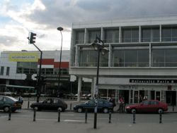

Title: Skiptinám „à Paris“
Slug: skiptinam-a-paris
Date: 2007-02-20 11:10:00
UID: 134
Lang: is
Author: Erna Jóhannesdóttir
Author URL: 
Category: Póstur að utan
Tags: 

Ég var ákveðin í að fara eitthvert sem skiptinemi meðan ég væri í BA-námi mínu í mannfræði við Háskóla Íslands. Fyrir valinu varð París. Franska var ekki beint í uppáhaldi hjá mér í menntaskóla en ég stóðst bara ekki tilhugsunina um að búa í París heilt skólaár. Ég fékk inngöngu í skóla sem heitir Paris 8 og er staðsettur í Saint-Denis rétt fyrir utan borgina (hverfi þar sem óeirðirnar voru hvað mestar árið 2005). Mannfræðideildin í HÍ er með sammning við þennan skóla. Það auðveldaði umsóknarferlið til muna. Á einhvern hátt náði ég líka að koma mér inn á stúdentagarða rétt hjá skólanum, en það er ekki mikið um þannig aðstöðu fyrir nemendur í París. 

Þegar ég mætti á staðinn fékk ég strax að finna fyrir frönsku skrifræði. Fyrstu tvær vikurnar mínar voru með eindæmum „skemmtilegar“ þar sem ég eyddi þeim aðallega í biðröð. Ég þurfti að gera hluti eins og að stofna bankareikning og skrá mig í kúrsa, sem ætti ekki að vera svo flókið, en það er bara ekkert grín að vera í Frakklandi og tala ekki frönsku! Alþjóðafulltrúinn í skólanum mínum talaði heldur ekki ensku þannig að ég sá fljótt fram á að ég þyrfti að læra frönsku og það hratt.

Fyrstu tvær vikurnar í skólanum fór ég því á frönskunámskeið með hinum Erasmusnemunum. Það var mjög sniðugt ekki síst vegna þess að maður kynnist svo mörgum þar. Allir voru mjög æstir í að eignast nýja vini og skiptast á símanúmerum. Aftur á móti var það nú ósköp lítið sem ég lærði af frönsku á þessu „frönskunámskeiði“ enda er eignilega ætlast til þess að maður sé altalandi þegar maður kemur. Allar tilkynningar varðandi námið og skólann voru á frönsku og ég skyldi ekki neitt í neinu.

Flestir háskólar í Frakklandi eru ríkisreknir. Skólinn minn er mjög ólíkur því sem maður hefur vanist heima. Um 30 þúsund nemendur eru í skólanum og þar er kennsla í öllu milli himins og jarðar, sama hvort um er að ræða listir, bóknám eða iðnnám. Ásjóna skólans er líka ólík því sem maður er vanur heima. Svo virðist sem skólabyggingunni sé ekkert, eða mjög lítið, haldið við og þar er veggjakrot um alla veggi. Það er ekkert óvenjulegt að sjá allskonar áróður spreyjaðan á veggi í skólastofum eða yfirlýsingar á borð við „niður með kennarann!“ Enginn virðist þó taka það neitt sérstaklega nærri sér. Það er líka reykt um allt, líka inn í skólastofunum(!), sem er gjörólíkt því sem maður hefur vanist á Íslandi. Upp um alla veggi er svo verið að auglýsa einhverja atburði; tónleika, mótmæli, bíókvöld eða tíma hjá spákonu, enda gríðarlega mikið í boði fyrir nemendur. Allt þetta gerir skólann, á einhvern kæruleysislegan hátt, mjög heimilislegan.

Ég byrjaði á að skrá mig eingöngu í kúrsa sem voru kenndir á frönsku. Eftir tveggja vikna frönskunámskeið sá ég hins vegar að það væri ekki alveg málið, svona til að byrja með, og fann mér fljótlega einhverja kúrsa á ensku. Mér þótti athyglisvert að það voru engar bækur settar fyrir kúrsana heldur var gert ráð fyrir að maður fyndi sjálfur eitthvað lesefni tengt náminu.

Það besta við skólann er bókasafnið. Það er mjög gott og þar er hægt að finna mikið úrval af bókum tengdum öllum fræðum auk þess sem þar er líka góð lesaðstaða. Bókasafnið býður einnig upp á lítinn bíósal þar sem hægt er að horfa á flestar franskar myndir sem gerðar hafa verið (þeir virðast ekki mikið vera fyrir erlendar myndir). Aðal gallinn við skólann er aftur á móti aðstaðan til að komast á Internetið. Það eru mjög fáar tölvur aðgengilegar, ekkert þráðlaust net og einn prentari. Sem sagt, ekki mjög tæknivætt umhverfi. 

Burt séð frá skólanum og náminu finnst mér aðalatriðið að búa á nýjum stað og njóta þess til hins ýtrasta. París er borg sem býður upp á endalausa möguleika. Það er hægt að finna eitthvað fyrir alla og alltaf er eitthvað í gangi. Ég hef í hyggju að flytja inn í miðja París, af stúdentagörðunum, þó að það hafi verið einstaklega gaman að búa þar upp á félagslíf að gera. En það er ekki alveg eins gaman að búa fyrir utan París og að búa í henni miðri og allt öðruvísi upplifun. En hérna leigumarkaðurinn er algjör frumskógur og það getur tekið mjög langan tíma að finna sér íbúð á viðráðanlegu verði. Maður getur þó verið heppinn og nælt sér í góða íbúð sem er á góðum stað, en staðsetning skiptir öllu máli. Draumurinn er að geta labbað um allt án þess að þurfa að stóla á lestarkerfið. 

París er full af ungu fólki og það er mikið af stúdentabörum og skemmtunum í boði fyrir „fátæka námsmenn“. Það er líka mikið af skipulögðum Erasmus-partíum sem af einhverri ástæðu eru líka mjög vinsæl meðal Frakka. Erasmuslífið er þó annars frekar ljúft, aðal stritið er fyrsta mánuðinn þegar allt er einn hrærigrautur og maður botnar ekki neitt í neinu. Það þýðir þó ekkert að láta það á sig fá heldur er um að gera að fá sér bara rauðvín og ost og bíða það af sér. 

