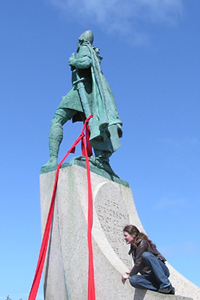
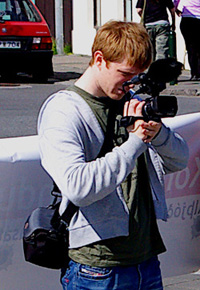
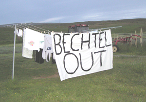

Title: Sófakynslóðin
Slug: sofakynslodin
Date: 2006-11-16 11:00:00
UID: 111
Lang: is
Author: Áslaug Einarsdóttir
Author URL: 
Category: Í umræðunni, Kvikmyndir
Tags: 

„Við erum sófakynslóð, sófalandið. Við sitjum bara í sófanum og erum á móti hlutum en gerum ekki rassgat í því.“ Svo komst einn viðmælenda að orði í heimildarmyndinni _Sófakynslóðin, Aktivismi á Íslandi_ sem verður sýnd næsta laugardag. En erum við jafn óvirk og aðgerðalaus og við virðumst oft vera? Þúsundir manna fylgdu til að mynda Ómari Ragnarssyni niður Laugaveginn. Á þriðjudaginn síðasta mættu um hundrað manns fyrir framan utanríkisráðuneytið með mótmælaborða og gjallarhorn til að mótmæla fundi utanríkisráðherra og sendiherra Ísraels, þrátt fyrir að fundurinn hafi verið boðaður með aðeins sólarhrings fyrirvara. Burt séð frá þessum dæmum mætti þó líklega segja að aktivismi sé tiltölulega óþekkt hugtak í íslensku samfélagi. Finnst Íslendingum þrátt fyrir allt bara hallærislegt að standa í rigningunni og rokinu með skilti og kyrja slagorð? 

Upp úr þessum vangaveltum kviknaði áhugi minn og meðframleiðanda míns, Garðars Stefánssonar, á því að taka saman myndefni um ýmsa aðgerðahópa og samtök sem eru að stunda aktivisma til að koma skilaboðum sínum á framfæri. _Sófakynslóðin_ sýnir frá aðgerðastarfi hópa og samtaka á borð við Femínistafélag Íslands, Ísland-Palestínu, Amnesty International auk ýmissa náttúruverndarhópa og tekin eru viðtöl við einstaklinga sem stunda margvíslegar aðgerðir. Með samantektinni er vonin sú að vekja athygli á aktivisma í íslensku samfélagi og sýna fram á þær ólíku leiðir sem einstaklingar geta farið til að koma hugsjónum sínum til skila til samfélagsins.

Segja má að hugmyndin um myndefni um íslenskan aktivisma hafi mótast þegar við unnum við að kynna mannréttindastarf á götum úti. Ungt fólk var almennt mjög áhugasamt um slíkt starf og vildi fá upplýsingar um hvernig hægt væri að komast í samband við virka aktivista, mynda eigin aðgerðahópa og standa fyrir ýmsum uppákomum. Margir hverjir höfðu þó ekki kynnst slíku starfi áður og vissu lítið um aðgerðastörf á vegum samtaka og hópa hérlendis. Þannig kviknaði sú hugmynd að gera heimildarmyndband um aktivisma til að fara með í framhaldsskóla og félagsmiðstöðvar. Markmiðið var að kynna margvíslega aðgerðaform fyrir ungu fólki, vekja áhuga þess á hugtakinu og koma af stað umræðum um markmið, áhrifamátt og tilgang aktivisma.

Við mættum, til að byrja með, ófáum skilningsvana andlitum þegar við sögðumst vera að vinna að kynningarefni um aktivisma enda er hugtakið tiltölulega lítið þekkt hér á landi. Til dæmis er ekki ennþá til góð þýðing á hugtakinu „aktivismi“. Okkur var bent á að orðið „aktivisti“ væri yfileitt þýtt sem „aðgerðasinni“ en þegar við bárum það undir viðmælendur okkar fannst flestum orðið vera óþjált og skorta alla skírskotun til þeirrar virkni sem aktivismi felur í sér. Okkar von er því að myndefnið veki athygli á hugtakinu sjálfu og hvetji fólk til umhugsunar á því hvaða skilning það leggi sjálft í hugtakið.

Eftir að hafa mótað hugmyndina var næsta mál á dagskrá að sækja um styrki til að fá að vinna að verkefninu yfir sumartímann. Einhverjir höfðu orð á því að efnið væri allt of umdeilt og eldfimt til að fá opinbera styrki en sú spá reyndist óþarflega svartsýn. Ungt fólk í Evrópu og Nýsköpunarsjóður námsmanna reyndust tilbúin að styrkja myndina. En í kjölfar þeirrar svartsýni sem við urðum vitni að í styrkjaferlinu spurðum við okkur að ástæðum þess að aðgerðir aktivista eru gjarnan umdeildar. Mætti jafnvel kenna fjölmiðlum þar um? Yfirleitt heyrast raddir aktivista ekki í fjölmiðlum nema þegar lög hafa verið brotin, t.d þegar eignartjón hefur átt sér stað. Fráleitt er þó að halda því fram að allir aktivistar kasti bensínsprengjum í sendiráð eða sletti skyri. Langflestar aðgerðir á Íslandi fara friðsamlega fram en einstaklingar hafa þó uppi ólíkar skoðanir um það hvernig best er að koma markmiðum sínum á framfæri, eins og aðrir hópar. Því töldum við nauðsynlegt að sýna fram á fjölbreytileika aðgerða og vekja um leið máls á þeirri spurningu hversu langt megi ganga í aktivisma. Viðmælendur okkar höfðu uppi mjög ólíkar skoðanir á því hvar mörkin skyldu dregin en þó tóku allir skýrt fram að líkamlegt ofbeldi væri aldrei réttlætanleg aðferð til þess að koma hugsjónum sínum á framfæri. Ég tel þannig óhætt að halda því fram að íslenskur aktivismi fari að langmestu leyti friðsamlega fram og sé tiltölulega öfgalaus miðað við aðgerðir í öðrum löndum. 

Eflaust fer það fyrir brjóstið á sumum að stefnt sé að því að sýna framhaldsskólanemum myndefni þar sem nokkrir viðmælendur boða borgaralega óhlýðni og gagnrýna t.d. harðlega viðbrögð lögreglu við mótmælum á Kárahnjúkum. En eiga ekki öll sjónarhorn og allar nálganir á samfélagslegar aðgerðir rétt á að heyrast í lýðræðissamfélagi? Staðreyndin er nefnilega sú að raddir aktivismans heyrast því miður ekki nógu hátt og sterkt. Mætti segja að það sé fyrst og fremst tilgangur kvikmyndarinnar að leyfa þessum röddum að heyrast. Áhorfendur gera það svo sjálfir upp við sig hvaða raddir höfða best til þeirra og hvaða nálgun sé best til þess fallin að ná árangri. 

_Sófakynslóðin_ verður sýnd öllum áhugasömum í Háskólabíói laugardaginn 18. nóvember klukkan 13:00. Aðgangur er ókeypis og eru allir velkomnir.

<small class="blurb">Ljósmyndir © Íris Ellenberger</small>
