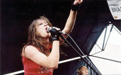

Title: Söngstjörnur
Slug: songstjornur
Date: 2005-10-27 11:09:00
UID: 8
Lang: is
Author: Unnur María Bergsveinsdóttir
Author URL: http://unnur.klaki.net
Category: Menningarfræði, Kvikmyndafræði
Tags: 

Um miðja síðustu öld kippti sér enginn upp við það að kvikmynda&shy;stjarna tæki sér stöðu við hljóðnemann og gæfi út plötu, annað hvort með þekktum smellum eða tónlist saminni af atvinnu&shy;laga&shy;höfundum. Stjörnur þessa tíma, og sér í lagi þær sem flokkuðust undir smástirni, töldust fyrst og fremst vera skemmti&shy;kraftar og því fjöl&shy;hæfari sem þær voru, því betra. Bæði fyrir stjörnuna sjálfa og atvinnu&shy;veitendur hennar. Gæti stjarna sungið og dansað voru þeir hæfileikar hennar hiklaust nýttir í ágóðaskyni. 

Í dag lifum við á tímum þar sem kvikmynda&shy;heimurinn keppist við að þvo af sér kenningar Richards Dyer um stjörnu&shy;kerfið. Við erum öll meðvituð um að við lifum á tímum markaðssetningar og er meinilla við tilhugsunina. Þess vegna markaðs&shy;setja kvikmynda&shy;stjörnur dagsins í dag sig upp til hópa sem viðkvæma og metnaðarfulla listamenn hverra helgasta boðorð er listrænt sjálfs&shy;forræði. Eða því vilja bæði leikarar og kvikmyndaver a.m.k. telja okkur trú um. Það eru helst bandarísk ungstirni, eða öllu heldur fégráðugir foreldrar eða kvikmynda&shy;fyrirtækin sem þau eru samnings&shy;bundin, sem leggja í að þjóðnýta þá möguleika sem stjörnu&shy;hlut&shy;verkið býður upp á. Þar fer Jessica Simpson líklega fremst í flokki en ungir aðdáendur hennar eru einmitt sá hópur sem líklega er hvað umburðar&shy;lyndastur gagnvart þeirri staðreynd að líkt og flest annað er stjarnan söluvara. 

Mergur málsins er sá að leikarar nútímans hafa, hvað almennings&shy;álitið varðar, unnið sig upp í þann sess að vera almennt taldir sinna köllun hjartans og lista&shy;gyðjunnar í stað þess að litið sé á það að vera stjarna sem starf sem krefst til&shy;tekinna hæfi&shy;leika. Nei, þess í stað höfum við þá mýtu að leikarar séu upp til hópa fólk sem vílar ekki fyrir sér að bæta á sig 20 kílóum og dvelja í 3 mánuði lokaðir inni í búri með þung&shy;lyndum nas&shy;hyrningum til þess eins að geta túlkað hlutverk sitt af raunsæi. Þetta kunnum við, sem erum alin upp í þeirri trú að hvert og eitt okkar geti orðið bæði rokk&shy;stjarna og forseti, vel að meta. Að trúa því að að fólkið á skjánum sé þar vegna þess að þess innsta þrá sé sú að færa okkur eitthvað óvið&shy;jafnan&shy;legt gerir okkar hlutverk sjálfkrafa meira virði.  

Þeir leikarar sem hafa virkilegan áhuga á tónlist eru því í verulegum vandræðum. Hin tónhneigða kvikmynda&shy;stjarna þarf nú í upphafi 21. aldar að dragnast með það orðspor að vera annað hvort tíma&shy;skekkja eða, það sem er verra, að vera að reyna að öðlast óverð&shy;skuldaða frægð á fölsuðum VIP passa. Þetta hafa Billy Bob Thornton, Keanu Reeves og Kevin Bacon þurft að þola. Líkt og Juliette Lewis sem söng með hljóm&shy;sveitinni _The Licks_ í Hafnarhúsinu fyrir tæpri viku síðan. 

Juliette, sem ber eftirnafnið Lewis, er betur þekkt sem leikkona. Hún ærði heiminn með því að sjúga á sér þumalfingurinn í _Cape Fear_ fyrir um fimmtán árum og hefur síðan trónað ofarlega á stjörnuhimni Hollívúdd. Hún hefur athyglis&shy;verða söngrödd sem hefur fengið að njóta sín í mörgum kvikmyndum og má þar helst nefna bæði _Natural Born Killers_ og vísinda&shy;tryllinn _Strange Days_,  en þar lék hún óhamingju&shy;sama nætur&shy;klúbbs&shy;söng&shy;konu sem þurfti að velja á milli frama á vegum vonda mannsins og þess að gera hið rétta í þágu hinnar veik&shy;lunduðu en heiðarlegu sögu&shy;hetju. Fyrir tveim árum fann hún tónlistar&shy;áhuganum útrás með stofnun hljóm&shy;sveitarinnar _The Licks_ en þau spila hrátt rokk. 

Það er athyglisvert að lesa viðtöl við Juliette og _The Licks_. Líkt og er tilfellið með aðra leikara sem hafa komið út úr skápnum sem tón&shy;listar&shy;menn, fer hjá Juliette jafnan mikil orka í það að sverja af sér þá gagnrýni að hún og strákarnir séu á nokkurn hátt að notfæra sér frægð sína sem leik&shy;kona. Mig rekur eiginlega ekki minni til þess að hafa nokkurn&shy;tíman lesið við hana viðtal sem ekki snýst einmitt um það að leggja áherslu á að þau hafi hvergi stytt sér leið. Að hún róti dóti með strákunum sínum. Að hún sé að þessu öllu saman eingöngu fyrir ástina sem hún hefur á rokk og róli. 

Hljómsveitin _The Licks_ hefur fengið misjafna dóma. Flestir gagn&shy;rýnendur eru þó sammála um að Juliette hafi flotta rödd og að tónleikar hennar ásamt _The Licks_ séu rokk&shy;samkomur af æsilegustu gerð. Af hverju skiptir það okkur þá svona miklu máli hvað varðar ánægju okkar af því að horfa á Juliette aka sér og skaka á sviði og syngja fína mússík með drullu&shy;fínni rödd að vita að hún hafi sjálf lyft mögnurum? Að lesa að hún hafi skrölt um banda&shy;ríska þjóð&shy;vegi í lítilli svita&shy;lyktar&shy;angandi rútu? Hversvegna snúast viðtölin ekki frekar um tónlist þeirra? Jú, þetta má að öllum líkindum rekja til hins slæma orðspors sem um var rætt hér að ofan. Gerist leikari tón&shy;listar&shy;maður er næsta víst að viðkomandi sé að reyna að snuða okkur og enginn vill þola slíkt, sér í lagi ekki þegar kemur að neyslu menningar. Slík iðja nýtist nefnilega til að bæta við okkar persónu&shy;lega menningar&shy;höfuð&shy;stól. Því viljum við trúa því að leikarar séu almennt heiðarleg og metnaðarfull stétt - að markmið sjöundu listarinnar sé ekki aðeins framleiðsla afþreyingar&shy;varnings. Við viljum líka að tón&shy;listarmenn skrifi söngva sína með blóði og tárum. Allt það sem minnir okkur á markaðs&shy;maskínuna og þann möguleika að hugsanlega séu margir listamenn fólk sem hefur einfaldlega séð leik&shy;list eða tónlist sem ákjósan&shy;lega leið til að hagnast á hæfi&shy;leikum sínum truflar þann draum. Ekkert okkar kærir sig um að ranka við sér síl&shy;spikað af af&shy;þreyingar&shy;skvabi. 

Það er athyglisvert að íslenskir leikarar sem hafa hætt sér út á tónlistarsviðið hafa fengið óvenju sanngjarnar viðtökur. Hugsanlega höfum við enga trú á því að neinum finnist taka því að beita markaðssetningarbrellum í svo smáu þjóðfélagi. Ég myndi jafnvel halda því fram að íslenskir leikarar njóti þannig þeirrar gæfu að vera dæmdir af eigin hæfileikum. Nýjasta íslenska dæmið um syngjandi leikara er auðvitað Brynhildur _Piaf_ Guðjónsdóttir en hún hélt magnaða útgáfutónleika á Borginni í gær þar sem hún söng með eigin hljómsveit fyrir fullu húsi heillaðra gesta. 

Airwaves hátíðin ber hinsvegar alþjóðlegan blæ og því er það af Juliette að segja að Íslendingar litu komu hennar tor&shy;tryggnis&shy;augum. Út um víðan blogg&shy;völl mátti lesa að það gæti varla verið mikið spunnið í þessa hljóm&shy;sveit, að frami hennar væri byggður á einhverju allt öðru en tónlistinni. Örfáir höfðu kynnt sér málið og höfðu áhuga á því að sjá sveitina á sviði. Allstaðar mátti þó greina eftir&shy;væntingu eftir tónleikum sveitarinnar, myndi hún standast prófið eða myndum við öll geta sameinast um að fordæma hana sem markaðs&shy;brellu? Að leik loknum reyndust skoðanir fólks skiptar. Þeir sem stóðu næst sviðinu og dönsuðu elskuðu hverja mínútu tónleikanna. Útsendari [Kistunnar](http://kistan.is) lýsti því til að mynda yfir að hún ætlaði [aldrei aftur að þvo á sér fingurgóma vinstri handar](http://kistan.is/efni.asp?n=4110&f=2&u=23). Fólkinu sem stóð aftar og kinkaði kolli gáfulega fannst hins&shy;vegar minna til atburðarins koma. 

---

<small class="blurb">
Þeim sem vilja kynna sér Juliette og _The Licks_ er bent á [heimasíðu hljómsveitarinnar](http://www.julietteandthelicks.com) en þar er ýmislegt góðgæti að finna sem gleður bæði augu og eyru. Þeim sem áhuga hafa á að kynna sér kenningar um stjörnukerfi Hollívúdd skal bent á verk [Richards Dyer](http://www2.warwick.ac.uk/fac/arts/film/about/staff/dyer/) og þá sér í lagi bókina _Stars_. Dyer er fáanlegur til útláns á Þjóðarbókhlöðunni en einnig bjóða reykvískar bókabúðir hann til kaups.
</small>

