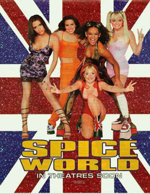

Title: Spice World - Gleðibyltingin
Slug: spice-world-gledibyltingin
Date: 2008-03-14 12:30:00
UID: 229
Lang: is
Author: Svala Kristín Þorleifsdóttir
Author URL: 
Category: Tónlist
Tags: Spice Girls, Spice World, Victoria Beckham, Melanie Brown, Geri Halliwell, Michelle Stephenson, Lianne Morgan, Chris Herbert, Bob Herbert, London, Emma Bunton, Melanie Chrisholm, Virgin Records, Wannabe, The Beatles, Bretland, Brit popp, Notting Hill, Austin Powers, Smack the pony, Einar Bárðarson, Simon Fuller, Simon Cowell, Claudia Schiffer, Pop Idol, American Idol, So you think you can dance, BBC, Pepsi, Kim Fuller, Royal Albert hall, Girl Power, Spice up your life, tíska, unglingar, stúlkur, samkynhneigðir, Menntaskólinn við Hamrahlíð

Flestir muna eftir Spice Girls æðinu sem tryllti heimsbyggðina undir lok síðustu aldar. Hljómsveitin var starfrækt á árunum 1994 — 2001 en kom aftur saman á stuttu tónleikaleikaferðalagi nú fyrir skömmu. Á hátindi ferilsins, árið 1997, kom út kvikmynd þeirra _Spice World_. Þrátt fyrir misjafna dóma gagnrýnenda varð myndin gríðarlega vinsæl og setti af stað hið svokallaða Spice Girls æði um heim allan og halaði inn um 75 milljónum dollara.[^1]  Þrátt fyrir að söguþráður myndarinnar og leikur stúlknanna gæti seint talist verðlaunaverður hafði myndin þó nokkur samfélagsleg áhrif og hér á eftir mun ég leitast við að rifja upp sögu hljómsveitarinnar og útskýra áhrif myndarinnar á samfélagið.

Það var þann 4. mars 1994 sem þær Victoria Beckham, Melanie Brown, Geri Halliwell, Michelle Stephenson og Lianne Morgan mættu ásamt 400 öðrum breskum stúlkum í áheyrnarprufur í Dance Works stúdíóinu í Balderton stræti í London. Loks voru þær valdar af þeim Chris og Bob Herbert til þess að mynda stúlknabandið Spice girls sem var formlega stofnað í London þetta sama ár.[^2]  Fljótlega sagði Stephenson sig úr bandinu og hin 18 ára gamla Emma Bunton var fengin í staðinn. Til þess að fínpússa stúlknabandið enn frekar var svo Morgan sagt upp vegna þess hversu gömul hún leit út fyrir að vera miðað við hinar stelpurnar, sem allar eru fæddar á árunum 1972 — 1976, og í stað hennar var fengin Melanie Chrisholm.[^3]

Hljómsveitin komst svo fljótlega á samning við Virgin Records og árið 1996 kom út slagarinn ,,Wannabe” sem sat í sjö vikur í toppsæti breska smáskífulistans og sló þar með gamalt sölumet Bítlanna. Þá var ekki aftur snúið og sama ár urðu þær heimsfrægar og seldu yfir 55 milljón plötur út um allan heim. Það var svo á hápunkti frægðarinnar, í desember 1997 sem Spice World myndin kom út og tryllti unglingsstúlkur heimsbyggðarinnar. Þessi framúrskarandi árangur hljómsveitarinnar hafði einnig mikil tónlistarleg áhrif í Bretlandi og kom popptónlist aftur á kortið eftir áralangar vinsældir Brit-poppsins.[^4]  Auk þess gáfu vinsældir hljómsveitarinnar Bretum meiri athygli á heimskortinu, þ.e. bresku tónlistar- og menningarlífi á miðjum tíunda áratugnum. Þar má nefna hvernig breski fáninn var gerður að vörumerki og er hinn frægi kjóll Geri Halliwell, sem gerður var úr bresku fánalitunum, þar augljós vitnisburður. Auk þess skartar kápumynd kvikmyndarinnar glitfögrum breskum fána í bakgrunni.[^5]  Bretland komst í tísku, ekki einungis í tónlist, heldur einnig í fatatísku og  í sjónvarpi, og má þar nefna kvikmyndir á borð við _Notting Hill_ og _Austin Powers_, auk gamanþáttaraða á borð við _Smack the pony_.

Stúlkurnar í Spice girls mega að mestu leyti þakka frægðarferil þeirra einum manni, Simon Fuller, en hann er líklega fyrirmynd okkar íslenska Einars Bárðarsonar. Þó má ekki rugla Simon þessum saman við nafna hans Simon Cowell, dómarans geðþekka úr _Idol_ þáttunum vestanhafs og austan. Fuller þessi hefur auk þess að vera umboðsmaður hljómsveitarinnar frægu, fyrirsætunnar Claudiu Schiffer og síðar Beckham hjónanna, einnig verið skapari sjónvarpsþáttaraða á borð við _Pop Idol_, _American Idol_ og _So you think you can dance_.[^6]  Fuller er því maður mikils metnaðar og segir hann meðal annars í viðtali við bresku fréttarásina BBC árið 2003 að hann hafi sest niður með stúlkunum í Spice Girls strax fyrsta starfsdaginn þeirra og ákveðið með þeim að setja markið á heimsfrægð.

Fuller var slingur í markaðsetningu hljómsveitarinnar og kom þeim fljótlega á samning við heimsþekkt fyrirtæki á borð við Pepsi og von bráðar var varla til það krummaskuð í heiminum sem ekki hafði heyrt um „Kryddpíurnar” vinsælu eins og þær hafa verið kallaðar hérlendis.

Auk þess var framleiddur fjöldinn allur af varningi tengdum hljómsveitinni, til að mynda Spice Girls barbie dúkkur fyrir yngstu kynslóð aðdáendanna. Þó varð úr að stúlkurnar ráku Fuller, mánuði áður en _Spice World_ kom út, og voru ástæðurnar sagðar vera að hann hafi gerst einum of stjórnsamur varðandi bæði þeirra persónulega og listræna frelsi.  Handrit kvikmyndarinnar _Spice World_ var hins vegar skrifað af bróður hans, Kim Fuller.

Söguþráður kvikmyndarinnar _Spice World_ er klassískur fyrir ungar konur á uppleið. Stelpurnar fimm hafa hvern sinn sérstæða persónuleika og baráttumál auk þess sem þær hafa nóg á sinni könnu við að sinna frægðinni. Gráðugur dagblaðaeigandi reynir að auka sölugróðann með gróusögum um stúlkurnar,  þær eru orðnar þreyttar á frægðinni og árasagjarnir ljósmyndarar og kvikmyndagerðarmenn láta þær ekki í friði. Á meðan á öllu þessu stendur ferðast þær um heiminn, undirbúa sig fyrir stórtónleika í Royal Albert Hall og verða í þokkabót viðstaddar barnsfæðingu vinkonu sinnar rétt fyrir stóru stundina.[^10]

Í myndinni er gert mikið úr vinskap stúlknanna og samstöðu.  Eftir myndina mynduðu þær einskonar feminískt viðhorf sem þær kölluðu ,,Girl power”, gerðu það að slagorði sínu og breiddu það út um heimsbyggðina. Þannig vildu þær hvetja konur á öllum aldri til þess að styrkja vináttuböndin sína á milli og standa saman. Spice Girls stelpurnar voru fyrirmynd kynslóðar sem átti að vera fjörug, lífsglöð og sterk. Slagorðið varð það útbreitt að það skipaði sér línu í Oxford-útgáfu ensku orðabókarinnar.[^11]   Jákvætt og glaðlegt viðhorf stúlknanna endurspeglaðist einnig í lagatextum þeirra líkt og í laginu „Spice up your life” af geisladisknum _Spice World_ frá árinu 1997, þar sem fram kemur þessi textabútur:

> When you’re feeling sad and low  
> we will take you where you’ve got to go  
> smiling and dancing  
> everything is free  
> all you need is positivity… [^12]

Kryddpíurnar þrengdu sér ekki aðeins inní hjörtu og eyru kvenna, heldur lögðu þær einnig línurnar í tískunni. Myndin _Spice World_ kom fram með nýja tískustrauma sem urðu vinsælir í útliti og fatnaði 20. áratugarins. Ber þar helst að nefna svokallaðan einkennisklæðnað stúlknanna, eins og t.d. dýramunstur Mel B, tíkarspenar Emmu, íþróttagallar Mel C, þykkbotnaskór Geri og pínupils Victoriu, svo ekki sé minnst á breska þjóðfánann.

Stíll Spice Girls stúlknanna höfðaði ekki síður til samkynhneigðra og varð fljótlega eins konar táknmynd fyrir samkynhneigða menningu á Bretlandseyjum og víðar, þrátt fyrir að ekki sé vitað til annars en að allir meðlimir sveitarinnar séu gagnkynhneigðir.[^13]

Það má því með sanni segja að _Spice World_ myndin hafi verið einn af áhrifaríkari poppviðburðum síðustu aldar, ekki einungis á Bretlandseyjum heldur um heim allan. Með tilkomu myndarinnar var hljómsveitinni komið og kortið og Spice Girls æðið hafið. Tónlist þeirra endurlífgaði táp og fjör í tónlistarlegu og menningarlegu samfélagi. _Spice World_ myndin varð til breytinga á stefnu í tónlist, poppmenningu, tísku og viðhorfi ungra kvenna til sjálfs síns út um allan heim. Þær báðu um byltingu og fengu hana.

---

<small class="blurb">
Grein þessi er afrakstur samstarfsverkefnis Hugsandi og sögukennara við Menntaskólann í Hamrahlíð. Greinin er skrifuð af nemanda í rokksöguáfanga.
</small>

[^1]: [„Spice Girls”](http://en.wikipedia.org/wiki/Spice_Girls). _Wikipedia the free encyclopedia_
[^2]: Rob McGibbon,. <cite>Spice power</cite>. The inside story. (London 1997, Boxtree), bls 9-12.
[^3]: [„Spice Girls”](http://en.wikipedia.org/wiki/Spice_Girls). _Wikipedia the free encyclopedia_
[^4]: [„Spice Girls”](http://en.wikipedia.org/wiki/Spice_Girls). _Wikipedia the free encyclopedia_
[^5]: [„Cool Britannica”](http://en.wikipedia.org/wiki/Cool_Britannia) _Wikipedia the free encyclopedia_.
[^6]: [„Simon Fuller”](http://en.wikipedia.org/wiki/Simon_Fuller) _Wikipedia the free encyclopedia_.
[^7]: [„Simon Fuller: Guiding pop culture”](http://news.bbc.co.uk/1/hi/entertainment/music/2999872.stm). _Fréttavefur BBC_. (2003).
[^8]: [„Spice Girls”](http://en.wikipedia.org/wiki/Spice_Girls). _Wikipedia the free encyclopedia_
[^9]: [„Spice Girls”](http://en.wikipedia.org/wiki/Spice_Girls). _Wikipedia the free encyclopedia_
[^10]: Bob Spiers. _Spice World. The Movie_ (Bretland 1997, Columbia Pictures, Polygram Filimed Entertainment, Buena Vista International).
[^11]: [„Spice Girls”](http://en.wikipedia.org/wiki/Spice_Girls). _Wikipedia the free encyclopedia_
[^12]: Richard Stannard, „Spice up your life”. _Spiceworld_ (1997).
[^13]: [„Spice Girls”](http://en.wikipedia.org/wiki/Spice_Girls). _Wikipedia the free encyclopedia_
