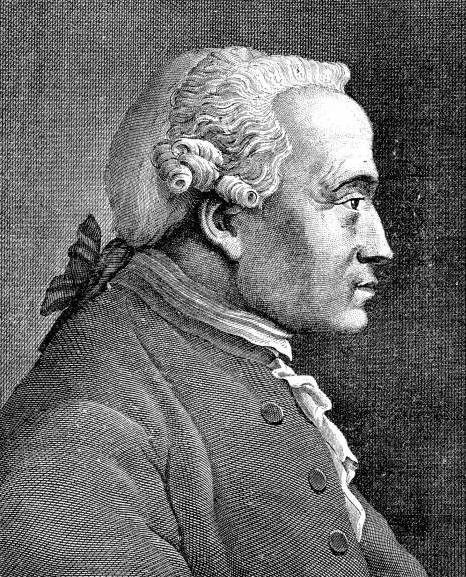
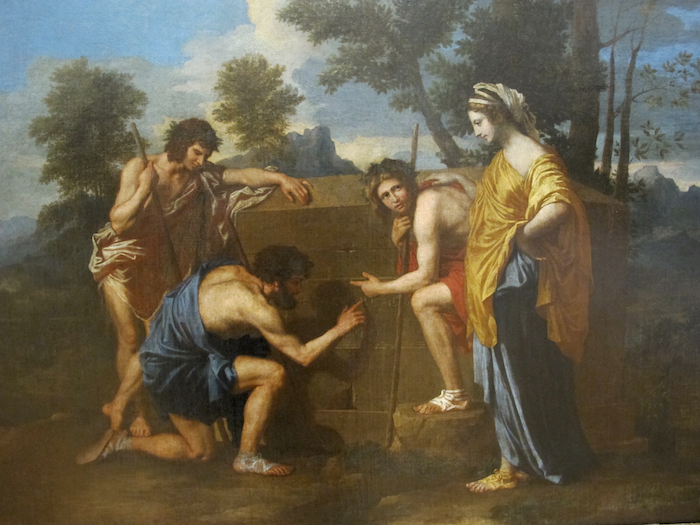

Title: Spor í sögu vestrænnar fagurfræði
Subtitle: Kant
Slug: spor-i-sogu-vestraennar-fagurfraedi
Date: 2007-05-29 11:07:00
Part: 1/4
UID: 163
Lang: is
Author: Kári Páll Óskarsson
Author URL: 
Category: Heimspeki, Listfræði
Tags: 

Allt frá tímum Forn-Grikkja hefur fegurðin verið við&shy;fangs&shy;efni mikilla hugsuða, en þó var fagur&shy;fræðin einungis jaðar&shy;grein í heim&shy;spekinni öldum saman. Höfundar fyrri tíma á borð við Platon, Aristóteles, Plótínus, Hóras, Longínus og Tómas af Akvínó  fjölluðu um þetta við&shy;fangs&shy;efni, en engu að síður var fagurfræði utan&shy;garðs, of huglæg og afstæð til að mönnum þætti hún full&shy;nægjandi viðfangs&shy;efni fyrir heim&shy;spekina. Það er ekki fyrr en með þýska heim&shy;spekingnum Immanuel Kant (1724-1804) sem fagur&shy;fræði fór að njóta sam&shy;mælis meðal annarra heim&shy;speki&shy;greina og því má líta á hann sem upp&shy;hafsmann nútíma fagur&shy;fræði. Kant var fyrsti mikli heim&shy;spekingurinn sem felldi kenningar um fagur&shy;fræði inn í heildar&shy;kerfi sitt, og fékk fagið þar með viður&shy;kennt sem jafn mikil&shy;vægt og aðrar heim&shy;speki&shy;greinar. 

Árið 1790 sendi Kant frá sér bókina _Gagnrýni dómgreindarinnar_, og var sú bók hin þriðja í röð svokallaðra gagnrýnisbóka hans. Í grófum dráttum má segja að hún fjalli um fagurfræði, en hinar tvær bækurnar, þ.e. _Gagnrýni verklegrar skynsemi_ (útgefin 1788) fjalli um siðfræði, og stórvirkið _Gagnrýni hreinnar skynsemi_ (útgefin 1781, endurskoðuð 1787) fjalli um þekkingu. Þessi verk, og sérstaklega hið síðast&shy;nefnda, hafa verið svo áhrifamikil að segja má að þau hafi verið jafn byltinga&shy;kennd fyrir heim&shy;spekina og uppgötvanir Kóperníkusar um stöðu jarðarinnar í sólkerfinu voru fyrir náttúru&shy;vísindin. Hér er ekki rúm til að ræða ítarlega hví hugmyndir Kant voru svona byltingar&shy;kenndar; duga verður að segja að hann hafi kollvarpað öllum fyrri hugmyndum um samband manns&shy;hugans við veru&shy;leikann. Í stuttu máli var eðli þessarar byltingar það að hann færði rök fyrir því að manns&shy;hugurinn, vitund manns sjálfs, stæði ekki fyrir utan umheiminn eins og hlutlaus áhorfandi sem gæti metið allt sem hann sæi á óhlut&shy;drægan hátt, heldur væri manns&shy;hugurinn þvert á móti rótfastur í umheiminum, í sífelldri díalóg við umhverfi sitt. Þetta myndi hafa í för með sér að allar hugmyndir mannsins um veru&shy;leikann hlytu að vera huglægar og afstæðar. Heimurinn eins og við þekkjum hann verður afurð hugar&shy;starfs okkar sjálfra. Kant vildi því meina að við gætum aðeins kynnst ásýnd hlutanna, en aldrei „hlutunum í sjálfum sér” eins og hann orðaði það. Ekki nóg með þetta, en sé hið mennska viðfang gert að upp&shy;sprettu reynslunnar þá hlýtur það að þýða að skilyrðin fyrir möguleikanum á huglægni séu um leið skilyrðin fyrir mögu&shy;leikanum á hlutlægni. Með öðrum orðum: uppbygging minnar persónulegu reynslu og uppbygging heimsins eru tvær hliðar á sama pening. Samkvæmt Kant nálgast hugurinn heiminn á þrenna vegu: í gegnum skilning (_Gagnrýni hreinnar skynsemi_), í gegnum skynsemi (_Gagnrýni verklegrar skynsemi_) og í gegnum fagurfræðilega reynslu (_Gagnrýni dómgreindarinnar_). Þessi svið útiloka síðan og takmarka hvert annað. Skilningur hefur t.d. ekkert að gera með skynsemi og öfugt.

Kenningar Kant um fagurfræði eru að mörgu leiti viðbrögð við skrifum David Hume um þetta efni. Hume hafði viljað meina að fegurð væri huglæg og smekkur manna háður persónulegum duttlungum, og Kant tók undir þetta en vildi þó meina að engu að síður væri til fegurðar&shy;upplifun sem væri alveg ópersónubundin. Markmið röksemda&shy;færslu hans verður því að brúa bilið á milli hins huglæga og hins hlutlæga, að sýna fram á að í þessum málum séu til algildir mæli&shy;kvarðar þó svo að smekkur manna sé sértækur. Ópersónulega fegurðar&shy;upplifunin er samkvæmt honum afleiðing af því sem hann kallaði frjálst samspil ímyndunar&shy;aflsins og skilningsins. Eina mögulega skýringin á reynslu sem þessari væri að hún endur&shy;speglaði að einhverju leiti innri gerð hugans, m.ö.o. að hugar&shy;starf allra manna sé eins að innri gerð. Það sé sem sagt til einhvers konar fegurðar&shy;upplifun sem er forskil&shy;vitleg, svo framarlega sem _viss skilyrði eru uppfyllt_, og er það í samræmi við þá höfuð&shy;kenningu sem Kant setti fram í _Gagnrýni hreinnar skynsemi_, þ.e. forskil&shy;vitlegu hughyggjuna (e. _transcendental idealism_). Kjarninn í henni er, eins og áður segir, að reynsla okkar af hlutum markast öll af því hvernig okkur virðast hlutirnir, en ekki af því hvernig þeir eru í raun. 

Skilyrðin fyrir þessari hreinu fagur&shy;fræðilegu upplifun eru fern. Í fyrsta lagi þarf að samþykkja að smekkur sé huglægur. Þetta er viðhorf Hume, og Kant samþykkir það. Tilfinningar sem vakna við að skoða fagra hluti eins og listaverk búa í þeim sem horfir en ekki í hlutunum sjálfum. Dómar um fegurð snúast ekki um eigin&shy;leika hluta heldur um tilfinningar sem vakna við að skynja form hlutanna.

Í öðru lagi þarf smekkur manns að vera óhlutdrægur. Dómar um fegurð verða semsagt að grundvallast á því að þeir séu ekki sprottnir af einhverjum praktískum ástæðum, eða persónulegum áhuga á hlutnum. Því má segja að Kant aðhyllist ákveðinn hrein&shy;leika í listmati. Það eina sem gildir er hug&shy;hrifin sem vakna með manni út frá skynjun á formi verksins. Þetta má ekki vera spurning um að langa í hlutinn til að svala neinum hvötum sem maður kann að hafa, því langanir heyra undir skyn&shy;semina í kerfi Kant, og eru þar með siðferðilegt en ekki fagurfræðilegt spursmál. Þetta er mikilvægt vegna þess að þetta var mjög róttæk hugmynd, að aðgreina hið fagra frá hinu góða með þessum hætti. Fegurð er, í heim&shy;spekilegum skilningi Kant, bæði óskyn&shy;samleg og ógagnleg. Þetta gengur þvert gegn klassísku hefðinni en samkvæmt henni höfðu hið fagra og hið góða alltaf fylgst að. 

Í þriðja lagi einkennist upplifun okkar á fegurð af því að okkur finnast fallegir hlutir vera einhvern veginn full&shy;komnir, endanlegir, líkt og það sé engu við þá að bæta. Manni finnst hluturinn vera eins og fyrir&shy;mynd annarra hluta. Sögnin _að finnast_ skiptir höfuð&shy;máli í þessu samhengi, vegna þess að hér er Kant að skilja á milli skilnings og smekks; þessi upplifun full&shy;kom&shy;leikans er til&shy;finninga&shy;bundin. Hann skilur þarna á milli með því að setja sem forsendu að fegurð hluta megi ekki byggja á neinni reglu. Sumir hlutir eru full&shy;komnir vegna þess að þeir þykja uppfylla einhverja fyrir&shy;fram&shy;ákveðna reglu og við getum útskýrt hvernig þeir uppfylla regluna, sagt til um hvort þeir uppfylla hana eða ekki. Það eru hins vegar engin rök sem geta útskýrt þennan full&shy;kom&shy;leika sem við teljum okkur stundum skynja í sumum lista&shy;verkum. Þessi tilfinning fyrir endan&shy;leikanum sem við skynjum í þeim er einungis afleiðingin af hinu frjálsa samspili ímyndunar&shy;aflsins og skynjunarinnar, sem áður var nefnt. Þessi aðgreining er í samræmi við aðgreininguna á milli sviða hugans (sem þrjár bækur Kants skiptast gróflega á milli) sem áður minnst á: skilningurinn má ekki hafa neitt með smekkinn að gera. Þessi þriðja forsenda fyrir hinni fagur&shy;fræðilegu upplifun er tilraun Kant til að koma klassísku hug&shy;myndinni um sanna fegurð til bjargar, eftir að Hume hafði brotið hana niður. Kant er með öðrum orðum að segja: gott og vel, sönn fegurð á kannski ekki raun&shy;veru&shy;lega rétt á sér en hug&shy;myndin um sanna fegurð er samt sem áður mikilvægt einkenni á fegurðar&shy;upplifun okkar.

Fjórða og síðasta forsendan er sú að okkur finnst eins og fegurð hlutar búi í hlutnum en ekki í huga okkar jafnvel þó að að smekkur sé í rauninni huglægur. Okkur _finnst_ samt eins og fegurðin búi í hlutnum, og í kjölfar þess ætlumst við til þess að öðrum þyki hann einnig fagur, dæmi hann sem fagran. Hér er því greint á milli dóma sem eru ákvarðandi annars vegar, og íhugandi dóma hins vegar. Það var aðgreining sem ekki hafði verið gerð áður og skiptir miklu máli. Það að fella dóma er, samkvæmt Kant, almennt það að hugsa hið sértæka innan hins almenna. Ákvarðandi dómar skipa hinu sértæka undir hið almenna, þ.e. þeir skipa beinum skilningi undir eitthvað hugtak, og ákvarða að hlutur sé eitthvað ákveðið fyrir&shy;bæri, t.d. ef maður segir „þetta er stóll”. Íhugandi dómar áskapa fyrirbærum hins vegar enga eiginleika. Smekks&shy;dómar eru íhugandi dómar. Ef maður segir t.d. að málverk sé fallegt er maður ekki að tileinka því einhverja raun&shy;hyggjulega eigin&shy;leika eins og rannsóknir hafi leitt í ljós að það búi yfir þeim. Svona íhugandi dómar ákvarða ekki neitt, einfaldlega vegna þess að þeim stendur ekki til boða neitt ákveðið hugtak til að fella skilning sinn undir. Þess í stað verðum við að _leita að_ hugtaki með vitsmunum okkar.

Íhugandi dómar þarfnast hugtaka því öll reynsla þarfnast hugtaka og beins skilnings. Til að uppfylla þessa þörf kemur ímyndunar&shy;aflið til skjalanna og leggur til óákvarðað hugtak yfir huglægan til&shy;gangs&shy;leika (e. _purposiveness_) náttúrunnar. Þetta hljómar illskiljanlega, en hinn huglægi til&shy;gangs&shy;leiki náttúrunnar er einfaldlega sú hugmynd að heimurinn komi okkur fyrir sjónir eins og að hann hafi verið beinlínis sniðinn að skilningi okkar á honum. Í kjölfar þessa lýsir Kant því yfir að við upplifum fegurð eða fagurfræðilegan unað þegar við teljum okkur sjá að skipu&shy;lagið sem við greinum í heiminum endur&shy;speglar skipu&shy;lagið sem okkur finnst við þarfnast til að öðlast merkingar&shy;bæra og skiljanlega reynslu. Með öðrum orðum: samkvæmt Kant eru augna&shy;blik fegurðar þau augnablik þegar við teljum okkur sjá glitta í möguleikann á reynslu.

Að lokum er því ósvarað hvernig Kant hugðist brúa bilið á milli hins huglæga og hins hlutlæga. Allt snýst það um ánægju. Ánægjan sem maður upplifir af hlutnum má ekki vera á einhvern hátt komin til af persónulegum hentug&shy;leika&shy;ástæðum, heldur verður hún að vera „hrein” eins og segir í annarri forsendunni. Þar sem hún byggist ekki á persónulegum hentug&shy;leika mínum hlýtur hún að vera óhlutdræg, og þá ætti hún að tengjast einhverju sem er sameiginleg öllum mönnum og þar með, segir Kant, er fagur&shy;fræðilegi dómurinn almennur enda þótt hann sé huglægur. 

