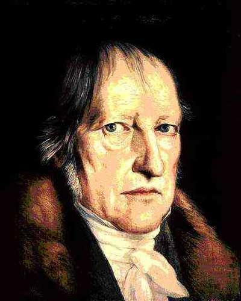
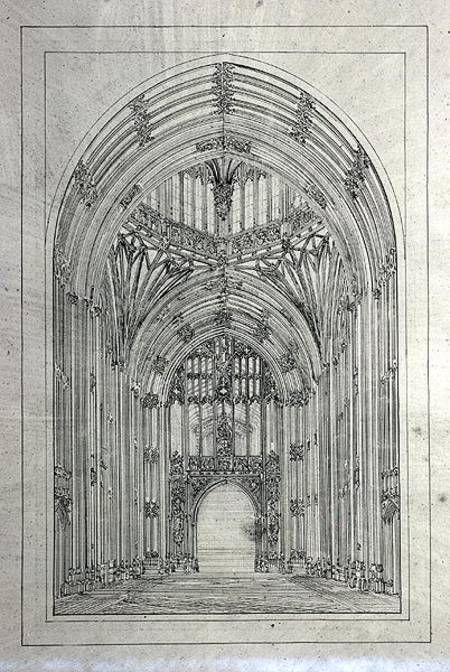
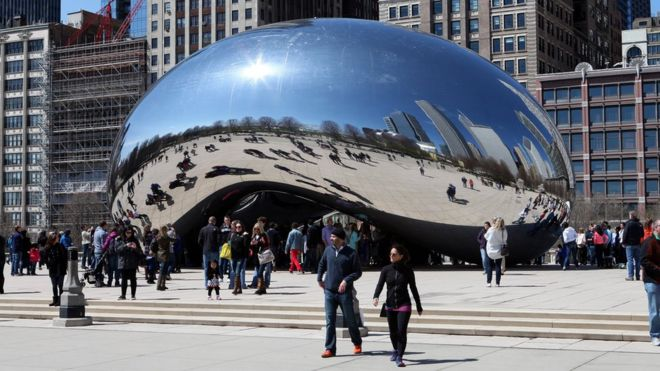
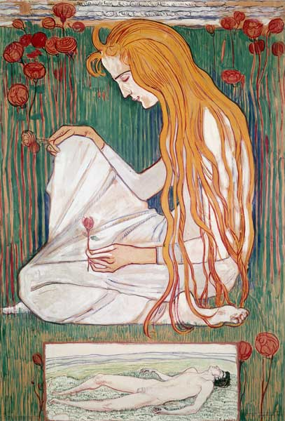

Title: Spor í sögu vestrænnar fagurfræði
Subtitle: Hegel
Slug: spor-i-sogu-vestraennar-fagurfraedi
Date: 2007-07-05 11:00:00
UID: 168
Lang: is
Part: 2/4
Author: Kári Páll Óskarsson
Author URL: 
Category: Heimspeki, Listfræði
Tags: 

Af beinum sporgöngumönnum Kants var það Georg Wilhelm Friedrich Hegel (1770-1831) sem átt hefur hvað veigamesta og langlífasta framlagið til heimspeki í Þýskalandi og allri Evrópu, og skrif hans um fagurfræði eru stór hluti af því framlagi. Á þriðja áratug 19. aldar var hann heimspeki&shy;prófessor við háskóla í Berlín og hélt þar oft fyrir&shy;lestra um list&shy;heim&shy;speki; skrif hans um fagur&shy;fræði voru í raun sett saman úr glósum nemenda og minnis&shy;blöðum hans sjálfs eftir dauða hans. Hann var hugsanlega síðasti vestræni heim&shy;spekingurinn sem reyndi að hanna heim&shy;spekilegt kerfi sem átti að ná yfir alla þætti raun&shy;veru&shy;leika okkar, og fagur&shy;fræðin skipar mikil&shy;vægan sess í kerfi hans, líkt og hjá Kant.

Þekking og veruleiki eru eitt, samkvæmt Hegel. Hann tefldi fram því sjónarmiði sem andsvari við idealisma Kants, sem hafði haldið því fram að við gætum aldrei raun&shy;verulega kynnst hlutunum-í-sjálfum-sér. Allar persónulegar upplifanir eru hluti af einni organískri hreyfingu, framþróun hugsunarinnar, sem miðar stöðugt áfram í átt að endalokum sögunnar. Á þann hátt má segja að þekking og veruleiki séu eitt enda þótt reynsla manna sé alltaf persónu&shy;bundin. Við endalok sögunnar verður endan&shy;legur og algjör samruni allra hluta, og Hegel nefnir samruna þennan ‘Algjöra þekkingu’ eða ‘Algjöran anda’. 

Hegel var heimspekingur á tímum rómantísku stefnunnar. Því eru kenningar hans nokkuð samhljóma þeirri rómantísku fagur&shy;fræði sem kom í kjölfar Kants, en samkvæmt henni er lífrænt samband á milli náttúrunnar og hins listræna innsæis. Organisminn, lífræna heildin, varð að mynd&shy;líkingu fyrir listræna sköpun. Það er þetta lífræna sem er mikilvægt í hugmyndum Hegels: einn hlutur getur skapað út frá sér kerfi eða net tengdra parta sem leitast stöðugt við að sameinast aftur, mynda aftur einingu. Með öðrum orðum, Hugmyndin með stóru H-i (hin algjöra sameining hugtaks og hlut&shy;tekningar þess skv. Hegel) öðlast tilveru í náttúrunni. 

Þetta hugtak, Hugmyndin, hljómar óneitanlega nokkuð platónsk og vissulega gætir hér áhrifa Platóns og frum&shy;mynda&shy;kenningar hans. Hún gengur í stuttu máli út á, fyrir þá sem ekki vissu, að yfir&shy;skil&shy;vit&shy;leg og afstæð form ákvarði lögun og eiginleika hins áþreifanlega veruleika; að sérhver hlutur sé eins og hann er vegna þess að honum hefur verið gefið upprunalegt mát sitt, væntanlega af einhvers konar guði. Grunninn að hluti-heild hughyggju Hegels má finna í _Ríkinu_ eftir Platón. Þar tekur Platón dæmi af sólinni og hvernig hún gerir hluti ekki einungis sýnilega með birtu sinni heldur setur einnig af stað ferli fæðingar, vaxtar og næringar í náttúrunni. Með sama hætti er það sem gerir viðfangs&shy;efni þekkingar skiljanleg, um leið það sem nærir viðfangs&shy;efnin og skapar þau. Í vissum skilningi skapar skynjunin sín eigin viðföng. Það sem er lífrænt, organískt líf, samsvarar þróun Hugmyndarinnar eins og planta sem vex af fræi. Fræið felur í sér alla plöntuna, en aðeins í ídealískum skilningi. Þekking er þróun upplifana og mögu&shy;leika sem eru þegar til staðar í upprunalegri meðvitund.

Ekki er hægt að sleppa svona almennri yfirferð um kerfi Hegels án þess að minnast á díalektík. Samband hugsunar og efnis er dínamískt; díalektík súbjekívisma og objektívisma sem mannleg vitund notar til að færast nær því að skilja að hugur og veru&shy;leiki eru eitt.  Vitundin opnast í síendur&shy;teknu þriggja skrefa ferli thesu, andthesu, og synthesu. Fyrst er t.d. kveðinn upp dómur yfir ein&shy;hverjum hlut (kannski lista&shy;verki); það er thesan. Með því að mæla hana fram áttar sá sem talar sig á því að viðkomandi hlutur býr yfir fleiri eigin&shy;leikum en felast í yfir&shy;lýsingunni; andthesan verður til. Þannig er ljósi varpað á eigin&shy;leika hlutarins sem ekki var gert ráð fyrir áður, og þá er hægt að leggja fram endur&shy;skoðaðan dóm; þetta er synthesan, sem verður svo ný thesa, og ferlið hefst upp á nýtt. 

Hlutverk listarinnar í kerfi Hegels er að vera andthesa hugsunarinnar, hvorki meira né minna; sjálfstæð framsetning sem stillt er upp andspænis með&shy;vitundinni, og sem með&shy;vitundin skynjar að er hluti af henni en um leið eitthvað annað líka. List er þar með orðin nauð&shy;synleg hvatning til fyrir&shy;spurnar, aukinnar þekkingar. Lista&shy;verkið er útlistun á sambandi manns&shy;hugans við ytri veruleika sinn, sameining hins súbjektíva og hins objektíva í skynjan&shy;legri mynd. 

Hegel skipti listaverkum gróflega í þrjá flokka. List getur sakvæmt honum verið symbólísk, klassísk eða rómantísk, og er þessari þrískiptingu ætlað að kortleggja bilið á milli andlegs innihalds og efnislegs forms verka. Symbólíska listin er frumstæðust en sú rómantíska ‘æðst’. Í symbólískri list er efnið veigameira en inni&shy;haldið (eða Hugmyndin), og hið ráðandi form er arkitektúr. Í klassískri list er jafnvægi milli efnis og inni&shy;halds, og hið ráðandi form er högg&shy;mynda&shy;list. Í rómantísku listinni er inni&shy;haldið svo orðið mikil&shy;vægara en formið og ráðandi form hennar eru mynd&shy;list, tónlist, og ljóðl&shy;ist eða skáld&shy;skapur. 

Þetta er í stuttu máli stigskipting þar sem list raðast á ás eftir því hversu móttækileg hún er fyrir Hugmyndinni að baki. Hegel segir t.d. að þar sem í arkitektúr höfum við efnið sjálft beint fyrir framan okkur í áþreifanlegu formi, þá sé það form illa til þess fallið að veita Hugmyndinni viðtöku og bein&shy;línis andstætt Hugmyndinni. Í klassískri list telur Hegel að formið (þ.e. högg&shy;mynda&shy;listin) sé nokkuð við&shy;eigandi fyrir Hug&shy;myndina í eðli sínu, séum við með skúlptúr sem sýnir mennskt form. Skynjanlega formið og Hugmyndin eru í jafnvægi. Hegel setur þessa tegund listar skör ofar en hina symbólísku vegna þess að hér eru lista&shy;menn að endurskapa form sem þeir hafa fundið í náttúrunni. Engu að síður hefur hún þann annmarka að hún er of sérstæð ef svo má segja; hún gerir ekki ráð fyrir því að fram&shy;setningin, verkið, nái ekki að endur&shy;spegla alla hugsun manns. Það háir rómantískri list hins vegar ekki. Í rómantískri list er fyrir hendi skilningur á því að frams&shy;etningin eða verkið getur ekki staðist allar kröfur hugsunarinnar (sbr. díalektíska módelið) og reynir því að brjótast undan þessari sérstöðu; verkið er abstrakt og leitast við að afneita veraldleika sínum. 

Rómantísku listinni skiptir Hegel svo aftur í þrjá flokka. Fyrst kemur myndlistin, sem frelsar listina undan veraldlegum, áþreifanlegum hömlum sínum með því að vera bundin við strigann, flatt tvívítt yfirborð. Svo er það tónlistin, sem er hreint hljóð, og að lokum skáld&shy;skapurinn, sem er æðsta listin því hann samanstendur af hljóði sem gefur til kynna innri hug&shy;myndir og skynjanir. Slík er þróun listarinnar frá úthöggnu grjóti til hug&shy;lægrar abstraksjónar samkvæmt Hegel.

Vita&shy;skuld er þetta einföldun. Hegel gefur sér að byggingar geti aðeins „fjallað um“ mold, grjót og þvíumlíkt, þegar raunin er að byggingar geta örvað hugann jafn vel og hvað annað. Hann gefur sér að við&shy;fangs&shy;efni skáld&shy;skaparins sé hinar innri, andlegu hliðar mannsins, þegar hið rétta er að ljóð&shy;list getur alveg eins fjallað um líkamann og moldina. Engu að síður má segja að Hegel hafi séð vísbendingar um hvert nútíma&shy;list myndi þróast. _Áþreifan&shy;leiki_ listarinnar hefur flysjast burt; impressionistar tóku að mála birtu í stað hluta, abstrakt list ruddi sér til rúms, og næst okkur í tíma er konsept-listin, sem samkvæmt skil&shy;greiningu Hegels mætti eflaust kalla rómantíska og hann myndi sjálfsagt kunna vel að meta hana, þó ekki væri nema vegna þess hve vel hún gæti fallið inn í díalektíska módelið hans.
