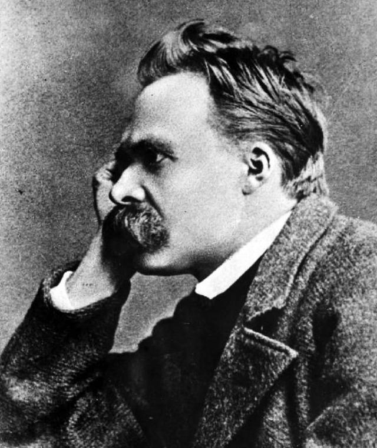
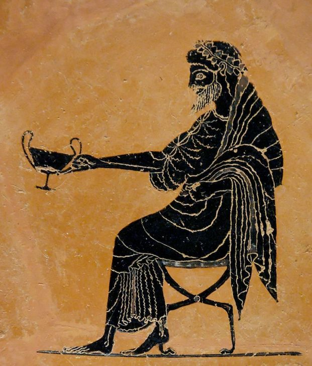

Title: Spor í sögu vestrænnar fagurfræði
Subtitle: Nietzsche
Slug: spor-i-sogu-vestraennar-fagurfraedi
Date: 2007-10-23 09:38:00
UID: 189
Part: 3/4
Lang: is
Author: Kári Páll Óskarsson
Author URL: 
Category: Listfræði
Tags: 

Þó svo að Friedrich Nietzsche (1844-1900) sé ef til vill frægastur nú á dögum fyrir margt annað á sviði heimspeki, þá var framlag hans til fagurfræði einnig umtalsvert. Áður en hann hætti sér handan góðs og ills, áður en hann sneri sér að Zaraþústra og Andkristi, skrifaði hann tvö rit sem fjallað verður um hér. Þetta eru Fæðing harmleiksins, sem kom út 1872 og er fyrsta bókin hans, og hin stutta ritgerð Um sannleika og lygi í ósiðrænum skilningi, sem var rituð ári síðar.

Eins og í öðrum verkum Nietzsches eru nokkur gegnumgangandi grunnhugtök sem einnig skyldi hafa í huga við umræðu á fagurfræði hans. Þetta eru til dæmis fjölhyggjan og áherlsan á hið órökrétta í hugsun manna: öll skipulagning heimsins er einfaldlega viðleitni manna til að þvinga þessa skipulagningu upp á veröld sem er glundroðakennd, og það sem kallast sannleikur er alltaf bara túlkun sem byggð er á hlutdrægum forsendum manna. Hann hafnar eðlishyggju og öllum viðteknum gildum og sannfæringum en aðhyllist þess í stað tómhyggju, níhilisma. Sá níhilismi þýðir þó ekki bölsýni heldur er einfaldlega ætlað að undirstrika ábyrgð okkar sjálfra á að skilgreina reglu og sannleika. Það sem er þó kannski róttækast við Nietzsche er að hann hafnar aðgreiningunni á milli raunveruleikans og þess sem er skynjað, leggur að jöfnu hug manns og raunveruleika. Áður hafði Kant greint á milli þess sem skynjað er og hlutanna-í-sjálfum-sér eins og hann kallaði það, en það sem Nietzsche leggur til er að heimurinn sé búinn til í gegnum framsetningar, það sem er skynjað; að heimurinn sé huglægur. Fyrir fagurfræði er þetta byltingarkennt, því þetta myndi þýða að list væri ekki lengur bundin við skynjun á yfirborði hluta eingöngu, heldur væri hún sjálft ferlið sem við mótum heiminn með. 

Afstaða Nietzsches til fjölhyggju hindraði hann auðvitað ekki í að leggja fram tilgátur um veröldina. Hann taldi sig meðal annars greina tvær ólíkar tilhneigingar í listum og í Fæðingu harmleiksins er lögð fram aðgreining á þessum tilhneigingum. Þetta eru hneigðir sem lýsa samspili reglu og glundroða í veruleikanum; annars vegar er hið appóloníska, sem hann bendlar við ljós, drauma, reglu, meðvitund, og höggmyndalist;  hins vegar hið díónýsíska, sem hann tengir við myrkur, ölvun, óreglu, algleymi, og tónlist. Í listum birtist okkur þetta samspil ólíkra afla því listamaðurinn verður að hafa milligöngu um ytri reglubyrði og innri glundroða. Appólons-tilhneigingin lýsir heilsteyptu sjálfi og í henni er einstaklingurinn frábrugðinn öðrum mönnum sem og náttúrunni. Díónýsíusar-tilhneigingin lýsir sjálfi sem er drepið á dreif, og í henni er einstaklingurinn ekki frábrugðinn öðrum mönnum eða náttúrunni. Hið appóloníska má heimfæra uppá það sem Kant kallaði hið fagra, en hið díónýsíska kallast á við það sem Kant kallaði hið háleita. Séu dæmi tekin úr listasögunni mætti segja að á nýklassíska tímanum hafi Appólons-kenndin verið í hávegum höfð; þá voru menn afar uppteknir af aga, reglu og formfestu í öllum listum og trúðu því að listin ætti að „kenna og gleðja“, eins og rómverska skáldið Hóras komst að orði. Expressíonisminn er hins vegar hreyfing sem Díónýsus er mjög ríkjandi í; oft er hann afar myrkur og trylltur, og það er varla tilviljun að þýsku expressíónistarnir frá fyrstu áratugum 20. aldar áttu það flestir sameiginlegt að vera vel lesnir í Nietzsche.

Þó svo að ritgerðin Um sannleika og lygi í í ósiðrænum skilningi sé stutt þá er innihald hennar merkilegt. Segja má að hún sé smáskammtur af öllu því sem nietzscheísk heimspeki samanstendur af. Hann viðrar þar meðal annars hugmyndir um tungumálið sem póst-strúktúralistar 20. aldar hafa verið alveg sammála, þó að Nietzsche hafi verið um hundrað árum fyrr á ferðinni. Tungumálið er tækið sem við notum til að skilgreina veruleikann, þó það sé sjálft svo ófullkomið og afstætt að það er nokkrum skrefum frá þessum veruleika; það hefur tekið frá honum tvö stökk myndlíkinga. Í fyrsta lagi er örvun taugaboða sem við upplifum umbreytt í ímynd: fyrri myndlíkingin. Í öðru lagi er ímyndinni umbreytt í hljóð, sem er orð í tungumálinu: seinni myndlíkingin. Samband okkar við veruleikann er ekki beinna en þetta! 

Síðan verða orð tungumálsins að hugtökum; Nietzsche tekur dæmi um hugtakið „laufblað''. Hvað er laufblað, nákvæmlega? Engin tvö laufblöð eru nákvæmlega eins, þau líkjast bara hvort öðru. En við höfum mótað okkur einhverja almenna og óljósa hugmynd um fyrirbærið sem er í huga okkar orðið að hugtakinu „laufblað'', með því að hunsa það sem gerir hvert og eitt laufblað einstakt. Hugtakið „laufblað'' smættar í sig öll möguleg laufblöð og gefur í skyn að í náttúrunni fyrirfinnist einhvers staðar hið eina sanna Laufblað, frumritið sem öll hin voru mótuð eftir af einhverjum yfirnáttúrulegum skapara sem vandaði sig ekki með þeim afleiðingum að ekkert laufblað varð nákvæmlega eins og hið upprunalega. 

Þetta upprunalega laufblað er auðvitað bara heilaspuni; það er ekki til. Við teljum okkur trú um að bara vegna þess að við höfum orð yfir eitthvað fyrirbæri þá hljóti að vera til eitthvað frumeðli að baki þessu fyrirbæri. En náttúran kannast ekki við nein af hugtökunum sem við mennirnir höfum skapað; hún hefur bara eitthvað X sem við getum  ekki skilgreint. Hugtökin okkar eru ekki til þess fallin að kortleggja hlutina-í-sjálfum-sér heldur bera þau frekar vott um sköpunargáfu okkar: þau eru myndlíkingar. Skynjun getur ekki falið í sér skýrskotun á milli hugtaks og hlutar vegna þess að það er enginn upprunalegur hlutur til að skýrskota til. Það eina sem er fyrir hendi er þetta sem Nietzsche kallar X, og skynfæri huga okkar umbreyta þessu X-i í upplifun, reynslu og skynjun. 

Skynjunin er umbreytileg og þar með metafórísk, knúin af myndlíkingum. Rétt eins og myndlíking samanstendur af pörun ólíkra fyrirbæra — til dæmis „veröldin er leiksvið'' —  þá felur skynjun í sér stökkin frá einu stigi til annars sem áður voru nefnd: frá skyntaugaörvun til ímyndar, frá ímynd til hljóðs, en það er engin raunveruleg tenging á milli þessarra stiga, ímyndin á til dæmis ekkert raunverulega sameiginlegt með hljóðinu sem við ánöfnum henni heldur eru tengsl þeirra afstæð. 

Það sem þetta þýðir í hnotskurn er að það sem við sjáum, heyrum og finnum eru atburðir sem hafa ákveðna eiginleika, ekki vegna þess að einhver utanaðkomandi uppspretta hefur veitt þeim þessa eiginleika heldur vegna þess að þeir eru skapandi, umbreytandi samskipti á milli hugar okkar og hins víðara sviðs tilverunnar sem Nietzsche kallar X. Þetta er hinn mikli X-faktor tilverunnar.

Þetta er speki sem hafnar venjulegum skilningi á sannleika og þekkingu. Þegar engin utanaðkomandi uppspretta er fyrir hendi til að ljá hlutum eðli sitt verður sannleikurinn túlkunaratriði, og þekking sem og skilningur verða svipaðir eiginleikar og listsköpun. Við þessar aðstæður verða gildi og sannleikur eitthvað sem þarf að skapa. Til dæmis með því að sjá líkama í skýjum himinsins er maður að taka metafórískt stökk sem gerir upplifun hans á heiminum fagurfræðilega.

