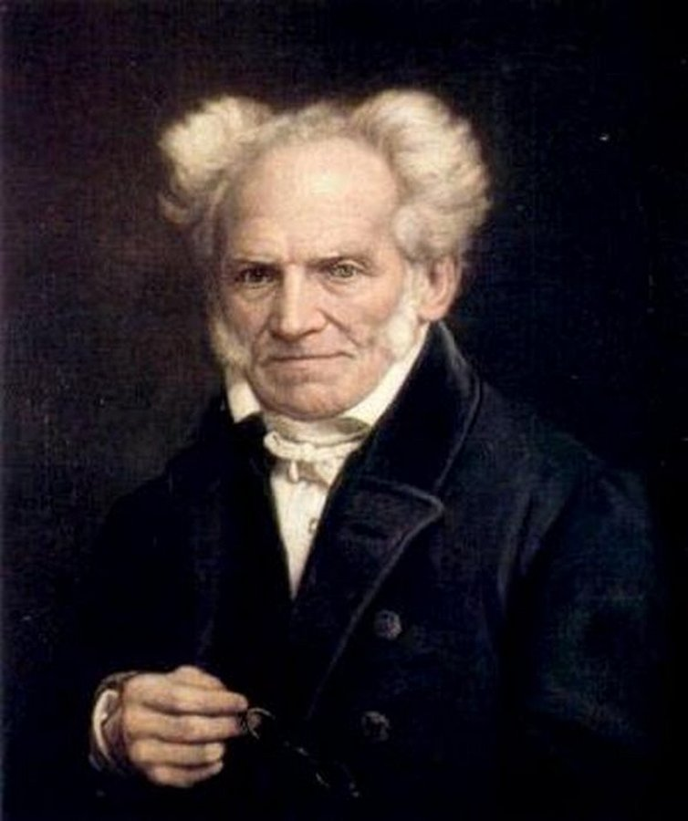
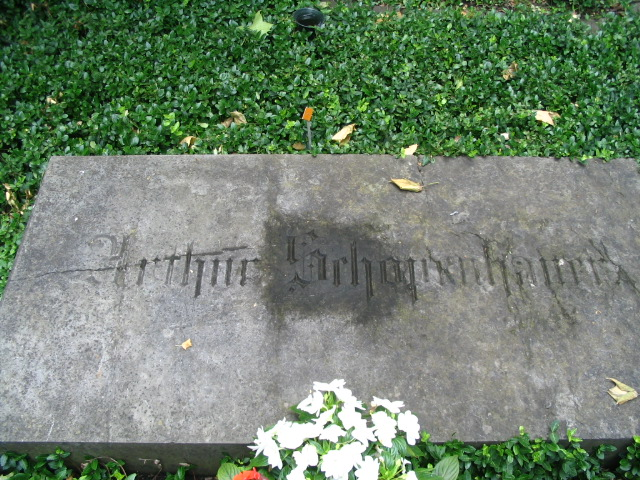

Title: Spor í sögu vestrænnar fagurfræði
Subtitle: Schopenhauer
Slug: spor-i-sogu-vestraennar-fagurfraedi
Part: 4/4
Date: 2008-02-12 10:09:00
UID: 218
Lang: is
Author: Kári Páll Óskarsson
Author URL: 
Category: Listfræði
Tags: 

Það hefur verið sagt um verk heimspekingsins Arthurs Schopenhauer (1788-1860) að þau séu í meiri metum á meðal listamanna heldur en annarra heimspekinga. Höfuðrit hans nefnist _Die Welt als Wille und Vorstellung_, sem á íslensku mætti kalla „Heimurinn sem vilji og framsetning“ eða „Heimurinn sem vilji og hugmynd“. Það kom fyrst út árið 1819 sem eitt bindi er skipt var niður í fjórar bækur myndandi heildstætt heimspekikerfi; sú fyrsta fjallaði um þekkingarfræði, önnur um verufræði, sú þriðja um fagurfræði og sú síðasta um siðfræði. Þessi uppbygging verksins skiptir því máli fyrir tilgang þessarar greinar, að hún sýnir hve miklu máli fagurfræði skipti í heildarhugsun Schopenhauers. Hann fylgir fordæmi Kants og gerir fagurfræðina að einum af aðalgreinum hugmyndakerfis síns. _Heimurinn sem vilji og hugmynd_ var endurútgefin tvisvar um lífdaga Schopenhauers; árið 1844, meira en tuttugu árum síðar, birtist verkið aftur en nú í tveimur bindum, með frumverkið í fyrra bindinu en hið síðara samanstóð af viðbætum, nánari útlistunum á efninu sem fyrir var; endanlega útgáfan birtist árið 1859, aftur með smávægilegum viðbætum. _Heimurinn sem vilji og hugmynd_ er með öðrum orðum æviverk Schopenhauers og nokkurs konar summa hugsunar hans; útlistun á skoðunum sem tóku engum róttækum breytingum á meðan maðurinn lifði.

Schopenhauer var undir miklum áhrifum frá Kant, þó hann gagnrýndi samt sem áður fjölmargt í kenningum hins síðarnefnda. Til dæmis glímdi hann við aðgreiningu Kants á milli skynjunar okkar og raunveruleikans. Samkvæmt þessari aðgreiningu er heimurinn annars vegar fenómenon, en það eru hlutirnir eins og við skynjum þá og getum þekkt sem skynjanir;  hins vegar eru númenon, það er að segja hlutirnir eins og þeir raunverulega eru (eða hlutirnir-í-sjálfum-sér), en þeir eru óháðir skynjun okkar og um þá getum við aldrei neitt vitað. Til að yfirstíga þessa gjá lagði Schopenhauer til að með skynjun okkar öðlumst við sjálfkrafa skilning á hlutunum í sjálfum sér, númeninu. Það sé vegna þess að við séum viti bornar verur í heiminum, og skynfæri okkar séu því fyrirfram íslungin því sem okkur skortir vitneskju um. Reynsla berst okkur í gegnum líkama okkar, sem gera okkur áþreifanleg sem skyni gæddar verur í veröldinni.  

Einnig skiptu forn indversk heimspekirit afar miklu máli fyrir Schopenhauer. Í _Heiminum sem vilja og hugmynd_ segist hann jafnvel telja að uppgötvun þessara Asíurita muni verða jafnmikilvæg fyrir hans tíma, 19. öldina, og enduruppgötvun forngríska og rómverska menningararfsins var fyrir Endurreisnartímann. Áhrif indversku spekinnar munu hafa haft mikil áhrif á hugmynd Schopenhauers um viljann, sem hann sá fyrir sér sem einhvers konar alheimsafl, nánast dulspekilegt, sem er undirrót alls í heiminum, og hann er leið Schopenhauers til að yfirvinna aðgreiningu Kants, að hafna tvíhliða módeli fenómenons gegn númenoni. Viljinn er hugmynd um raunveruleikann sem hreyfiafl sem umvefur gjörðir okkar og hugsanir. Bæði skynjuð reynsla og raunveruleiki spretta upp úr einu og sama fyrirbærinu, viljanum. Líkt og síðar hjá Nietzsche er hér verið að leggja skynreynslu manns og raunveruleikann að jöfnu, sem myndi þýða að veröldin væri orðin ansi fagurfræðileg.

Mannsviljinn er hluti af þessum mikla vilja og mannskepnan lætur stjórnast af viljanum. Langanir mannanna eru ákveðin birtingarmynd þessa vilja, sem er ábyrgur fyrir óhamingju þeirra samkvæmt hinum afar bölsýna Schopenhauer. Hann taldi að tilvera mannsins væri lítið annað en sveiflur á milli langana annars vegar, og hins vegar leiða. Maðurinn er endalaust haldinn löngun eftir einhverju, og ef ekki er hægt að svala þessari löngun veldur það oft óbærilegum kvölum. En sé hægt að svala henni, þá hverfur hún einfaldlega um leið og henni hefur verið fullnægt og í tómarúminu sem myndast þá í tilverunni tekur við lífsleiði, _ennui_, eða þar til nýjar langanir láta á sér kræla og þannig koll af kolli.

Maðurinn getur öðlast frelsi undan Viljanum, segir Schopenhauer, undan þessu tveggja elda víti langana og leiða, og þegar það tekst kemst hann í sérstakt, sælukennt hugarástand; hann gleymir sjálfum sér og vægðarlausum Viljanum sem knýr hann sífellt áfram. Þetta er nokkurs konar leiðslukennt algleymi sem hægt er að öðlast með tilstuðlan listar. Listin getur bæði verið tjáning á Viljanum og tæki til að losa mann undan honum. Schopenhauer áleit að tónlist væri sérstaklega tengd Viljanum og taldi hana æðsta allra listgreina vegna afstæðis hennar; að hlusta til dæmis á eitthvað tónverk og verða frá sér numinn af hrifningu á því, það er þessi leiðslukennda, fagurfræðilega upplifun sem frelsar okkur undan ánauð Viljans. 

Þessi hugmynd um fagurfræðilega hugarástandið felur líka í sér mikilvægi ákveðins _áhugaleysis_, það er: hversdagsleg meðvitund manna er mótuð af viljanum og nytsemdarsjónarmiðum, þörfum sem leitast er við að uppfylla, en hin fagurfræðilega meðvitund er _hrein_. Hún er ómenguð af vilja eða nokkrum hagsmunum, nánast meinlætaleg, sælukennd hugleiðing á hinu fagra viðfangi einungis vegna fegurðar þess. Í því sambandi er einnig rétt að nefna að Schopenhauer aðhylltist það sjónarmið að huglægt mat eingöngu stjórnaði því hvað við teldum fagurt, með öðrum orðum að fegurð einhvers hlutar felist ekki í hlutnum sjálfum, né sambandi hugarins við hlutlæga þætti, heldur sé fegurð hlutarins einungis í huga þess sem horfir. Síðari tíma listheimspekingar eins og Stolnitz hafa reynt að gera fyllri grein fyrir þessu svokallaða fagurfræðilega viðmóti.

Að lokum má geta þess að hugmyndina um frelsun undan oki Viljans gæti verið áhugavert að bera saman við ákveðna fagurfræði lýrískur, ljóðlistar: sumir kannast við hugtakið _kaþarsis_ eða geðhreinsun, sem er notað í orðræðu um harmleiki, en til er sambærilegt hugtak fyrir lýrík og kallast það _kenosis_, og mætti þýða sem „tómleiki“. Í stuttu máli snýst það um að lesendur ljóðlistar eigi að geta „tæmt“ sig, þ.e. að egó-hluti persónuleika þeirra tæmist inn í beina skynstjórnun hins ljóðræna. Þannig sé maður í skamma stund laus við egóið, með öllum þeim kröfum sem það heimtar  stanslaust að séu uppfylltar, og öðlast tímabundna sælu.

