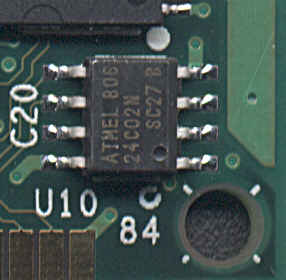

Title: Stafræn skjöl og sagnfræði
Subtitle: Hvenær getum við talað um stafræna heimild sem upprunalega?
Slug: stafraen-skjoel-og-sagnfraedi
Date: 2006-09-19 13:05:00
UID: 94
Lang: is
Author: Unnur María Bergsveinsdóttir
Author URL: http://unnur.klaki.net
Category: Bókasafns- og upplýsingafræði, Upplýsingasamfélagið
Tags: 

Spurningin sem lögð er til grundvallar þessari grein er bæði flókin og yfir&shy;grips&shy;mikil. Hér er enda ekki ætlunin að svara henni í eitt skipti fyrir öll heldur að velta upp nokkrum áhuga&shy;verðum flötum þessarar umræðu. 

Ólíkar starfs&shy;stéttir skilja hugtakið „uppruna&shy;legur“ á mismunandi máta og lýsa því þar af leiðandi á ólíkan hátt. Skjala&shy;verðir myndu í skráningu leggja áherslu á að undir&shy;strika þá þætti skjals sem heimildar&shy;gildi þess fyrir tiltekið safn liggur í á meðan að bóka&shy;safns&shy;fræðingar myndu lýsa innihaldi þess almennt, með það í huga að þau not sem hafa má af tilteknu skjali munu breytast eftir því sem árin líða. Í augum fræði&shy;manna fer það hvað telst kjarni heimildar ekki síst eftir því í hverju nota&shy;gildi hennar felst: á hún að sanna að tilteknir atburðir hafi gerst eða er um að ræða upplýsingar sem hægt er að nota til að setja upp ákveðnar aðstæður í tilrauna&shy;stofu. Þannig eru leiðirnar til að tryggja það að hægt sé að bera kennsl á heimild og stað&shy;festa uppruna&shy;leika hennar jafn&shy;margar og mögulegir notkunar&shy;mátar hennar. 

### Mörk efnis og miðlunar? 

Hvaða hlutar stafrænnar heimildar tilheyra kjarna hennar og hverjir miðlunar&shy;mátanum? Þegar við fáumst við hef&shy;ðbundnar heimildir á borð við segul&shy;bands&shy;upptöku af viðtali eða texta vélritaðan á pappír tökum við samstundis eftir því ef tekið hefur verið yfir hluta af upptökunni eða strikað yfir stöku setningar. Hvort krotað hafi verið á spássíurnar. Miðillinn er þannig sam&shy;ofinn inni&shy;haldinu. Þessi eining tilheyrir hins&shy;vegar ekki hinni stafrænu nátttúru. Engin leið er hinsvegar til þess að sjá það af lestri rafræns skjals hvort átt hafi verið við innihald þess eða ekki, hvort texti tekinn úr tölvu&shy;pósti hafi verið klipptur til. Í hinum stafræna heimi er svarið við þessu hið svokallaða meta&shy;data: texti sem hengdur er við rafræn skjöl og inniheldur ýmsar upplýsingar um eðli þeirra og tilurð. Þessar inni&shy;halds&shy;lýsingar framkalla auðvitað enn frekari spurningar um varð&shy;veislu&shy;máta og hvernig skuli tryggja að upp&shy;lýsingarnar haldist læsilegar.  

David Levy, sérfræðingur í stafrænum bóka&shy;söfnum, skil&shy;greindi afritun staf&shy;rænna gagna sem fram&shy;leiðslu&shy;ferli, þar sem líkja mætti hinu staf&shy;ræna skjali við prent&shy;plötur. Í stafrænum heimi eru ekki til nein einstök skjöl, ekki nema mistök verði við afritun þeirra. Hin stafræna heimild er ekki til sem áþreifan&shy;legur hlutur, heldur aðeins sem safn upp&shy;lýsinga um það hvernig skuli kalla heimildina fram.[^1] Clifford Lynch, doktor í tölvunar&shy;fræði, útskýrir einmitt muninn á staf&shy;rænum og hefð&shy;bundnum heimildum á þann einfalda máta að að afhendi einn maður öðrum segul&shy;bands&shy;spólu þá hafi spólan óhjá&shy;kvæmilega skipt um hendur. Það að stafræn hljóð&shy;skrá sé send manna á milli í tölvupósti þýðir hinsvegar að nú hafi báðir aðilar eintak af henni.[^2] 

### Ein eða fleiri frummynd?

Uppruni heimildar er afar mikil&shy;vægt atriði í huga skjala&shy;varða, í raun mikil&shy;vægara en sann&shy;leiks&shy;gildi hennar. Skjala&shy;söfn geyma upp&shy;lýsingar sem miða að því að sanna hvaðan heimildir eru upprunnar, hverjir hafi haft þær undir höndum og í hvaða röð. Hlutverk skjala&shy;safnanna eru að varð&shy;veita upplýsingar á öruggum stað, að þar sé hægt að ganga að upplýsingum vísum í trausti þess að ekki hafi verið átt við þær. Munu skjala&shy;söfn halda áfram að gegna hlut&shy;verki þessa þriðja aðila á tímum staf&shy;rænna heimilda? Margir spá því reyndar að ný tækni muni leysa skjala&shy;söfnin af hólmi: stimplun tíma&shy;setningar, dulkóðun, rafrænar undir&shy;skriftir og vatn&shy;smerki. Flestar þessar aðferða reiða sig þó að einhverju leyti á til&shy;vist hins þriðja, óháða, aðila. 

Með tilkomu staf&shy;rænna heimilda hefur afritun heimilda yfir á yngri miðlunar&shy;form orðið mikilvægur liður í varð&shy;veislu heimilda. Þrátt fyrir að stál&shy;þræðir hafi dottið úr notkun fyrir mörgum áratugum má enn finna í skjala- og bóka&shy;söfnum landsins hljóð&shy;upptökur á því formi og enn eru til eitt til tvö tæki til afspilunar slíkra forngripa. Forrit sem voru algengur miðlunar&shy;máti fyrir aðeins áratug eru hins&shy;vegar mörg hver úrelt í dag og heimildir sem geymdar eru á til&shy;heyrandi sniðum því ólæsilegar. Það sem er at&shy;hyglis&shy;vert við þetta ástand er reyndar einmitt það að stöðlun í miðlun texta er í raun til&shy;tölulega nýlegt fyrir&shy;bæri sem varð til um leið og prent&shy;smiðjan og hefur aldrei átt við óútgefið efni á borð við bréf eða heima&shy;fram&shy;kallaðar ljós&shy;myndir. Reyndar má svo halda því fram líka að sú staðreynd að tölvu&shy;skjáir séu stilltir á mismunandi vegu geti haft teljandi áhrif á það hvernig tilteknar heimildir birtist okkur. Er stafræn heimild sem lítur ólíkt út á mismunandi skjáum sama heimildin? Er hljóð&shy;skrá sem er til bæði sem `.mp3` og sem `.wav` sama hljóðskráin? 

Hvað hefð&shy;bundnar heimildir varðar er varðveisla sjaldan órjúfanlegur hluti þeirra ákvarðana sem liggja að baki myndun hennar. Þrátt fyrir allt getum við enn lesið skinn&shy;handrit dregin upp úr fletum kerlinga, lengi vel er hægt að bjarga bókum sem prentaðar hafa verið á lélegan pappír, og nostra má við skorpnuð hljóðbönd þannig að hægt sé að afrita uppt&shy;ökurnar sem þau geyma. Mikil&shy;vægi varð&shy;veislu þarf hinsvegar að hafa í huga strax frá upphafi hvað stafrænar heimildir varðar. Það er ekki hægt að setja stafrænt skjal upp í hillu og fresta því að huga að varðveislu. Fyrr en varir er allt eins líklegt að ómögulegt sé að nálgast upp&shy;lýsingarnar sem það geymir. Þeir sem skapa stafrænar heimildir þurfa að hafa óhjákvæmileg endalok miðilsins í huga. Hversu mikilvæg er heimildin og hversu lengi þarf hún að vera læsileg? Á hvaða formi er vænlegast að vista hana? 

### Skapandi umræða

Slíkar umræður eru forsenda alls þegar stafræn söfn eru sett fót. Michael Seadle kom að stofnun og skipulagningu [The National Gallery of the Spoken Word](http://www.ngsw.org/), þverfaglegs verkefnis sem hefur aðsetur innan fylkisháskólans í Michigan. Að NGSW koma ólíkir aðilar, bæði frá háskólanum og utanaðkomandi og notar Seadle hugtakið _fjölmenningarlegur_ til að lýsa hópnum. Hann styður þá lýsingu þeim rökum að innan sérhverrar fagstéttar þrífist sérstök menning og sérstakt tungutak sem sé óaðgengilegt utanaðkomandi.  Í grein sinni _Spoken Words, Unspoken Meanings_ lýsir Seadle vinnuferlinu í kringum stofnun NGSW og því hvernig ekki var nóg að skilgreina það hvernig skyldi unnið og að hverju heldur þurftu þeir ólíku hópar sérfræðinga sem að verkinu komu  beinlínis að ræða sig niður á sameiginlegt tungumál, eða að minnsta kosti læra eitthvað hrafl í tungumáli hvers annars. Í þessu tiltekna tilviki unnu saman kennarar, verkfræðingar, bókasafnsfræðingar, sagnfræðingar og stjórnmálafræðingar. Nálgun Seadle er byggð á þeim skilningi sem Clifford Geertz leggur í tungumál, að tungumálið sé margrætt og merkingin myndist ekki nema í gegnum samskiptin. Tungumálið getur þannig sameinað jafnt sem sundrað og af tilraunum til að skapa samskiptagrundvöll geta nýjar aðferðir sprottið.[^3]

Stafræn heimildasöfn eru skammt á veg komin á Íslandi og enn sem komið er hefur umræða um þau að mestu farið fram innan þröngra sviða og snúist um stafrænar endurgerðir heimilda sem fyrir eru til á ýmsum hefðbundnum miðlum. Með síaukinni áherslu á stafræna miðlun verður mikilvægi þess að slík söfn séu rædd og skipulögð þó æ meira aðkallandi og þar með mikilvægi þess að ólíkar starfsstéttir læri að tala saman um þau. Þar sem umræða um heimildir hefur hér á landi svo lengi verið tengd skinnhandritum og handskrift svo órjúfanlegum böndum verður eflaust spennandi að fylgjast með. 

[^1]: Levy, David M., „Where's Waldo? Reflections on Copies and Authenticity in a Digital Environment", _Authenticity in a Digital Environment_, Council on Library and Information Resources, maí 2000. Sjá [hér](http://www.clir.org/pubs/reports/pub92/levy.html)

[^2]: Lynch, Clifford, „Authenticity and Integrity in the Digital Environment: An Exploratory Analysis of the Central Role of Trust",_Authenticity in a Digital Environment_, Council on Library and Information Resources, maí 2000. Sjá [hér](http://www.clir.org/pubs/reports/pub92/lynch.html)

[^3]: Seadle, Michael, „Spoken Words, Unspoken Meanings. A DLI2 Project Ethnography", D-Lib Magazine Vol. 6, # 11, nóvember 2000. Sjá [hér](http://www.dlib.org/dlib/november00/seadle/11seadle.html).  

[^4]: Einnig er við skrif þessarar greinar sótt efni til samantektar Abby Smith á umræðum og fyrirlestrum ráðstefnunnar _Authenticity in a Digital Environment_. Samantekt Smith og fyrirlestra frummælenda ráðstefnunnar má lesa [hér](http://www.clir.org/pubs/reports/pub92/contents.html)
