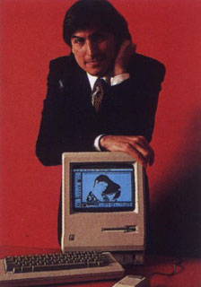
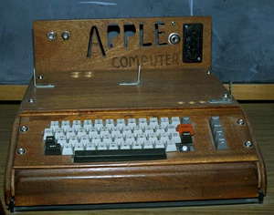
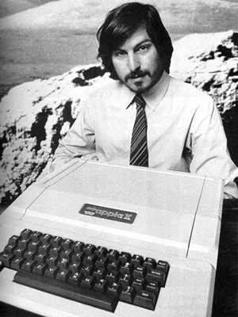
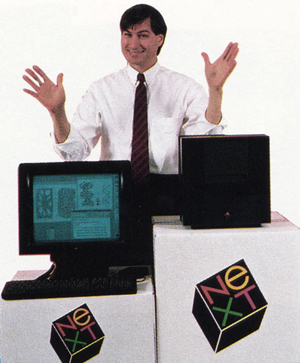
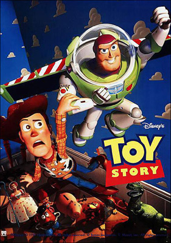

Title: Steve Jobs
Slug: steve-jobs
Date: 2007-05-15 20:14:00
UID: 158
Lang: is
Part: 1/2
Author: Karl Jóhann Jóhannsson
Author URL: 
Category: Upplýsingasamfélagið, Neyslusamfélagið
Tags: Steve Jobs, Apple, NeXT, OS X, Tækni, Tölvur, Pixar, iPhone, iOS

Steve Jobs fæddist í San Francisco en var ættleiddur viku gamall og flutti til fjölskyldu í  Mountain View. Sem unglingur vann hann hjá Hewlett-Packard og kynntist þar Steve Wozniak, meðstofnanda Jobs að Apple. Jobs reyndi við háskóla en leiddist og hætti eftir eina önn. Hann hóf þá vinnu hjá Atari tölvuleikjafyrirtækinu til að safna pening fyrir ferðalagi til Indlands, þar sem hann vonaðist til að finna einhvers konar heimspekilega uppljómun. Hann var þó ekki eins ánægður með för sína og hann hafði vonast og kom aftur með fátt annað en indversk föt og rakaðan haus. Þegar heim var komið hélt hann áfram að vinna hjá Atari auk þess að hanga meira og meira með Steve Wozniak.

Fyrirtækið Apple var stofnað í kringum tölvu sem Wozniak hafði smíðað fyrir sjálfan sig. Jobs sá möguleika á að selja tölvuna og sannfærði því Wozniak um að stofna fyrirtæki með sér. Apple I tölvan var ansi merkileg en skorti þó margt og ári síðar smíðaði Wozniak Apple II, sem þeir framleiddu og seldu fyrir hagnaðinn af sölu á Apple I auk peninga frá fjárfestum.

Apple II tölvan varð gullfóturinn í einkatölvum við lok áttunda áratugsins og byrjun níunda og varð nafnið Apple að samnefnara fyrir einkatölvur. Þegar Apple varð að hlutafélagi 1980 varð Steve Jobs að margföldum milljónamæringi, 24 ára gamall.

Kannski sökum þess hversu vel gekk ofmetnaðist Jobs, hann vildi gera eitthvað stórt og merkilegt og hann gleymdi að hugsa um peningalegu hliðina á ákvörðunum sínum. Fyrst hóf hann þróun Lisa tölvunnar, sem var fyrsta tölvan með grafísku notendaviðmóti, hugmynd sem hann hafði fengið (stolið) hjá Xerox. Stjórnendur þar á bæ sáu ekki hvernig slíkt gæti skilað hagnaði, sem er reyndar ekki skrítið þar sem tölvan þeirra (Alto) hefði verið allt of dýr í framleiðslu. 

Árið 1982 var stjórn verkefnisins hins vegar tekin af honum þar sem yfirmönnum þóttu hugmyndir hans um hvernig tölvan ætti að vera óraunsæjar. Í staðinn var honum gefinn titillinn stjórnarformaður, titill sem honum þótti gera lítið gagn í þróun fyrirtækisins. Hann tók því yfir stjórn Macintosh verkefnisins, sem þá var mjög lítið verkefni innan Apple og eftir að hin tvö þáverandi verkefni Apple, Lisa og Apple III, mistókust þá voru vonir allra bundnar við Macintosh verkefni Steve Jobs.

Jobs lagði alltaf mikla áherslu á útlit og vildi hann að Macintosh tölvan yrði flottasta tölvan á markaðinum, ekki bara að grafíska stýrikerfið liti vel út heldur einnig kassinn utan um tölvuna. Hafði Jobs því yfirumsjón með útliti tölvunnar og voru prufuútgáfurnar margar, sumar með mjög smávægilegum breytingum. Ekki þurfti einungis kassinn að líta vel út heldur einnig móðurborðið, sem er áhugavert í ljósi þess að nær allir notendur tölvunnar sáu það aldrei.

Árið 1984 kynnti Jobs svo Macintosh tölvuna, sem var án nokkurs vafa flottasta tölvan á markaðinum. Tölvan var lofum hlaðin en þó ekki eins vinsæl og vonast hafði verið til. Ástæður þess eru sérstaklega taldar vera skortur á hugbúnaði, en framleiðendum tókst ekki að standa við skilafrest sinn. Það og traust vörumerki IBM – sem hóf samkeppni við Apple 1981 – gerðu Apple mjög svo erfitt fyrir.

### Næst

Það var engin spurning um snilligáfu Jobs en það var ekki auðvelt að vinna með honum. Hann fékk alltaf sínu fram, sama hvað öðru leið, og var það líklega ein ástæða þess að Macintosh tölvan var eins flott of hún var; Jobs gerði fáránlegar kröfur og fékk þær uppfylltar. En yfirmaður hans, sem Jobs réði sjálfur, var ekki alltaf sammála ákvörðunum hans og stjórnin tók hlið Scully. Þrítugur að aldri, árið 1985, tapaði hann valdabaráttu innan Apple og hætti í kjölfar þess. 

Jobs sat þó ekki lengi með tómar hendur heldur stofnaði hann annað tölvufyrirtæki – [NeXT]( http://en.wikipedia.org/wiki/NeXT) – og tók nokkra starfsmenn Apple með sér. Fyrirtækið tók þrjú löng ár í að sjóða saman tölvu sem var ekkert minna en tæknibylting. Tölvan sjálf var glæsileg í útliti, stýrikerfið undravert og langt á undan sinni samtíð og gæðin á tölvunni voru á allan hátt allt annað en það sem þekktist á þeim tíma. Allt þurfti að vera fullkomið og ekkert minna en fullkomið. 

En með fullkomnum kom hátt verð og langur þróunartími. Biðin eftir hugbúnaði fyrir tölvuna var of mikill og sum fyrirtæki sem ætluðu að skrifa hugbúnað fyrir tölvuna – þá sérstaklega IBM – gátu það einfaldlega ekki vegna þess hversu langt á undan sinni samtíð stýrikerfið var.

Þegar tölvan var loks frumsýnd var hún svo mikið lofuð að það hefði mátt halda að aldrei fyrr hefði nokkuð eins stórkostlegt verið framleitt. Tölvan var vægast sagt flott, en það réttlætti vissulega ekki verðið á henni, sem var hærra en flestir höfðu efni á. Þeir sem höfðu þó efni á henni nýttu hana vel, eins og í að skrifa fyrsta vafrann fyrir internet og að þróa tölvuleikinn [Doom](http://en.wikipedia.org/wiki/Doom), einn af áhrifamestu fyrstu persónu skotleikjum til að koma fram í byrjun tíunda áratugarins.

Eitt af helstu ástæðum þess að tölvan varð ekki vinsæl (fyrir utan verð) var reyndar sú staðreynd að Steve Jobs þoldi ekki floppí diska og veðjaði á nýja geymslutækni sem reyndist ekki verða eins vinsæl og hinir útbreiddu floppí diskar. Á endanum var því vélbúnaðadeild fyrirtækisins lögð niður og fyrirtækið einbeitti sér algjörlega að framleiðslu hugbúnaðar fyrir aðrar tölvur

### Pixar

En NeXT var ekki það eina sem Jobs hafði verið að fást við frá því hann hætti hjá Apple. Árið 1985 keypti hann tölvuteiknimyndastúdíóið [Pixar](http://en.wikipedia.org/wiki/Pixar), sem þá var hópur hámenntaðra manna sem í stuttu máli höfðu það að sameiginlegu markmiði að búa til tölvuteiknimyndir og höfðu þróað tölvur og hugbúnað til þess. Þessar tölvur voru helsta söluvara fyrirtækisins, því þó þeir framleiddu stuttar tölvuteiknaðar myndir þá var það helst til að sýna mátt tölvunnar og hugbúnaðarins. Þrátt fyrir að vinna óskarsverðlaun, og vera tilnefnd til annarra, seldist tölvan ekki vel, þá aðallega vegna verðs.

Þegar fjárhagsörðugleikar Pixar voru í hámarki í byrjun tíunda áratugarins, þá skrifaði Jobs undir samning við Disney um framleiðslu á þremur tölvuteiknimyndum. Fyrsta myndin sem var framleidd var Toy Story og voru vinsældir hennar gríðarlegar. 

Fyrir útgáfu myndarinnar var ráðgert að gera Pixar að hlutafélagi og gerði það Jobs að milljónamæring, þrátt fyrir slæmt gengi hjá NeXT. Jobs náði svo arðbærum samning við Disney um framleiðslu fimm mynda til viðbótar og tryggði þannig framtíð sína og Pixar.

----

#### Heimilidir

 * Andy Hertzfeld. (2005). _Revolution in The Valley: The Insanely Great Story of How the Mac Was Made_
 * Martyn Burke (leikstj.). (1999). _Pirates of Silicon Valley_.
 * Romain Moisescot. (2006). [_All about Steve Jobs_](http://romain-moisescot.com/steve/)

