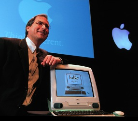
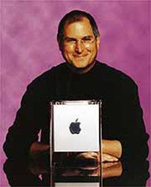
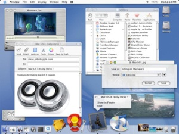
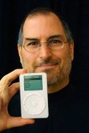
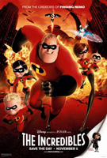
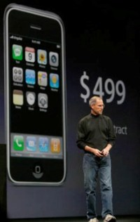

Title: Steve Jobs
Slug: steve-jobs
Date: 2007-05-17 16:44:00
UID: 159
Lang: is
Part: 2/2
Author: Karl Jóhann Jóhannsson
Author URL: 
Category: Upplýsingasamfélagið, Neyslusamfélagið
Tags: Steve Jobs, Apple, NeXT, OS X, Tækni, Tölvur, Pixar, iPhone, iOS

Þegar hér er komið við sögu þá hefur Steve Jobs farið frá tölvu&shy;fyrir&shy;tækinu sem hann stofnaði, Apple, og stofnað nýtt tölvu&shy;fyrir&shy;tæki, NeXT, sem gengur ekki vel. Þar að auki er hann eigandi tölvu&shy;fyrir&shy;tækisins Pixar, sem aftur á móti er orðið að mjög arðbæri fyrirtæki.

### Aftur til Apple

Það væri mikil einföldun að segja að Apple hafi ekki gert neitt merkilegt eftir að Jobs hætti þar, en í raun er það ekki of langt frá sannleikanum. Að sjálfsögðu unnu þar áfram merkir menn, sem höfðu gert fyrirtækið að því sem það var, en án Jobs skorti Apple algjörlega einbeitingu og hugsjón.

Nokkrum mánuðum eftir að Steve Jobs fór frá Apple byrjuðu Macintosh tölvurnar að seljast í gríðarlegu magni og gerðu það alveg þangað til PC klónin - sem voru mun ódýrari - fóru að skjóta upp kollinum undir lok níunda áratugsins. Þannig var að IBM framleiddi fyrstu PC tölvurnar og gerðu þær vinsælar, en vegna þess að hugbúnaður sem var skrifaður fyrir tölvurnar mátti nota á tölvum sem ekki voru framleiddar af IBM nýttu MicroSoft og fleiri fyritæki sér það og seldu fyrirtækjum eins og Dell og HP hugbúnað sinn til notkunar á klónum (eða "eftirlíkingum") þeirra. DOS og Windows stýrikerfin voru ekki merkileg og meira að segja Bill Gates vissi að þau voru langt á eftir nokkru sem Apple hafði framleitt (og áratugum á eftir NeXTSTEP stýrikerfinu), en fólk vissi lítið um stýrikerfi svo það sá ekki mikinn mun og valdi því ódýrari kostinn. 

Þetta endaði með því að Windows varð ofan á á stýrikerfismarkaðinum og það bitnaði all verulega á Apple. Þegar Windows 95 kom svo út var útlit fyrir að Apple væri búið að vera. Eftir þó nokkrar misjafnlega vel heppnaðar vörur leitaði fyrirtækið af örvæntingu að nýjum hugmyndum til að koma sér aftur á markaðinn og var sú ákvörðun tekin í desember 1996 að kaupa NeXT hugbúnaðarfyrirtæki Steve Jobs. Apple hafði þá reynt að framleiða eigið stýrikerfi en eftir þó nokkra þróun sáu þeir að það myndi líkast til borga sig frekar að kaupa NeXT frekar en að þróa eigið stýrikerfi sem á endanum hefði líklega verið óæðri NeXTSTEP hvort sem er.

Á þeim tíma gekk fyrirtækinu alveg hreint út sagt hræðilega og leit allt út fyrir að Apple myndi þurfa að lýsa yfir gjaldþroti innan skamms. En hálfu ári eftir að Apple keypti NeXT ráku þeir forstjóra sinn eftir að hafa boðið Steve Jobs þá stöðu. Steve kynnti sér strax rækilega öll verkefni Apple og lagði niður þau sem honum þótti ekki ganga upp. Hugmynd Jobs var að einbeita sér að fáum en góðum vörum og voru því margar vörulínur lagðar niður. 

Áætlunin tókst því innan árs frá endurkomu Jobs var Apple farið að sýna töluverðann gróða. Jobs byrjaði í raun frá grunni og eftir voru aðeins fjórar vörur, tvær borðtölvur (Power Mac og hin nýja og glæsilega iMac) og tvær samsvarandi fartölvur (Powerbook og iBook). Sökum fallegs útlits urðu tölvurnar hylltar af þeim sem þóttu ljósbrúni liturinn á flestum tölvum frekar leiðinlegur. Tölvurnar seldust gríðarlega og gat Jobs glaður kynnt að fyrsta árið hans hafi verið fyrsta árið sem skilaði gróða í fimm ár.

Nýjum vörum var svo bætt við smám saman, misjafnlega stórum en flestum vel heppnuðum. Apple var aftur orðin brautryðjandi og ekki bara í tölvuhönnun, einnig í samskiptum, bæði með notkun USB, þráðlaus nets (með Airport) og innbyggðum nettengingum í öllum tölvunum. Á komandi árum komu fram margar nýjungar í tölvum Apple. Þeirra á meðal var yndið hans Jobs, G4 Cube tölvan, sem var augljóslega eftirmynd af NeXT cube tölvunni, nema Apple útgáfa. En örlögin urðu einnig samskonar, tölvan var of dýr og var því hætt framleiðslu á henni eftir aðeins ár. Í staðinn var ráðist í framkvæmd á Mac Mini, ódýrasta Apple tölvan hingað til sem er, eins og nafnið gefur til kynna, afar lítil.

Árið 2000 var svo Mac OS X stýrikerfið loks kynnt, en það var byggt ofan á NeXTSTEP, ekki þeim stýrikerfum sem Apple hafði framleitt fyrir þann tíma. Stýrikerfið var sannarlega á undan sinni samtíð og hafa önnur fyrirtæki á þessum markaði verið mörg ár að ná Mac OS X. Steve Jobs sá fyrir hvernig tölvur yrðu notaðar og vann út frá því. Því gat Mac OS X gert allt sem ætlast var til af tölvum og meira. Tengst internetinu, stafrænum myndavélum, klippt videó og tónlist og allt annað sem notendur þurftu að gera, en ekki bara nota ritvinnslu- og reikniforrit og prenta út bréf. 

Svo bættist auðvitað við iTunes með iTunes verslun og með því iPod-inn, fyrsti almennilegi mp3 (og núna videó) spilarinn. En auk iTunes verslunarinnar var fyrsta Apple búðin opnuð árið 2001, hugmynd sem Jobs hafði komið með 1985 til að losna við þáverandi dreifingar og endursölu vandamál. Loks ber að nefna iPhone, sem á að koma á markað núna í sumar, sem er líkari tölvu en öðrum farsímum á markaðinum, með öllu tilheyrandi, auk fullbúiðs stýrikerfis (útgáfu af Mac OS X) og er í raun lófatölva eða lítil fartölva með innbyggðum síma frekar.

### En hvað með Pixar?

Á sama tíma og Jobs var að endurreisa Apple hafði Pixar orðið að vinsælasta teiknimyndastúdíói alls tíma. Í samstarfi við Disney hafði fyrirtækið skilað mjög miklum hagnaði með myndum eins og Toy Story, Monsters inc., Finding Nemo og The Incredibles. En Jobs var ekki sáttur við samstarfið með Disney og fór fram á kröfur sem Disney gátu ekki sætt sig við. Samstarfi var því slitið. Ein ástæða sem Jobs gaf var að Pixar vildi ekki að Disney ættu myndirnar þeirra, því þá mættu þeir gera ódýrar framhaldsmyndir eins og venjan var þar á bæ. En hann var þó sáttur við að Disney myndi markaðssetja myndirnar og taldi markaðssetningu sterkasta og eina skapandi hlið Disney fyrirtækisins. 

Því lauk þó ekki þar, hallarbylting var í Disney kastalanum og nýr forstjóri settur – maður sem Steve Jobs var sáttur við – og samningaviðræður hófust á ný. Viðræðurnar enduðu með því að Disney keypti Pixar og gerðu Steve jobs að stærsta hluteiganda í Disney. Með fyrstu ákvörðunum sem Jobs kom í gegn eftir að hann var svo kominn í stjórn Disney var að hætt yrði framleiðslu á ódýrum framhaldsmyndum. 

Sökum Pixar og arðbærs starfs sem forstjóri Apple á Steve Jobs meiri pening en hann veit hvað hann á að gera við og er afskaplega sáttur við sína stöðu í tækniheiminum. Jobs gerði þetta augljóslega ekki allt sjálfur, en það er nokkuð óhætt að fullyrða að án hans hefði þetta ekki gerst. Apple hefði líklega farið á hausinn, Pixar væri líklega ekki til og tölvur og stýrikerfi í dag væru öll ljót og leiðinleg. Það er eins með alla skapandi snillinga, listamenn sem aðra, hluti af frægð þeirra og viðurkenningu samfélagsins á þeim er vegna heppni, þeir eru á réttum stað á réttum tíma. Það má vel vera að ef Steve Jobs hefði ekki verið heppinn þá hefði einhver annar verið það, en svo mikið er víst að hann á allan þann heiður skilinn sem hann fær.
