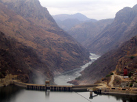
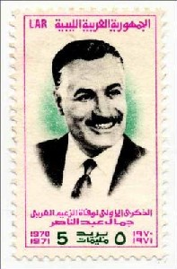
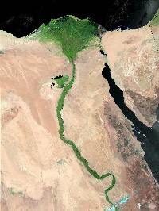

Title: Stíflur, þjóðríki og pólitík í Afríku
Slug: stiflur-thjodriki-og-politik-i-afriku
Date: 2006-11-14 10:12:00
UID: 110
Lang: is
Author: Íris Ellenberger
Author URL: 
Category: Sagnfræði, Umhverfismál
Tags: 

Hvers virði eru melar og móar? Þess hafa landsmenn spurt sig á undanförnum árum í tilefni af áformum um fyrstu risastíflu Íslands sem nú er orðin að veruleika. En við erum ekki þau einu sem höfum spurt slíkra spurninga og ef marka má hug&shy;mynda&shy;fræðina sem umlykur stíflur og vatns&shy;afls&shy;virkjanir er svarið skýrt. Náttúran er einskis virði nema mannshöndin nýti hana. Hér á Íslandi er auðvelt að réttlæta nýtingu náttúru&shy;auðlinda þegar um er að ræða fáfarin svæði fjarri manna&shy;byggðum. En í Afríku lifir mikill fjöldi fólks á frjósömum jarðvegi árfarvega og þar hefur komið í ljós að „mannshöndin“ sem hér um ræðir tilheyrir ekki hverjum sem er. Þar hefur hún gjarnan tilheyrt ríkisstjórnum sem hafa pólitísk markmið að leiðarljósi og hampa stíflum sem táknum um mátt þjóð&shy;ríkisins.

Hug&shy;mynda&shy;fræði virkjana sækir mjög til 4. áratugar 20. aldar þegar fyrstu risa&shy;stíflurnar risu og talið var að vísindum og framförum væru engin takmörk sett. Patrick McCully, fram&shy;kvæmda&shy;stjóri International Rivers Network, bendir á að stíflur voru samofnar fram&shy;fara&shy;hyggju tímabilsins: „they are concrete, rock and earth expressions of the dominant ideology of the technological age: icons of economic development and scientific progress to match nuclear bombs and motor cars.“[^1]  Þessi hug&shy;mynda&shy;fræði hefur að miklu leyti staðist tímans tönn þrátt fyrir sífellt vaxandi gagnrýni í garð stífla og virkjana. Hlutverk stífla er ekki aðeins tengt notagildi þeirra og áhrifum á efnahag viðkomandi landa heldur er það einnig táknrænt. Þær standa sem vitnis&shy;burður um yfirráð mannsins yfir náttúrunni og eru einnig táknmynd ríkisins sem gerir þær að æskilegum verkefnum fyrir þjóðríki sem vilja festa sig í sessi.[^2]  Því er ekki að undra að ríki sem hafa átt í vandræðum með að hljóta viður&shy;kenningu alþjóða&shy;sam&shy;félagsins hafi gripið til þess ráðs að byggja risavaxnar virkjanir í viðleitni sinni til að verða þjóðríki á meðal þjóðríkja. Póltísk réttlæting á tilvist þjóðríkja var einmitt helsti hvatinn að nokkrum þeirra verkefna sem mörkuðu upphafið að „tímabili risa&shy;stíflanna“ í Afríku, tímabili sem enn stendur yfir.

Nýlendu&shy;stefnan leið undir lok skömmu eftir miðja 20. öld og meðal þeirra ríkja sem þá hlutu sjálf&shy;stæði voru Ghana, Egyptaland og Mósambík. Nýlendu&shy;stjórnir ríkjanna þriggja höfðu þá þegar hafið undirbúning raf&shy;orku&shy;fram&shy;leiðslu og áveitu með hjálp stífla og vatnsafls&shy;virkjana. Þegar FRELIMO (Frente de Libertação de Moçambique) hrifsaði til sín völdin í Mósambík árið 1974 var Cahora Bassa-virkjunin í fullum rekstri.[^3]  Nýlendu&shy;herrar í Ghana höfðu þegar árið 1955 hafið undir&shy;búning að Akosombo-virkjuninni sem átti að framleiða raforku fyrir álver.[^4]  Á svipuðum tíma ráðgerðu Bretar að byggja stíflur í Eþíópíu og Úganda Egyptum til hagsbóta.[^5]

Cahora Bassa- og Akosombo-virkjanirnar ollu titringi innan nýrra ríkis&shy;stjórna Mósambík og Ghana því þær voru í raun arfleifð nýlendu&shy;stefnunnar. Samkvæmt stjórnmála&shy;fræðingnum Joshua B. Forrest voru virkjanir í augum nýlendu&shy;herra nauðsynleg tæki til að drottna yfir samfélögum nýlendanna og skiptu þær sköpum fyrir lykil&shy;atvinnu&shy;greinar s.s. námu&shy;vinnslu, fram&shy;leiðslu og markaðs&shy;væddan landbúnað.[^6] Ráðamenn hinna sjálfstæðu Afríku&shy;ríkja brugðu þá á það ráð að skapa þessum mann&shy;virkjum nýja táknræna merkingu sem þjónaði pólitískum hagsmunum þeirra.

Nkrumah, fyrsti forseti Ghana, leit á Akosombo-virkjunina sem tæki til að festa sig og heimaland sitt í sessi sem framverði þeirrar afrísku iðnvæðingar sem skyldi fylgja í kjölfar endaloka nýlendu&shy;stefnunnar. Virkjunin skyldi skapa Ghana ímynd nútímalegs þjóðríkis. Hann fékk almenning til liðs við áform sín m.a. með því að kalla virkjunina „verk&shy;fræði&shy;undur“ enda myndaði hún stærsta manngerða stöðuvatn heims.[^7]

FRELIMO átti hins vegar í mun meiri vandræðum með að réttlæta Cahora Bassa-virkjunina því rafmagnið sem hún framleiddi hafði upphaflega verið ætlað Suður-Afríku. Auk þess hafði virkjunin átt að stuðla að mannfjölgun í land&shy;nema&shy;byggðum hvítra í Mósambík m.a. í þeim tilgangi að hefta árásir FRELIMO á nýlendu&shy;stjórnina. Þar skipti einnig land&shy;fræðileg lega lónsins miklu máli. Virkjunin var hins vegar gangsett sex mánuðum áður en FRELIMO tók við stjórnar&shy;taumunum og því stóð hin nýja ríkis&shy;stjórn frammi fyrir þeim „tákn&shy;fræðilega“ vanda að Mósambík hýsti risa&shy;vaxinn vitnisburð um mátt þeirrar stjórnar sem FRELIMO hafði velt úr sessi. Nýir valdhafar leystu vandann með því að breyta tákn&shy;merkingu virkjunarinnar. Hún skyldi þjóðnýtt og henni var fagnað sem tákni um það frelsi sem myndi bæta efnahag fátækrar þjóðarinnar með raforkusölu til nágranna&shy;landa.[^8]

Aswan-stíflan gegndi svipuðu hlutverki í Egyptalandi og Akosombo-virkjunin í Ghana. Nasser forseti ætlaði Egyptalandi að verða leiðandi í iðnvæðingu álfunnar um leið og hann leitaðist við að byggja upp jákvæða ímynd af sjálfum sér og byltingar&shy;stjórn sinni. Eins og J. R. McNeill orðar það: „Nasser saw in the high dam Aswan a symbol that would contribute to the heroic, vigorous image he sought for himself, his revolutionary regime, and for Arab nationalism“.[^9] Hlutverk virkjana og stífla sem pólitísk tæki í Afríku á eftir&shy;nýlendu&shy;tímanum birtist m.a. í þeirri staðreynd að Nasser „flutti inn“ áform um stíflu&shy;byggingar frá nágranna&shy;ríkjunum. Breska nýlendu&shy;stjórnin hafði áformað að reisa stíflur í Úganda og Eþíópíu svo hægt yrði að auka ræktar&shy;land til að brauðfæða ört vaxandi íbúafjölda Egypta&shy;lands. Hentugustu stíflustæðin var að finna utan Egypta&shy;lands en uppgufun er gríðarleg í Aswan sem veldur því að 11% lóns&shy;magnsins tapast árlega og gerir svæðið einkar óhentugt fyrir stíflur.[^10] Hins vegar gengu stíflur í erlendum ríkjum þvert á markmið Nassers sem vildi skapa Egyptum ímynd sem frum&shy;kvöðlar nýsjálf&shy;stæðra Afríkuríkja.[^11] Hagkvæmni vék fyrir hug&shy;mynda&shy;fræði og tókst egypskum stjórn&shy;völdum að þagga niður í efasemda&shy;röddum og efla fylgi almennings við verkefni með því að gera Aswan-stífluna að tákni um mátt ríkisins.[^12]

Stíflurnar þrjár eru dæmi um pólitískt eðli stíflu- og virkjana&shy;fram&shy;kvæmda þrátt fyrir staðhæfingar um að slíkum verkefnum sé eingöngu ætlað að efla iðnvæðingu og hagvöxt. Byltingar&shy;stjórnirnar í Mósambík og Egypta&shy;landi þurftu að finna leiðir til að réttlæta vald sitt og tryggja áframhaldandi yfirráð. Stíflur reyndust vera hentugt tæki til þess því ímynd valds og trausts umvafði þær.[^13] Yfirvöld litu framhjá umhverfis&shy;málum og sam&shy;félags&shy;legri velferð íbúanna, sér&shy;stak&shy;legra þeirra sem byggðu líf sitt á frjósamri náttúru árfar&shy;veganna. Í Egypta&shy;landi þurftu þúsundir Núbíumanna að færa sig um set með þeim afleiðingum að samfélagið varð um tíma svo fátækt að það þurfti á matar&shy;aðstoð að halda.[^14] En voru stíflurnar þess virði?

Allt frá byggingu Cahora Bassa-virkjunarinnar og þar til að aðskilnaðar&shy;stefnan leið undir lok í Suður-Afríku var raforkunet Mósambík skotmark skemmdar&shy;varga á vegum RENAMO (Resistência Nacional Moçambicana) til að hindra þjóð&shy;nýtingu virkjunarinnar. Fram&shy;leiðslu&shy;mögu&shy;leikar hennar hafa aldrei verið full&shy;nýttir og verða það væntanlega aldrei því áformað er að byggja nýja stíflu skammt frá Cahora Bassa.[^15] Þegar samningar voru gerðir um fjármögnun Akosombo-virkjunarinnar reyndist aðal&shy;raf&shy;orku&shy;kaupandinn álver í eigu hins banda&shy;ríska Kaiser Company. Forsvarsmenn þess kröfðust 30 ára samnings sem fól í sér mjög lágt raf&shy;orku&shy;verð sem skerti ábata virkjunarinnar fyrir Ghanabúa umtalsvert og lagði lítið af mörkum til aukinnar uppbyggingar raf&shy;orku&shy;nets í þágu almennings.[^16] Með Aswan-stíflunni tókst egypskum yfir&shy;völdum að fresta nei&shy;kvæðum áhrifum gríðar&shy;legrar fólks&shy;fjölgunar um nokkra áratugi samkvæmt sagn&shy;fræðingnum J.R. McNeill: „By the end of the century water was short again, Egypt dependent again, and additional environmental costs were visited upon Egyptians present and future …“.[^17] Auk þess eru Nílarósar að minnka sökum þess að stíflan heftir framburð sem er nauð&shy;synlegur til að vinna gegn ágangi sjávar. Þar eru fram&shy;leiddir tveir þriðju hlutar af land&shy;búnaðar&shy;vörum Egypta&shy;lands.[^18] Flestar af neikvæðum afleiðingum stíflunnar voru þekktar þegar hún var í undirbúningi.[^19]

Ferill stíflanna þriggja er sannarlega ekki eins glæstur og forsvars&shy;menn þeirra héldu fram. Hins vegar virðast stíflu&shy;fram&shy;kvæmdirnar hafa borið árangur þegar litið er til þeirra pólitísku ástæðna sem lágu að baki þeim. Pólitískum leiðtogum var aðallega umhugað um að réttlæta ríkis&shy;stjórnir sínar og festa nýstofnuð þjóð&shy;ríkin í sessi. Nú eru Ghana, Egypta&shy;land og Mósambík þjóðríki meðal þjóð&shy;ríkja og enginn efast lengur um rétt íbúanna til sjálfstæðis.

[^1]: McCully, _Silenced Rivers_, 2-3.
[^2]: McCully, _Silenced Rivers_, 237.
[^3]: Isaacman, Sneddon, „Fanning the Flames“, 6.
[^4]: McCully, _Silenced Rivers_, 239.
[^5]: McNeill, _Something New Under the Sun_, 169.
[^6]: Forrest, „Water policy and environmental sustainability“, 394.
[^7]: McCully, _Silenced Rivers_, 240.
[^8]: Isaacman, Sneddon, „Fanning the Flames“, 6.
[^9]: McNeill, _Something New Under the Sun_, 168.
[^10]: McNeill, _Something New Under the Sun_, 169; White, „The Environmental Effects of the High Dam at Aswan“, 8.
[^11]: McNeill, _Something New Under the Sun_, 169.
[^12]: McCully, _Silenced Rivers_, 238-39.
[^13]: McNeill, _Something New Under the Sun_, 159.
[^14]: Scudder, „Conservation vs. Development“, 28; Williams, „Dam project sparks continued protests“.
[^15]: Hoover, „Damming the Zambezi“, 11.
[^16]: McCully, _Silenced Rivers_, 240.
[^17]: McNeill, _Something New Under the Sun_, 172.
[^18]: McNeill, _Something New Under the Sun_, 171-72.
[^19]: White, „The Environmental Effects of the High Dam at Aswan“, 37.
