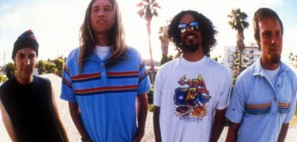
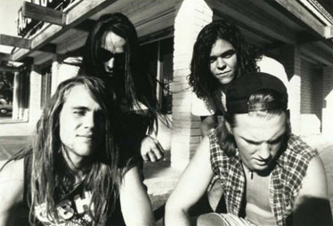
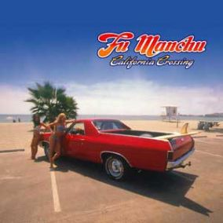
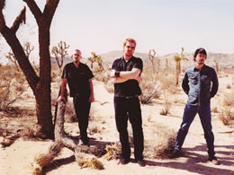

Title: Stoner rokk
Slug: stoner-rokk
Date: 2006-02-07 09:00:00
UID: 42
Lang: is
Author: Þórir Hrafn Harðarson
Author URL: 
Category: Tónlist, Samfélag
Tags: 

Á níunda ártugnum var glysrokkið í algleymingi og sveitir eins og Poison, Mötley Crue og Whitesnake yfir&shy;gnæfðu ljós&shy;vakann með smekklausum hárs&shy;greiðslum og leiðin&shy;legum gítar&shy;sólóum. Undir megin&shy;straumnum voru þó menn með meiri smekkvísi sem litu til baka til pönk&shy;tón&shy;listar og rokksins eins og það hafði verið í lok sjöunda og byrjun áttunda áratugs. Í Seattle braust fram hljóm&shy;sveitin Nirvana sem leiddi grugg&shy;rokkið fram til sigurs yfir glys&shy;rokkinu og í Kaliforníu varð minna þekkt sveit þess valdandi að hefja með áhrifum sínum tón&shy;listar&shy;stefnu sem fékk nafnið “stóner rokk.“

Stóner rokk vísar að sjálfsögðu til reykinga á vissri jurtategund, en víst er að sumum sveitum og áhangendum stefnurnar finnist það fylgja að stunda þá iðju. Það er auðvitað ekki algilt og því kjósa margir að kalla rokkið eyði&shy;merkur&shy;rokk, geimrokk, fuzzrokk eða riffrokk. Burtséð frá nafngiftinni er fæðing stefnunnar vanalega miðuð við upphaf sveitarinnar Kyuss (borið fram kæ-uss) sem var stofnuð árið 1990. Sveitin sótti áhrif sín að mestu aftur til upphafs áttunda áratugarins og þá sérstaklega í þung og fuzzkeyrð riff hljóm&shy;sveitarinnar Black Sabbath, en einnig hið mikla grúv, til&shy;rauna&shy;mennsku og sækadelíu sem einkenndi rokkið þá. Einnig var Josh Homme, gítarleikari sveitarinnar, mikill aðdáandi pönk&shy;sveitarinnar Black Flag og því töluverð áhrif sótt í pönkið, bæði hvað varðaði smekkleika í lagasmíðum og “gerðu það sjálfur“ (e. _do it yourself_) hugsunar&shy;háttinn. Markmiðið var að spila þau lög sem þá langaði að heyra, en enginn var að spila. 

Eftir að hafa byggt upp hóp aðdáenda með því að spila á tónleikum og í eyði&shy;merkur&shy;partýum í Suður-Kaliforníu var ráðist í að taka upp plötu og árið 1991 kom frumburðurinn _Wretch_ út. Ekki tókst þó vel upp að ná fram hljóm sveitarinnar og það var því ekki fyrr en árið 1992 þegar sveitin gaf frá sér hina frábæru _Blues for the Red Sun_ sem hjólin fóru að snúast. Platan þótti afspyrnu góð og féll vel í eyru bæði aðdáenda sveitarinnar jafnt sem gagnrýnenda. Dave Grohl trommari Nirvana lýsti einnig yfir hrifningu sinni á bandinu og kallaði þá framtíð grugg&shy;rokksins. 

Árið 1994 var svo fylgt eftir með plötunni _Welcome to Sky Valley_ sem er fyrir&shy;rennaranum engu síðri í gæðum. Því miður voru liðsmenn sveitarinnar á þessum tíma á góðri leið með að mála sig út í horn, en stuttu eftir útgáfu _And the Circus Leaves Town_ árið 1995 lagði sveitin upp laupana. Söngvarinn Johnny Garcia stofnaði sveitina Slo Burn, trommarinn Brant Bjork gekk til liðs við meðbræður sína í sveitinni Fu Manchu og Josh Homme stofnaði Queens of the Stone Age. 

Þrátt fyrir að Kyuss hafi hvorki náð háum aldri né mikilli frægð innan megin&shy;straumsins hafði gjöfulum fræjum verið sáð í jarðveg jaðar&shy;rokksins.  Á fyrri hluta tíunda áratugarins fóru að spretta upp fjöldi banda í suðurhluta Bandaríkjanna sem tóku nýja, gamla hljóminn upp á sína arma. 

Þó hljómurinn sé yfirleitt svipaður meðal hljómsveita innan senunnar, þungur og með sýrópsþykkum fuzz hljóm, er misjafnt hvaða árherslur eru á lagasmíðunum. Mörg bönd innan senunnar leitast við að gleyma sér í hassdrifnum sækadelíu köflum og framsæknum tónsmíðum og eiga það til að semja jafnvel heil tónverk. Má þar nefna sem dæmi hljómsveitina Sleep. Síðasta plata þeirra drengja áður en þeir hættu, _Dopesmoker_, innheldur eitt lag sem er yfir klukkustund að lengd. 

Aðrir hafa ekki miklar áhyggjur af því að taka sig of alvarlega, eru meira í því að semja stutt og einföld lög, texta um kraftmikla bíla, ferðir um himingeiminn, fallegar stúlkur, djamm og skemmtileg&shy;heit. Þar er á  ferðinni partírokk sem er eingöngu samið til þess að komast í gott skap og hafa gaman af, hvort sem verið er að keyra um eyðimerkur Kaliforníu eða fá sér öl í góðra vina hópi. Fremstir meðal jafninga í þeim efnum eru hressu drengirnir í Fu Manchu frá Suður-Kaliforníu. Þeir eru búnir að vera að frá því snemma á tíunda áratugnum og þeirra fyrsta plata kom út árið 1994. Sveitin hefur gengið í gegnum nokkuð af manna&shy;breytingum, en fastur punktur innan bandsins er forsprakki sveitarinnar, gítar&shy;leikarinn og söngvarinn Scott Hill. 

Um miðjan áratuginn fengu Fu Manchu til sín Brant Bjork, fyrrverandi trommara Kyuss. Gaf sá mannskapur út fjórar góðar plötur, en eftir það yfirgaf Brant Bjork hljómsveitina til að einbeita sér að sólóferli sínum. Fu liðar héldu þó ótrauðir áfram og gáfu út sína tíundu breiðskífu, hina ágætu _Start the Machine_, árið 2004. Fu Manchu verða seint sakaðir um frumlegheit eða tilraunir til þess að þróast of mikið en málið er bara svo einfalt að það sem þeir gera gera þeir virkilega vel.  Þó það eigi sér alltaf stað einhver smávægileg þróun milli platna þá veit maður hvað maður fær þegar maður hlustar á Fu Manchu. 

Þó Kyuss og Fu Manchu séu þau bönd sem fyrst koma upp í hugann er enginn skortur á góðum stóner rokk böndum. Má þar nefna sveitir eins og hina skemmtilegu Clutch frá Maryland, en þeir drengir hafa verið að frá 1991 án manna&shy;breytinga og sent frá sér 10 plötur á 15 ára ferli. Einnig drengirnir í Alabama Thunderpussy, sem eru reyndar ekki frá Alabama, en þeir komu einmitt hingað til lands fyrir stuttu og héldu fjöruga tónleika, Orange Goblin frá Bretlandi, en þeir hafa verið að í 10 ár og gerðu plötu árið 2002 með Johnny Garcia, fyrrum söngvara Kyuss, sem gesta&shy;söngvara. Johnny hefur einnig verið iðinn frá því hann yfirgaf Kyuss og verið í sveitunum Slo Burn, Unida og núna Hermano sem gáfu út hina fínu _Dare I Say_ í fyrra. Fleiri sveitir sem vert er fyrir áhugafólk að athuga eru Dozer, Acid King, The Atomic Bitchwax, Monster Magnet, Electric Wizard, Spiritual Beggars, Nebula og fulltrúar okkar Íslendinga í Brain Police.

Hvað framtíðin ber í skauti sér fyrir stefnuna er auðvitað erfitt að segja, en Queens of the Stone Age hafa verið duglegir að koma rokkinu í eyru lýðsins. Gömlu jaxlarnir frá upphafi tíunda áratugarins eru flestir hverjir enn virkir og ekki skortir ný bönd. Stóner rokkið mun líkast til seint verða vinsælt í hinum poppaða meginstraumi, en fyrir okkur hin sem langar að njóta þess að hlusta á gott rokk mun það alltaf krauma undir niðri og halda í heiðri gildum hins klassíska rokks.

