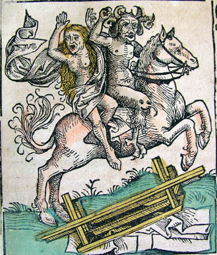

Title: Stungið í Víti
Subtitle: Kynlíf og kynferði í Tídægru Boccaccios
Slug: stungid-i-viti-kynlif-og-kynferdi-i-tidaegru-boccaccios
Date: 2008-07-25 13:55:28
UID: 358
Lang: is
Part: 1/2
Author: Elín Björk Jóhannsdóttir
Author URL: 
Category: Bókmenntafræði, Bókmenntir
Tags: Tídægra, Giovanni Boccaccio, Flórens, Svarti dauði, Kynlíf, Kynferði, Miðaldir, gróteska, rammafrásögn, munnmælasögur, fábyljur, freistingar, Ítalía, Ítalskar bókmenntir, Add new tag

_Tídægra_ eftir Giovanni Boccaccio var rituð um 1349-1353 í kjölfar þess að svarti dauði herjaði á Flórens, heimaborg höfundarins. Í upphafi bókarinnar ákveður hópur ungra Flórensarbúa; sjö stúlkur og þrír piltar, að flýja borgina og faraldinn og koma sér fyrir á setri uppi í sveit sem af lýsingunum að dæma er nokkurs konar paradís á jörðu. Frásagnir af lífi þessara persóna á sveitasetrinu mynda svo umgjörð bókarinnar en þau stytta sér stundir með því að segja hundrað sögur sem skiptast niður á tíu daga svo hver sögumaður segir eina sögu á dag. Þannig myndar Boccaccio svokallaða rammafrásögn þar sem aðalsagan af ungmennunum inniheldur hundrað sögur sem þau segja hvort öðru. Þær sögur eru af ókunnugum en þó nafngreindum aðilum og myndu í dag líklega flokkast undir gróusögur.

Sögunum er flestum ætlað að skemmta áheyrendum, unga fólkinu, og stytta þeim stundirnar á meðan plágan gengur yfir og þau geta snúið aftur til samfélagsins í borginni. Þar sem _Tídægra_ er skrifuð við lok miðalda er heilagleikinn ekki yfirhafinn hlátrinum en Boccaccio vann sögurnar upp úr eldri munnmælum og sagnabálkum, bæði ítölskum og frá öðrum löndum og eru plottin í sögunum komin þaðan. Hæðst er að klerka&shy;stéttinni og í sögunum koma meðal annars fyrir kynósa nunnur sem allar, að abbadísinni meðtalinni, taka sér garðyrkjumann klaustursins sem elskhuga[^1] og munkur og ábóti sem hvorugur standast þá líkamlegu freistingu sem á vegi þeirra verður.[^2] Unga fólkið skemmtir sér yfir óförum og aðförum persónanna í sögunum, þrám þeirra og brögðunum sem þær beita í tilraunum sínum til að ná sínu fram.

Í sögunum kemur fram ákveðinn rígur á milli kynjanna, sem oft reyna að blekkja hvort annað eða þriðja aðila til að öðlast það sem þau þrá eða til þess að geta viðhaldið hegðun sem þykir ámælisverð og felst oftast í framhjáhaldi. Þessi rígur endurspeglast í samskiptum unga fólksins, efnisvali þeirra og því hvernig þau, karlmennirnir sérstaklega, nota sögurnar sem þeir segja til að ögra hinu kyninu. Ástin kemur raunar til sögunnar strax í upphafi bókarinnar því stúlkurnar treystu sér ekki til að yfirgefa borgina án fylgdar karlmanna og svo heppilega vill til að ungu mennirnir þrír eru allir ástfangnir af einhverri stúlknanna og því fúsir að fylgja þeim út úr borginni.

### Ólíkar dýrategundir

Ungmennin skipta með sér störfum í sátt og samlyndi svo að hver fær að vera kóngur/drottning í einn dag en kóngurinn/drottningin fær jafnframt þann heiður að velja efni sagnanna sem sagðar eru þann daginn. Það ríkir því jafnrétti í stjórnun þessa smáa samfélags sem unga fólkið myndar á sveita&shy;setrinu. Þrátt fyrir að Elísa segi að „karlinn [sé] konunnar höfuð”[^3] endur&shy;speglast það ekki í stjórnunar&shy;háttum þeirra þar sem allir fá jafn&shy;veiga&shy;mikið hlutverk. Eftir þriðja daginn kemur togstreita kynjanna bersýnilega í ljós. Þann dag eru sagðar sögur sem ganga út frá kynlífi og í lok hans eru konur og karlar álitin sitt hvor tegundin[^4] þegar Neifíle líkir konunum við kindur og körlunum við úlfa[^5]. Þó svo að verka&shy;skiptingin sé jöfn er ljóst að kyn kóngs/drottningar er ekki gleymt og að það eru tveir ólíkir hópar sem skipta með sér stjórn hópsins. Þetta endurspeglast einnig í frásögnum ungu mannanna en þeim er beint sérstaklega að stúlkunum, þær eru oftast ávarpaðar áður en sagan hefst en ekki hinir mennirnir tveir. Uppröðunin á sögunum er reyndar þannig að ungu mennirnir segja sjaldan sögu á eftir hvorum öðrum. Þó er það ljóst af orðum þeirra að þeir reyna að höfða til stúlknanna frekar en hinna tveggja af sínu eigin kyni og ávarpa þær meðal annars sem „elskulegu ungrúr“, „mikilhæfu stúlkur“, „þokkafullu stúlkur“ og „ástríku ungfrúr“[^6]. Jafnframt er karlmönnum og kvenmönnum þannig stillt upp sem andstæðum og það eru karlmennirnir sem reyna að gleðja konurnar með sögum sínum á meðan sögur kvennanna eru sagðar fyrir allan hópinn.

### Samlíðun með sögupersónum
Þó svo að ekki sé beint sagt frá kynlífi ungmennanna sjálfra, eða skorti á því, er ljóst að það ólgar undir niðri og endurspeglast í sögunum sem þau segja sér til skemmtunar. Þegar fulltrúi karlmannanna, Fílóstrató heldur áfram með líkingu Neifíle og segir við stúlkurnar; „Hefðuð þið farið að mínum ráðum væru úlfarnir búnir að kenna kindunum að stinga djöflinum í Helvíti“[^7]. Með því „að stinga djöflinum í Helvíti“ er átt við samfarir karls og konu og með þessum orðum ögrar Fílóstrató stúlkunum á ákaflega kyn&shy;ferðis&shy;legan hátt en það er látið liggja á milli hluta hvort honum tekst ætlunar&shy;verkið, að fá þær til að leyfa þeim „að stinga djöflinum í Víti“.

Á yfirborði frá&shy;sagnarinnar eru samskipti hópsins ákaflega siðsöm. Raunar svo siðsöm að Elísa stöðvar Díoneó þegar hann ætlar að syngja söngva sem að öllum líkindum eru of klámfengnir fyrir félagsskapinn.[^8] Undir niðri er þó ljóst að kynin takast á og það endurspeglast í sögunum en í gegnum þær geta sögumennirnir komið hugðarefnum sínum á framfæri. Það felst einnig ákveðin ögrun í hinum djörfu umfjöllunar&shy;efnum sagnanna og bersögli þeirra í kyn&shy;ferðis&shy;málum. Karlmennirnir segja nokkrar sögur sem ýmist vekja blygðunar&shy;kennd ungu stúlknanna eða þær hreinlega geta ekki bælt hláturinn yfir. Þannig hristast þær meðal annars af hlátri yfir stúlkunni sem í sakleysi sínu þjónar guði með því að stinga áðurnefndum djöfli í Helvíti.[^9] Umfjöllun sagnanna um kynhvöt er tengd við sögumennina meðal annars þegar söguhöfundur _Tídægru_ ýjar að girnd stúlknanna og túlkar viðbrögð þeirra við sögunum. Eftir söguna af konu „sem hafði gamnað sér tíu þúsund sinnum við átta ólíka menn“ skýtur sögumaður bókarinnar eftirfarandi inn í: „Mikið andvörpuðu ungu stúlkurnar yfir marg&shy;breyti&shy;legum ævintýrum hinnar fríðu meyjar: en hver veit af hvaða sökum? Ef til vill andvörpuðu sumar þeirra ekki svo af samlíðun með Alatíel, heldur af því þær vildu gjarnan giftast jafn oft og hún“.[^10] Þannig er það gert ljóst að stúlkurnar sjö eru ef til vill ekkert betri en sögu&shy;persónurnar sem þær segja frá heldur hafa einnig líkamlegar þrár og þarfir. Eins og fram kom hér að ofan fara ungu mennirnir þrír ekki mjög leynt með vilja sinn til að kenna stúlkunum að „stinga skrattanum í Víti“og þrá þeirra er aldrei langt frá yfirborðinu, enda eru þeir allir ástfangnir af einni af stúlkunum sjö.

### Ástin sem sjúkdómur
Þrátt fyrir að það hafi verið Svarti dauði sem ungmennin flúðu frá er það annar og ögn frábrugðinn sjúkdómur sem herjar á hug þeirra og hjörtu í sældarlífinu á sveita&shy;setrinu: ástin. Þessi ást sem er um&shy;fjöllunar&shy;efni svo margra sagnanna er ákaflega líkamleg og væri líklega réttara að kalla hana einfaldlega girnd. Henni er lýst sem veiki frekar en öðru og hún veldur meðal annars svefn&shy;leysi[^11] og því að menn og konur verða gjörsamlega heltekin af einstaklingi af hinu kyninu og ráða hreinlega ekki við sig og líkamlegar hvatir sínar. Það eru þó ekki einungis persónur sagnanna í _Tídægru_ sem þjást af sjúkdómnum heldur einnig aðal&shy;persónanna.

Þó svo að rammi bókarinnar sé ekki gróteskur eru sögurnar innan hans það. Plottin sem ganga út á það að tveir líkamar mætist með tilheyrandi hömluleysi en samkvæmt Mikhail M. Bakhtin eru samfarir tveggja líkama og losun líkamsvessa meðal aðalviðburða hins gróteska líkama.[^12] Líkaminn tekur völdin og sögu&shy;persónurnar missa stjórn á honum, hversu dyggðugar sem þær kunna að hafa verið fyrir hliðarsporið. Þar sem plott sagnanna eru komin frá eldri sögum er tengingin þar á milli ákaflega sterk og þó svo að _Tídægra_ sé skrifuð í upphafi nýju aldarinnar tengjast umfjöllunar&shy;efnin eldri verkum, eins og frönsku fábyljunum eða fabellunum (f. fablieux), órjúfanlegum böndum. Í sögunum kemur það fyrir að báðir aðilar „smitast“ af sjúkdómnum sem ástin er, eins og í sjöundu sögu annars dags þar sem tveir einstaklingar gæta ekki að sér þegar þau deila rúmi saman og „sama sterka þráin [grípur] þau bæði.“[^13] Það er þó algengara að aðeins annar aðilinn verði sjúkur af ást, oft við fyrstu sýn og af einhverjum sem hann ekki þekkir heldur heillast af útliti hans eða hennar. Með því að horfa á viðfangið „drekka [mennirnir] í sig eitur ástarinnar í gegnum augun.“[^14] Auk svefnleysis og almennrar vanlíðunar er ein afleiðing umræddar veiki sú að mennirnir verða einnig helteknir af afbrýðis&shy;semi út í þann sem hefur hendur á konunni það skiptið. Þess vegna stela mennirnir í þessari sömu sögu konunni, sem þeir verða allir ástfangnir af, hver frá öðrum. Þó virðist vera auðvelt að lækna veikina hjá karlmönnum, þeir sækjast að minnsta kosti ekki eftir því að ná konunni til baka frá þjófinum eftir að þeir hafa misst hana.

[^1]: Boccaccio, Giovanni. 1999. Tídægra. Þýð. Erlingur E. Halldórsson. Mál og menning, Reykjavík. s 186-192
[^2]: Sama heimild s. 60-63
[^3]: Boccaccio, Giovanni. 1999. Tídægra. Þýð. Erlingur E. Halldórsson. Mál og menning, Reykjavík. s 36
[^4]: Wallace, David. 1991. Giovanni Boccaccio, Dekameron. Cambridge University Press, Cambridge, s. 45
[^5]: Boccaccio, Giovanni. 1999. Tídægra. Þýð. Erlingur E. Halldórsson. Mál og menning, Reykjavík s 259
[^6]: Sama heimild, síður 60, 68, 129, 387
[^7]: Sama heimild s. 259
[^8]: Sama heimild s. 395
[^9]: Sama heimild s. 259
[^10]: Sama heimild s. 148
[^11]: Sama heimild s. 237
[^12]: Bakhtin, Mikhail. 1984. „The Grotesque Image of the Body and Its Sources“. Rabelais and His World. þýð. Helene Iswolsky. Indiana University Press, Bloomington. bls. 303-436.
[^13]: Boccaccio, Giovanni. 1999. Tídægra. Þýð. Erlingur E. Halldórsson. Mál og menning, Reykjavík, s.143
[^14]: Sama heimild s. 137
