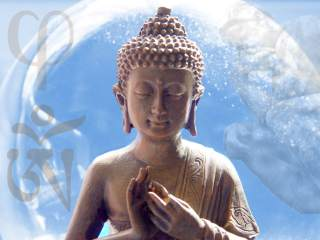

Title: Stutt hugleiðing um túlkun (tiltekinna) mótsagna í búddhískum ritum
Subtitle: Um hlutverk fjórsetninga í Majjhima Nikaya og Mūlamadhyamakakārikā
Slug: stutt-hugleiding-um-tulkun-tiltekinna-motsagna-i-buddhiskum-ritum
Date: 2007-10-16 13:17:00
UID: 186
Lang: is
Author: Hrafn Ásgeirsson
Author URL: 
Category: 
Tags: 

Heimsmynd búddhisma felur í sér skarpan greinarmun á sýnd og veruleika. Skýrasta dæmið mun líklega vera það að samkvæmt búddhisma er _sjálfið_ (enska: _ego_; palí: _atta_; sanskrít: _atman_) ekki til, að minnsta kosti ekki sem slíkt. Það er þó vissulega „til“ í einhverjum skilningi; okkur _sýnist við_ hafa eitthvað sem kallast getur ‚sjálf‘, en í _raun og veru_ er ekkert slíkt til. Það fer svo eftir stefnum innan búddhisma hvort þetta sama eigi við um önnur hugtök okkar einnig og hvort gera megi grein fyrir því hvað sé til í raun og veru sem skýri þetta. Samkvæmt Theravada búddhisma, sem telja má að fari sem næst kenningum Búddha (ca. 563–483 f. Krist) sjálfs, á þetta helst við einmitt um hugtakið _sjálf_, en samkvæmt Mahayana búddhisma á þetta við um öll hugtök okkar. Ef hið síðara er rétt, þá eru öll hugtök okkar „tóm“ í þeim skilningi að þau endurspegla ekki veruleikann eins og hann er. Og engin hugtök okkar gætu gert það.

Ég mun taka dæmi af ákveðnu „rökbragði“ sem notað er á tvennan hátt, annars vegar úr ritinu _Majjhima Nikaya_[^1] og hins vegar úr ritinu _Mūlamadhyamakakārikā_[^2]  eftir Nagarjuna (ca. 150–250 e. Krist). Hið fyrra er einn höfuðtexta Theravada búddhisma, en hið síðara einn höfuðtexta Mahayana búddhisma. Dæmin tel ég sýna að minnsta kosti þrennt. Í fyrsta lagi undirstrika þau hve rökleg búddhísk hugsun er, þrátt fyrir að koma fremur skáldlega fyrir sjónir. Og þá meina ég rökleg í þeim skilningi að í ritunum kemur fram mikilsverður skilningur á máli, málnotkun og rökfræðilegum eiginleikum. Í öðru lagi sýna dæmin hvernig þessum skilningi er beitt til að sýna fram á nokkur mikilvæg atriði í búddhískri hugsun. Og í þriðja lagi, sem kann að vera ótengt búddhisma sem slíkum, sýna þau hvernig við mannfólkið túlkum mál, ritað jafnt sem mælt, í ljósi ákveðinna viðmiða sem lúta að því að halda í tiltekin grunnlögmál rökfræðinnar.

Rökbragðið kallast ‚fjórsetning‘ (e. _tetralemma_; skt. _catuskoti_, og er sett upp á eftirfarandi hátt (þar sem `x` stendur fyrir hvaða hlut sem er og `F` fyrir hvaða eiginleika sem er):

> (1) `x` er `F`  
> (2) `x` er ekki `F`  
> (3) `x` er bæði `F` og ekki `F`  
> (4) `x` er hvorki `F` né ekki `F`

Búddhísk fjórsetning er til bæði jákvæð og neikvæð. Sú jákvæða játar öllum fjórum setningum, og þar er sægur af efni í mótsagnir. Setningar (1) og (2), sem dæmi, eru í beinni mótsögn[^3]  og setning (3) er í beinni mótsögn við mótsagna&shy;lögmálið sjálft! Neikvæða fjórsetningin neitar hins vegar öllum fjórum setningum. Ég mun fara nánar í það neðar um það hvers kyns neitun er að ræða.

Fyrst er það beiting jákvæðrar fjór&shy;setningar. Tökum dæmi úr _Mūlamadhyamakakārikā_:

> Allt er raunverulegt og óraun&shy;verulegt  
> Bæði raunverulegt og óraun&shy;verulegt  
> Hvorki raunverulegt né óraun&shy;verulegt  
> Þetta kennir heilagur Buddha.[^4] 

Hér er allt fernt fullyrt, og því verður vart þverfótað fyrir mótsögnum. Hvað er réttast að gera? Taka þeim opnum örmum og líta á búddhisma sem röklausa kenningu, í þeim skilningi að hann virðir ekki eitt traustasta lögmál rökfræðinnar? Nei, til er bæði röklegri og sennilegri lausn. Þegar við túlkum texta og rekum okkur á mótsögn er okkur tamt að leita leiða til að túlka hann þannig að leyst sé úr mótsögninni. Ég tel að höfundar búddhíska textans hafi verið fullkunnugt um þetta og að þeir hafi einmitt nýtt sér þetta túlkunar&shy;viðmið við smíði þessara dæma. Lítum á eftirfarandi, sem ég tel vera hliðstætt vanda jákvæðu fjór&shy;setningarinnar:

Jón er 175 cm á hæð. Er Jón stór eða er hann ekki stór?

Svarið er hverjum á reiðum höndum: Jón getur verið stór _miðað_ við einn en ekki stór _miðað við_ annan. Þannig er hann _í vissum skilningi_ bæði stór og ekki stór. En að segja þetta tvennt kemur manni ekki í mótsögn við sjálfan sig. 

Setningarnar

> Jón er stór miðað við x  
> Jón er ekki stór miðað við y

eru ekki í mótsögn hvor við aðra frekar en ‚Grasið er grænt‘ og ‚Jörundur fretar furðulega‘ eru það. Við ættum að leita svipaðrar leiðar til að leysa vanda jákvæðu fjór&shy;setningarinnar. Búum til tilvik af fjór&shy;setningunni úr _Mūlamadhyamakakārikā_ hér að ofan og notum til þess hugtakið _sjálf_, sem samkvæmt búddhisma virðist raunverulegt þrátt fyrir að vera það samt ekki:

* Sjálfið er raunverulegt í tilteknum skilningi
* Sjálfið er óraunverulegt í (öðrum) tilteknum skilningi.
* Sjálfið er bæði raunverulegt og óraunverulegt í tilteknum skilningi.
* Sjálfið er hvorki raunverulegt né óraunverulegt í tilteknum skilningi.

Sé greinar&shy;munurinn á sýnd og veruleika hafður í huga, má sem sagt leggja viðeigandi merkingu í setningarnar að ofan og um leið komast hjá nokkurri mótsögn.

Þá að beitingu neikvæðu fjór&shy;setningarinnar. Tökum dæmi úr _Anguttara Nikaya_, úr samtali Gotama (Búddha) or mein&shy;læta&shy;mannsins Vaccha:

> Gotama, hvar er hinn endurfæddi múnkur sem frelsaði hug sinn á þennan hátt?  
> Vaccha, það er ekki við hæfi að segja að hann sé endurfæddur.  
> Þá, Gotama, er hann ekki endurfæddur.  
> Vaccha, það er ekki við hæfi að segja að hann sé ekki endurfæddur.  
> Þá, Gotama, er hann bæði endurfæddur og ekki endurfæddur.  
> Vaccha, það er ekki við hæfi að segja að hann sé bæði endurfæddur og ekki endurfæddur.  
> Þá, Gotama, er hann hvorki endurfæddur né ekki endurfæddur.  
> Vaccha, það er ekki við hæfi að segja að hann sé hvorki endurfæddur né ekki endur&shy;fæddur.[^5] 

Hér virðast eftirfarandi fjórum setningum neitað einni af annarri:

* Hann er endur&shy;fæddur.
* Hann er ekki endur&shy;fæddur.
* Hann er bæði endur&shy;fæddur og ekki endur&shy;fæddur.
* Hann er hvorki endur&shy;fæddur né ekki endur&shy;fæddur.

Sem fyrr leitum við leiða til að túlka textann í samræmi við grund&shy;vallar&shy;lögmál rökfræðinnar. Lykillin að viðeigandi túlkun tel ég leynast í vali höfundanna á orðunum ‚það er ekki við hæfi að segja‘.[^6]  Neitun setninganna fjögurra er ekki hefðbundin neitun full&shy;yrðinganna. Slíkt gæfi okkur annan sæg mótsagna. Sú neitun sem um er að ræða mætti kalla ‚stað&shy;hæfingar&shy;neitun‘ eða eitthvað álíka. Hér er verið að neita því að viðeigandi sé að staðhæfa neina af setningunum fjórum. Skýringuna, eða rétt&shy;lætinguna, er að finna í kenningunni sjálfri: raun&shy;veru&shy;leikinn er handan orða okkar og hugtaka. Ef hugtakið ‚endurfæddur‘ á ekki við um þann sem verið er að ræða um, þá er ekki viðeigandi að staðhæfa neina setninganna. Ekki fremur en viðeigandi er að staðhæfa um jólasveininn (óháð því hvort hann sé til eða ekki) að hann sé tveggja gíra eða að hann sé ekki tveggja gíra. Þetta hugtak á einfaldlega ekki við um jólasveininn. Sama kann að eiga við um mörg eða öll hugtök okkar og tilraunir okkar til að láta þau lýsa raun&shy;veru&shy;leikanum[^7]. 

Ég tel að þetta sýni glögglega hversu vel búddhískir hugsuðir voru að sér í rökfræðilegum og málspekilegum efnum og að þeir hafi nýtt sér þetta í framsetningu sinni á inntaki búddhisma (hvort sem er í textunum sem sagðir eru vera orð Búddha sjálfs, t.d. _Majjhima Nikaya_, eða í textunum sem á eftir komu, t.d. _Mūlamadhyamakakārikā_). Jákvæðar fjórsetningar virðast gagnast vel til að undirstrika greinarmuninn á sýnd og veruleika og neikvæðar fjórsetningar til að varpa ljósi á eðli veruleikans (og mörk mannlegrar hugsunar). Að lokum tel ég dæmin sýna vel það grund&shy;valla&shy;rviðmið túlkunar að gefa höfundi það að hann virði (að minnsta kosti) grund&shy;vallar&shy;lögmál rökfræðinnar: mót&shy;sagnar&shy;lögmálið. Við virðumst, og ættum að, leitast við að túlka texta á sem sann&shy;gjarnastan hátt. Að gera ráð fyrir því að höfundurinn sé röksamur, í þeim skilningi að virða grund&shy;vallar&shy;lögmál rökfræðinnar, er fyrsta skrefið í átt að slíkri túlkun.

----

<small class="blurb">_Athugasemdir eru vel þegnar, ekki síst ef þær snúa að skilningi mínum á Búddhisma._</small>

----

#### Heimildir

* Jay L. Garfield, _The Fundamental Wisdom of the Middle Way: Nagarjuna‘s Mūlamadhyamakakārikā_ (Oxford: Oxford University Press, 1995).
* [Laurence R. Horn](http://plato.stanford.edu/archives/fall2006/entries/contradiction), „Contradiction“, _The Stanford Encyclopedia of Philosophy_ (Fall 2006 Edition), Edward N. Zalta (ed.).</a>
* H.C. Warren, _Buddhism in Translations_ (Cambridge, MA: Harvard University Press, 1915). 

[^1]: Sjá þýðingu á völdum köflum úr búddhískum ritum á pali (tungumáli Búddha), þar á meðal úr _Majjhima Nikaya_, í _Buddhism in Translations_ eftir H.C. Warren (Cambridge, MA: Harvard University Press, 1915).
[^2]: Sjá _The Fundamental Wisdom of the Middle Way: Nagarjuna‘s Mūlamadhyamakakārikā_ eftir Jay L. Garfield (Oxford: Oxford University Press, 1995).
[^3]: Réttast væri reyndar að segja að í hverju _tilviki_ af (1) og (2) séu þær í mótsögn hvor við aðra, en ég hef þá afsökun að ég reyni að feta veg milli hvers&shy;dags&shy;legrar og tæknilegrar málnotkunar.
[^4]: _Mūlamadhyamakakārikā_, bls. 102. [Eigin þýðing úr ensku.]
[^5]: _Majjhima Nikaya_, bls. 125. [Eigin þýðing úr ensku.]
[^6]: Þýðendur úr palí eru reyndar ekki á eitt sáttir um það hvernig skuli þýða forskeytta orða&shy;sam&shy;bandið. Orðaval þeirra virðist fara eftir kenningu þeirra um fjór&shy;setningarnar og því ætti að varast að lesa of mikið í ensku þýðingarnar. Hins vegar er klárt að frumtextinn inniheldur vísun í það _að segja_. Og það er nóg til þess að renna stoðir undir þá túlkun sem ég aðhyllist.
[^7]:  Hér er reyndar tvennt sem flækir málið. Annars má líta svo á að sum hugtök eigi ekki við um eitthvað tiltekið af því að þetta tiltekna er ekki til, sbr. sjálfið. Hins vegar má líta svo á að hugtök okkar eigi hreinlega ekki við um raun&shy;veru&shy;leikann. Hvor skilningurinn er lagður í málið tel ég fari eftir mismunandi stefnum búddhisma, en ég tel ekki að þessi munur skipti sköpum fyrir túlkun mína jafnvel þótt hann kunni að flækja málin.
