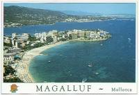

Title: Svekkjandi auglýsingar
Slug: svekkjandi-auglysingar
Date: 2005-11-15 15:04:00
UID: 16
Lang: is
Author: Bjarni Rúnar Einarsson
Author URL: http://bre.klaki.net
Category: Neyslusamfélagið
Tags: Auglýsing, markaðsefni

Mér fannst áhugavert að fylgjast með viðbrögðum fólks við auglýsingaherferð ónefnds stórfyrirtækis um daginn.  Herferðin og skoðanir fólks á henni hafa orðið tilefni skemmtilegra samtala, bæði á kaffistofunni og víðar.

Fyrir þá sem lesa frá útlöndum eða úr framtíðinni, þá voru í nóvemberbyrjun bréf sem virtust handskrifuð á ýmisskonar bréfsefni sett milli blaðsíðna Morgunblaðsins og Fréttablaðsins, þannig að um leið og fólk fletti rakst það á eitthvað sem gæti hvort sem er hafa verið óvænt bréf frá elskhuga eða eitthvað sem hefði "óvart" gleymst inní blaðinu.  Orðalagið var smjaðurslegt og væmið og hvergi kom fram um hvað málið snérist í raun, en undirskriftin vísaði á vefslóð sem svo reyndist vera í eigu banka.

Fólk brást illa við, var hneykslað og fúlt.  Margir hringdu og hvörtuðu undan auglýsingunum og [næsta dag birtust afsökunarbeiðnir í blöðunum.](http://www.mbl.is/mm/frettir/innlent/frett.html?nid=1167486) Í þeim var beðist afsökunar á að gleymst hefði að merkja auglýsingarnar sem slíkar: "því miður hafi fallið niður texti neðst í dreifibréfinu sem sagði að um auglýsingu væri að ræða".

Afsökunarbeiðnin er áhugaverð fyrir tvennar sakir.

Annarsvegar má lesa það út úr henni að það átti ekki að koma fram að um auglýsingu væri að ræða fyrr en að lestri loknum. Hinsvegar var hvergi beðist afsökunar á því sem ég held að hafi raunverulega angrað lesendur blaðanna:

### Það er ömurlegt að láta plata sig svona!

Er það ekki kjarni málsins?

Persónuleg bréf eru sjaldgæf og spennandi.  Hvort sem þau eru gleðiefni eða ekki, þá vekja þau athygli og komast langt inn fyrir þann tilfinningalega múr sem yfirleitt heldur fréttum og auglýsingum og öðru ópersónulegu efni í hæfilegri fjarlægð. Það var auðvitað tilgangur þessarar herferðar að komast inn fyrir varnirnar og ná athygli.

Ég held hinsvegar að hugmyndasmiðir herferðarinnar hafi ekki leitt hugann að því sem gerist eftir að athyglin hefur verið fönguð með þessum hætti.

Fólk verður nefnilega yfirleitt fúlt þegar það er haft að fífli. Þegar það rennur upp fyrir lesanda að hann hafi verið plataður, að ópersónuleg auglýsing hafi stolist inn fyrir tilfinningalega varnarmúra og kitlað sálina hrekkur lesandinn í vörn og reiðist.

Þessi tiltekna herferð náði mér ekki, ég fylgdist bara með viðbrögðum annarra.  Hinsvegar lét ég blekkjast af svipuðum auglýsingum í sumar.  Þá voru send "handskrifuð" póstkort með villandi texta og ég varð glaður og forvitinn, enda sumar og sá tími árs þegar vinahópurinn er á flakki um heiminn og sendandi póstkort hingað og þangað.

_Hver er svona góður að senda mér póstkort?  Gaman! Spennandi!_

Þegar það rann upp fyrir mér að þetta var bara bensínauglýsing eða eitthvað álíka umbreyttist spennan og gleðin í pirring og vonbrigði.

_Fúlt!  Mig langaði í óvænt póstkort!  Ömurlega fyrirtæki X, það ætti að kveikja í þeim..._

Ég gæti best trúað því að mörgum hafi liðið svipað að lesa þessi bréf frá bankanum og ég mér leið þegar póstkortin eyðilögðu fyrir mér morguninn nú í sumar.

Auðvitað er skiljanlegt að auglýsendur noti hugmyndaflugið til að ná til lesenda sem eru löngu orðnir þrautþjálfaðir í að leiða markaðsefni hjá sér.  Persónuleg bréf eru opnuð og lesin strax, bréf frá fyrirtækjum og stofnunum fá að liggja óáreitt á eldhúsborðum landsmanna þar til þau eru annaðhvort hraðlesin með morgunkaffinu eða sett beint í endurvinnsluhrúguna.

Nokkuð er síðan markaðsefni fór að berast með ívið persónulegra orðalagi, kuldalegt stofnanafasið mýkt með því að ávarpa móttakendur með nafni og undirskrift tiltekins starfsmanns neðst í bréfunum.  Í þessum tveimur nýlegu dæmum er hinsvegar skrefið stigið til fulls, stofnanaeinkennin eru öll afmáð og geta móttakandans til að greina á milli markaðsefnis og persónulegra bréfa er verulega skert.

Þessi tækni er nokkuð snjöll tilraun til að forðast endurvinnsluna og ná athygli.  Hún virkar; allir á kaffistofunni lásu bréfin og sumir oftar en einusinni.

En helgar tilgangurinn meðalið?

Þegar enginn sýnilegur munur er á persónulegum bréfum og markaðsefni, mun það leiða til þess að við lesum markaðsefnið eða hættum við einfaldlega að gleðjast þegar okkur eru send persónuleg bréf?  Munu bréfin frá Ömmu fara beint í endurvinnsluna, eins og kemur af og til fyrir tölvupóst sem drukknað hefur í spamflóði?

Og auglýsendur sérstaklega þurfa að spyrja sig: er ekki hætt við að svekktir neytendur beini viðskiptum sínum annað, einmitt vegna þess að tæknin virkar?
