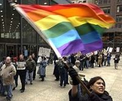
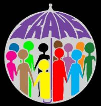
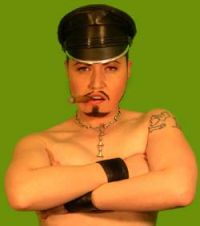

Title: Svona og hinsegin
Slug: svona-og-hinsegin
Date: 2007-10-25 09:45:00
UID: 190
Lang: is
Author: Auður Halldórsdóttir
Author URL: 
Category: Hinsegin fræði
Tags: 

Í ágúst á hverju ári flykkjast þúsundir Íslendinga í miðbæ Reykjavíkur til að taka þátt í Hinsegin dögum. Fjölskyldufólk með barnavagna, unglingar og eldri borgarar koma til að sýna stuðning, til að til að horfa á skrúðgönguna eða bara sýna sig og sjá aðra. Þau stilla sér upp á gangstéttina til að horfa á þá sem eru á götunni, hinsegin fólkið. Öðrum megin við línuna er svona fólk og hinum megin hinsegin fólk.

En hverjir eru þessir hinsegin? Og er línan svo skörp milli þeirra og hinna?

Áður en lengra er haldið er vert að benda á að hugtakið hinsegin hefur margar ólíkar skýringar og er afar sveigjanlegt. Hinsegin nota ég hér sem íslenska þýðingu á enska hugtakinu queer.

Hinsegin er mikið notað í nútímatungu sem regnhlífarhugtak yfir samkynhneigða, tvíkynhneigða og transgender fólk (STT). Transgender er svo annað regnhlífarhugtak, og nær td. yfir fólk sem upplifir sig í röngu kyni (hvort sem það gengst undir aðgerð til leiðréttingar á kyni og/eða hormónameðferð eður ei), klæðskiptinga og dragdrottningar og dragkónga.

Hinsegin fræði er íslensk þýðing Geirs Svanssonar á enska hugtakinu queer theory og var fyrst notuð í grein hans „Ósegjanleg ást“, sem birtist í _Skírni_ árið 1998.[^1] Nafn hinsegin fræða er dregið af skammaryrði sem hefur verið notað yfir samkynhneigða og með því að eigna sér tungutak fordómanna vill kynferðislegt uppreisnarfólk gera það óskaðlegt.[^2] Hinsegin fræði eru regnhlífarhugtak yfir margar þverfaglegar kenningar.

Ekki er um að ræða eiginleg og skýrt afmörkuð fræði heldur nokkurs konar „umsagnir“;  róttæka menningarrýni sem er pólitísk og gagnrýnin.[^3] Hinsegin fræði þróast úr homma- og lesbíufræðum, og byggja á þeim þótt áherslurnar séu að einhverju leyti aðrar. Í raun fjalla hinsegin fræði um allt það sem fellur ekki inn í hin hefðbundnu gagnkynhneigðu tengsl, og beina sjónum sínum að normum í þjóðfélaginu í stað frávikanna. Ef horft er á heiminn frá hinsegin sjónarhorni eru það ekki frávikin sem skapa vandann, heldur kerfið sjálft.

Hinsegin fræði ná yfir kenningar sem ekki falla að gagnkynhneigðu forræði. Þau hafa að markmiði að grafa undan hefðbundnum kyngervum með því að benda á innri óstöðugleika þeirra.[^4] Gagnkynhneigt forræði gerir í aðalatriðum ráð fyrir því að kynin séu tvö, kynjunum er eignað mismunandi eiginleikar; konur eiga að vera kvenlegar og karlar karlmannlegir. Kynin tvö eiga að dragast hvort að öðru og í ástarsamböndum þeirra er aðeins rúm fyrir tvo aðila. Þessi þröngi kassi rúmar ekki alla. Hinsegin fræði, sem og fleiri póstmódernískar kenningar, hafna öllum allsherjar skilgreiningum, og það gerir umræðu um hugtakið erfiða. Fræðin vinna í anda afbyggingar, en einkenni afbyggingar er nánast fullkomin vantrú á alla viðtekna merkingu. Sú óvissa sem slík afbygging leiðir af sér getur verið óhentug í réttindabaráttu STT fólks, þar sem gengið er út frá því að þessi hópur deili ákveðnum einkennum, reynsluheimi og eigi sér sameiginleg markmið. Svipaðar hræringar hafa einnig átt sér stað innan femíniskra fræða. Bandaríska fræðikonan Judith Butler heldur því aftur á móti fram að sú hugsun að konur deili einhverju samkvenlegu eðli geti verið hættuleg femínisma.  Þannig gangi femínistar inn í orðræðu og hugsun feðraveldisins, en kyngervismyndir séu flókin framleiðsla samfélagsins og verði til undir sífelldu oki þess. Hinsegin fræðin og baráttumálefni ýmissa hinsegin hópa fara ekki alltaf saman. Hjónabandið sem samkynhneigðir berjast hatrammlega fyrir er til dæmis úrelt stofnun samkvæmt hinsegin hugmyndafræði. 

Orðið hinsegin hefur skapað sér sess í STT málum á íslandi, má þar til að mynda nefna Hinsegin daga og Hinsegin bíódaga. Í síðustu viku breytti FSS, félag STT stúdenta nafni sínu í FSS, félag hinsegin stúdenta. Á þeim átta árum sem liðin eru síðan félagið var stofnað hefur það nokkrum sinnum breytt nafni sínu og í þeim breytingum endurspeglast þróunin eins og hún hefur verið í mörgum félögum sem beita sér í málefnum STT fólks. Í byrjun var FSS félag samkynhneigðra stúdenta, seinna sam- og tvíkynhneigðra stúdenta og síðast félag sam- og tvíkynhneigðra og kynskiptra (transgender) stúdenta. Ein ástæða fyrir að notast við hinsegin sem regnhlífarhugtak er að það er þjálla en að þylja upp samkynhneigt, tvíkynhneigt og transgender fólk í sífellu. Á sama tíma skapar hinseginregnhlífin einnig rými fyrir þá sem ekki skilgreina sig sem samkynhneigða, tvíkynhneigða eða transgender, en standa engu að síður utan við gagnkynhneigða normið. Fyrir sumum er hinsegin skilgreiningin pólitísk afstaða, þeir neita að ganga inn í tvenndarhyggju sem gerir samkynhneigð að eftirlíkingu gagnkynhneigðar og transgender fólk óeðlilegra en ótransgender fólk. Með því að sameina krafta þessa hópa er auðveldara að setja spurningamerki við þá valdaformgerð sem býður að karlar skuli vera karlmannlegir, konur kvenlegar og að kynin tvö skuli hrífast að hvoru öðru, að líkamlegt kyn fari endilega saman við kyngervisupplifun hvers og eins og að læknar hafi það vald að ákvarða kyn barna sem fæðast með órætt kyn.

Gallinn við hinsegin hugtakið þegar það er notað yfir hóp fólks er hversu óskýrt er um hverja er átt við í hvert skipti. Eru það samkynhneigðir, sam- og tvíkynhneigðir, sam- og tvíkynhneigðir og transgender fólk, eða allt það fólk sem ekki hlýtir ekki lögmálum gagnkynhneigðs forræðis. Það eru, auk STT fólks, til dæmis þeir sem stunda BDSM kynlíf og þeir sem eru í opnum samböndum eða fleiri en einu nánu ástarsambandi í einu. Þessi ruglingur stafar einnig af því að hinsegin hugtakið er ýmist notað sem regnhlífarhugtak fyrir sam- og tvíkynhneigða og transgender, eða sem viðbót við stafasúpuna, STTH (ens. LGBTQ).

Af þessu má sjá að hugtakið hinsegin, að minnsta kosti ef litið er á það sem samsvarandi hinu enska queer, er vandskilgreint. Það er þó einnig kostur, þar sem það er í orðsins eðli að vera sveigjanlegt. Það býður upp á stöðuga þróun, og hver veit nema á endanum verði enginn á gangstéttinni, og allir orðnir hinsegin, hver á sinn hátt.

[^1]: Geir Svansson: „Ósegjanleg ást: Hinsegin sögur og hinseginfræði í íslensku samhengi“, _Skírnir_ (172) haust, 1998, 476-527.

[^2]: Dagný Kristjánsdóttir: „Skápur, skápur, herm þú mér...“, _Undirstraumar_, Reykjavík : Háskólaútgáfan, 1999 b. 290-296: 290.

[^3]: Geir Svansson. 1998: 480-482.

[^4]: Sama: 480.

