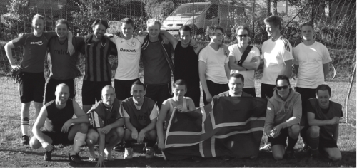

Title: Tár, bros og takkaskór
Slug: tar-bros-og-takkaskor
Date: 2006-12-19 11:00:00
UID: 120
Lang: is
Author: Íris Ellenberger
Author URL: 
Category: Viðtöl, Íþróttir
Tags: 

„Í rauninni byrjaði þetta allt með því að Hafsteinn Þórólfsson átti heima í London og spilaði fótbolta með Leftfooters FC sem er „hommaboltalið“. Honum fannst það mjög gaman svo þegar hann kom heim í sumar hóaði hann saman vinum til að spila fótbolta. Fyrsti „boltinn“ var spilaður sunnudaginn 11. júní kl. 14 á Miklatúni. Sjö manns mættu, sjö hommar. Smám saman fréttust æfingarnar út um borg og bý og fleiri mættu á næstu æfingar“ segir Hannes Páll Pálsson, listrænn stjórnandi Strákafélagsins Styrmis, eða St. Styrmis, eina íþróttafélagsins á landinu sem er eingöngu skipað samkynhneigðum karlmönnum.

### Ungir hommar með hlutverk

„Hafsteinn byrjaði í Leftfooters FC af því að þar skipti ekki máli hversu góður maður var heldur nægði að spila fótbolta og hafa gaman af því. Hugmyndafræði St. Styrmis er komin þaðan.“ Knattspyrna er kjölfestan í starfsemi félagsins þótt það bjóði einnig upp á spinning, þolfimi, dans og stefni á tennisæfingar eftir áramót. En forsvarsmenn St. Styrmis líta ekki aðeins á félagið sem vettvang fyrir íþróttaiðkun og skemmtun. Íþróttafélagið starfar undir einkennisorðunum „Fyrirmyndir ekki staðalmyndir“ og því er ætlað ákveðið samfélags- og fræðsluhlutverk. 

Hannes segir félagið hafa markað sér samfélags- og fræðslustefnu vegna þess að mikil þörf væri á slíkri þjónustu: „Síðasta haust færðum við æfingar innanhúss því það var orðinn svo mikill áhugi á að taka þátt. Við litum í kringum okkur og sáum marga unga stráka sem voru ekki enn komnir út úr skápnum. Við byrjuðum að fá tölvupósta frá strákum sem sögðust vera þakklátir fyrir þetta starf því þeir höfðu hrökklast úr íþróttum vegna fordóma. Aðrir höfðu ekki þorað að taka þátt í íþróttum. Þeir þjáðust af lágu sjálfsmati því þeir voru ekki komnir út úr skápnum og voru hræddir við fordóma meðspilara sinna. Þá vaknaði samfélagsábyrgðin og við ákváðum að gera þetta óformlega íþróttafélag að formlegum félagasamtökum.“

„Við byrjuðum að ræða um reynslu okkar af íþróttastarfi og sáum að við höfðum flestir hrökklast úr íþróttum. Ég hætti í körfubolta því mér hafði aldrei liðið vel þar og sömu sögu var að segja af fleirum. Við ákváðum því að móta ákveðna samfélagsstefnu. Við erum að útbúa kynningarefni um félagið sem við ætlum að dreifa í framhaldsskólum. Það er í rauninni forvarnar- og samfélagsábyrgð okkar að vera sýnilegir. Við teljum að bara með því að kynna starfið séum við að brjóta ákveðna fordóma á bak aftur. Í framhaldi af útgáfu bæklingsins ætlum við að bjóða upp á fyrirlestra í þeim skólum sem það vilja.“

### Andstæðuparið hommar og íþróttir

Hannes segir að hommar og íþróttir séu enn andstæður í hugum margra. Því sé sannarlega þörf fyrir íþróttafélag samkynhneigðra karlmanna þótt mikið hafi sannarlega áunnist í réttindabaráttu samkynhneigðra á síðustu árum: „Ég held að staðalmyndin sé mjög rík að samkynhneigðir menn taki ekki þátt í íþróttastarfi. En þeir eru náttúrlega alls staðar. Við búum bara ekki í samfélagi þar sem þeir geta auðveldlega komið út úr skápnum sem íþróttamenn og hommar.“

Það kemur líka í ljós að St. Styrmir hefur fengið nokkra athygli fyrir það eitt að vera „hommaboltafélag“. Fréttablaðið, Blaðið og Morgunblaðið hafa öll birt viðtal við Hafstein Þórólfsson þar sem hann hefur sagt frá starfsemi félagsins. Einnig birtist hlekkur yfir á heimasíðu félagsins á vefsíðunni b2.is, undir fyrirsögninni „Hýrasta fótboltafélag landsins“. Sá hlekkur lenti í flokknum „spes“. Hannes segir að félagið veki athygli og furðu fólks: „Fólki virðist þykja það sérstakt að það sé til fótboltafélag sem er eingöngu skipað hommum. Það er líklega vegna þess að þetta hefur aldrei verið gert áður á Íslandi. Eini heimsþekkti fótboltamaðurinn sem hefur komið út úr skápnum framdi sjálfsmorð fyrir nokkrum árum.“ Þar á Hannes við Justin Fashanu sem lék með ýmsum félagsliðum í Englandi á 9. áratug síðustu aldar. „Hann lenti í miklu mótlæti eftir að hann kom út úr skápnum og hrökklaðist úr fótboltanum. Hommar og fótbolti virðast ekki fara saman í hugum fólks. Það er t.d. enginn í deildinni hérna heima sem hefur komið út úr skápnum og það sama gildir um karlmenn í flestum íþróttum. Íþróttir eru að vissu leyti síðasta vígið.“

St. Styrmir vinnur að því að eyða slíkum fordómum en Hannes segir félagið ekki síst stuðla að bættum samskiptum innan samfélags samkynhneigðra: „Innan hommasamfélagsins er viðurkennt samskiptaleysi á milli ákveðinna hópa. Ég hef stundum sagt við vin minn í félaginu „ætli ég hefði nokkurn tíman talað við þig ef ég hefði haft ekki þennan grundvöll?“ Aldursmunurinn er mikill á milli leikmanna en þegar við höfum kynnst skiptir það engu máli, hvorki inni á vellinum né utan hans. Um leið og þú ert kominn inn í liðið ertu kominn með mjög gott stuðningsnet. Þeir sem yngri eru læra eitthvað af okkur sem erum eldri og við ekki síður af þeim því þeir eru að upplifa allt aðrar aðstæður en þær sem voru fyrir hendi fyrir jafnvel bara tíu árum.“

### Íþróttafélag með metnað

Þrátt fyrir að félagsstarf, forvarnir og samfélagsþjónusta séu ofarlega á baugi í St. Styrmi þá segir Hannes liðsmenn hafa mikinn metnað þegar kemur að því að keppa á mótum og vinna til verðlauna: „Við tókum þátt í Norðurlandamóti „hommaboltafélaga“ í Danmörku, reyndar var eitt liðið blandað bæði hommum og lesbíum. St. Styrmir snýst um miklu meira en að hittast og sparka í tuðru. Við mætum á tækniæfingar einu sinni í viku. Í framhaldi af því erum við að fara að keppa í Evrópumeistaramóti samkynhneigðra karlaliða í London í apríl 2007 og síðan á heimsmeistaramótinu í Buenos Aires í september. Það hefur sýnt sig að liðið hristist mjög vel saman í svona ferðum og sá kjarni sem fór til Danmerkur mætir enn á allar æfingar.“

„Við hittumst alltaf tvisvar í viku og þá leggjum við áherslu á að spila skemmtilegan bolta. Við leggjum reyndar áherslu á að spila í hvetjandi umhverfi og forðumst það að skamma fólk, það hefur leitt til ótrúlega mikilla framfara allra þeirra sem reglulega mæta á æfingar. Þótt við reynum að höfða sérstaklegra til samkynhneigðra karlmanna þá er engum meinaður aðgangur. Vinir og ættingjar leikmannanna mæta. Því eru nokkrir gagnkynhneigðir karlmenn að æfa með okkur og svo hafa stelpur líka mætt á æfingar.“ 

„Það er vinaleg stemning utan fótboltavallarins en um leið og við erum komnir inn á völlinn þá snýst þetta um að vinna og þetta getur alveg orðið harkalegur bolti eins og við sjáum annars staðar. Reyndar sparkaði ég óvart í eina stelpuna í blandaða liðinu þegar við voru að leika á Norðurlandamótinu. Ég fékk mikið samviskubit og hljóp til hennar til að biðjast afsökunar. Það var haft sérstaklega á orði við mig að þetta væri nú ekki viðtekin venja inni á vellinum. Þeir okkar sem höfðu spilað með öðrum liðum höfðu aldrei heyrt menn biðjast afsökunar á vellinum áður.“

<small>Frekari upplýsingar um St. Styrmi er að finna á heimasíðu félagsins, [www.ststyrmir.is](http://www.ststyrmir.is)</small>

