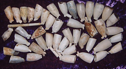

Title: Það er algjör vitleysa að reykja.
Subtitle: Túlkun krítarpípa frá Skálholti.
Slug: thad-er-algjoer-vitleysa-ad-reykja
Date: 2008-01-17 13:22:00
UID: 206
Lang: is
Author: Ágústa Edwald
Author URL: 
Category: Fornleifafræði
Tags: 

Við uppgröft svefnstofu skólapilta í Skálholti fannst 571 krítarpípubrot í jarðlögum sem hafa verið gróflega aldursgreind frá miðri 17. öld til síðari hluta 18. aldar. Hvað segja þessar pípur okkur um strákana í Skálholti, um skólann og um íslenskt samfélag á þessum tíma? Það er ljóst að strákarnir reyktu talsvert mikið. Einnig hefur fundist talsvert af eldtinnu í svefnstofunni svo það er líklegt að þeir hafi ekki einungis geymt pípurnar inni í herberginu heldur reykt þær þar.

> Archaeologistst struggle constantly with the familiar problematics of inference because what we observe in the record does not register directly what we wish to know about the past.[^1]

_Strákunum fannst gott að reykja eftir langan skóladag?_ Reykingar hafa verið ávananbindandi þá líkt og nú. _Það þótti töff að reykja og sérstaklega úr pípu með hælstimpli af stríðsmanni?_

Pípurnar voru ekki allar eins. Hælar sumra þeirra eru stimplaðir með mismunandi myndum, en einnig fannst einn glerjaður pípuhaus í svefnstofunni. _Pípurnar mátti framselja til fátækari nemenda, kannski fyrir auka teppi eða vinskap?_ Í reglugerðum um skólann í Skálholti er það ítrekað að eldri nemendur megi ekki selja eða pranga hlutum inn á yngri nema. Allir skuli skrá eigur sínar hjá rektor í upphafi skólaárs og fara með sitt heim að vori. _Með því að reykja inni í svefnstofunni undirstrikuðu skólapiltar vald sitt yfir herberginu, sem var það eina sem þeir höfðu út af fyrir sig af öllum herbergjunum og byggingunum á svæðinu — það gat enginn bannað þeim það?_ Skólapiltum var bannað að fara inn í aðrar byggingar á svæðinu nema með sérlegu leyfi. _Geta pípurnar kannski sagt okkur eitthvað um íslenskan efnahag?_ Pípur eru hvergi á lista yfir innfluttar vörur á þessu tímbili, og þó sjálfsagt megi gera ráð fyrir að þær falli í flokkinn “annað” þá er freistandi að ímynda sér að að minnsta kosti hluti pípanna, sem eru langflestar hollenskar, hafi verið keyptur ólöglega beint af hollenskum sjómönnum sem stunduðu í auknum mæli veiðar við landið eftir miðja 16. öld og fram á miðja 17.

Að sjálfsögðu er fáránlegt að ætla sér að velja einn af þessum þáttum enda engin ástæða fyrir því að þeir hafi ekki allir verið gildir í senn, eða hvað?

Breski fornleifafræðingurinn Hodder hefur skilgreint þrjú mismunandi túlkunarsamhengi hluta: 

> …various types of meaning can be sought, varying from the systematic processes of social and economic relations, to the structured contents of symbolic codes, to the conjuncture of these two, as mediated by the embodied experiences and strategic intentions, in the context of everyday life.[^2]

Hodder og Hunter tala um þrjú mismunandi samhengi, þ.e. félagslegt og efnahagslegt samhengi hluta, táknfræðilegt samhengi þeirra og svo hversdagslegt samhengi þar sem hin tvö fyrri koma saman. Samkvæmt þeim verður árangursrík túlkun til þegar hlutirnir eru skoðaðir í sínu rétta samhengi.

> When addressing social phenomena it is often a good choice to start at a microlevel … the initiation and constitution of social practice is complex: sometimes it is intentional, sometimes it is carried out by routine or simply subconsciously performed. Moreover, the effect of an act is always to some extent unpredictable: it may be successful, but it may just as likely fail. Social action is also frequently misunderstood by others, or may have unintended consequences far beyond the realm of the agents involved.[^3]

Samkvæmt þeim félögum Fahlander og Cornell er öruggast að byrja á að túlka hlutina í micro-skala og leggja svo út frá því. Í tilraun til að byggja kennilegt módel þar sem hægt er að ferðast frá því sértæka til hins almenna kynna þeir til sögunnar myndlíkingu þráða, bands og reipis — Reipið verður til úr mismunandi böndum sem er ofið úr þráðum sem eru grundvöllur reipisins — minnsta ‘samhengi’ reipisins.

Skilgreining mismunandi samhengja og/eða skala viðheldur þeirri hugmynd að það sé greinarmunur á hinu sértæka og hinu almenna, á efnahags- og félagslegu samhengi, táknfræðilegu samhengi og hinu hversdagslega samhengi. Slíkur munur gerir túlkun flókna þar sem fræðimaðurinn þarf að ferðast á milli mismunandi samhengja og skala og brúa bil þar á milli. Hann/hún þarf að mynda þræði, þá bönd og loks reipi. Í tilraun til að greiða götu fræðimannsins hafa verið grafnar hugmyndafræðilegar gjár sem ef betur er að gáð má jafnvel ganga fram hjá með öllu án hjálpar-reipis.

Þegar leitast er við að túlka grip til að varpa ljósi á byggingu, stofnun eða samfélag er villandi að reyna að sjá fyrir sér tengingar á milli smá-skala og stórs, á milli efnahagslegs og táknfræðilegs samhengis. Þegar krítarpípurnar sem fundust í svefnskála skólapilta í Skálholti eru skoðaðar er ekki verið að skoða Skálholtsskóla í smá-skala heldur hann allan. Stofnunin er samband (e. collective), fólks, gripa og bygginga, og verður einungis til þegar þessir hlutir spila saman. Krítarpípurnar eru ekki birtingarmynd undirliggjandi reglna og venja heldur eru þær raunverulega þær reglur og venjur. Hér er ekki um að ræða tákn og merkingu heldur samspil þátta. Þetta samspil er efnismenning (e. materiality) stofnunarinnar og rétt eins og heimurinn er ekki til áður en búið er í honum er stofnunin ekki til án efnismenningar sinnar.

Það er engin þörf fyrir hina fornleifafræðilegu ályktun (e. the archaeological inference). Fornleifafræði er ályktun í sjálfu sér sem lítur dagsins ljós við uppgröft. Það er engin falin merking í gripum eða byggingum. Þegar fræðimaðurinn hefur skilið að einungis eitt samhengi er til staðar og að mismunandi skalar tilvísanna eru allir til staðar í senn verður ekki lengur þörf á að byggja brýr eða vefja reipi.

----

#### Heimildir

* Cornell, Per og Fredrik Fahlander. 2002. Microarchaeology, Materiality and Social Practice. Current Swedish Archaeology 10, 21-38.
* Hodder, Ian og Scott Hutson. 2003. Reading the Past, Current Approaches to Interpretation in Archaeology (3rd ed.). Cambridge: Cambridge University Press.
* Shott, Michael J. 1998. Status and Role of Formation Theory in Contemporary Archaeology and Practice. Journal of Archaeological Research 6 (4), 299-329.]

[^1]: Shott 1998, 199
[^2]: Hodder and Hutson 2003, 203
[^3]: Fahlander og Cornell, 2002, 29

