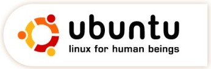

Title: Þar sem hugsjónir eiga heimili
Slug: thar-sem-hugsjonirnar-eiga-heimili
Date: 2006-03-07 09:00:00
UID: 52
Lang: is
Author: Karl Jóhann Jóhannsson
Author URL: 
Category: Samfélag, Neyslusamfélagið
Tags: 

Sama hver heimspekileg afstaða fólks til slíkra hluta er þá er erfitt að deila um að peningar stuðli að hraðari þróun í vísindum en nokkurn tíman myndi verða fyrir tilstilli forvitni og hugsjónar eingöngu.  Fólk þarf peninga til að lifa sómasamlegu lífi, sérstaklega í nútímasamfélagi, og hæfir menn kosta mikla peninga.  Þessi dýri starfskraftur þarf svo ódýrari starfskraft til að gera erfiðisvinnuna fyrir sig til að þeir geti einbeitt sér að mikilvægari atriðum.  En svo eru auðvitað líka þeir sem kosta ekki neitt.

Eins og skilja má er fólk misjafnt í því hversu hátt það metur veraldleg verðmæti, sumir meta þau hæst öllu, á meðan aðrir telja sig nógu vel setta til að hafa efni á að fylgja eftir áhugamálum sínum.

Forvitni, sem má kalla þorsta í fróðleik og þekkingu, er mjög drífandi eiginleiki, án hans byggju menn eflaust í hellum, án símalína.  Þessi eiginleiki meðfram lönguninni til að skapa og að nýta þekkingu til þess að búa eitthvað spennandi til er grundvöllur í þróun samfélagsins.  Til að gera mönnum þekkingaröflun auðveldari og sömuleiðis tækifæri á að koma sköpun sinni á framfæri er hið margrómaða og yndislega internet.  

Internetið hefur minnkað heiminn það mikið að allir geta fundið sér fólk sem hefur sama áhuga og það sjálft fremur auðveldlega.  Þegar áhugamálin eru mannskemmandi og/eða ógeðsleg þá er þetta reyndar ekki mikill kostur fyrir mannkynið, en í flestum tilfellum er það svo sannarlega svo.  

Það sem hér er rætt um eru möguleikarnir sem hafa aukist með áframhaldandi notkun alþjóðlegs samskiptakerfis til að safna gögnum, upplýsingar um allt á milli himins og jarðar, og hvaða áhrif þessir "gagnagrunnar" hafa á þróun samfélags og menningar.

Staðreyndin er sú að hið vel setta fólk sem minnst var á hér að ofan, hefur sameinast til að breyta heiminum, eða eitthvað í þá áttina.  Frítími þúsunda manna hvaðan af í heiminum er eytt í að þróa hina ýmsu hluti, hvort sem það eru forrit sem vafra um vefsíður eða stýra tölvukerfinu þínu, alfræðiorðasíður eins og [Wikipedia](http://wikipedia.org/) eða jafnvel uppskriftir, til dæmis af gosi, bjór, smákökum eða jafnvel lyfjum.

Þetta fólk fær ekki borgað fyrir iðju sína í peningum og hverjar sem ástæðurnar fyrir vinnunni eru þá veitir þetta upplýsingaflæði möguleika á að gjörbreyta heiminum, og byltingin er að mörgu leyti hafin.  Hvað varðar hugbúnað þá er opinn hugbúnaður orðinn svo stór hluti af markaðinum að jafnvel ríkustu menn í heiminum eru farnir að hafa áhyggjur af stöðu sinni.   Nægir þar að nefna [FireFox](http://www.mozilla.com/) vafrann sem er orðinn svo vinsæll að meira að segja ömmur út í bæ eru farnar að nota hann og [OpenOffice](http://www.openoffice.org/) skrifstofuforritin sem eru orðin vægast sagt það góð og samkeppnishæf að það getur varla talist skynsamlegt að borga fyrir nokkuð annað.

Sumir vilja þó heldur borga, þau treysta betur hlutum sem þau borga fyrir og oftar en ekki fylgir einhver áþreifanleg ábyrgð því sem þau eru að kaupa, hvort sem hún dugir eða ekki.  En það undarlega er hversu fáir eru búnir að átta sig á því að oft er ókeypis hugbúnaður stöðugri og einfaldlega betri en sá sem kostar mikla peninga. Þetta er að sjálfsögðu ekki algilt en staðreyndin er sú að flestir gætu komist upp með að borga aldrei fyrir hugbúnað og samt verið vel settir í þeim málum.

Það er kannski ekki slæmt að fólk þurfi að borga fyrir hugbúnaðinn sinn, það er nóg af pening til og ekki veitir af því að styrkja litlu tölvufyrirtækin svo að þau verði nógu stór fyrir stærri fyrirtæki að hafa áhuga á að kaupa þau.  

Reynslan hefur sýnt að í sumum tilfellum er jafnvel hagkvæmara fyrir framleiðendur minni forrita að hafa þau ókeypis og fá pening frá gjafmildum notendum, oft fylgja meira að segja leiðbeiningar með forritunum um hvernig megi gefa pening til þess að halda verkefninu gangandi.  Í þeim tilfellum eru allir væntanlega ánægðir og sá kostur er einnig fyrir framleiðandann að hann þarf ekki að hafa fyrir því að reyna að selja forritið.  Að sjálfsögðu er fallegri hugsjón að gefa frá sér forritið og leyfa öðrum að njóta góðs af, jafnvel leyfa öðrum að læra af því og þróa það ef þeir vilja, en sitt sýnist hverjum.

Stórfyrirtæki hafa efni á því að ráða til sín fjöldan allan af fólki til þess að búa eitthvað til fyrir sig og eru sum þeirra jafnvel byggð á open source lögmálunum, að þekking sé almenningseign.  Önnur hafa aðrar áherslur en það þýðir ekki að þau séu slæm, enda væru þau varla þar sem þau eru ef þau væru ekki að gera eitthvað rétt.

Fyrirtæki eins og [Google](http://www.google.com/) vinna hart að því að þróa hin ýmsu nytsamlegu forrit, til þess eins að fólk geti notið þeirra.  Umrætt fyrirtæki er ef til vill ekki með öllu góðviljað, en við látum það liggja á milli hluta og njótum góðs af með bros á vör.

Þegar hundruðir miljónir manna, hver við sína tölvu, koma saman í gegnum internetið þá hefur það sýnt sig að þróun getur átt sér stað án teljandi fjármagns.  Fyrir stórfyrirtæki í tölvuiðnaðinum þá þýðir þetta að endurskoða þurfi stöðuna all verulega.  Breyttir tímar kalla á breytt viðhorf og fáir vettvangar breytast jafn hratt og tölvuiðnaðurinn.

Þegar fólk hugsar um opinn hugbúnað dettur því oft í hug Linux stýrikerfið, sem hefur nú verið í stöðugri þróun í um 14 ár og með einni vinsælustu dreifingunni í dag, [Ubuntu](http://www.ubuntu.com/), er komið stýrikerfi sem lítur vel út, er auðvelt í notkun og kostar ekki krónu.  Ef þú ert ekki með internettengingu þá getur þú meira að segja fengið stýrikerfið sent heim til þín í formi geisladisks og þú þarft ekki einu sinni að borga sendingarkostnaðinn, svo mikil er hugulsemin.

Opinn hugbúnaður er í sífelldri aukningu, bæði í magni og gæðum og framtíðin virðist mjög björt fyrir hann.  Að sjálfssögðu eru einhverjar vafasamar hliðar á öllu þessu, upplýsingarnar eru misjafnlega áreiðanlegar, stórfyrirtæki hafa hugbúnað opinn til þess að spara sér peninga í þróun hans og eflaust mætti lengi telja.  Það eru þó óþarfa áhyggjur, áhuginn virðist vera óþreytandi og á meðan við höfum ekkert meira áríðandi að gera þá munum við eyða góðum hluta af okkar frítíma í að gera heiminn að betri stað.

Það er allavega engin spurning um að það séu spennandi tímar í tölvuheiminum í dag, sérstaklega ef þú ert svo heppinn að vera hugsjónamaður.

