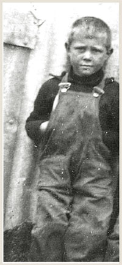

Title: „Þegar á unga aldri lifi ég enn og leik mér aldrei” 
Slug: thegar-a-unga-aldri-lifi-eg-enn-og-leik-mer-aldrei
Date: 2008-03-04 13:03:00
UID: 225
Lang: is
Author: Ragnheiður Gló Gylfadóttir
Author URL: 
Category: Fornleifafræði
Tags: 

Titill þessarar greinar eru tvær línur varðveittar úr íslenskri lausavísu en þær gefa ef til vill ákveðna innsýn á líf barna. Hver sú sýn er fer eflaust eftir lesendanum hverju sinni en ætla má að börn hafi verið hluti af íslenskum veruleika í gegnum tíðina og að þau hafi með tilvist sinni sett mark sitt á fortíðina. Ef athuganir fornleifafræðinga á börnum eru skoðaðar er hins vegar ekki um auðugan garð að gresja, því fáar rannsóknir hafa verið gerðar á lífi þeirra eða tilvist hérlendis. Hugmyndir um börn nútímans virðast oft vera yfirfærðar á hugmyndir um börn í fortíðinni, án þess að rannsóknir liggi þar að baki. Svo virðist einnig sem að gert sé ráð fyrir að öll börn hafi hegðað sér eins og að bernskan hafi verið tími leikja og áhyggjuleysis. Innan fornleifafræðinnar hefur þó á síðustu árum komið fram undirgrein, barnafornleifafræði, sem líkt og nafnið gefur til kynna fjallar um börn, bernsku og málefni tengd þeim. Tilkoma hennar hefur orðið til þess að hugmyndin um barnið sem óvirka og staðlaða  breytu sem hægt er að yfirfæra á samfélög, bæði í nútíð og fortíð, er óðum að leysast upp.[^2] 

Innan fræðigreina, s.s. sagn- og mannfræði, hafa börn verið rannsökuð lengur en innan fornleifafræði. Hugmyndin um hið menningarlega barn er gjarnan rakin til Philippe Ariés[^3]  sem fyrstur fræðimanna setti fram heildstæðar kenningar um börn árið 1960 og höfðu þær víðtæk áhrif á rannsóknir innan margra fræðigreina. Hann taldi m.a. að á miðöldum hefði hugmyndin um bernsku ekki verið til og að líta bæri á börn sem smávaxna fullorðna. Þó að kenningar Ariés hafi enn áhrif á fræðilega umræðu innan margra fræðigreina hefur þeim að sama skapi verið harðlega mótmælt. Samfara þeirri byltingu sem orðið hefur síðustu áratugi innan sál-, mann- og félagsfræði hvað varðar hugmyndir um líf barna er nú litið á börn sem virka gerendur (e. _agents_) innan hvers þess samfélags sem þau tilheyra.

Fornleifarannsóknir frá því fyrir 1980 innihalda yfirleitt fáar tilvísanir í börn og lítill áhugi virðist á þeim tíma vera á kenningum eða aðferðum til þess að gera þau sýnilegri. Hvorki gripir né líkamsleifar þeirra voru sérstaklega notaðar til þess að draga ályktanir um líf barnanna sjálfra, skoða stöðu þeirra, hlutverk eða þátttöku í samfélögum, svo dæmi séu tekin. Eitt fyrsta hlutverkið sem börnum var gefið í fornleifafræðilegum rannsóknum var að skýra tilvist óútskýranlegra hluta, eins og minni útgáfur af hlutum, t.d. ílát eða gripi sem hugsanlega gætu verið leikföng. Viðhorfið til barna einkenndist af þeirri hugmynd að fyrst þau væru lítil þá hlytu þau að tengjast hinu smáa í fornleifunum og leika sér með litla hluti. Litið var svo á að þau hefðu hugmyndaflug til þess að gera leikföng úr spýtum, steinum og hversdagslegum heimilisáhöldum sem oft verða ósýnileg og illgreinanleg í gripasöfnum og við úrvinnslu gagna.[^4]  Sem dæmi má nefna um þetta, að í Hvítárholti fundust árið 1964 ellefu smásteinar við veggjarbrún í suðvesturenda byggingar sem talin var skáli. Þessir steinar voru túlkaðir sem hugsanleg vísbending þess að börn hafi tileinkað sér ákveðin svæði til leiks. Tekið er fram að fleiri slíkir steinar hafi fundist víðar um uppgraftarsvæðið, einkum við útveggi.[^5] 

Rætur barnafornleifafræði eru gjarnan raktar til annarrar kynslóðar femínisma. Með femínískri fornleifafræði fór fljótlega að bera á vaxandi áhuga á því að þróa undirgrein þar sem áherslan yrði á börn og bernsku. Ástæður þessa má m.a. rekja til andófs gegn ríkjandi viðhorfa vestrænna samfélaga um börn sem óvirka þegna, á jaðrinum menningarlega séð og auk þess ónothæf til rannsókna á efnahagslegri framleiðslu. Jafnframt var talið sjálfsagt að viðhorf til barna og bernskunnar í fortíðinni hafi verið það sama og í dag. Með áhrifum femínismans á fornleifafræðina var hins vegar fyrst farið að skoða hvernig bernskan getur verið menningarlega mótuð og sögulega afmörkuð. Eins var farið að líta á hugtakið barn sem félagslega breytu, fremur en líffræðilega eins og áður var gert. Börn voru áður fyrr eingöngu flokkuð eftir þroskastigum og þau sett í ákveðna aldurshópa eftir greiningu lífaldurs, líkt og gert var um kyn og aldur fullorðinna. Í dag hefur hins vegar verið bent á að líffræðilegar mælingar á þroska beina geti í raun verið villandi þegar kemur að félags- og andlegum þroska, eins og bent hefur verið á almennt innan kyngervis og aldursrannsókna.[^6] 

Fyrstu rannsóknirnar innan barnafornleifafræði beindust einkum að sýnileika nýfæddra barna og ungabarna í fornleifafræðilegu samhengi og að því að draga þvermenningarlegar ályktanir um tengsl barna og efnismenningar.[^7]  Einkennandi fyrir nýlegar rannsóknir innan barnafornleifafræði er jafnframt umræðan um líffræðilega eða félagslega skilgreiningu á börnum og bernsku. Litið er á börn sem virka gerendum (e. _agents_) innan allra samfélaga í jafnt nútíð sem fortíð og að mikilvægi þeirra fyrir virkni samfélagsins sé ekki minna en annarra þegna þess. Þau gögn sem helst eru notuð til rannsókna á atbeini (e. _agency_) þeirra eru engu að síður þau sömu og fyrr, s.s. líkamsleifar, grafir og greftrunarsiðir, leikir og leikföng, myndir af börnum við ýmsar athafnir og gripir framleiddir af börnum eða handa börnum. Breytingar felast nefnilega einkum í nýjum áherslum og aðferðum við að nálgast þessi gögn. Því er samt ekki að neita að efnismenning barna og þær minjar sem þau skilja eftir sig geta verið torræðar og erfitt að túlka þær eða losa frá efnismenningu fullorðinna fyrir utan beinagrindur og grafir þeirra. 

Barnafornleifafræði hefur m.a. stuðlað að því að börn eru komin fram í dagsljósið sem virkir gerendur (e. _agents_) samfélagsins, með jafnt efnahags- og samfélagsleg hlutverk. Tilkoma barnafornleifafræði hefur einnig haft þau áhrif að kröfur hafa verið lagðar fram um endurskoðun á notkun ríkjandi aldursflokkunar og að félagslegir þættir verði þá notaðir við lífaldursgreiningar samhliða líffræðilegum greiningum. Rannsóknir hafa t.d. sýnt að líkamlegur þroski stúlkna og drengja er mismunandi, auk þess sem hugmyndir um kyn og aldur hljóta alltaf að vera mismundandi í ólíku umhverfi en þess vegna geta þessar breytur ekki verið staðlaðar. Í þessu felst jafnframt fráhvarf frá vestrænum hugmyndum um aldur og kyn, því ríkjandi viðmið slíkra flokkana byggja einkum á þeim. Þetta er hins vegar ekki nóg, það þarf í auknum mæli að leita að börnunum sjálfum innan gagna fornleifafræðinnar og láta þau segja söguna. Þessari þróun hefur gjarnan verið líkt við barn sem er að taka fyrstu skrefin og er það mjög viðeigandi myndlíking. Til áframhaldandi vaxtar er einnig nauðsynlegt að skoða hvernig fornleifafræðingar öðlast gögnin sem félagslegar túlkanir byggja síðan á.[^8]  Fornleifafræðingurinn Frederik Fahlander telur að barnafornleifafæði eigi langt í land ennþá og að frekari skilgreiningar á því hvað er að vera barn í öðrum en líffræðilegum skilningi vanti:

> Still, the research on children in archaeology is hampered by the fact that the object of study is very diffuse and fluid. It has proven difficult to establish a general threshold when a child is turning adult in a social sence.[^9]

Kollegi hans, Catherine Kamp[^10]  telur að ríkjandi orðræða innan barnafornleifafræði eigi án efa eftir að þróast og rannsóknirnar fylgi þá með. Í fyrsta lagi telur hún að aldursflokkar munu, líkt og kynjaflokkar, í síauknum mæli verða álitnir félagslega skapaðir fremur en líffræðilegur raunveruleiki. Í öðru lagi muni lífaldur væntanlega verða talinn mikilvægur grunnur í félagslegum kerfum og honum ekki sleppt í greiningum á samfélögum fortíðar. Í þriðja lagi telur hún að litið verði svo á að börn jafnt og fullorðnir hafi gegnt mikilvægum félags- og efnahagslegum hlutverkum innan sinna samfélaga en slíkar hugmyndir virðast hafa gleymst í samtímanum. Í fjórða lagi er Kamp bjartsýn á að mögulegt verði að nálgast líf barna og hlutverk þeirra innan samfélaga fortíðar með notkun fornleifafræðilegra gagna, það þurfi einungis að bera kennsl á þau. Forspá þessi er nú þegar byrjuð að rætast því byrjað er að gagnrýna þá aldursflokkaskiptingu sem er ríkjandi í dag innan lífshlaupsrannsókna og fornleifafræði almennt. Þannig er hægt að halda því fram að barnafornleifafræði sé ákveðið viðhorf sem felur í sér breytingu á hugsunarhætti og opnar augu rannsakenda fyrir börnum sem mikilvægum gerendum allra samfélaga í fortíð sem nútíð.

----

#### Heimildir

* Ariès, Philippe (1962). _Centuries of childhood. A social history of family life_. London: Jonathan Cape Ltd.
* Baxter, Jane Eva (2005). _The archaeology of childhood; children, gender and material culture_. Gender and archaeology series. Walnut Creek: Altamira Press.
* Derevenski, Joanna Soafer (2000). „Material culture shock: confronting expectations in the material culture of children.“ _Children and material culture_. Joanna Soefer Derevenski (ritstjóri). London: Routhledge, bls. 3-16. 
* Fahlander, Frederik (í prentun). „Subadult or subaltern? Children as serial categories.“ _ (Re)Thinking the little ancestor: New perspectives on the archaeology of infancy and childhood_. Mike Lally (ritstjóri).Oxford: Archaeopress, British  Archaeological Reports.
* Guðrún Hannesdóttir (2007). „Hver var að hlægja?“ _Börn og menning_. 1. tbl, 22. árg, bls. 4-7.
* Gilchrist, Roberta (2006). „Fornleifafræði og lífshlaup: Tími, aldur og kyngervi.“ Steinunn Kristjánsdóttir þýddi (frumútgáfa 2004). _Ólafía I_., 1. árg., 1. tbl., bls. 77-96.
* Kamp, Kathryn A. (2001). „Where have all the children gone?: The archaeology of childhood.“ _Journal of Archeological method and theory_. 8. árg., 1. tbl., bls. 1 - 34.
* Lewis, Mary E. (2007). _The bioarchaeology af children: perspectives from biological and forensic anthropology_. Cambridge: Cambridge University Press.
* Þór Magnússon (1973). „Sögualdarbyggð í Hvítárholti.“ _Árbók Hins íslenzka fornleifafélags 1972_. Kristján Eldjárn (ritstjóri). Reykjavík: Ísafoldarprentsmiðja, bls. 5-80. 

[^1]: Guðrún Hannesdóttir, 2007: 5.
[^2]: Fahlander, í prentun
[^3]: Philippe, Ariés, 1962: 33, 128, 144.
[^4]: Baxter, 2005: 8; Lewis, 2007: 9.
[^5]: Þór Magnússon, 1973: 21, 26.
[^6]: Derevenski, 2000: 8; Kamp, 2001: 2; Baxter, 2005: 8.
[^7]: Gilchrist, 2006: 87.
[^8]: Lewis, 2007: 1.
[^9]: Fahlander, í prentun.
[^10]: Kamp, 2001: 3.

