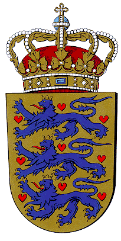
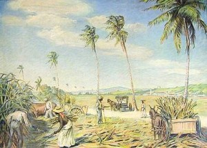

Title: Þegar Danir frelsuðu þrælana.
Slug: thegar-danir-frelsudu-thraelana
Date: 2007-10-11 13:11:00
UID: 187
Lang: is
Author: Anna Dröfn Ágústsdóttir
Author URL: 
Category: Sagnfræði
Tags: 

Frændþjóð Íslendinga og fyrrum hjálenduherra, Danmörk, getur flokkast sem eitt af nýlenduveldunum í Evrópu. Danir áttu nýlendur í Afríku, Indlandi, Karabíska hafinu að ógleymdu Grænlandi og eyjunum í Atlantshafi; Íslandi og Færeyjum. Jafnframt réðu Danir yfir Noregi og Slésvík-Holtsetalandi. Fáir eru samt til í dag sem vilja flokka Ísland sem eina af nýlendum Dana og var því notað orðið hjálenda (biland, dependancy) hér að ofan.

Réttindi íbúa í Danaveldi voru afar misjöfn og óhætt er að segja að hitabeltisnýlendurnar hafi fengið verstu útreiðina. Danir tóku þátt í þrælaflutningum yfir Atlantshafið frá 1660 til 1803 þegar þeir voru bannaðir. 

Þrælaflutningar Dana voru frá nýlendu þeirra á Gullströndinni í Afríku til  sykureyjanna þriggja í Karabíska hafinu. Í fyrstu áttu dönsk fyrirtæki nýlendurnar og réðu þar öllu. Verslunin var ekki alltaf arðvænleg þar sem siglingarnar voru mjög dýrar og áhættusamar. Mest áhersla var í byrjun á að flytja gull frá Gíneu en af því er nafn Gullstrandarinnar dregið. Áhersla á þrælaflutninga af Gullströndinni jókst þegar Danir þurftu þrælana sjálfir í vinnu í nýlendum sínum í Karabíska hafinu. 

Danir áttu þrjár sykureyjar sem þeir eignuðust frekar seint miðað við aðrar Evrópuþjóðir. Fyrstu eyjurnar, St. Thomas og St. John (St. Jan), eignuðust þeir árin 1672 og 1717, en þriðja eyjan var St. Croix sem þeir keyptu af Frökkum árið 1733. Árið 1755 tók  danska krúnan við öllum eyjunum og rekstri fyrirtækjanna. 

Á þeim tæplegu 150 árum sem þrælaflutningar stóðu yfir á vegum Dana er talið að um 75.000 þrælar hafi verið fluttir á dönskum skipum yfir Atlantshafið. Til gamans má geta að Íslendingar voru á þessum árum um 50.000. Danir fluttu samt aðeins brot af því sem stærri þjóðir í Evrópu gerðu. Danir státa sig oft af því að hafa verið fyrsta þjóðin til að taka það skref að banna þrælasölu, _slave trade_, en hafa ber í huga að þeir bönnuðu ekki þrælahald, _slavery_, fyrr en árið 1848 í kjölfar uppreisnar á St. Croix þegar Peter Von Scholten danskur yfirlandsstjóri í sykureyjunum gaf þrælunum frelsi.

### Horfið frá þrælaverslun

Peter von Scholten var yfirlandstjóri, _generalguvernor_,  í sykureyjunum á árunum 1827-1848. Hann var yfirmaður hersins, _kommandant_, á St. Thomas frá 1799 og var tekinn sem stríðsfangi Breta bæði árin 1801 og 1807. Árið 1804 var hann gerður að liðsforingja _løjtnant_, yfir öllu herliði Dana í Vestur-Indíum og  varð þar með einn aðalráðgjafi Friðriks 6. í landvörnum Dana. Von Scholten þótti standa sig vel í embætti og var vinsæll meðal eyjaskeggja. Hann var gerður að landstjóra á St. Thomas árið 1823 og fjórum árum seinna yfir öllum þremur eyjunum.

Fyrsta verkefni hans var að hvetja þrælana til að koma til sín með óleyst vandamál milli sín og eiganda sinna. Ef honum þóttu kvartanir þrælanna réttlátar var hann tilbúinn til að gefa út frímiða,  _friseddel_,  sem verndaði þrælinn gegn tilviljanakenndum refsingum eigandans. Ekki þorðu margir þrælar að koma til landstjórans til að vitna um óréttlæti en þetta er gott dæmi um góðvild Scholten gagnvart þrælunum.

Frjálsir svartir _Free colored_ voru helst sá hópur sem var líklegur til að ná fram umbótum en hann var um fimmtungur af íbúum eyjanna árið 1830. Þeir gerðu árangurslausa tilraun til að fá sama rétt fyrir lögum og hvítir árið 1816. Peter von Scholten var dygggur talsmaður þeirra, en hann var í sambúð með frjálsri svartri konu er hét _Anna Heegaard_. 

Peter endurskipulagði her þeirra frjálsu og gerði tvo liðsforingja þeirra að sínum persónulegu aðstoðarmönnum, _kolonialadjudanter_. Því næst fékk hann samþykki Friðriks 6. til að skipta frjálsum í tvo hópa þar sem annar fengi borgarabréf líkt og hvítir í eyjunum en hinn hópurinn fengi hið óvinsæla _fribrev_. Bréfið var óvinsælt því þeir þurftu að hafa það á sér öllum stundum sem vitnisburð um „frelsi” sitt. Þrælarnir áttu svo möguleika á að flytjast á milli hópanna. 

Hann reyndi einnig að minnka aðgreiningu hvítra og frjálsra svartra í eyjunum. Sífellt fleiri svartir voru gerðir að embættismönnum undir hans stjórn og var þeim og fjölskyldum þeirra ávallt boðið til skemmtanna með hvítum í landstjórabústaðinn. 

Árið 1830 fékk von Scholten leyfi frá danska kónginum til að vinna nýtt lagafrumvarp um þrælana, en í því vildi hann m.a. gefa þrælum tækifæri til  að kaupa sér frelsi. Sú hugmynd hans vakti ekki mikla lukku hjá dönsku verslunarstéttinni þar sem þrælarnir héldu uppi efnahag St. Croix og samdráttur þar var líklegur til að hafa mikil áhrif á stöðu mála í móðurlandinu.

Von Scholten var mjög meðvitaður um að það væri ekki spurning um hvort heldur hvenær þrælarnir fengju frelsi. Eftir að Englengdingar bönnuðu þrælaverslun árið 1807 og í kjölfarið þrælahald ýttu þeir mjög á aðrar þjóðir að gera slíkt hið sama. Mikill óróleiki var því í eyjunum í kring og uppreisnir urðu þar sífellt algengari. Honum fannst hann því knúinn til að gera ákveðnar umbætur og var menntun þrælanna eitt af því sem hann barðist fyrir. Hann benti á að í kjölfar frelsunar þræla í bresku nýlendunum myndi óánægja þræla í dönsku eyjunum aukast. Öllum væri fyrir bestu að kenna þrælunum rétt og góð gildi til að komast hjá uppreisnum og að þrælarnir nýttu þá frekar frelsi sitt á uppbyggilegan hátt fyrir eyjurnar. Forðast þyrfti hörmungar eins og á Haítí.

Samkvæmt _landskoleordningen_ frá árinu 1839 var skólaskylda hjá börnum þræla sett í reglugerð en samkvæmt henni áttu þau að ganga í skóla þrjá tíma á dag fyrstu fimm daga vikunnar en eldri börn sem voru orðin vinnufær (9-12 ára) fengu aðeins kennslu á laugardögum. Í skólunum var ákveðið að kenna ensku sem móðurmál og dó mál Kreólanna út í kjölfarið.

Plantekrueigendur í sykureyjunum voru lítt hrifnir af aðgerðum landstjórans en sú óánægja náði hámarki árið 1840 þegar Scholten kom til eyjanna frá Kaupmannahöfn og gerði opinberar hugmyndir Kristjáns 8. Danakonungs um að þrælarnir fengju einn frídag vikulega allt árið nema á haustin. Samkvæmt frumvarpinu áttu plantekrueigendur því að borga þrælunum laun ef þeir unnu á frídegi sínum frá 1. desember til 1. júlí. Með lögunum fannst plantekrueigendum þrælunum verið gefið frelsi á kostnað þeirra þar sem þeir fengu engar skaðabætur fyrir kostnaði sem breytingunum myndu fylgja.

Peter von Scholten varð því að snúa aftur til Kaupmannahafnar til að tilkynna konungi óánægju þegna hans í eyjunum. Niðurstaða málsins varð sú að laugardagar urðu opinberir frídagar sem hugsaðir voru fyrir ferðir á markaðinn. Sunnudaga átti svo að nýta til að mennta þrælana og styrkja hjá þeim kristna trú. Flestir voru sáttir við þetta fyrirkomulag þar sem það þótti ekki eins róttækt og fyrri hugmyndir og þrælarnir voru þakklátir fyrir aukafrídaginn.

Næst kynnti konungur hugmyndir sínar um hvernig afmá mætti þrælahald í litlum skrefum. Samkvæmt _yndlingsidé_ konungs myndu öll börn þræla fæðast frjáls hver sem staða móður væri. Á afmælisdegi konungs, 18.september árið 1847, kynnti Scholten þá hugmynd fyrir íbúum í eyjunni St. Croix. Hugmyndin þótti ekki góð og létu þrælarnir óánægju sína í ljós en þeir voru ekki sáttir við að börn þeirra yrðu frjáls en þau ávallt þrælar. Scholten hafði óttast þetta. 

Óróleiki meðal þrælanna magnaðist stig af stigi í kjölfarið og í byrjun júlí sumarið eftir kom til uppreisnar. Í vesturhluta eyjunnar St. Croix safnaðist saman stór hópur þræla sem fylkti liði í átt að Fredriksted. Hvítir í byggðinni flúðu inn í virki eða földu sig í skipum sem lágu við höfnina. Scholten landstjóri var strax látinn vita af ástandinu en hann var staddur á fundi í Christiansted. Þar fundaði hann með ráðgjöfum sínum um nóttina en fór um morguninn í vagni sínum til Fredriksted. Þegar hann kom þangað seinni part mánudagsins 3. júlí umkringdu hrópandi svertingjar vagn hans. Steig hann þá út og kallaði yfir mannfjöldann: _Now you are free, you are hereby emancipated!_.

Nýlendur Dana í Afríku og Karabíska hafinu græddu lítið á nýlenduherrum sínum og líklega hefðu íbúar þar verið betur settar undir stjórn Breta þar sem þeir bönnuðu þrælahald á undan Dönum og komu almennt betur fram við þræla sína í breskum eyjum í Vestur-Indíum. Danskir þrælar kynntust því þegar Bretar hertóku eyjarnir í stríðum árin 1801-3 og 1807-15. Í kjölfar yfirráða Breta í seinna skiptið gerðu frjálsir svartir uppreisn þar sem þeir fóru fram á það við dönsku stjórnina að halda ýmsum réttindum sem Bretar höfðu gefið þeim. Danir græddu gífurlega á þessum „hitabeltisnýlendum” sínum en afurðir frá þeim voru uppistaðan í þríhyrningsversluninni. 

Þótt Danir hafi aldrei orðið frægir fyrir siglingar sínar eða önnur stórvirki í nýlendum sínum, þá unnu þeir sér sæti meðal menningarþjóða og mikla virðingu meðal þeirra þegar þeir urðu fyrstir til að banna þrælasölu árið 1803.

Í dag lifa íbúar eyjanna þriggja sem Danir áttu í Karabíska hafinu að miklu leyti á ferðamönnum sem koma þangað með skemmtiferðaskipum til að skoða eyjarnar og íbúa þeirra. St. Croix er vinsælasti áfangastaðurinn hjá þeim sem stoppa lengur en einn dag, því þar er mest þjónusta fyrir ferðamenn. Í St. Thomas er hægt að kaupa áfengi, ilmvötn og ýmsan annan varning á fríhafnarverði en St. John er í dag þjóðgarður. Þar eru fagrir skógar sem þarf að vernda og því er fjöldi ferðamanna í eyjunni takmarkaður. Margir Íslendingar  hafa lagt leið sína á þessar slóðir til að skoða þessa paradís en eflaust hafa margir þeirra ekki haft hugmynd um sögu þessarar eyja og íbúa þeirra sem líkt og Íslendingar voru þegnar Dana. 

----

#### Heimildir

* _A historical guide to world slavery_. Seymor Drescher og Stanley L. Engerman ritstýrðu. New York. 1998.
* Bregnsbo, Michael & Kurt Villads Jensen: _Det Danske Imperium. Storhed og fald_. Kaupmh. 2004.
* Rezende, Elisabeth: „In their own voices: Concerns leading to the collective political awareness of the free colored in Christiansted, St.Croix former Danish West Indies, 1733-1816”. _The Oldenburg Monarchy. An Underestimated Empire?_. Kiel. 2006. Bls.221-235.
* Feldbæk, Ole & Ole Justesen: _Kolonierne I Asien og Afrika_. Danmarks Historie. Kaupmh. 1980.
* Hornby, Ove: _Kolonierne I Vestindien_. Danmarks Historie. Kaupmh. 1980. 

