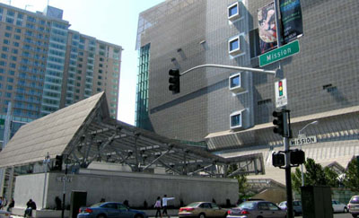
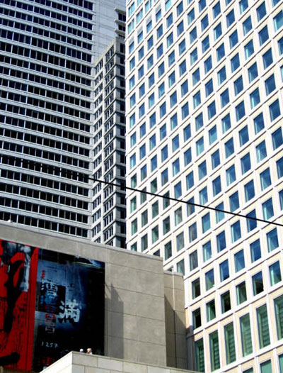
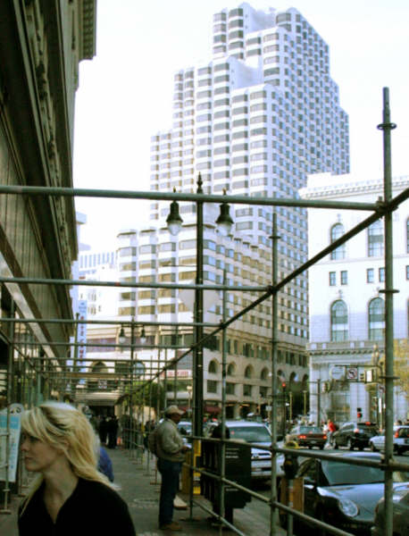

Title: Þetta eru hagsmunamál
Slug: thetta-eru-hagsmunamal
Date: 2007-11-01 13:05:00
UID: 191
Lang: is
Author: Bryndís Björgvinsdóttir
Author URL: 
Category: Menningarfræði, Póstur að utan
Tags: Berkeley, Bandaríkin, Þjóðfræði, hugvísindi, vald, Valdimar Tr. Hafstein, Loki, marxisti, norræn goðafræði, Ground Zero, 11. september, minnisvarði, Bourdieu, arkitekt, hagsmunamál, Háskóli Íslands, Eden, Texas, Frakkland, Freedom tower

Ég mun eyða mánu&shy;dögum og mið&shy;viku&shy;dögum vetrarins við háskólann í Berkeley, Banda&shy;ríkjunum. Ég er að læra þjóð&shy;fræði og sú grein hér í Berkeley er sam&shy;kvæmt rituðum heimildum „cutting edge“ eða framar&shy;lega á merinni. Á hvaða meri? Ég veit það ekki alveg, kannski hug&shy;vísinda&shy;merinni. Eða enn líklegri meri: Afbygging valds, vald/þekking, vald og nýlendur, valdamerin. Valdimar Tr. Hafstein heitir leið&shy;beinandinn minn heima. Þetta kemur allt á sama stað niður. Ég er heltekin af valdi. Allir kennararnir mínir líka, nema þessi sem kennir mér norræna goða&shy;fræði. Hann kallar mig marxista og segir að ég hafi ekki lært heima þegar ég, stóreygð og æst, held því fram að Æsir hafi búið saman í kommúnu. Loki var ein&shy;staklings&shy;hyggjan sem eyðilagði fyrir, nú bundinn og skekur jörðina alla.

Ég missti trúna á því um daginn, yfir miðjum hafragraut í hádeginu, að langanir mínar væru í raun mínar eigin, þær eru heldur sprottnar frá einhvers&shy;konar sam&shy;félags&shy;legu valdi. Sam&shy;félags&shy;legri kommúnu. Og eins og með allt annað í dag, þegar það er búið að semja svo mörg lög að allt hljómar kunnuglegt og þegar það er búið að skrifa svo mikið að nánast ekkert er ósagt, þá var þetta til ritað einhver&shy;staðar, hjá hinum og þessum heim&shy;spekingum. Þeir heilla mig hérna daglega upp úr skónum og þaðan ofan á lykla&shy;borðið þar sem ég ligg dæsandi, í kjallara&shy;kytru er sólin skín úti, og veit ekki hvar ég á að bera niður fingurna. Jú, ég á að vera að skrifa ritgerð fyrir skólann sem mig langaði í. Ritgerð um efni sem mig langaði að skrifa um. Númer eitt: Ritgerð um væntanlegan minnisvarða á Ground Zero í New York. Númer tvö: Ritgerð um menningarlega framleiðslu á kapítali.

Það er hola í jörðu Ground Zero og arki&shy;tekta&shy;stofa hér í Berkeley liggur sveitt yfir teikningum og pælingum um tillögur þess efnis hvað sé hægt að gera við holuna. Stjórn&shy;mála&shy;menn, aðstandendur hinna látnu, hönnuðir og lands&shy;lags&shy;arkitektar eru ekki sammála. Eitt er þó víst: Það á að hafa risa&shy;stóran vegg með nöfnum þeirra sem létust. Arkitektar komu með þá hugmynd að hafa rúllustiga ofan í holuna og veggurinn myndi vera á hægri hönd þeirra sem fara niður stigann. „Ööö, hvar eigum við að setja blómin sem við viljum leggja við nafn hina látnu?“ spyrja aðstandendurnir. „Oh! Blóm! Ætla þeir að koma með blóm!“ segja arkitektarnir og breyta teikningunum, teikningum af rými sem snertir svið trúar og hefða, viðskipta, stjórnmála, tísku, stjórnsýslu, vísinda, lista og fjölskyldu, sem sagt fullt af sviðum.

Fólk mun vera leitt ofan í holuna og upp úr henni aftur, „þetta er eins og að fara niður í helvíti!“ segir einn arkitektinn. Fólk mun fara í ferðalag. Og eins og með flest ferða&shy;lög þá er atbeini þeirra einhvers&shy;konar þroski og breyting. Sá sem snýr heim er ekki sá hinn sami og fór. Því býð ég spennt eftir því að fá að sjá hvað mun gerast í holunni, hvers&shy;konar fólk mun stíga upp úr henni aftur. Ég veit ekki alveg hver tilgangur minnis&shy;varða er, og þegar ég leyfi mér að velta vöngum, án þess að segja bara: „9/11 var hörmu&shy;legur atburður og þetta eru viðbrögð mín“, þá verða allar hug&shy;myndir mínar hálf takt&shy;lausar. En afgreiðum það: 9/11 var hörmu&shy;legur atburður. Og áfram skal halda: Hver er til&shy;gangur minnis&shy;varðarins? Ef langanir okkar eru félagslegar, þegar „við“ segjum að okkur langi í þennan minnis&shy;varða, þegar margir hafa svona mikinn áhuga á honum, þá má segja, og Bourdieu styður það, að sá áhugi sé í slagtogi með hagsmunum.[^1]  Arkitektarnir dæsa, stroka út og færa rúllu&shy;stigana til. Þeir vita allir að þetta er hagsmunamál.

Námið mitt í Berkeley er þrusugott og spennandi, en ég segi það satt, þjóð&shy;fræði&shy;deildin í HÍ er ekki síðri, bara minni, en kannski hags&shy;munanna vegna, menningar&shy;lega kapítalsins og allt það, þá langar manni aðeins meira að stúdera við Berkeley. „Sjáið tindinn! Þarna fór ég! Beint af augum, ýkt létt!“. Og námið er létt af því að það er skemmtilegt, og síðast en ekki síst því ég þurfti ekki að borga skóla&shy;gjöldin í landinu þar sem allt snýst um kapítal. Þar sem minnis&shy;varðinn á Ground Zero snýst um kapítal, félags&shy;legan og tákn&shy;rænan auð. Gröf óþekkta her&shy;mannsins, eða öllu heldur í þessu tilfelli: Gröf skrif&shy;stofu&shy;manna, sem urðu fórnar&shy;lömb hryðju&shy;verka&shy;manna, sem kallaði á, hinum megin við hafið, grafir óþekktra „hryðju&shy;verka&shy;manna“ sem urðu fórnar&shy;lömb skrif&shy;stofu&shy;manna.

Ég verð að muna: Ekki vanmeta skrif&shy;stofu&shy;menn. Eftir allt saman þá voru það þeir sem litu á vega&shy;bréfið mitt í sendi&shy;ráðinu heima, settu upp svip, sögðu mér að svara skýrar og skeleggar og gáfu mér, af gæsku sinni og mildi, leyfi til að búa í þessu landi þar sem allt sem ég hef áhuga á, þar sem flest öll blæbrigði af löngunum þrífast, þar sem kapítalið syngur í hverju fótmáli, grasserar eins og gróðurinn í Eden. Hér er af svo miklu að taka að hvern hug- og félags&shy;vísinda&shy;manni hlýtur að klæja, og ef skrif&shy;stofu&shy;menn segja mig vera Marxista og skamma mig fyrir að halda því fram að Æsirnir hafi búið í kommúnu, þá vona ég að þeir trúi því að óþol mitt við samtímann sé greiði við fram&shy;tíðina. Og þeir kaupi það, með öllu sínu kapítali.

Texas er stærra en Frakkland. Stærra að flatarmáli en kannski minna af menningarlegu auðmagni í vitund almennings. Bandaríkin eru þar af leiðandi margfalt stærri en Frakkland. Stærðir eru sem samt vinsælar hérna, eitthvað sem Frakkar, eins og Bourdieu og fleiri, kunna kannski ekki að skilja þar sem þeir eru hvað mest þekktir fyrir dúllerí, fínpússingar á hinu smáa. Bourdieu talar hvergi um „kapítal metra og kílómetra“ í bókinni sem ég er með frá honum. Ég skal segja ykkur það, að þessi minnis&shy;varði þarna á Ground Zero verður ekkert krúsídúll a la Frakkland.

Gröf óþekkta hermannsins getur dinglað sér, skrif&shy;stofu&shy;menn eiga næsta leik, og þeir eru ekkert að fara að ljósrita ómerka pappíra, þeir hafa vald til þess ljósrita stærsta félagslega og táknræna kapítal í heimi. Arkitektar, ættingjar hinna látnu, stjórn&shy;mála&shy;menn og fleiri sameinast um að langa í slíkt. Í dag liggur hagur okkar í [Freedom tower](http://en.wikipedia.org/wiki/Freedom_Tower)).
