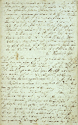

Title: Þingeyskur femínisti á 19. öld
Slug: thingeyskur-feministi-a-19-oeld
Date: 2005-10-25 07:00:00
UID: 6
Lang: is
Author: Hrafnkell Lárusson
Author URL: 
Category: Sagnfræði, Kynjafræði
Tags: Verslunarmannafélag Reykjavíkur, kvenfrelsi, sveitarblöð, Viljinn, Mývatnssveit, 19. öld, jafnrétti

Vertu hávaxinn, dökkhærður karlmaður!

Af nýlegri sjónvarpsauglýsingu frá Verslunarmannafélagi Reykjavíkur að dæma virðist sem ofangreint sé besti grunnur sem manneskja getur haft til þess að njóta góðra kjara á Íslandi í dag. VR bendir á þetta, ekki sem lof eða last um hávaxna dökkhærða karlmenn, heldur til að sýna fram á hversu mikil áhrif útlit og þó einkum kyn getur haft á kjör fólks. Af auglýsingunni að dæma eru lágvaxnar, ljóshærðar konur ólíklegastar til að njóta góðra kjara. Vitanlega er þó ástandið einfaldað til að falla að formi auglýsingarinnar. Eftir stendur að launalegt jafnrétti kynjanna er enn ekki veruleiki í upphafi 21. aldar.

Líkt og með margt annað í sagnfræði er erfitt að tímasetja nákvæmlega upphaf baráttunnar fyrir jöfnun rétti kvenna og karla á Íslandi. Óvíst er raunar hvað ynnist með því að afmarka upphafið við ár, dag eða klukkustund! Þó er ljóst að ekki tekur að hrikta, að neinu marki, í stoðum hugmynda um fastmótuð kynjahlutverk í íslensku samfélagi fyrr en undir lok 19. aldar. Helst fór þá að bera á kröfu um að konur fengju betri menntun en áður, ekki endilega sjálfra þeirra vegna heldur barnanna. Þær væru fyrstu kennarar barnanna og betur menntaðar væru þær betur undirbúnar til að takast á við það hlutverk. Líkast til hefur þá einkum verið hugsað um hagsmuni drengjanna, sem kyns síns vegna áttu möguleika á langskólanámi síðar meir. Skólaganga þeirra krafðist undirbúnings. Af þessu má sjá að þrátt fyrir að mælt hafi verið fyrir auknum réttindum kvenna er undirliggjandi að eftir sem áður var þeim ætlað sama hlutverk og fyrr. Þeirra vettvangur skyldi vera inni á heimilinu, við barnauppeldi og húsmóðurstörf.

En það voru ekki aðeins kvenfrelsishugmyndir sem komu fram á Íslandi á síðari hluta 19. aldar. Ný tegund fjölmiðlunar kom þá einnig fram, tegund sem átti eftir að lifa með breytilegum hætti fram eftir 20. öld: Handskrifuðu blöðin. Þau náðu fótfestu um allt land en voru þó algengust í sveitunum enda hafa þessi blöð löngum verið kölluð sveitarblöð. Þau gengu stundum á milli meðlima í t.d. lestrar- eða menntafélagi eða voru rituð í bók og lesin upp á fundum. Algengasta form dreifingar var þó að gefa blað út í einu eintaki og láta það ganga á milli allra bæja í einum hreppi.

Eitt þessara blaða hét _Viljinn_ og kom út á Sveinsströnd í Mývatnssveit árin 1879 til 1881. Það er nú varðveitt í Héraðsskjalasafni Þingeyinga á Húsavík. _Viljinn_ var fremur hefðbundið blað sem fjallaði líkt og mörg önnur einkum um hagsmunamál hreppsbúa með áherslu á atvinnumál, menntamál og félagastarfsemi.

Á aðfangadag árið 1879 kom út þriðja tölublað fyrsta árgangs _Viljans_. Í því er að finna grein sem nefnist „Spurningar“. Greinin er stutt og skrifuð undir dulnefni, eins og títt var um greinar í handskrifuðu blöðunum. Efni hennar er tvíþætt. Í síðari hluta greinarinnar er samanburður á afkomu vinnumanna og lausamanna, málefni sem algengt var að tekið væri til umræðu. Fyrri hlutinn er það sem vekur athygli. Í honum spyr höfundur bændur og vinnumenn í Mývatnssveit samviskuspurninga sem ólíklegt verður að telja að karlmenn á þeim tíma hafi verið vanir að vera spurðir. Greinin hefst svo:

> Bændur og vinnumenn!
>
> Þykir yður eigi skömm að því, þegar daglaun og árskaup karla fara hækkandi ár frá ári, hve verklaun kvenna hækka lítið að því skapi?
>
> Finnst yður sanngjarnt að karlmaður, er heyjar á votengi, hafi helmingi hærra kaup (eða meir) en kvennmaður, í sinni röð eins duglegur og á sama engi?

Eftir þessi upphafsorð reikar hugurinn á ný til auglýsingarinnar frá VR. Voru konur í engjaheyskap á 19. öld í áþekkri stöðu og skrifstofukonur eru á 21. öld? Þá, líkt og nú, unnu kynin í mörgum tilfellum sömu störf. Bæði þá og nú leiðir þetta oftast til sömu niðurstöðu fyrir konur: Sama vinna — lægra kaup! Þess ber að geta að greinarhöfundur í _Viljanum_ telur vinnumenn síst ofhaldna af sínum tekjum sem þó séu háar miðað við það sem vinnukonur fái.

Eftir langan vinnudag á enginu, á lægra kaupi en karlarnir, var vinnudegi lágt launaðra íslenskra vinnukvenna á 19. öld þó ekki lokið. Óréttlætið reið ekki við einteyming og greinarhöfundurinn í aðfangadagsblaði _Viljans_ hefur fleiri erfiðar spurningar til að leggja fyrir bændur og vinnumenn:

> Þykir yður sanngjarnt, þegar þér látið kvennfólk standa jafnlengi yður á engjum, og síðan þjóna yður til sængur, þvo plögg og bæta skó yðar heita morgunkaffi og fleira auk þess, sem þær þurfa að þjóna sér sjálfar á þeim tíma sem þér hvílið yðar lúnu bein?
> 
> Mundi ekki hverjum karlmanni sem vill telja sig mann með mönnum sæma betur að láta ekki kvennfólkið þurfa að leysa af sér skóna, og hjálpa sér úr fötunum, jafnvel um hásláttinn, að skola úr plöggum sínum sjálfur meðan stúlkur gjöra slíkt hið sama?

Skortur á launalegu jafnrétti er eitt! Jafnrétti og vinnudreifing á heimilinu annað! Greinarhöfundurinn skorar á kynbræður sína að sýna manndóm sinn í því að bjarga sér sjálfir og létta birgðunum af konunum. Dæmi voru um húsmæður sem reyndu að losna undan hluta daglegs amsturs heimilisstarfa til að sinna störfum sem karlar annars sinntu. Þetta jók virðingu þeirra enda er að sjá sem hin ýmsu störf hafi verið álitin mis virðingarverð. Óvirðulegustu störfin voru ýmis „kvennastörf“, t.d. þvottar og matseld.

Það er sérstætt að sú manneskja sem þannig vekur athygli, með jafn afgerandi hætti, á ójafnri stöðu kynjanna er ekki kona heldur karlmaður. Ljóst er af greininni, þá einkum af útlistunum í síðari hluta hennar varðandi efnahagslegan mun milli lausamanna og vinnumanna, að það er karlmaður sem heldur á pennanum. Dulnefni greinarhöfundar er „Lausamaður“ og þekking hans á kjörum lausamanna og vinnumanna er augljóslega byggð á eigin reynslu. Þar að auki voru það karlmenn sem skrifuðu lungann af því efni sem handskrifuðu blöðin birtu á 19. öldinni. Annað sem einnig vekur mikla athygli við greinina í _Viljanum_ er hversu snemma hún er skrifuð — við lok árs 1879! Í því ljósi er líka sérstætt hversu ákveðna afstöðu til jafnréttis er þar að finna og hversu óhikað er gengið til verks við að benda á ójöfnuð milli kynjanna. Hér er ráðist gegn ranglæti vanans.

Hinn nafnlausi þingeyski „femínisti“ sem feðrar þá grein sem hér hefur verið fjallað um snýr sér einnig beint að konum og ávarpar þær. Hann segir að þeim beri hluti af því frelsi og jafnrétti sem þjóðinni sé að hlotnast. Þeirra fulltingis sé þörf til að snúa hjólum framfara. Þær verði að fá tækifæri til mennta því menntunina sé „að sannfæra heiminn um jafnrétti karla og kvenna.“ Þessi vísan til „heimsins“, til viðbótar því hve snemma greinin er skrifuð, leiðir hugann að því hvort greinarhöfundur hafi verið undir beinum áhrifum frá erlendu lesefni, e.t.v. þekkt til Kúgunar kvenna eftir John Stuart Mill? Það rit kom út árið 1869 en birtist þó ekki í íslenskri þýðingu fyrr en um aldamótin 1900. Sú staðreynd þarf þó ekki að þýða að einhverjir hér heima hafi ekki þekkt til ritsins eða eignast það á frummálinu fyrir þann tíma.

Frá árinu 1879 hefur margt unnist í átt til jafnréttis kvenna og karla á Íslandi, ekki hvað síst varðandi menntun. En kynbundinn launamunur er enn til staðar. Því verður það líkast til enn um sinn forgjöf í íslenskri kjarabaráttu að vera hávaxinn, dökkhærður karlmaður.
