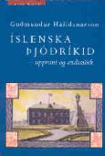

Title: Þjóðríkið afbyggt, goðsögnin afhjúpuð?
Slug: thjodrikid-afbyggt-godsoegnin-afhjupud
Date: 2008-02-21 14:13:00
UID: 221
Lang: is
Part: 1/2
Author: Pálmi Gautur Sverrisson
Author URL: 
Category: Sagnfræði, Menningarfræði
Tags: 

_Rýnt í fræðimanninn Guðmund Hálfdanarson og ritið Íslenska þjóðríkið, uppruni og endimörk._

### Fyrri hluti.

Guðmundur Hálfdanarson er líklega sá fræðimaður er mest áhrif hefur haft á afstöðu og hugmyndir sagnfræðinema seinustu ára til íslenska þjóðríkisins. Hann hefur varið drjúgum hluta af fræðilegri ævi sinni í rannsóknir á fyrirbærinu og í ritinu _Íslenska þjóðríkið, uppruni og endimörk_ birtast niðurstöður rannsókna sem flestar hafa þó áður birst í formi átta tímaritsgreina frá árinu 1986. Inngangskafli og lokakafli munu þó vera að birtast í fyrsta sinn á prenti.[^1]  Fyrir vikið virkar bókin á köflum nokkuð sundurlaus hvað „flæði“ milli einstaka kafla varðar en augljóst er þó að Guðmundur hefur lagt talsvert á sig við að samræma og „byggja brýr“ milli greina sinna. Ritið er því margslungið og röksemdir þess á köflum flóknar þó þær miði allar að því að grafa undan „opinberri sköpunargoðsögn íslenska þjóðríkisins“. Í gegnum _Íslenska þjóðríkið_ gengur þó þráður vantrúar og andmæla gegn trúnni „[...] á sjálfvirk tengsl þjóðernis og ríkismyndunar [...].“[^2]  En hver er eiginlega efnislegt innihald bókarinnar, hvernig kemst höfundur að slíkum niðurstöðum? 

### Heimildir og háflug

Í stuttu máli þá eru heimildir höfundar flestallar opinberar heimildir auk þess sem skrif „landsfeðra“, þjóðskálda og menntamanna skipa stóran sess heimildavinnu bókarinnar. Líkt og fyrri fræðimenn er hann því í vissum skilningi fastur í því að skrifa sögu „þjóðar“, í þessu tilfelli hugmynda framangreinds hóps, út frá litlum hluta hennar þ.e.. hinna valdamestu og best stæðu. Slíkar heimildir eru auðvitað þeim annmörkum háðar að gefa fyrst og fremst innsýn í hugarheim þeirra manna er mynduðu þær. Þetta helgast þó að sjálfsögðu af því að í bókinni eru til umfjöllunar stjórnmál, ríkið og hugmyndafræði elítu þeirrar er skóp einingarsögu íslenska þjóðríkisins. Um leið er höfundur oft á býsna „háu flugi“ yfir viðfangsefnum sínum. Það helgast af hinni kennilegu nálgun auk þess sem hann tekur til umfjöllunar hið óhlutbundna. Við lestur bókarinnar hvarflaði því á köflum að þeim er þetta ritar hvort að hinar abstrakt kenningar sem eru notaðar til að skýringa séu ekki „um of abstrakt“. Í áttunda kafla sem snýst að um að rökstyðja hvernig þjóðin velur og hafnar minningum til að viðhalda sjálfri sér segir til að mynda að í Þingvallahátíðinni 1994 birtist „[...] opinber staðfesting á vilja íslenskrar þjóðar til að viðhalda „ímynduðu samfélagi“ og verja það gegn þeirri upplausn sem einkennir okkar óþjóðlegu tíma.“[^3]  Hér mætti þó spyrja hvort fræðimaðurinn sé ekki búinn að missa sig í kennilegri túlkun atburða, getur t.d. ekki verið að tugþúsundir Íslendinga hafi fyrst og fremst mætt á hátíðina sem eitt risavaxið skemmtiprógramm frekar en að hin hátíðlega skýring Guðmundar hafi á einhvern ómeðvitaðan hátt knúið menn af stað? Var hátíðin ekki bara eitt stórt partý og fátt annað þó að skemmtidagskráin hafi sótt efnivið í klisjuna um íslenskt þjóðerni? Hér birtist einnig sá vandi að nota nánast alfarið hina ofangreindu heimildaflokka. Þeir geta ekki birt nema eina hlið fortíðarinnar, „almenningsálitið“ verður ekki svo glöggt ráðið úr þeim. En snúum okkur þá eftir þennan stutta útúrdúr að því að gera nánar grein fyrir inntaki _Íslenska þjóðríkisins_. 

### Í stuttu máli sagt...

Ritið _Íslenska þjóðríkið_ er í stuttu máli sagt, líkt og fyrr var getið, eitt allsherjar uppgjör við íslenskt þjóðerni og sköpunargoðsögn þjóðríkisins og - í henni er hún véfengd og hrakin lið fyrir lið. Í fyrstu köflum bókarinnar sýnir höfundur fram á íhaldssemi sjálfstæðisbaráttunnar, í. þ.m. í upphafi, og það hvernig þjóðfrelsi átti að viðhalda bændasamfélagi fremur en að færa einstaklingum aukið frelsi. Þessi túlkun er ólík þeirri er haldið hefur verið fram, að þjóðernishreyfingin hafi fært landsmönnum öllum aukið frelsi. Höfundur gerir einnig að umtalsefni málsflutning Jóns Sigurðssonar sem á stundum andmælti íhaldsemi íslenskra bænda.[^3]  Þjóðfrelsishreyfingin á 19. öld var því að mati Guðmundar viðbrögð við frjálslyndum hugmyndum dönsku stjórnarinnar ofar öðru.[^5]  Í framhaldi rekur höfundur hvernig bættur efnahagur undir lok nítjándu aldar hafi ekki haft neitt með aukið frelsi að gera heldur hafi íslenska iðnbyltingin fyrst og fremst orðið fyrir tilstuðlan ytri efnahagslegra aðstæðna og þrota íslenska bændasamfélagsins.[^6]  Jafnframt sýnir hann í bókinni fram á hvernig hugmyndir þegna og ríkis stönguðust oft á. Ennfremur hvernig breytingar í átt að frjálslyndu ríksivaldi nútímans hefðu getað farið á allt annan veg[^7]  og aldrei hafi verið einhugur um það hvernig skyldi móta íslenskt samfélag í upphafi 20. aldar. Stjórnmálahugsjónir stönguðust á og þjóðin var aldrei einhuga í sjálfsstæðisbaráttunni nema kannski á lokapunkti hennar árið 1944 þegar landsmönnum hafði endanlega verið innrætt þjóðerni sitt af ríkinu.[^8]  Lokakaflar snúast síðan um að sýna fram á hvernig hinu „ímyndaða samfélagi“ er haldið er saman m.a. með því að hlaða náttúru og sögu táknum þjóðernishreyfingarinnar. Afhjúpun einingarsögunnar er því liður í að sýna hvernig íslensk þjóð og þjóðerni sé nútímafyrirbæri. 

### Þjóðir og þjóðflokkasamfélög, röksemdir og þversagnir?

Flókið, sennilega ógerlegt, er í svo stuttu máli að taka alla röksemdafærslu höfundar til greiningar þar sem „heildarniðurstöður“ verksins eru byggðar á niðurstöðum margra greina án þess að þær tengist beinlínis innbyrðis. Þess í stað vil ég hér benda á þversögn eða óleyst vandamál í röksemdafærslu höfundar fyrir grunnafstöðu hans til þjóðernis, þ.e. að það sé alfarið nýtt á nálinni. 

Í umræðu sinni um þjóðerni notast Guðmundur við hugmynd Anthony Smith um _ethnie_ eða þjóðflokkasamfélög.[^9]  Hann virðist líta svo á að Íslendingar hafi myndað þjóðflokkasamfélag áður en hin íslenska ríkisþjóð varð til. Í upphafskafla bókarinnar segir að „[þ]egar þessum tveimur _þjóðflokkasamfélögum_ [mín leturbreyting] var gert að kjósa um hvaða þjóðríki þau skyldu tilheyra varð niðurstaðan mjög ólík- Íslendingar _völdu_ að mynda eigið þjóðríki á meðan Bretónar gengu Marianne, „fjallkonu“ franska lýðveldisins, á hönd.“[^10]  Erfitt er að skilja þessi ummæli á annan veg en þann að Guðmundur geri sumpart ráð fyrir að nútímaþjóðin eigi sér dýpri rætur en að vera skilgetið afkvæmi nývæðingar þó hann vilji ekki gangast við ethnískum hugmyndum um uppruna þjóðríkja. En ef hugmyndin um _ethnie_, hópur sem síðar _valdi_ að mynda þjóð, er samþykkt án þess að gera ráð fyrir einhverskonar sameiginlegri vitund þjóðarsamfélagsins um eigið samfélag þá þarf um leið að skýra hvenær rofið var á milli þjóðflokkasamfélags og þjóðar og hverju þjóðin rofnaði eiginlega frá. Auk þess á ég bágt með að samþykkja að hugmyndir manna um samband sitt við samfélag sitt sé jafn skilyrt af opinberri flokkun og módernískar hugmyndir gera ráð fyrir. Hér virðist um þversögn að ræða. Og hvað varð þá um þjóðflokkasamfélögin, eru tákn þeirra og félagsminningar alfarið horfin? Getur ekki verið að ný tákn hafi einfaldlega leyst hin eldri af hólmi?[^11]  Hafa þjóðflokkasamfélögin ekki bara öðlast pólitíska merkingu ofan á annað um leið og sum þeirra hafa runnið saman líkt og dæmið af Bretóna og myndun franska þjóðríkisins gæti bent til? Teygja hugmyndir um íslenskt þjóðerni sig kannski allt aftur til 16. aldar líkt og Gunnar Karlsson hefur haldið fram?[^12]  Þau rök að þjóðaratkvæðagreiðslan 1944 sýni að „[...] hinn eþníski þegnréttur og sá borgaralegi höfðu runnið í eitt“[^13] , gengur þvert á þá röksemdafærslu að þjóðir eigi sér ekki „nafla“. Það er því að mínu mati ekki sannfærandi að halda því fram að vitundin um íslenskt þjóðerni eigi sér ekki einhverjar rætur lengra aftur en til 19. aldar þó að það sé að sjálfsögðu ekkert eðlislægt eða náttúrulegt við þjóðir og þjóðflokkasamfélög og hugmyndin hafi kannski umturnast svo að hún hafi í raun öðlast nýtt inntak. En nú skal hugað nánar að þeirri aðferðar- og hugmyndafræði sem _Íslenska þjóðríkið_ byggir á. 

### Frásagnasagnfræði, félagssaga og hin póstmódernísku fræði

Guðmundur Hálfdanarson stendur milli tveggja „skóla“ innann sagnfræðinnar. Annan fótinn hefur hann í félagssöguhefð þar sem megindleg tölfræði réði ríkjum en hinn fótinn hefur hann í þeim „skóla“ sem gjarnan er tengdur aðferðar- og hugmyndafræði póstmódernisma. Bókin ber því merki þess að aðferðir Guðmundar hafi tekið nokkrum breytingum í gegnum tíðina. Hin hefðbundna frásagnarsaga birtist í kaflanum „Stjórnmálahugsjónir nýrra tíma“ sem stingur raunar í stúf við aðra fyrir vikið.[^14]  Auk þess sem rannsóknir Guðmundar byggja á empírískri heimildarýni má í bókinni finna aðferðarfræðileg úrvinnslu byggða á semíólógíu, nálgun byggða á tölfræðigreiningu[]15  auk þess sem flestallar greinarnar byggja á skýrt afmörkuðum kennigrundvelli.[^16]  Þar má nefna kenningu Pierre Bordieu um „táknrænt vald“ og „táknrænt ofbeldi“ sem hann nýtir í greiningu á vexti og mótun ríkisvaldsins í lok 19. aldar.[^17]  Einnig umfjöllun í kaflanum „Þingvellir- staður minninga“ þar sem Guðmundur nýtir kenningu Pierre Nora um „staði minninga“ til þess að sýna fram á táknrænt hlutverk Þingvalla, stað hlöðnum völdum félagsminningum ætluðum að viðhalda hinu „ímyndaða samfélagi“.[^18]  Afstaða höfundar til efnisins og starfa sinna kemur ennfremur í ljós er hann veltir því fyrir sér hvort að sú sagnfræði sem hann stundi sýni ekki fram á að Ernest Renan hafi verið sannspár um að vísindaleg sagnfræði væri þjóðerninu hættulegt.[^19]  

Hugmyndin um að afhjúpa íslenskt þjóðerni byggir á að „próblemerísera“ og afbyggja þjóðernishugmyndir, og raunar snýst öll bókin um að vinda undan eldri hugmyndum um sköpunarsögu íslenska þjóðríkisins. Í formála segir Guðmundur m.a. að það verði ekki framhjá því litið að „öll sögulega skilgreind menningarfyrirbæri eru „problematísk“ í eðli sínu, vegna þess að sögulegar aðstæður breytast og þar með menningarfyrirbærin sem þau eru háð“, og telur hann íslenskt þjóðerni enga undantekning frá þeirri reglu.[^20]  Grunnurinn að þessari problemeríseringu er að líta á þjóðir sem hugarsmíð mannanna og þjóðríki sem pólitískt val og slíkt gerir hann m.a. með að leita í kenniramma Pierre Bourdieu en samkvæmt honum munu öll orð sem notuð eru til að lýsa félagslegum veruleika fjarri því að vera hlutlaus lýsing á veruleikanum.[^21]  Það er því ekkert við flokkun manna í þjóðir, þó hún sýnist sumum svo, sem gerir þjóðerni að eðlislægu eða náttúrulegu fyrirbæri. 

Þessi afstaða og „próblemerísering“ er ennfremur byggð á því að stefna saman nokkrum andstæðum kenningum um þjóðir og þjóðerni. Eldri kenningum um „eðlis- og náttúrulægni“ þjóða etur hann saman við yngri fræðikenningar um þjóðerni og upphaf þjóðríkisins s.s. Renans, Andersons, Bordieu og Gellner sem allar eiga það sameiginlegt að líta á þjóðir sem mannlega smíði. Þessi hugmynd er grundvöllur Guðmundar fyrir því að hugsa hugmyndina íslenskt þjóðerni upp á nýtt um leið og hann gerir grein fyrir sögu þess. 

Höfundur hallast einnig að því að skýra hreyfiöfl sögulegra samfélaga fyrst og fremst úr frá ópersónulegum öflum og virkni þeirra fremur en að líta á einstaklinga sem hin eiginlegu hreyfiöfl. Það gengisfellir augljóslega hetjusögur sjálfstæðisbaráttunnar. Slíkt má t.d. sjá í greiningu á breytingum á efnahag og samfélagsgerð á 19. öld í fjórða kafla en þar eru aukin efnahagsleg gæði í lok 19. aldar og upphafi hinnar tuttugustu rakin til breyttrar samfélagsgerðar og efnahagslegra aðstæðna í Evrópu fremur en til meints aukins frelsis í kjölfar þjóðfrelsisbaráttu.[^22]  

Að þessu sögðu mætti lýsa höfundi Íslenska þjóðríkisins á eftirfarandi máta. Hann birtist í bókinni sem „kennilega þenkjandi“ sagnfræðingur undir greinilegum áhrifum frá megindlegri félagssöguhefð en um leið kennir sterkra áhrifa póstmódernískra hugmynda og aðferðarfræði. Nú hefur Guðmundur Hálfdanarson verið staðsettur innan sagnfræðinnar, en skyldi mega greina í ritinu pólitíska afstöðu, sýn fræðimannsins  á tilveruna og hugmyndir hans um hlutverk fræðanna? 

---

#### Hugtakaskrá

_Afbygging (e. deconstruction)_: Afbygging er hugtak og aðferð, gjarnan kennt við póstmódernisma, til textagreiningar. Aðferðin felur m.a. í sér að reyna að komast handan þess sem viðtakendur ganga að sem hefðbundnum sannindum í frásögn. Hugmyndin um afbyggingu gengur því gegn þeirri hugmynd að lýsa megi „raunveruleika“ í texta, þar sem texti kemur ávallt til með að lúta lögmálum sem höfundur fær ekki komist handan. Afbygging felur því m.a. í sér að rýna í tákn og orðræðu, frásagnarform sem kunna t.d. að vera beygð undir ákveðna hugmyndafræði eða siðaboðskap, auk þess að í hugtakinu felst að finna og greina mögulegar stórsögur (e. metanarratives).[^23]  Afbygging er því enn ein leiðin í fræðum til að leiða „það sem sannara reynist“ í ljós.

_Módernískar þjóðerniskenningar_: Módernískar kenningar um þjóðerni eiga það sameignlegt að neita því að þjóðerni eigi sér rætur handan þeirra þjóðfélagsbreytinga er fylgdi nývæðingu og iðnbyltingu Evrópuríkja. Þær halda því fram að tilgangslaust sé að leita uppruna þjóða þar sem þær séu menningarlega skilgreint fyrirbæri og að tengsl þeirra við eldri samkennd hópa sé tilviljunum háð. Þjóðerniskennd nútímans er því í „eðli“ sínu annað en samkennd fyrri tíma.[^24]  Módernískar þjóðerniskenningar eru enn ein Evrópumiðaða leiðin að því að skýra heiminn. 

_Pólitísk þjóðernishyggja_: Stjórnmálaskoðanir er eiga sér rætur aftur til 18. og 19. aldar. Grunnhugmynd þeirra er krafan um samruna landamæris ríkis og þjóðar. Þær gera ráð fyrir menningarlegri og náttúrlegri einingu og samkennum hverrar þjóðar. Í stefnunni felst einnig það viðhorf að gera ráð fyrir að hver meðlimur hinnar pólitísku einingar tilheyri einu óskiptu samfélagi. Pólitísk þjóðernishyggja er m.a. rakin til menningarlegrar þjóðernishugsunar Johanns Gottfrieds Herder sem gerði ráð fyrir því að tungumál hverrar þjóðar endurspeglaði náttúrulegar aðstæður mannlegra samfélaga. Auk þess leit hann svo á að hefðir og venjur hverrar þjóðar ættu sér rætur í náttúrunni. 

_Póstmódernismi_: Hugmyndastraumur og n.k. ósamstætt kerfi hugsunar sem felur í sér viss einkenni ætluðum að grafa undan „módernísku“ þekkingarkerfi. Póstmódernísk afstaða felur oft á tíðum viss sameiginleg einkenni í sér: s.s. (1) afneitun þess að „raunveruleikinn“ verði táknaður á nokkurn algildan hátt, (2) afneitun þess að siðferði geti verið byggt á hlutlægum grunni, (3) sannfæringu þess að tungumál sé uppspretta valds, (4) meðvitund um að inn í öll fræðaskrif blandist huglæg afstaða og skoðanir höfundar og (5) meðvitund um samband rökræðu og stórsagna.[^25]  

_Próblemerísering_: Í hugtakinu felst að gera viðtekin sannindi, hugmynd eða orð í frásögn eða greiningu að „vandamáli“ þ.e. að draga áður viðtekin þekkingargrunn í efa og kanna hvort hann feli ekki t.d. í sér ákveðið gildismat eða fordóma. Um leið er uppruni þekkingar og greiningar er kannaður.[^26] 

_Táknfræði, semíólógíu_: Táknfræði felur í sér greiningu tákna. Hvert tákn samanstendur af tákninu sjálfu (t.d. orði eða mynd ) og þeirri hugmynd eða hugmyndum sem táknið á að vísa til. Sú hugmynd getur aftur átt að vísa í meintan veruleika, eðli eða einkenni. [^27]  Táknhugmyndin og táknið ljær því þeim eða því sem ber táknið vissum „veruleika“, eðli eða einkennum. 

_Upprunagoðsögn íslenska þjóðríkisins_: Í stuttri samantekt Guðmundar Hálfdánarsonar er hún nokkurn vegin á þessa leið: „_Fyrir margt löngu komst Ísland undir stjórn vondra útlendinga, sem hugsuðu um það eitt að pína þjóðina og hafa úr henni sem mest fé. Smám saman var landið slegið myrkri vonleysis og doða, sem heltók hina gáfuðu og merku þjóð. Eftir hartnær sex alda niðurlægingu hlotnaðist hnípinni þjóð, öllum að óvörum, sú gæfa að meðal hennar fæddist hópur úrvals gáfumanna. Allflestir sigldu þeir utan til að afla sér þekkingar og frama og námu þar ýmis gagnleg fræði og kynntust helstu hræringum í stjórnmálum Evrópu. Á þessum tíma var alþýða manna í hinum stóra heimi að brjóta af sér fjötra einvaldsstjórna undir merkjum frjálslyndis og þjóðernisstefnu. „Dagur er upp kominn!“ sögðu þeir löndum sínum. Íslensk alþýða, bogin undan oki erlends valds og fátæktar, lagði við hlustir og gekk hinum nýju innfluttu kenningum á hönd. Hófst þá barátta fyrir frelsi þjóðarinnar, barátta sem skapað hefur samfélag lýðræðis, framfara og ríkisdæmis sem einkennir Ísland nútímans.“[^28]_  

_Þjóð (e. nation)_: Hugtakið þjóð er og hefur alltaf verið óljóst. Þjóð er þó mannlegt samfélag með eitt eða fleiri sameiginlegt tákn, viðhorf og minningar um fortíðina auk þess að viðkomandi hópur deilir samkomulagi um að hann teljist til þjóðar. Þjóðir eru oft tengdar ákveðnum landsvæðum, tungumáli og menningu. Deildar skoðanir eru þó um hvað þurfi til að hópur manna geti skilgreinst sem þjóð. 

_Þjóðarvitund_: Meðvitund og vilji einstaklinga um og til að tilheyra ákveðnu og afmörkuðu samfélagi ofar öðru, þ.e. þjóðinni. 

_Þjóðflokkasamfélag (e. ethnie)_: Félagsfræðingurinn Anthony D. Smith skilgreinir hugtakið sem „nafngreindan hóp manna sem á sér goðsagnir um sameiginlegan uppruna, sameiginlegar sögulegar minningar, eitt eða fleira sameiginleg menningareinkenni, tengist ákveðnu heimalandi og sýnir ákveðna samstöðu, a.m.k. á meðal yfirstéttarinnar.“[^29]  Smith telur þjóðir vera skilgetið afkvæmi þjóðflokkasamfélaga. Hugmyndir er gera ráð fyrir því að þjóðríki og nútíma þjóðir séu framhald þjóðflokkasamfélaga eru því _eþnískar_. 

Þjóðríki: Afmarkað landfræðilegt rými þar sem ríkjandi þjóðarbrot hefur myndað ríki undir merkjum eigin þjóðernis. Þar með hafa mörk ríkis og þjóðar runnið saman. Þjóðríki telur sig fullvalda í krafti sameiginlegs þjóðernis þegna sinna. Þjóðernið er því hvorutveggja uppspretta og réttlæting valda þjóðríkisins.

[^1]: Páll Björnsson: „Guðmundur Hálfdanarson, Íslenska þjóðríkið - Uppruni og endimörk.“ _Saga_ XL:1 (2002), bls.  262-269.

[^2]: Guðmundur Hálfdanarson: _Íslenska þjóðríkið, uppruni og endimörk_. Hið íslenska bókmenntafélag og ReykjavíkurAkademían, Reykjavík 2001, bls. 10.

[^3]: Guðmundur Hálfdanarson: _Íslenska þjóðríkið_, bls. 176.

[^4]: Guðmundur Hálfdanarson: _Íslenska þjóðríkið_., bls. 79.

[^5]: Guðmundur Hálfdanarson: _Íslenska þjóðríkið_., bls. 75-76.

[^6]: Guðmundur Hálfdanarson: _Íslenska þjóðríkið_., bls.108-109.

[^7]: Guðmundur Hálfdanarson: _Íslenska þjóðríkið_., bls. 113, 130 og 134.

[^8]: Sjá t.d. Guðmundur Hálfdanarson: _ Íslenska þjóðríkið_., bls. 143 og 148.

[^9]: Sjá skilgreiningu í hugtakaskrá.

[^10]: Guðmundur Hálfdanarson: _Íslenska þjóðríkið_., bls. 35.

[^11]: Guðmundur Hálfdanarson: _Íslenska þjóðríkið_., bls. 35.

[^12]: Sjá t.d. Gunnar Karlsson: „Íslensk þjóðernisvitund á óþjóðlegum öldum.“ _Skírnir_. 173:1 (1999), bls. 141-178. Bls. 149.

[^13]: Guðmundur Hálfdanarson: _Íslenska þjóðríkið_., bls. 143.

[^14]: Þar gerir höfundur grein fyrir hugmyndafræðilegri togstreitu er birtist í málflutningi Jóns Þorkelssonar og Jónasar Jónssonar, sem höfundur kallar „[...] guðfeður nútíma flokkakerfis á Íslandi [...]“um hvort skyldi ríkja, samvinnuhugsjón eða einkaframtak. (Guðmundur Hálfdanarson: _Íslenska þjóðríkið_., bls. 148.)

[^15]: Sjá t.d. kaflan „Frá fullveldi til sjálfstæðis“ (Guðmundur Hálfdanarson: _Íslenska þjóðríkið_., bls. 135-145.)

[^16]:  Sem dæmi um sagnaritun Guðmundar byggðri á lýð- og tölfræði skal nefndur kaflinn „Forsendur iðnbyltingar á Íslandi.“ Í kaflanum kannar höfundur íslenska samfélagsgerð á nítjándu öld og í upphafi þeirrar tuttugustu út frá lýðfræði- og tölfræðilegri nálgun svo sem um atvinnu- og aldursskiptingu Íslendinga. Einnig má benda kaflann „Frá fullveldi til sjálfstæðis“ sem dæmi um hvernig Guðmundur nýtir sér tölfræðigreiningu í sagnfræði sinni. (Sjá Guðmundur Hálfdanarson: _Íslenska þjóðríkið_., bls. 99-109.)

[^17]: Guðmundur Hálfdanarson: _Íslenska þjóðríkið_., bls. 128.

[^18]: Guðmundur Hálfdanarson: _Íslenska þjóðríkið_., bls. 174-176 og 188-89.

[^19]: Guðmundur Hálfdanarson: _Íslenska þjóðríkið_., bls. 184-188.

[^20]: Guðmundur Hálfdanarson: _Íslenska þjóðríkið_., bls. 17.

[^21]: Guðmundur Hálfdanarson: _Íslenska þjóðríkið_., bls. 38.

[^22]: Guðmundur Hálfdanarson: _Íslenska þjóðríkið_., bls. 99-109, einkum bls. 108-109.

[^23]: Brown, Callum G.: _Postmodernism for Historians_.. Pearson/Longman, Edinborg 2005, bls. 99-101.

[^24]: Guðmundur Hálfdanarson: _Íslenska þjóðríkið_., bls. 26.

[^25]: Brown, Callum G.: _Postmodernism for Historians_., bls. 185-186.

[^26]: Brown, Callum G.: _Postmodernism for Historians_., sjá t.d. bls 186.

[^27]: Brown, Callum G.: _Postmodernism for Historians_., sjá t.d. bls. 33-35.

[^28]: Guðmundur Hálfdanarson: _Íslenska þjóðríkið_., bls. 45.

[^29]: Guðmundur Hálfdanarson: _Íslenska þjóðríkið, bls. 27_.

