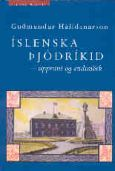

Title: Þjóðríkið afbyggt, goðsögnin afhjúpuð?
Slug: thjodrikid-afbyggt-godsoegnin-afhjupud
Date: 2008-02-22 15:04:00
UID: 222
Lang: is
Part: 2/2
Author: Pálmi Gautur Sverrisson
Author URL: 
Category: Sagnfræði, Menningarfræði
Tags: 

_Rýnt í fræðimanninn Guðmund Hálfdanarson og ritið Íslenska þjóðríkið, uppruni og endimörk._

## Seinni hluti

_Íslenska þjóðríkið_ er afbragðs dæmi um það hvernig sagnfræðin getur verið í beinni samræðu við samtíma sinn með því að benda á hvernig fortíðin mótar stöðugt hugmyndir samtímans - hugmyndir sem geta virkað „ósögulegar“ á þá er ekki kæra sig um að líta um öxl. Ritið virðist að nokkru hugsað til að benda á hvernig pólitísk orðræða sjálfstæðisbaráttunnar mótar enn að hluta sjálfsmynd og orðræðu íslenskra stjórnmála. Guðmundur virðist því hafa ákveðnar hugmyndir um hlutverk sagnfræði í samfélaginu þ.e. að sýna hvernig Íslendingum er réttast að „[...] byggja afstöðu sína til samtímans á gagnrýnu mati á fortíðinni.“[^1]  En það má einnig greina pólitískan undirtón í _Íslenska þjóðríkinu_. Augljóst er t.d. að höfundi hugnast best að segja sögu „litla mannsins“ um leið og hann „gengisfellir“ hetjusögur sjálfsstæðisbaráttunnar. Hér má nefna dæmi úr fjórða kafla sem um hrekur þá goðsögn „að efnahagslegar framfarir á Íslandi á nítjándu og tuttugustu öld hafi staðið í nánu sambandi við aukið frelsi þjóðarinnar“ í kjölfar þjóðfrelsisbaráttunnar. Í lok kaflans segir höfundur að raunverulegar „hetjur íslenskrar iðnbyltingar“ hafi verið þeir „sem fluttu úr sveitunum á mölina þrátt fyrir allar hrakspár“ samtímamanna.[^2]  Fljótt hvarflar því að lesanda að pólitískar skoðanir höfundar halli helst í átt til vinstri. En könnum nú áfram hvernig persóna sagnfræðinga birtist í fræðum þeirra. 

Í fræðideilum Guðmundar við Gunnar Karlsson endurspeglast að nokkru umræða seinustu ára um hvernig beri að skilja þjóðerni. Gunnar fer fram undir merkjum eþnískra hugmynda um þjóðir og þjóðríki, Guðmundur undir fána módernískra hugmynda. Báðir leita þeir þó að hluta í hvorn kennirammann fyrir sig til að skýra þjóðerni og uppruna þjóðríkja. Deila þeirra snýst því að mestu um það hve gamalt þjóðerni og þjóðvitund Íslendinga sé og hvort þjóðvitund eigi sér rætur í þjóðflokkasamfélögum, nokkuð sem mjög vandasamt er að greina eða mæla. Guðmundur gerir tilraun til slíks m.a. með því að túlka kosningaþátttöku 1918 og 1944 en Gunnar leitar í skrif presta og betri bænda frá fyrri öldum þar sem hann telur birtast vitund um íslenskt þjóðerni. Að mínu mati birtist í deilu þessari afstaða þeirra tveggja til pólitísks samtímaefnis auk ólíkrar sýnar á stöðu sína í samhengi við fortíð íslensks samfélags. Það að varðveita hugmyndina um íslensku þjóðina fyrr á öldum sem samheldinn flokk manna virðist vera það sem Gunnari gengur til með skrifum sínum, en hann telur sig m.a. hafa sýnt fram á að íslensk þjóðernisvitund eigi sér rætur allt aftur til þjóðveldisaldar þó hún hafi ekki tekið á sig pólitískan blæ fyrr en á 19. öld.[^3]  En fræðileg afstaða Gunnars fær á sig nýja „vídd“ er skrif Gunnars um íslenska þjóð eru skoðuð nánar. Hugmyndir sjálfstæðisbaráttunnar og goðsögnin um íslenska þjóðríkið virðist enduróma í skoðunum hans. Hann hefur m.a. haldið því fram að bændastéttin, í hinni eldri samfélagsgerð, hafi verið samstæður hópur en ekki „[...] divided into two groups, the rich landowners and the poor farmers who had no or very little land of their own. The whole farming class can be ordered along an uninterrupted continuum from those who owned no land to those who possessed up to 60 farms.“[^4]  Íslenska þjóðin var þá samkvæmt Gunnari nánast ein og óskipt eftir stöðu eða efnum. Gunnari virðist því vera meira í mun að varðveita einingarsögu íslenskrar þjóðar ólíkt yngri fræðimönnum sem þvert í móti hafa rökstutt hið gagnstæða. Hugmyndir og sýn Gunnars Karlssonar á samtíma sinn virðist því enn krefjast einingar í fortíðinni. Andstætt þessu endurómar _Íslenska þjóðríkið_ vantrú margra fræði- og stjórnmálamanna, í upphafi 20. aldar, á þjóðríkið. Guðmundur nýtir sér ritið sem rödd er talar fyrir því að íslenskt þjóðerni sé hugsað upp á nýtt þegar hyllir undir pólitískan samruna þjóðríkja Evrópu. Deilur þeirra Gunnars og Guðmundar sýna því samræður tveggja kynslóða, hinnar eldri er ólst upp við flokkun og skilgreiningar heimsins sem hin yngri sér flosna upp. Á meðan hin eldri vill halda í íslenskt þjóðerni sem grundvöll fullveldis sér hin yngri fram á umbyltingu þess á tímum alþjóðlegra markaða, internets og menningarneyslu sem nær út fyrir öll landamæri þjóðríkja. Hinn yngri vill því leita nýrra leiða til að skilja og skýra mannleg samfélög í fortíð, nútíð og framtíð þar sem fyrri flokkanir og skilgreiningar virðast ekki lengur eiga við. 

Í _Íslenska þjóðríkinu_ birtist heimssýn höfundar vel í umræðu um stöðu Íslands gagnvart hnattvæðingu nútímans. Af þeirri niðurstöðu að þjóðerni sé hvort sem er hugsmíð auk þess að þjóðríkið virðist vera að missa vald sitt og vægi gagnvart þegnum sínum virðist sem að Guðmundur vildi helst sjá Ísland ganga til aukins samstarfs við stærri heild - Evrópusambandið. Þannig segir Guðmundur í lokakafla verksins í kjölfar umræðu um grundvöll fullveldis og lýðræðis að „[...] ég á fullveldi mitt ekki undir því að ég er íslenskur ríkisborgari, heldur því að ég er þegn ríkis sem virðir og tryggir réttindi mín. Af þessu leiðir einnig að Íslendingar þurfa alls ekki að glata fullveldi sínu með því að ganga inn í stærri ríkisheildir, hvort sem þeir taka upp nýtt ríkisfang sem einstaklingar eða þjóðin gerist sem ein heild aðili að nýju ríki.“[^5]  Hér er að sjálfsögðu verið að undirstrika að íbúar Íslands geti verið Íslendingar þó þeir gangi í Evrópusambandið. Í bókinni er því að finna pólitískan boðskap þ.e. þann að þjóðerni skuli ekki vera grundvöllur pólitíkur. Guðmundur boðar því í _Íslenska þjóðríkinu_ nýjan grundvöll íslenskrar stjórnmálaumræðu, grundvöll sem ekki er plagaður af orðræðu sjálfstæðisbaráttunnar, grundvöll sem lítur handan sköpunargoðsagna þjóðríkja og þjóðernis. Það er því erfitt að lesa seinasta kafla bókarinnar á annan veg en að Guðmundi hugnist að Ísland gangi í fjölþjóðlega ríkisheild. Það er því sérstakt við _Íslenska þjóðríkið_ að í því fjallar höfundur ekki einungis um fortíðina, heldur ljær hann verki sínu gildi með því að velta fyrir sér framtíðinni á grundvelli sagnfræði sinnar. Það verður að teljast fremur óvenjulegt að íslenskt sagnfræðirit birti framtíðarspá höfundar á jafn beinskeyttan hátt. 

Íslenska þjóðríkið er því bæði hið ágætasta fræðirit auk þess að vera dæmi um hvernig sagnfræðirit eru ávallt í samræðu við samtíma sinn og höfund. Í þeim kemur ávallt fram persónuleg heimsmynd, stjórnmálaskoðanir og lífssýn höfundar enda verða allar fræðilegar rannsóknir, flokkanir og hugtakasmíð ávallt til í samspili við samfélag sitt, eða líkt og Guðmundur Hálfdanarson kemst að orði,  „[r]annsóknir fræðimanna verða aldrei til í einangrun.“[^6]

---

#### Hugtakaskrá

_Afbygging (e. deconstruction)_: Afbygging er hugtak og aðferð, gjarnan kennt við póstmódernisma, til textagreiningar. Aðferðin felur m.a. í sér að reyna að komast handan þess sem viðtakendur ganga að sem hefðbundnum sannindum í frásögn. Hugmyndin um afbyggingu gengur því gegn þeirri hugmynd að lýsa megi „raunveruleika“ í texta, þar sem texti kemur ávallt til með að lúta lögmálum sem höfundur fær ekki komist handan. Afbygging felur því m.a. í sér að rýna í tákn og orðræðu, frásagnarform sem kunna t.d. að vera beygð undir ákveðna hugmyndafræði eða siðaboðskap, auk þess að í hugtakinu felst að finna og greina mögulegar stórsögur (e. metanarratives).[^7]  Afbygging er því enn ein leiðin í fræðum til að leiða „það sem sannara reynist“ í ljós. 

_Módernískar þjóðerniskenningar_: Módernískar kenningar um þjóðerni eiga það sameignlegt að neita því að þjóðerni eigi sér rætur handan þeirra þjóðfélagsbreytinga er fylgdi nývæðingu og iðnbyltingu Evrópuríkja. Þær halda því fram að tilgangslaust sé að leita uppruna þjóða þar sem þær séu menningarlega skilgreint fyrirbæri og að tengsl þeirra við eldri samkennd hópa sé tilviljunum háð. Þjóðerniskennd nútímans er því í „eðli“ sínu annað en samkennd fyrri tíma.[^8]  Módernískar þjóðerniskenningar eru enn ein Evrópumiðaða leiðin að því að skýra heiminn. 

_Pólitísk þjóðernishyggja_: Stjórnmálaskoðanir er eiga sér rætur aftur til 18. og 19. aldar. Grunnhugmynd þeirra er krafan um samruna landamæris ríkis og þjóðar. Þær gera ráð fyrir menningarlegri og náttúrlegri einingu og samkennum hverrar þjóðar. Í stefnunni felst einnig það viðhorf að gera ráð fyrir að hver meðlimur hinnar pólitísku einingar tilheyri einu óskiptu samfélagi. Pólitísk þjóðernishyggja er m.a. rakin til menningarlegrar þjóðernishugsunar Johanns Gottfrieds Herder sem gerði ráð fyrir því að tungumál hverrar þjóðar endurspeglaði náttúrulegar aðstæður mannlegra samfélaga. Auk þess leit hann svo á að hefðir og venjur hverrar þjóðar ættu sér rætur í náttúrunni. 

_Póstmódernismi_: Hugmyndastraumur og n.k. ósamstætt kerfi hugsunar sem felur í sér viss einkenni ætluðum að grafa undan „módernísku“ þekkingarkerfi. Póstmódernísk afstaða felur oft á tíðum viss sameiginleg einkenni í sér: s.s. (1) afneitun þess að „raunveruleikinn“ verði táknaður á nokkurn algildan hátt, (2) afneitun þess að siðferði geti verið byggt á hlutlægum grunni, (3) sannfæringu þess að tungumál sé uppspretta valds, (4) meðvitund um að inn í öll fræðaskrif blandist huglæg afstaða og skoðanir höfundar og (5) meðvitund um samband rökræðu og stórsagna.[^9]  

_Próblemerísering_: Í hugtakinu felst að gera viðtekin sannindi, hugmynd eða orð í frásögn eða greiningu að „vandamáli“ þ.e. að draga áður viðtekin þekkingargrunn í efa og kanna hvort hann feli ekki t.d. í sér ákveðið gildismat eða fordóma. Um leið er uppruni þekkingar og greiningar er kannaður.[^10] 

_Táknfræði, semíólógíu_: Táknfræði felur í sér greiningu tákna. Hvert tákn samanstendur af tákninu sjálfu (t.d. orði eða mynd ) og þeirri hugmynd eða hugmyndum sem táknið á að vísa til. Sú hugmynd getur aftur átt að vísa í meintan veruleika, eðli eða einkenni. [^11]  Táknhugmyndin og táknið ljær því þeim eða því sem ber táknið vissum „veruleika“, eðli eða einkennum. 

_Upprunagoðsögn íslenska þjóðríkisins_: Í stuttri samantekt Guðmundar Hálfdánarsonar er hún nokkurn vegin á þessa leið: „_Fyrir margt löngu komst Ísland undir stjórn vondra útlendinga, sem hugsuðu um það eitt að pína þjóðina og hafa úr henni sem mest fé. Smám saman var landið slegið myrkri vonleysis og doða, sem heltók hina gáfuðu og merku þjóð. Eftir hartnær sex alda niðurlægingu hlotnaðist hnípinni þjóð, öllum að óvörum, sú gæfa að meðal hennar fæddist hópur úrvals gáfumanna. Allflestir sigldu þeir utan til að afla sér þekkingar og frama og námu þar ýmis gagnleg fræði og kynntust helstu hræringum í stjórnmálum Evrópu. Á þessum tíma var alþýða manna í hinum stóra heimi að brjóta af sér fjötra einvaldsstjórna undir merkjum frjálslyndis og þjóðernisstefnu. „Dagur er upp kominn!“ sögðu þeir löndum sínum. Íslensk alþýða, bogin undan oki erlends valds og fátæktar, lagði við hlustir og gekk hinum nýju innfluttu kenningum á hönd. Hófst þá barátta fyrir frelsi þjóðarinnar, barátta sem skapað hefur samfélag lýðræðis, framfara og ríkisdæmis sem einkennir Ísland nútímans.“[^12]_  

_Þjóð (e. nation)_: Hugtakið þjóð er og hefur alltaf verið óljóst. Þjóð er þó mannlegt samfélag með eitt eða fleiri sameiginlegt tákn, viðhorf og minningar um fortíðina auk þess að viðkomandi hópur deilir samkomulagi um að hann teljist til þjóðar. Þjóðir eru oft tengdar ákveðnum landsvæðum, tungumáli og menningu. Deildar skoðanir eru þó um hvað þurfi til að hópur manna geti skilgreinst sem þjóð. 

_Þjóðarvitund_: Meðvitund og vilji einstaklinga um og til að tilheyra ákveðnu og afmörkuðu samfélagi ofar öðru, þ.e. þjóðinni. 

_Þjóðflokkasamfélag (e. ethnie)_: Félagsfræðingurinn Anthony D. Smith skilgreinir hugtakið sem „„nafngreindan hóp manna sem á sér goðsagnir um sameiginlegan uppruna, sameiginlegar sögulegar minningar, eitt eða fleira sameiginleg menningareinkenni, tengist ákveðnu heimalandi og sýnir ákveðna samstöðu, a.m.k. á meðal yfirstéttarinnar.““[^13]  Smith telur þjóðir vera skilgetið afkvæmi þjóðflokkasamfélaga. Hugmyndir er gera ráð fyrir því að þjóðríki og nútíma þjóðir séu framhald þjóðflokkasamfélaga eru því _eþnískar_. 

Þjóðríki: Afmarkað landfræðilegt rými þar sem ríkjandi þjóðarbrot hefur myndað ríki undir merkjum eigin þjóðernis. Þar með hafa mörk ríkis og þjóðar runnið saman. Þjóðríki telur sig fullvalda í krafti sameiginlegs þjóðernis þegna sinna. Þjóðernið er því hvorutveggja uppspretta og réttlæting valda þjóðríkisins.

[^1]: Guðmundur Hálfdanarson: _Íslenska þjóðríkið_., bls. 9.

[^2]: Guðmundur Hálfdanarson: _Íslenska þjóðríkið_., bls. 109.

[^3]: Gunnar Karlsson: „Íslensk þjóðernisvitund á óþjóðlegum öldum“, bls. 149-150 og 176-178.

[^4]: Gunnar Karlsson: „The Emergence of Nationalism in Iceland.“ _Ethnicity and Nation Building in the Nordic World_.. Í ritstjórn Sven Tägil. Hurst and Company, London 1995, bls. 33-62. Bls. 55. 

[^5]: Guðmundur Hálfdanarson: _Íslenska þjóðríkið_., bls. 235.

[^6]: Guðmundur Hálfdanarson: _Íslenska þjóðríkið_., bls. 10.

[^7]: Brown, Callum G.: _Postmodernism for Historians_.. Pearson/Longman, Edinborg 2005, bls. 99-101.

[^8]: Guðmundur Hálfdanarson: _Íslenska þjóðríkið_., bls. 26.

[^9]: Brown, Callum G.: _Postmodernism for Historians_., bls. 185-186.

[^10]: Brown, Callum G.: _Postmodernism for Historians_., sjá t.d. bls 186.

[^11]: Brown, Callum G.: _Postmodernism for Historians_., sjá t.d. bls. 33-35.

[^12]: Guðmundur Hálfdanarson: _Íslenska þjóðríkið_., bls. 45.

[^13]: Guðmundur Hálfdanarson: _Íslenska þjóðríkið, bls. 27_.

