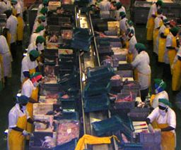
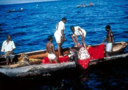
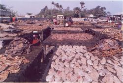

Title: Þorskur á þurru landi eða fagur fiskur í sjó?
Slug: thorskur-a-thurru-landi-eda-fagur-fiskur-i-sjo
Date: 2007-03-27 12:24:00
Part: 1/2
UID: 145
Lang: is
Author: Hilmar Magnússon
Author URL: 
Category: Stjórnmálafræði
Tags: 

Fisk upp á hvern disk! Þessi setning gæti í raun verið inntak fyrsta markmiðs Þús&shy;aldar&shy;mark&shy;miðanna svokölluðu, en hún fjallar um hvorki meira né minna en útrýmingu fátæktar og hungurs úr heiminum. Þús&shy;aldar&shy;mark&shy;miðin átta eru helstu áhersluatriði Þúsaldar&shy;yfirlýsingar Sameinuðu þjóðanna, sem samþykkt var á 55. alls&shy;herjar&shy;þingi samtakanna árið 2000. Yfirlýsingin tekur einnig á heilbrigðis-, mennta-, jafnréttis-, umhverfis- og rétt&shy;lætis&shy;málum, en í þessum fyrsta punkti er markmiðið að minnka hlutfall þess fólks í heiminum sem býr við örbirgð og hungur um helming frá því sem það var árið 1990. Takmarkið á að nást árið 2015.[^1]

Eflaust þykir mörgum þessi markmið heldur háleit og líklega er hægt að deila lengi um hvort eða hvenær þessu takmarki verður náð. En burtséð frá því, þá eru þessi markmið orðin að almennum viðmiðum í alþjóðlegri þróunar&shy;sam&shy;vinnu og íslensk stjórnvöld aðilar að þeim.[^2] Því er ekki úr vegi að spyrja um hvar Íslendingar ætli að leggja sitt lóð á vogar&shy;skálarnar og hvernig þeir muni aðstoða þau ríki heims sem búa við hvað lökust lífskjörin.

### Hvert stefna Íslendingar í þróunarmálum? 

Í þessari grein verður skyggnst inn í stefnu íslenskra stjórnvalda í þróunarmálum og sjónum beint að einum anga þeirra, nánar tiltekið verkefnum Þróunar&shy;sam&shy;vinnu&shy;stofnunar Íslands (hér eftir nefnd ÞSSÍ) á sviði fiskimála. Sérstaklega verða til umfjöllunar verkefni hennar í Afríkuríkinu Malaví og spurningum um tilgang, umfang, nálganir, framkvæmd og árangur svarað. 

Í síðari hluta greinarinnar verður rætt um kenningar í tvíhliða þróunar&shy;sam&shy;vinnu, þeim vettvangi sem ÞSSÍ starfar á. Helstu viðhorf og nálganir á þessu sviði verða rakin, þau borin saman og litið á hvernig þau hafa breytt starfs&shy;að&shy;ferðum og hugmyndum fólks innan geirans. Horft verður á framvindu þessarra mála erlendis og hún borin saman við þróunina í starfi ÞSSÍ.

Þá verða verkefnin í Malaví skoðuð í ljósi þessarra kenninga. Haft verður að leiðarljósi hvort þau kunni að hafa orðið fyrir einhverjum áhrifum af þeirra völdum og reynt að meta þau út frá styrkleikum og veikleikum. Hafa fiski&shy;mála&shy;verk&shy;efnin í raun skilað sér í bættum hag Malavíbúa? Eiga þau framtíðina fyrir sér sem fagur fiskur í sjó, eða eru þau dæmd til að daga uppi eins og þorskur á þurru landi?

### Fiskimálaverkefni ÞSSÍ - upphaf, framvinda og umfang

Upphaf fiski&shy;mála&shy;verk&shy;efna ÞSSÍ má rekja aftur til ársins 1979 þegar hafinn er undirbúningur að verkefni um þróun sjávarútvegs á Græn&shy;höfða&shy;eyjum. Árið eftir tekur ÞSSÍ formlega til starfa og hefur vinnu við þetta fyrsta sjálfstæða verkefni sitt.[^3] Upphafið er í takt við breyttar áherslur í þróunarmálum á áttunda áratug síðustu aldar. Á þessum tíma er verið að snúa frá iðnvæðingu og áhersla þess í stað lögð á frumþarfir, s.s. framleiðslu matvæla, hreint vatn, húsaskjól, grunnmenntun og heilsu&shy;gæslu.[^4] Allt frá þessu fyrsta verkefni ÞSSÍ hafa fiski&shy;mála&shy;verk&shy;efnin skipað stærsta sessinn í starfinu og voru reyndar, ásamt smáum hliðar&shy;verkefnum af félagslegum toga, í raun eina tegundundin í starfsemi stofnunarinnar fram til ársins 2000.[^5]

Með tilkomu nýrra verkefna á sviðum heilbrigðis-, mennta- og félagsmála hin síðari ár, hefur vægi fiski&shy;mála&shy;verk&shy;efnanna þó farið minnkandi.[^6] Árið 2005 er hlutdeild þeirra í heildar&shy;fjár&shy;fram&shy;lögum ÞSSÍ þannig komin niður í 31%, en eftir sem áður eru þau enn stærsti hluti kökunnar.[^7] En hvenær hóf ÞSSÍ afskipti sín af fiskimálum í Malaví?

### SADC- fisk&shy;veiði&shy;verk&shy;efnið, Malaví&shy;vatns&shy;verk&shy;efnið og Bunda háskóli

Þróunar&shy;sam&shy;starf ÞSSÍ við Malaví má rekja aftur til ársins 1989 og tengist það í byrjun stuðningi Norðurlanda við almennt sam&shy;starfs&shy;verk&shy;efni ríkja í sunnanverðri Afríku - skammstafað SADC. Hlutverk ÞSSÍ var að sinna fisk&shy;veiði&shy;hluta þessa samstarfs. Fljótlega kom í ljós að SADC-ríkin sýndu þessu verkefni lítinn áhuga og hvíldi það nánast að öllu leyti á starfsfólki ÞSSÍ. Árið 1996 var reynt að koma verkefninu í höfn með samningi um stuðning Malavískra stjórnvalda og samkvæmt skýrslu frá 2001 var þá tilbúin fullkomin tæknimiðstöð, með farartækjum og fjórum þjálfuðum starfsmönnum og verkefni ÞSSÍ þar með lokið.[^8]

Malaví&shy;vatns&shy;verk&shy;efnið hófst árið 1990 í samvinnu við Alþjóða&shy;bankann og Norræna þróunar&shy;sjóðinn - NDF og var annað helsta verkefni ÞSSÍ í Malaví allan 10. ára&shy;tuginn.[^9] Meginmarkmið verkefnisins var að efla sjálfbærar veiðar á vatninu til að styrkja efnahag landsins og skjóta styrkari stoðum undir fæðuöflun lands&shy;manna.[^10] Verkefnið skiptist í tvo meginhluta: byggingu og rekstur rann&shy;sókna&shy;skips og fjárhagslegan stuðning við fiski&shy;rann&shy;sókna&shy;stöð. Mikill árangur varð af þessu verkefni sem sýndi fram á gjöful fiskimið úti á vatninu, þar sem áður höfðu ekki verið stundaðar veiðar. Miðin urðu grundvöllur togveiða á vatninu, en sjálfu verkefni ÞSSÍ lauk formlega árið 2000.[^11] 

Árið 1991, um svipað leyti og Malaví&shy;vatns&shy;verk&shy;efnið var að hefjast, tók ÞSSÍ þátt í að koma á fót fisk&shy;eldis&shy;deild við Land&shy;búnaðar&shy;há&shy;skóla Malaví. Verkefnið var á vegum SADC-ríkjanna og átti að þjónusta allt það svæði. Meiningin var að verkefnið nyti stuðnings fleiri aðila, m.a. Norðmanna, en sá stuðningur brást og því þurfti að takmarka nemenda&shy;fjöldann við 10-12 nemendur á ári frá öllu svæðinu. ÞSSÍ leiddi verkefnið, bæði hvað varðar rekstur og aðstöðu sem og námsstyrki og var verkefnið  enn í gangi árið 2005.[^12]

### Sjómanna&shy;skólinn, sjómælingar og kortagerð í Malavívatni

Á árinu 1999 undirritaði stofnunin samning um stuðning við sjómannaskóla sem settur hafði verið á laggirnar árið 1981. Skólinn var upphaflega eingöngu ætlaður farmönnum á Malavívatni, en með aukningu togveiða á vatninu hafði skapast þörf fyrir menntun yfirmanna á fiskiskipum. Höfuð&shy;verk&shy;efnið var að ráða tvo íslenska kennara sem sjá skyldu um endur&shy;skipu&shy;lagningu, gerð námsskráa, þjálfun innlendra kennara og fleira.[^13]

Kortlagning og sjómælingar á Malavívatni var næst á dagskrá ÞSSÍ og í lok árs 2000 undirritaði stofnunin samning þar að lútandi. Þarna var orðið aðkallandi að gera ný kort, bæði til nota í samgöngum og fiskveiðum. Þáverandi kort voru yfir fjörutíu ára gömul og höfðu ekki verið uppfærð, þrátt fyrir verulegar breytingar á sjálfu vatninu í gegnum árin. Í þessu verkefni lagði stofnunin fram tækniaðstoð og hluta rekstrar&shy;kostnaðar.[^14]

### Fiski&shy;mála&shy;verk&shy;efnin í Malaví - umfang

Eins og sjá má af upp&shy;talningunni hér að framan hafa umsvif ÞSSÍ í Malaví verið töluverð í gegnum árin. Árið 2005 má því til staðfestingar sjá á ríkis&shy;reikningi að fyrirferðin í starfseminni er langmest í Malaví, sem tekur til sín um 25% af heildar&shy;fjár&shy;magni stofnunarinnar. Reyndar þarf að fara allt aftur til ársins 2000 til að sjá önnur lönd ofar á blaði.[^15] Landið sker sig ekki úr með tilliti til skiptingar á milli málaflokka, hún er í fullu samræmi við heildar&shy;þróunina í fjárútgjöldum stofnunarinnar, þar sem hlutur fiskimála fer minnkandi.[^16] 

Eftir þessa innsýn í fiski&shy;mála&shy;verk&shy;efni ÞSSÍ og starfið í Malaví er rétt að líta á aðferða&shy;fræðina í þróunar&shy;sam&shy;vinnunni. Í næsta hluta greinarinnar verða bornar saman helstu nálganir og kenningar í faginu og þær settar í samhengi við vinnulag stofnunarinnar og það sem tíðkast í þessum málum fyrir utan lands&shy;steinana.

----

#### Heimildir

* Björn Dagbjartsson (2005). „Stuðningur ÞSSÍ við fiskimálaverkefni. Sögulegt yfirlit.“ _Þróunarmál. Fréttabréf um þróunarmál. Þróunarsamvinna í fiskimálum_, 32.hefti, 20.árg., bls.3-8. Reykjavík: Þróunarsamvinnustofnun Íslands.
* Hermann Örn Ingólfsson & Jónas H. Haralz (2003). _Ísland og þróunarlöndin. Álitsgerð um þróunarsamvinnu Íslands og þátttöku í starfi alþjóðastofnana_ (skýrsla). [vantar útgáfustað]: [vantar útgefanda].
* Sjöfn Vilhelmsdóttir (umsjón með útgáfu) (2005). _Stefna og verklag ÞSSÍ_. (bæklingur). Reykjavík: Þróunarsamvinnustofnun Íslands.
* Utanríkisráðuneytið (2005). _Stefnumið Íslands í þróunarsamvinnu 2005-2009_. [vantar útgáfustað]: Utanríkisráðuneytið.
* Valgerður Sverrisdóttir (2006). _Skýrsla Valgerðar Sverrisdóttur um utanríkis- og alþjóðamál. (Lögð fyrir Alþingi á 133.löggjafarþingi 2006-2007.)_. [vantar útgáfustað]: [vantar útgefanda].
* Þórdís Sigurðardóttir (2002). „Ný sjónarmið í þróunarsamvinnu. Frá verkefnum til geirastuðnings og samþættingar.“ _Þróunarmál. Fréttabréf um þróunarmál. Líf og starf í Afríku_, 30.hefti, 17.árg., bls.19-21. Reykjavík: Þróunarsamvinnustofnun Íslands.

[^1]: Hermann Örn Ingólfsson & Jónas H. Haralz 2003:3.
[^2]: Utanríkisráðuneytið 2003:6-9.
[^3]: Björn Dagbjartsson 2005:4.
[^4]: Hermann Örn Ingólfsson & Jónas H. Haralz 2003:1.
[^5]: Hermann Örn Ingólfsson & Jónas H. Haralz 2003:23.
[^6]: Hermann Örn Ingólfsson & Jónas H. Haralz 2003:24.
[^7]: Valgerður Sverrisdóttir 2006:81
[^8]: Hermann Örn Ingólfsson & Jónas H. Haralz 2003:43. 
[^9]: Hermann Örn Ingólfsson & Jónas H. Haralz 2003:43.
[^10]: Björn Dagbjartsson 2005:5.
[^11]: Hermann Örn Ingólfsson & Jónas H. Haralz 2003:43.
[^12]: Björn Dagbjartsson 2005:5.
[^13]: Hermann Örn Ingólfsson og Jónas H. Haralz 2003:45. 
[^14]: Hermann Örn Ingólfsson og Jónas H. Haralz 2003:45.
[^15]: Valgerður Sverrisdóttir 2006:93-94.
[^16]: Hermann Örn Ingólfsson & Jónas H. Haralz 2003:49.

