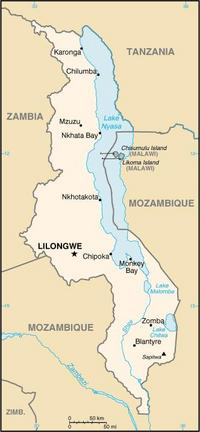
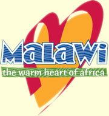
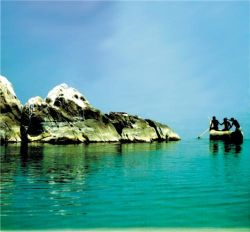

Title: Þorskur á þurru landi eða fagur fiskur í sjó?
Slug: thorskur-a-thurru-landi-eda-fagur-fiskur-i-sjo
Date: 2007-03-29 11:00:00
UID: 146
Lang: is
Part: 2/2
Author: Hilmar Magnússon
Author URL: 
Category: Stjórnmálafræði
Tags: 

Þróunar­&shy;sam­&shy;starf Þróunar&shy;­sam­&shy;vinnu­&shy;stofnunar Íslands (ÞSSÍ) við Malaví má rekja aftur til ársins 1989 og tengist það í byrjun stuðningi Norðurlanda við almennt sam&shy;starfs&shy;verk&shy;efni ríkja í sunnanverðri Afríku - skammstafað SADC. Í fyrri hluta þessarar greinar var gefin innsýn í fiski&shy;mála&shy;verk&shy;efni ÞSSÍ og starfið í Malaví. Því er rétt að líta á aðferða&shy;fræðina í þróunar&shy;sam&shy;vinnunni. Hér á eftir verða bornar saman helstu nálganir og kenningar í faginu og þær settar í samhengi við vinnulag stofnunar&shy;innar og það sem tíðkast í þessum málum fyrir utan lands&shy;steinana.

### Viðhorf og kenningar - verk&shy;efna&shy;nálgun

Í þessu sambandi ber fyrst að geta þess að ÞSSÍ hefur frá upphafi unnið á grunni svokallaðrar verk&shy;efna&shy;nálgunar (project-wide approach). Þessi nálgun í þróunarstarfi felur í sér að aðstoðinni er varið í einstök afmörkuð verkefni á þeim sviðum sem stofnunin vinnur með.[^17]

Kostirnir við þessa nálgun eru þeir helstir að verkefnin eru skýrt afmörkuð og þeim stjórnað af þeirri stofnun sem í hlut á. Þannig getur hún sjálf valið þá ráðgjafar- og fram&shy;kvæmdar&shy;aðila sem koma eiga að verkefninu. Öll umsýsla, greiðslur og bókhald fara einnig fram samkvæmt skilmálum stofnunar&shy;innar og hún á því auðvelt um vik með að tryggja að fjármagnið lendi ekki í röngum höndum í sam&shy;starfs&shy;landinu. Jafnframt er tryggt að stofnunin hafi góða yfirsýn yfir stjórn og ábyrgð framkvæmdanna og þess fjármagns sem í þær fer.[^18]

Á níunda áratug síðustu aldar fór að bera á gagnrýni á þessa nálgun. Fólst hún meðal annars í því að nálgunin tæki ekki nógsamlegt tillit til heildar&shy;að&shy;stæðna í sam&shy;starfs&shy;löndunum eða stefnu ríkisstjórna þeirra. Einnig þótti samræmingu skorta á milli þeirra stofnana sem voru í stuðningi við einstök verkefni innan sömu geira. Verk&shy;efna&shy;nálgunin þótti því ómarkviss og ekki til þess fallin að ná nægilega góðum og varanlegum árangri.[^19] 

Ekki er nóg með að einstök verkefni þyki í þessu tilliti hafa tilhneigingu til að vera í of litlum tengslum við þá heildar&shy;stefnu sem mörkuð hefur verið í viðkomandi geira. Fleiri gallar hafa verið tíndir til. Verkefnin snúast oft um fjárfestingar í mannvirkjum og þjálfun, en ekki rekstur og viðhald. Því er hætta á að þeim sé ekki fylgt eftir af heimamönnum þegar þróunar&shy;stofnunin er farin. Þegar kemur að yfirtöku heima&shy;landsins á verkefni sem það hefur jafnvel mjög takmarkað komið að sjálft, fer málið einnig að snúast um eignarhald á því og hver það er sem hefur leitt það. Þarna getur sá kostur sem annars felst í algjörri verk&shy;efna&shy;stýringu þróunar&shy;stofnunar&shy;innar farið að snúast upp í andverfu sína.[^20]

### Viðhorf og kenningar - geiranálgun

Geiranálgun (sector-wide approach) þykir taka betur á þessu vandamáli. Nálgunin snýst um heildar&shy;stuðning stofnana innan fárra geira í samstarfs&shy;löndunum og horfið er frá stuðningi við lítil og afmörkuð verk&shy;efni.[^21] Í stað þess er byggt á heildar&shy;lausnum í formi mark&shy;miða&shy;setningar, áætlana&shy;gerðar, uppbyggingar og rekstrar og starfinu beint að þeim lang&shy;tímamark&shy;miðum sem heimamenn sjálfir hafa sett sér.[^22]

Kostir þessarrar nýju stefnu eru einfaldari starfsemi stofnana í sam&shy;starfs&shy;löndunum og minni stjórnunar&shy;þörf þeirra. Þessi nálgun leggur einnig meiri stjórnunar- og fjár&shy;hags&shy;ábyrgð í hendur sam&shy;starfs&shy;landanna og er það lykilatriði. Þetta atriði er nefnilega talið stuðla að og auka eignarhald (ownership) stjórnvalda í sam&shy;starfs&shy;löndunum á þróunar&shy;við&shy;fangs&shy;efnunum.[^23] Þetta aukna eignarhald leiðir svo aftur til þess að líkurnar á að verkefnin verði árangursrík og sjálfbær vaxi.[^24]

Gallar geira&shy;nálgunarinnar eru einkum þeir að erfiðara er fyrir þróunar&shy;sam&shy;vinnu&shy;stofnanir að fylgjast með ráðstöfun þess fjár sem veitt er til verkefnanna. Þetta getur skapað meiriháttar spennu á milli þeirra og ríkis&shy;stjórna þeirra sam&shy;starfs&shy;landa þar sem spilling ríður húsum og stjórnsýsla er veik. Þá getur það gerst að aðstoðin fari í súginn og skili nánast engu.[^25]

### Viðhorf og kenningar -  samþætting

Þriðja hugtakið sem vert er að nefna þegar rætt er um viðhorf og kenningar er hugtakið samþætting (main&shy;streaming). Þetta hugtak hefur fengið mikið rými innan þróunar&shy;sam&shy;félagsins undanfarið og fléttast inn í þær skipu&shy;lags&shy;breytingar sem hafa orðið í átt að geirabundinni aðstoð. Hugtakið á sér þó nokkra sögu og er sprottið upp úr gagnrýni á að þróunar&shy;verk&shy;efni tækju ekki tillit til allra hópa samfélagsins, væru einangruð, sundurlaus, til&shy;viljana&shy;kennd og hálfpartinn eins og álfar út úr hól.

Femínistar hafa hér dregið vagninn og krafist þess að jafn&shy;réttis&shy;sjónar&shy;mið væru ekki einungis samþætt þróunar&shy;starfi, heldur almennum mark&shy;miða&shy;setningum ríkja heims. Þetta þýðir einfaldlega að kynjavíddin sé allsstaðar nálæg, taki á öllum þáttum þróunar&shy;starfsins og móti inntak, aðferðir og afrakstur vinnunnar. Þannig verði komið í veg fyrir aðferðir sem snúa að sértækum aðgerðum í þágu kvenna eða karla. 

Sam&shy;þættingar&shy;mark&shy;mið hafa verið mikilvægur hluti í endurskoðun þróunarstarfs liðinna ára og eru notuð á tvennum vígstöðvum: inni í stofnununum sjálfum og á vettvangi. Nú er einnig svo komið að langflestar þróunar&shy;stofnanir setja skilyrði um samþættingu fyrir aðstoðinni og þær kröfur takmarkast ekki við kynja&shy;sjónar&shy;mið. Hér er nefnilega líka tekið á lýðræði, mannréttindum og umhverfi, svo eitthvað sé nefnt.[^26]

### Breyttar aðferðir - hvar stöndum við gagnvart umheiminum?

Bæði al&shy;þjóða&shy;stofnanir og einstök ríki hafa undanfarið gjörbreytt afstöðu sinni til þróunar&shy;að&shy;stoðar. Norðurlöndin hafa verið í forystu um þessar breytingar og lagt þunga áherslu á þær. Flestir hafa tekið upp geiranálgun í starfi sínu og leggja nú áherslu á virka þátttöku og forystu sam&shy;starfs&shy;landanna, í samræmi við þá stefnu sem viðkomandi lönd sjálf hafa markað sér. Aðstoðar&shy;landið hefur þó alltaf í hendi sér hvort aðstoð sé veitt eða ekki, því stefnu móttöku&shy;landsins þarf að samþykkja og meta hvort það sé fært um að standa að framkvæmd að&shy;stoðar&shy;innar. Þessi vinnubrögð kalla á nánara samráð milli þróunarlanda, stuðnings&shy;landa og alþjóða&shy;stofnana. Einnig reyna þau á trausta stjórn við&shy;töku&shy;landanna og ættu þannig að vera hvati til þess að efla hana enn frekar.[^27]

Þótt íslensk þróunar&shy;samvinna hafi hingað til aðallega falist í verk&shy;efna&shy;bundinni aðstoð, hefur í vaxandi mæli verið tekið mið af heildar&shy;áætlunum í þeim geirum sem hún styður í hverju landi.[^28] Ekki er þó gert ráð fyrir að ÞSSÍ hverfi frá einstökum verkefnum til aðstoðar við heila málaflokka eða atvinnu&shy;greinar og að baki þeirri stefnu liggja ekki flókin rök. Til að aðstoðarinnar geti gætt innan heilla atvinnu&shy;greina, þ.m.t. fiskveiða og vinnslu, er hún einfaldlega alltof smá í sniðum.[^29]

Hins vegar er það stefna ÞSSÍ að taka í auknu mæli þátt í samræmingu þróunarstarfs á alþjóða&shy;vett&shy;vangi, kynna sér þróunar&shy;áætlanir og reyna að tryggja að þróunar&shy;sam&shy;starfið sé á forsendum sam&shy;starfs&shy;landsins. Hún mun einnig reyna að tryggja að þeir hópar sem þróunar&shy;starfið snertir, taki virkan þátt í undirbúningi og framkvæmd verkefna í anda svokallaðrar þátt&shy;töku&shy;nálgunar (participatory approach). Með þessum aðgerðum á að tryggja að eignarhald á verkefnum ÞSSÍ færist yfir til sam&shy;starfs&shy;landanna.[^30]

Þá hefur ÞSSÍ farið að fordæmi flestra annarra systur&shy;stofnana og hafið vinnu með sam&shy;þættingar&shy;mark&shy;mið í verkefnum sínum, aðallega á sviði jafn&shy;réttis&shy;mála.[^31] Greinilegur vilji er til halda þeim markmiðum á lofti, þar sem hnykkt var enn frekar á þessari stefnu í riti utan&shy;ríkis&shy;ráðu&shy;neytisins um stefnumið Íslands í þróunar&shy;samvinnu frá árinu 2005.[^32] 

### Niðurstöður - fiski&shy;mála&shy;verkefnin í Malaví metin í ljósi kenninganna

Eftir samanburðinn á framan&shy;greindum nálgunum og kenningum er fróðlegt að bakka aðeins og líta á nokkur af  fiski&shy;mála&shy;verk&shy;efnunum í Malaví í nýju ljósi.

Sé SADC-fisk&shy;veiði&shy;verk&shy;efnið skoðað vekur strax athygli hversu lítinn áhuga SADC-ríkin sjálf sýndu því og hvernig það lenti nánast að öllu leyti á starfsfólki ÞSSÍ. Hér gætu neikvæðir þættir verk&shy;efna&shy;nálgunar verið að verki, svo sem að stefna viðkomandi ríkja hafi ekki verið höfð nægjanlega að leiðarljósi við sköpun verkefnisins eða að þátttaka heimamanna hafi ekki verið næg strax á fyrstu stigum og þar af leiðandi leitt til áhugaleysis varðandi eignarhald að verkefninu.

Í út&shy;tektar&shy;skýrslum um Malaví&shy;vatns&shy;verk&shy;efnið er ÞSSÍ hrósað fyrir tæknihliðina sem og góða skilgreiningu á hlutverkum í samstarfinu við NDF.[^33] Verkefnið virðist því vera skýrt afmarkað, sem er einn af styrkleikum verk&shy;efna&shy;nálgunar. Á seinni stigum fer þó starfsemi fisk&shy;rann&shy;sóknar&shy;stöðvarinnar og útgerð rann&shy;sóknar&shy;skipsins mjög halloka og gerist það eftir að ÞSSÍ afhendir heimamönnum verk&shy;efnið.[^34] Hér gæti aftur verið um að ræða vandamál varðandi eignarhald og eftirfylgni í verk&shy;efna&shy;nálgun.

Starfsemin í Bunda háskóla, þar sem stuðningur ÞSSÍ er við fisk&shy;eldis&shy;deild, gengur nokkuð vel. Það sem lítur þó út fyrir að há verkefninu er að lítið fer fyrir fiskeldi í landinu að öðru leyti.[^35] Þarna virðist því vanta tvennt: samræmingu milli mismunandi aðila innan ólíkra þátta fisk&shy;eldis&shy;geirans og heildarsýn fyrir atvinnu&shy;greinina, hugsanlega vegna ómarkvissrar verk&shy;efna&shy;nálgunar.

Þegar allt er tekið saman má glöggt sjá að ÞSSÍ hefur átt sína góðu og slæmu daga í starfinu í Malaví. Mikið af þeim neikvæðu atriðum sem hér hafa komið fram má líklega skrifa á vinnuaðferðir og undirbúning. Það sýnir sig þó líka að þær nálganir sem stofnunin hefur hingað til unnið eftir geta fyllilega átt við í sumum tilvikum og þá sérstaklega vegna smæðar stofnunar&shy;innar.

Greinilegt er líka að starfsemi stofnunar&shy;innar er núorðið í stöðugri endurskoðun og mikil vinna í gangi við að útvíkka kenningalegan þekkingar&shy;grunn. Þá er mjög jákvætt að sjá að hún virðist hafa fullan hug á að tileinka sér og vera ávallt með nútímaleg vinnubrögð og aðferðir á takteinum í starfi sínu. Það má því með nokkurri vissu segja að Þróunar&shy;sam&shy;vinnu&shy;stofnun Íslands sé enginn þorskur á þurru landi. Jafnvel má færa rök fyrir því að hún stefni á að verða fagur fiskur í sjó.

---

#### Heimildir

* Björn Dagbjartsson (2005). „Stuðningur ÞSSÍ við fiskimálaverkefni. Sögulegt yfirlit.“ _Þróunarmál. Fréttabréf um þróunarmál. Þróunarsamvinna í fiskimálum_, 32.hefti, 20.árg., bls.3-8. Reykjavík: Þróunarsamvinnustofnun Íslands.
* Hermann Örn Ingólfsson & Jónas H. Haralz (2003). _Ísland og þróunarlöndin. Álitsgerð um þróunarsamvinnu Íslands og þátttöku í starfi alþjóðastofnana_ (skýrsla). [vantar útgáfustað]: [vantar útgefanda].
* Sjöfn Vilhelmsdóttir (umsjón með útgáfu) (2005). _Stefna og verklag ÞSSÍ_. (bæklingur). Reykjavík: Þróunarsamvinnustofnun Íslands.
* Utanríkisráðuneytið (2005). _Stefnumið Íslands í þróunarsamvinnu 2005-2009_. [vantar útgáfustað]: Utanríkisráðuneytið.
* Valgerður Sverrisdóttir (2006). _Skýrsla Valgerðar Sverrisdóttur um utanríkis- og alþjóðamál. (Lögð fyrir Alþingi á 133.löggjafarþingi 2006-2007.)_. [vantar útgáfustað]: [vantar útgefanda].
* Þórdís Sigurðardóttir (2002). „Ný sjónarmið í þróunarsamvinnu. Frá verkefnum til geirastuðnings og samþættingar.“ _Þróunarmál. Fréttabréf um þróunarmál. Líf og starf í Afríku_, 30.hefti, 17.árg., bls.19-21. Reykjavík: Þróunarsamvinnustofnun Íslands.

[^17]: Sjöfn Vilhelmsdóttir 2005:21.
[^18]: Þórdís Sigurðardóttir 2002:19.
[^19]: Sjöfn Vilhelmsdóttir 2005:21.
[^20]: Þórdís Sigurðardóttir 2002:19.
[^21]: Sjöfn Vilhelmsdóttir 2005:20.
[^22]: Þórdís Sigurðardóttir 2002:19.
[^23]: Sjöfn Vilhelmsdóttir 2005:20.
[^24]: Þórdís Sigurðardóttir 2002:19-20.
[^25]: Sjöfn Vilhelmsdóttir 2005:20.
[^26]: Þórdís Sigurðardóttir 2002:20.
[^27]: Hermann Örn Ingólfsson & Jónas H. Haralz 2003:9-10.
[^28]: Þórdís Sigurðardóttir 2002:21.
[^29]: Hermann Örn Ingólfsson & Jónas H.Haralz 2003:9-10.
[^30]: Sjöfn Vilhelmsdóttir 2005:15.
[^31]: Þórdís Sigurðardóttir 2002:21.
[^32]: Utanríkisráðuneytið 2005:18.
[^33]: Hermann Örn Ingólfsson & Jónas H. Haralz 2003:43-44.
[^34]: Hermann Örn Ingólfsson & Jónas H. Haralz 2003:43-44.
[^35]: Hermann Örn Ingólfsson & Jónas H. Haralz 2003:45.

