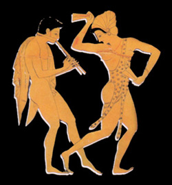
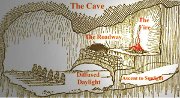
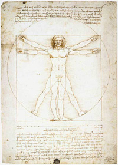

Title: Þróunin að listkerfi nútímans
Subtitle: Frá Platón til Kants
Slug: throunin-ad-listkerfi-nutimans-fra-platon-ad-kant
Date: 2007-02-27 11:00:00
UID: 137
Lang: is
Author: Margrét Áskelsdóttir
Author URL: 
Category: Listfræði, Heimspeki
Tags: 

Hver sá sem starfar á einhverju tilteknu sviði þarf að búa yfir ákveðinni verkkunnáttu innan sinnar starfsgreinar. Forngrikkir kölluðu þessa kunnáttu _techne_. Enginn greinarmunur var gerður á listamönnum og þeim sem fengust við aðrar starfsgreinar. Hvort sem um er að ræða bónda, kaupmann, stjórnmálamann, stærðfræðing, skáld eða myndlistarmann þarf viðkomandi að hafa _techne_, þekkingu á viðfangsefni sínu. Þótt ótrúlegt megi virðast þá kallast hugtakið _list_ á við hugmynd forngrikkjanna um _techne_. Rómverjar þýddu orðið _techne_ í orðið _ars_ sem síðar varð að orðinu _art_ á ensku. Og af þessu má sjá að þrátt fyrir að menn hafi fengist við listsköpun í árþúsundir þá er listhugtakið eins og við skiljum það í dag ekki ýkja gamalt. Flestir eru sammála um að málaralist, byggingarlist, höggmyndalist, skáldskaparlist og tónlist myndi kjarnann í listkerfi nútímans. Sumir telja þó að grafík, alls kyns skreytilistir, leiklist, dans, skrúðgarðahönnun, ópera, mælskulist og lausamálsbókmenntir eigi einnig heima í þessu kerfi. Listkerfi nútímans á sér langa þróun, en það varð ekki til í þeirri mynd sem við þekkjum það fyrr en um miðja átjándu öld.

Lengi vel var skáldskaparlistin talin sú listgrein er bæri höfuð og herðar yfir aðrar. Samkvæmt Platón og Aristóteles eru tónlist og dans ekki sjálfstæðar listgreinar heldur flokkast þær undir skáldskaparlist sem ljóðrænn og leikrænn þáttur skáldskapar. Fornaldarmenn litu almennt niður á þá sem unnu með höndunum, allar greinar sem kröfðust líkamlegrar áreynslu voru taldar óæðri hinum andlega efniviði. Menn gátu dáðst að verkum málara og annara sem fengust við gerð sjónlista en það var alls ekki eftirsóknarvert að vinna að slíkri list. Líklegt er að þetta viðhorf megi rekja til kenninga Platóns. Samkvæmt kenningum Platóns um aðgreininguna á milli hins æðri veruleika — heim frummyndanna — og hins jarðbundna heims er skáldskapur andlegur og tilheyrir því æðri hluta sálarinnar, en vegna þess að myndlist er jarðbundin tilheyrir hún óæðri hluta sálarinnar. Þrátt fyrir að málurum væri fundinn staður í lægri þrepum þjóðfélagsins, líktu þó nokkrir höfundar málverkinu við skáldskap. En vert er að geta að engin fræðileg ritgerð eða kerfisbundinn úttekt var skrifuð um sjónlistir á þessum tíma.

Kenningin um eftirlíkinguna er tileinkuð Platóni, í henni felst að listsköpun sé eftirlíking náttúrunnar. Svo að dæmi sé tekið er góður leikari sá sem að hermir vel eftir. Áhorfandinn gleðst þegar að hann uppgötvar að hann þekkir fyrirmyndina sem leikarinn hermir eftir. Það er mannlegt eðli að gleðjast yfir því að komast að einhverju nýju og læra. Það er uppgötvunin sem að menn sækjast eftir í eftirlíkingunni og þess vegna hafa menn þörf fyrir eftirlíkingar. Með eftirlíkingunni sáu sumir höfundar fornaldar tengsl milli málverks, höggmynda, skáldskapar og tónlistar og byrjuðu að bera saman myndlist og skáldskap. Engin gekk þó svo langt að fella ofangreindar listgreinar saman undir einn flokk. Í kjölfar uppgötvunnar Pýþagórasar á talnahlutföllum var komin fræðileg tenging frá tónlistinni yfir í stærðfræði. Þar af leiðandi var tónlistinni oft skipað við hlið stærðfræði og stjörnufræði sem stóð jafnan með skáldskap og dans. Myndlist, höggmyndalist og byggingarlist voru ekki í hóp hinna fögru lista heldur áttu þær sér stað meðal handverksgreina.

Á endurreisnartímanum urðu miklar breytingar á þjóðfélagslegri og menningarlegri stöðu margra listgreina. Með húmanismanum á sextándu öld komust lausabókmenntir og skáldskapur á þjóðtungu á sama stall og latneskar bókmenntir. Með endurfæðingu platónismans (á seinni hluta sextándu aldar) var blásið nýju lífi í hugmyndina um guðdómlegt æði skáldsins sem fór síðan að breiðast út meðal sjónlistanna. Þessi hugmynd er uppsprettan af nútímahugmyndinni um snillinginn. Sjónlistunum óx að sama skapi vegur og virðing á endurreisnartímanum. Nú var aukin þekking á mannslíkamanum, fjarvídd og flatarmálsfræði talin nauðsynleg fyrir málara og myndhöggvara. Margir kröfðust þess að fá sjónlistirnar viðurkenndar sem frjálsa list. Einn þeirra var Leonardo. Hann skilgreindi málaralist sem vísindagrein og fjallaði víða um tengsl málaralistarinnar við stærðfræði. Það er auðskiljanlegt í því ljósi að á þessum tíma var litið á hinar frjálsu listir sem vísindagreinar sem unnt væri að kenna. 

Málaralistin telur sig verðskulda meiri heiður á þessum tímabili og vill öðlast hlutdeild í virðingarsessi bókmenntanna. Í fornöld höfðu nokkrir höfundar sem skrifuðu um skáldskap líkt skáldskap við málverk en nú hafði umræðan snúist við. Nú var málverkið borið saman við skáldskap þegar ritað var um málverk, og kenningum og hugtökum úr skáldskaparfræði var beitt á málaralist. Hóratíus var sá sem mótaði þessa umræðu einna mest og voru skrif hans fyrirmynd þónokkurra ritgerða um málaralist. Það voru ekki einungis málaralist og skáldskaparlist sem tókust á um verðleika hvorrar annarar. Svona deilur mátti finna á milli hinna ýmsu greina, til að mynda á milli lögfræði og læknisfræði og deilan milli málaralistar og höggmyndalistar var ekki síður vinsæl. 

Í Frakklandi voru stofnaðar akademíur fyrir listir og vísindi. Konunglega málverka- og höggmyndaakademían var ein þeirra. Áður höfðu franskir listamenn tilheyrt gildum handverksmanna en með stofnun Konunglegu málverka- og höggmyndaakademíunnar losnuðu þeir undan þeim gildum sem höfðu tengst stétt handverksmanna. Akademíurnar gerðu hinum fögru listum þó ekki skil út frá vísindalegu sjónarmiði. Samt sem áður jukust umræður um sjónlistir mikið eftir að akademíurnar komust á laggirnar og mikið var skrifað um að myndlist og skáldskapur ættu að standa jafnfætis. 

Það var stórt skref í átt að listkerfi nútímans þegar munurinn á fornaldarmönnum og nútímamönnum var kannaður með það að leiðarljósi að sjá hverju nútímamaðurinn hafði áorkað umfram fornaldarmanninn. Auðvelt var að sjá að nútímamaðurinn stóð mun framar í þeim greinum sem byggðust á mælingum hvers konar. Erfiðara var þó að dæma um þær greinar er byggjast á hæfileikum eða smekk. Upp úr þessu varð aðgreiningin milli lista og vísinda enn skýrari. Að hluta til héldu endurreisnarmenn í kerfi miðalda en það voru augljóslega miklar breytingar sem gengu í garð og fagurfræðilegar kenningar héldu áfram að þróast. Sjónarhornið var einnig farið að breytast. Listirnar voru ekki einungis skoðaðar frá sjónarhóli listamannsins heldur frekar frá sjónarhóli áhorfandans, hlustandans eða lesandans. 

Á fyrri hluta átjándu aldar var kerfi fagurlistanna mikið í umræðunni. Margar ritgerðir voru skrifaðar um efnið en jafnframt ræddu menn efnið í samræðum, bréfaskriftum og skrifaðar voru þó nokkrar blaðagreinar. Skrif Abbé Dubos eru talin mikilvæg í þróun listrænnar hugsunar en ólíkt mörgum fyrri höfundum hefur Dubos ekki áhuga á yfirburðum einnar listar fram yfir aðrar. Hann ræðir það sem listirnar eiga sameiginlegt og einnig það sem er ólíkt með þeim. Hann gerir skýran greinarmun á vísindum sem byggjast á uppsafnaðri þekkingu og listum sem byggjast á hæfileikum. Dubos setur þó aldrei á blað það sem kalla mætti skilmerkilegt kerfi hinna fögru lista. Sá fyrsti sem skjalfesti skilmerkilegt kerfi hinna fögru lista var Abbé Batteux. Batteux reynir að sýna að sameiginlegur grundvöllur allra lista sé eftirlíking fagurrar náttúru. Margir hafa gagnrýnt Batteux en eftirlíkingin var þó eini grundvöllurinn sem hann gat notað á þessum tíma sem samnefnara hinna fögru lista. Gagnrýnendurnir taka það þó ekki með í reikninginn að þeir ganga að kerfinu vísu og eru einungis að reyna að finna því nýjan grundvöll. Í kjölfar Batteux var kerfi fagurlistanna skjalfest í inngangskafla  Alfræðibókarinnar og kerfið tók engum grundvallarbreytingum um nokkurt skeið. Alfræðibókin og fleiri rit um efnið voru þýdd yfir á mörg tungumál og þannig breiddist kerfið á milli landa. Í kjölfarið fóru enn fleiri höfundar að tjá sig um efnið. Í Þýskalandi var svo stigið eitt skref til viðbótar: Fræðileg umfjöllun um fagurlistirnar varð grein innan heimspeki, það er fagurfræði. Í aðdraganda þessa er vert er að nefna Baumgarten. Hann var fyrstur manna að telja listirnar sérstaka heimspekilega grein og telst þess vegna upphafsmaður að fagurfræðinnar. Honum tókst þó ekki að þróa kenningu sína svo að hún tæki til annara listagreina en skáldskapar og mælskulistar. Það var þó ekki fyrr en eftir daga Kants sem fagurfræðin öðlaðist fastan sess meðal viðfangsefna heimspekinnar.

Breytingar á listhugtakinu hafa verið mjög miklar frá því í fornöld og endurspegla að vissu leyti samfélög hvers tíma fyrir sig. Listgreinarnar eiga allar sitt blómaskeið og líklega á listkerfi nútímans eftir að halda áfram að taka breytingum fram eftir öldum.

