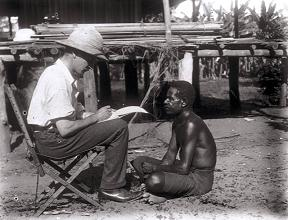

Title: Tilgangur etnógrafíunnar
Slug: tilgangur-etnografiunnar
Date: 2006-08-17 08:33:00
UID: 87
Lang: is
Author: Katla Ísaksdóttir
Author URL: 
Category: Mannfræði
Tags: 

Til þess að geta talist til mannfræðinga þarf maður að gera mannfræðilega rannsókn og birta sem etnógrafíu[^1]. Ýmsir fræðimenn vilja þar með halda því fram að eitt aðalhlutverk mannfræðinga sé að skrifa, og velta þannig fram spurningunni um hvers eðlis mannfræðin sé. Er hún skáldskapur eða vísindi? Er raunhæft að ætla sér að nálgast tiltekið samfélag á forsendum þeirra sem búa þar, eða er rannsóknin alltaf háð forsendum, viðhorfum og menningu rannsakandans? Er hægt að alhæfa um samfélög, nálgast tiltekinn kjarna eða sannleika, eða er hver rannsókn einstök upplifun rannsakandans á samfélaginu? Getur etnógrafían verið annað en þjóðhverf, eða öllu heldur sjálfhverf lýsing einstaklings á umhverfi sem ekki er hans eigið? Með því að fjalla um vangaveltur nokkurra mannfræðinga um þessar flóknu spurningar, mun ég reyna að átta mig á hvert ætlunarverk etnógrafíunnar í raun sé.

Menningarlega afstæðishyggju (cultural relativism), má rekja til Franz Boas og nemenda hans. Boas lagði áherslu á að engin menning væri öðrum æðri og til þess að rannsaka menningu þyrfti að skilja hana út frá henni sjálfri, en ekki dæma hana út frá eigin menningu. Alan Barnard sagði mannfræði síðan seint á 19. öld hafa flokkast undir menningarlega nauðhyggju (cultural determinism), og hafi þar með gengið út frá því að það sé menning hvers og eins sem ráði því hvernig menn skynja (perceive) heiminn. Þekkingarfræðileg afstæðishyggja (epistemological relativism) felur í sér að gert sé ráð fyrir því að svo gott sem engin takmörk séu á menningarlegri fjölbreytni. Þeir sem aðhyllast þessar hugmyndir segja mannlegt eðli vera menningarbundið, og þar með sé órökrétt að setja fram alhæfingar og kenningar um menningu. 

Clifford Geertz er einn þekktasti talsmaður þekkingarfræðilegrar afstæðishyggju. Hann þvertók fyrir að mannfræðin flokkaðist með vísindum. Hann tók undir með Max Weber sem hélt því fram maðurinn væri líkt og skepna föst í vef sem hann sjálfur hefur spunnið. Geertz sagði þennan vef vera tákn fyrir menningu og hann hélt því fram að greining á henni væri ekki vísindaleg leit að lögmálum, heldur túlkunarfræðileg leit að merkingu. Að hans mati ætti etnógrafían að leitast við að skapa svokallaða „þykka lýsingu“ (thick description), þ.e.a.s. ætti hún ekki einungis að rannsaka það sem sést á yfirborðinu heldur reyna að skilja menningarlegar athafnir fólks í stærra samhengi. Þær ætti að skoða út frá mörgum sjónarhornum og leita þannig að duldum merkingum sem felast í athöfnum fólks í hverju samhengi fyrir sig. Geertz sagði meginmarkmið mannfræðinnar vera „útvíkkun hinnar mannlegu orðræðu“. Hann taldi mikilvægt að leggja áherslu á hið sammannlega án þess að draga úr margbreytileika mannlegrar tilveru. 

Etnógrafíur geta að mati Geertz talist skáldskapur (fiction). Ekki er þar með sagt að þær séu falskar eða byggðar á lygasögum, heldur verða þær aldrei annað en skilningur og túlkun utanaðkomandi einstaklings á fólki sem er hluti af annarri menningu en hann sjálfur. Þar sem etnógrafía er lítið annað en upplifun mannfræðings á vettvangi á ákveðnum tímapunkti, sagði Geertz ekki vera hægt að afsanna þær. Þrátt fyrir að annar mannfræðingur komi í hans stað áratug síðar og komi í gjörbreytt samfélag, er ekki hægt að halda því fram að hinn fyrri hafi haft rangt fyrir sér. Þar sem ekki er til nein ákveðin uppskrift að etnógrafíu getur hún flokkast með fagurfræði. Hún er gagnrýnd fyrir sem það sem hún er, en ekki það sem hún ætti að vera.

Stoller heldur því fram að mannfræðingar skrifi sjaldan það sem þá í raun langi til að skrifa. Þeir eru bundnir í siðvenjur mannfræðinnar sem fræðigreinar og láti það stjórna sér hvað sé viðtekið innan fræðasamfélagsins og hvers konar textar séu venjulega birtir. Þannig forðist þeir að skrifa um persónulegar og tilfinningasamar upplifanir sem þeir hljóti þó undantekningarlaust að upplifa. Hann talar um mikilvægi þess að fræðimaðurinn láti umhverfið smjúga inn í sig líkt og góður listmálari. Að hann láti vettvanginn grípa sig og skrifi í gegn um upplifanirnar sem hann hlýtur að launum. Þannig birtist etnógrafían sem nýr vettvangur þar sem lesandi og höfundur skapa saman nýjan heim með nýjum merkingum, og niðurstaðan er, enn á ný, að mannfræðin sé listgrein, eða skáldskapur.

Henrietta L. Moore veltir fyrir sér hvers vegna sífellt fleiri mannfræðingar afneiti almennum kenningum og leggi þeim mun meiri áherslu á etnógrafíuna. Hún talar um hvernig póstmódernísk mannfræði hafi sett fram fram svo kallaðar „anti-kenningar“, þar sem hún forðist að setja fram stórar kenningar vegna þess að þær alhæfi um hið síbreytilega. Hinar póstmódernísku „anti-kenningar“ höfðu þau áhrif að mannfræðin var endurskoðuð, bæði hvað varðar mannfræðilegar aðferðir á vettvangi og hugmyndir um kenningar. Margir mannfræðingar reyna að snúa algjörlega baki við kenningasmíðum og halda á vettvang, þar sem þeir eru bundnir viðföngum sínum og samræðum við þau, og fá þannig ákveðna fjarlægð frá vestrænum gildum og kenningum. Moore kemst að þeirri niðurstöðu að kenningar séu nauðsynlegt tæki til þess að tengja menningar saman í gagnrýnan ramma, sem sé mikilvægt þar sem eitt af markmiðum mannfræðinnar sé að skoða gaumgæfilega eigin samfélög í gegn um uppbyggingu annarra.

Hversu mikið mark skal tekið á mannfræðinni nú eftir að hafa mulið hana í smátt með hinni póstmódernísku kvörn afstæðishyggjunnar? Hvað er vettvangsrannsókn annað en flótti ævintýragjarns vesturlandabúa frá akademískum hversdagsleikanum? Hvað er etnógrafían annað en fagurfræðileg útkoma ævintýrs þessa vesalings? Hver er tilgangurinn með þessum ósköpum? Reyni maður að varpa ljósi á tilgang mannfræðinnar sem mannfræðingur, mun maður augljóslega aldrei komast að niðurstöðu. Mannfræðingar virðast nefnilega ekki sætta sig við indælar litlar kenningar um einföld atriði, heldur sökkva sér dýpra og dýpra niður í hinn botnlausa kenningabrunn, og glatast að eilífu í tilgangsleysi alheimsfræðanna. En þar sem ég er ekki mannfræðingur þá vil ég í sakleysi mínu halda því fram að Stephen A. Tyler komist nokkuð nærri því að setja fram kenningu um tilgang etnógrafíunnar. Það virðist nokkuð ljóst að seint verður settur fram algildur sannleikur um menningu eða mannlegt eðli sem slíkt. Það virðist ekki einu sinni vera mögulegt að skrifa raunsanna lýsingu á fólki eins og það er, því fólk er ekki bara persónur í kringum mannfræðing, það er svo endalaust mikið meira en það. Póstmódernistinn Tyler gerir sér grein fyrir þessu og segir það rangt að setja fram etnógrafíu sem lýsingu, eða framsetningu (representation) á ákveðinni menningu. 

Etnógrafían er miklu meira en texti á blaði, hún er heill heimur sem myndast fyrir tilstilli þríeykisins viðfanga, höfundar og lesanda. Hún skal því vera einskonar uppvakning (evocation) fyrir þá sem koma að henni. Þannig er etnógrafían sem og vettvangsrannsóknin sjálf svo undurtilgangsmikil. Þær vekja upp nýjar upplifanir og tilfinningar hjá þeim sem fá að vera hluti af þeim. Í gegn um þær tengjast mörg ólík sjálf og hafa áhrif á mótun hvors annars, og fá um leið innsýn í og verða hluti af nýrri menningu. Þannig vil ég halda því fram að tilgangur etnógrafíunnar sé að minnka tilgangsleysi hins gráa hversdagsleika, þannig að við getum öll í sjálfsblekkingu ímyndað okkur að það sé einhver tilgangur með lífinu og heiminum og öllu saman. 

---

#### Heimildir

* Barnard, A. 2000. _History and theory in anthropology._ Cambridge: University Press.
* Geertz, C. 1973. _The interpretation of cultures._ New York: Basic Books.
* Geertz, C. 1988. _Works and lives: The anthropologist as author._ California: Stanford University Press.
* Moore, H. 1999. Anthropological theory at the turn of the century. Í _Anthropological theory today._ Cambridge: Polity press.
* Stoller, P. 1989. Eye, mind and word in anthropology. Í _The taste of ethnographic things._ Philadelphia: University of Pennsylvania Press.
* Tyler, S.A. 1986. Post-modern ethnography: From document of the occult to occult document. Í _Writing Culture: The poetics and politics of ethnography._ Berkeley: University of California Press.

[^1]: Á íslensku hefur etnógrafía verið nefnd „þjóðlýsing“ en þýðingin hefur ekki öðlast sterkan hljómgrunn meðal íslenskra mannfræðinga.

