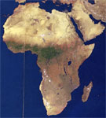

Title: Trúarleg lausn á veraldlegum vanda
Subtitle: Hvítasunnuhreyfingin og hagsæld í afrísku samhengi
Slug: truarleg-lausn-a-veraldlegum-vanda
Date: 2006-02-28 15:30:00
UID: 50
Lang: is
Author: Una Þóra Eyjólfsdóttir
Author URL: 
Category: Mannfræði, Trúarbragðafræði
Tags: 

> [...] og lýður minn, sá er við mig er kenndur, auðmýkir sig, og þeir biðja og leita auglitis míns og snúa sér frá sínum vondu vegum, þá vil ég heyra þá frá himnum, fyrirgefa þeim syndir þeirra og græða upp land þeirra.[^1]

Hvítasunnuhreyfingar[^2] njóta sívaxandi fylgis í Afríku[^3] og telja margir að ýmsar áherslur í boðskap þeirra, sérstaklega varðandi hagsæld, skýri vinsældir og öra útbreiðslu þeirra í samtímanum, á tímum hnattvæðingar og breyttrar heimsmyndar. Ofangreint Biblíuvers fangar á vissan hátt kjarna hreyfingarinnar í afrísku samhengi og það hefur raunar orðið að slagorði meðal hvítasunnumanna í Nígeríu vegna þeirrar vonar sem það veitir um lausn landlægra vandamála. En í hverju felst sérstaða hvítasunnuhreyfingarinnar í kristinni trú?

Saga hvítasunnuhreyfingarinnar er tiltölulega stutt[^4] en sjálf telur hún sig vera að endurvekja „hið fulla gospel“, þ.e. gamlar kenningar eins og þær birtast í Biblíunni. Áherslurnar eru á frelsun og trúarréttlætingu, endurkomu Krists, guðlega heilun og að lokum hinn heilaga anda en hann á að stuðla að farsælu lífi kristins einstaklings og gera honum kleift að framkvæma hið yfirnáttúrulega. Trú á skírn hins heilaga anda á hvítasunnudag meðal fyrstu lærisveina Jesú Krists er einnig áberandi en hvítasunnumenn telja að allir trúaðir geti öðlast svipaða reynslu nú á tímum.

Innan hvítasunnuhreyfingarinnar er lögð mikil áhersla á þátttöku einstaklingsins við boðun fagnaðarerindisins og mælst er til að einstaklingar sýni persónulega helgun í lífi sínu sem oftast felst í höfnun á áfengi, tóbaki og almennum skemmtunum en slíkt er talið hlutgerving hins illa. Hvítasunnuhreyfingin setur sig einnig í andstöðu við allar kirkjur sem tengjast „hefðbundnum“ trúarþáttum, helgiathöfnum eða dulspeki. Sumir fræðimenn hafa bent á að hægt sé að flokka hreyfinguna til þeirrar tegundar kristni sem í daglegu tali er nefnd bókstafstrú en hugtakið vísar í þá kristnu hópa sem ala með sér bókstaflega túlkun á Biblíunni, boða strangt siðferði og reyna að skilja safnaðarmeðlimi frá afhelguðum freistingum. Hvítasunnumenn líta á sig sem hluta af sérstöku og heilögu samfélagi með áherslu á einingu þess og sjálfsmynd í forgrunni. Þeir telja sig „endurfædda“ en sú orðanotkun tengist hugmyndinni um að „gefa Kristi líf sitt“.

Ein kenning um ástæðu þess að hvítasunnuhreyfingin á svo miklu fylgi að fagna í Afríku er talin felast í þeim leiðum sem hún „miðlar, semur við og mildar nútímann“[^5]. Rannsóknir hafa sýnt að þáttaka í hvítasunnukirkjum geti leitt af sér nýjar leiðir til að tengjast heiminum, sérstaklega hvað varðar sambönd við fortíðina, forfeður og fjölskyldu. Innganga í hvítasunnukirkju er talin vera persónuleg ummyndun, leið til að fjarlægjast bæði stofnanabundin félagstengsl, sambönd og byrði hefðbundinna skyldna og væntinga í afrískum veruleika.

Athyglisvert einkenni hvítasunnukirkja er jafnframt staðsetning þeirra í samfélaginu. Þær höfða sérstaklega til yngri kynslóða með predikunarstíl sínum og hvatningu til þátttöku á nútímalegum sviðum, auk þess sem þær nýta sér opinskátt ýmsa miðla samtímans; fjölmiðla, myndbönd, útvarp og tímarit. Í þessu sambandi er mikilvægt að skoða áhuga hvítasunnumanna á nútímalegum háttum, neyslu og nýrri tækni og hvernig þeir hafni gildum samtímans en ekki endilega tækjum hans. Þannig er hvatt til siðferðislegrar endurnýjunar sem blönduð er vonum og væntingum um félagslegar og efnahagslegar framfarir og mikil áhersla er lögð á hvernig einstaklingurinn er „endurfæddur“ inn í nútímalegan heim.

Í raun má segja að hvítasunnuhreyfingin boði ákveðið rof við fortíðina sem tengist upptöku nútímalegra hátta en jafnframt höfnun á nútímalegum gildum. Í afrísku samhengi er þessi þáttur trúarbragðanna einstaklega áhugaverður þar sem hann tengist oft efnahagslegum raunum álfunnar. Þannig er áhugavert að skoða hvernig boðskapur hvítasunnuhreyfingarinnar um aukna hagsæld í lífi trúaðra tengist hnattrænum valdatengslum Afríku og þeim efnahagslegu vandamálum sem mörg afrísk þjóðríki glíma við. Á vissan hátt er því hægt að segja að með þátttöku í hvítasunnukirkjum er einstaklingum færður ákveðinn atbeini í óvissum raunveruleika. Í þessu sambandi er neysla og breyttar neysluvenjur einkar athyglisverður þáttur.

Í gagnlegri rannsókn sinni á viðhorfum hvítasunnumanna í Ghana til neyslu kemst Birgit Meyer (1998) að þeim niðurstöðum að þeir hafi sérstaka sýn á vörumarkaðinn þaðan sem alþjóðleg framleiðsla dreifist inn á einkaheimili. Neysluvörurnar eru taldar andsetnar en að jafnframt séu til leiðir til að umbreyta þeim í nothæfa hluti. Þetta samband trúarbragða og neyslu ber að skoða í ljósi hnattvæðingar, þ.e. þáttöku fólks í efnahagslegum, pólitískum, félagslegum, menningarlegum og trúarlegum ferlum og meðvitund þess um slík ferli. Meyer bendir auk þess á að nauðsynlegt sé að endurskilgreina ýmis hugtök eins og „neysluvörur“ og „neysla“ til þess að skilja hvernig hnattræn hagfræði er meðtekin í grasrótinni, t.d. af hvítasunnuhreyfingunni. 

Í Ghana hefur efnahagslegum lægðum fylgt fjölgun nýrra kirkja. Félagslega séð höfða kirkjurnar mest til fólks sem er tiltölulega valdalaust í hinu karllæga valdakerfi og það álítur inngöngu í kirkjuna sem leið til aukinna efnahagslegra tækifæra, helst á sviði viðskipta. Meyer telur að hægt sé að skýra þátttöku fólks í þessum kirkjum með þeirri sýn sem þær færa fólki gagnvart breyttum heimi og með leiðum til að takast á við bæði kosti og galla nútímans.

Eitt aðalatriði í boðskap hvítasunnukirkja er áhersla á farsælt líf sem endurspeglast í hugmyndum um að Guð muni blessa þá sem eru „endurfæddir“ með auðsæld. Framlag kirkjanna er þó fyrst og fremst táknrænt og lögð er áhersla á að einstaklingar afli tekna af eigin getu. Á móti veita kirkjurnar vernd og blessun á viðskiptaframtaki og með því að slíta á blóðbönd á táknrænan hátt þá styðja kirkjurnar efnahagslega einstaklingshyggju. Í óeiginlegum skilningi hvetur hvítasunnuhreyfingin til siðferðis sem styrkir „anda kapítalisma“ þó að slík hugsun bjóði fram fáar skilvirkar lausnir á víðtækri efnahagslegri vansæld og óhætt er að segja að flestir safnaðarmeðlimir séu fátækir. Framlag hvítasunnuhreyfingarinnar felst hins vegar í því ímyndaða rými sem hún býr til sem fólk notar til að takast á við langanir sínar í nútímalegan, sjálfstæðan og farsælan lífsstíl.

Að lokum er áhugavert að vísa í hugmyndir trúarlífsfélagsfræðingsins Stephen Hunt (2002) til að útskýra vinsældir hvítasunnuhreyfingarinnar í Afríku en hann hefur beint sjónum sínum að mótun sjálfsmyndar meðal v-afrískra (aðallega nígerískra) innflytjenda í Bretlandi. Hann kemst að þeim niðurstöðum að hvítasunnukirkjur í V-Afríku séu lykilafl í að móta gildismat og sjálfsmynd einstaklinga, auk þess sem hreyfingin sjálf aðlagar sig vel að fjölmenningarlegum aðstæðum á Vesturlöndum. Á erfiðum tímum hafi kenningar hvítasunnumanna um efnishyggju og gildi atvinnu einnig fallið í kramið hjá fólki í Nígeríu, ásamt því að fela í sér harða gagnrýni á þá spillingu og eyðslu sem einkennt hefur nígerískt samfélag á undanförnum áratugum. Á vissan hátt hafa hvítasunnukirkjur hampað ýmsum vestrænum gildum; efnishyggju, starfsframa og einstaklingsframtaki, auk þess að hvetja til sjálfstæðis í mótun eigin framtíðar meðal meðlima sinna.

Af þessu að dæma er því óhætt að segja að hvítasunnuhreyfingin „bæti“ stöðu Afríku í hnattrænu samhengi með því að færa meðlimum sínum tæki til endursköpunar eigin sjálfsmyndar og hugmyndafræði sem fellur betur að valdameiri öflum í sambandi Afríku og Vesturlanda. Í upphafi þessarar greinar var vísað í vers Biblíunnar þar sem lofuð er uppgræðsla lands þess lýðs sem snýr sér að andliti Guðs og tilbiður hann. Þessi hugmynd, eða sannleikur, er orðin að veruleika í huga fólks víðs vegar í Afríku. Staðreynd þessi er ágætis vísbending um þá valdalausu stöðu sem álfan býr við í hnattrænu samhengi.

----

#### Heimildir

* Hunt, Stephen. 2002. ‘Neither Here nor There’: The Construction of Identities and Boundary Maintenance of West African Pentecostals [rafræn útgáfa]. Sociology, 36(1), 147-169.
* Lauterbach, Karen. 2004. Transnational Religious Networks: A Study of Ghanaian Pentecostals in Europe and Ghana. Erindið var flutt á 13th Nordic Migration Conference AMID, 18-20. nóvember.
* Maxwell, David. 1999. Historicizing Christian Independency: The Southern African Pentecostal Movement [rafræn útgáfa]. Journal of African History, 40, 243-264.
* Mbe, Akoko Robert. 2002. New Pentacostalism in the Wake of the Economic Crisis in Cameroon [rafræn útgáfa]. Nordic Journal of African Studies 11(3), 359-376.
* Meyer, Birgit. 1998. Commodities and the Power of Prayer: Pentecostalist Attitudes Towards Consumption in Contemporary Ghana [rafræn útgáfa]. Development and Change, 29, 751-776.
* van Dijk, Rijk A. 2000. Christian Fundamentalism in Sub-Saharan Africa: The Case of Pentecostalism [rafræn útgáfa]. Occasional Paper: Centre of African Studies University of Copenhagen.

[^1]: Síðari Kroníkubók, 7: 14.
[^2]: Með hugtakingu hvítasunnuhreyfing hef ég í huga enska orðið pentecostalism.
[^3]: Samkvæmt Wikipedia eru 41.1 milljónir fylgjenda í Afríku (Nígería með flesta 12 milljónir)
[^4]: Hreyfingin var stofnuð 1906 í Kaliforníu, BNA.
[^5]: Sjá Van Dijk

