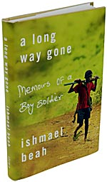
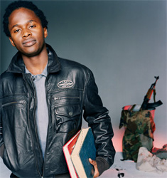

Title: Um langan veg.
Subtitle: Vangaveltur um bækur, börn og stríð.
Slug: um-langan-veg-vangaveltur-um-baekur-boern-og-strid
Date: 2007-11-20 14:51:00
UID: 196
Lang: is
Author: Hafdís Hafsteinsdóttir
Author URL: 
Category: Menningarfræði, Bókmenntir, Dómar
Tags: stríð, barnahermenn, Sierra Leone, Playboy, Armani, sjálfsævisaga, endurminningar, Ishmael Beah, Blood Dimond, James Bond, The Last King of Scotland, Starbucks, minni, Dægurmenning

Talið er að um 300.000 börn gegni hermennsku einhvers staðar í heiminum í dag. Ishmael Beah frá Sierra Leone var eitt þessara barna. Hann gaf nýlega út endur&shy;minningar sínar, _A long way gone_ sem kemur út í íslenskri þýðingu fyrir jólin.Blöð og tímarit hafa dásamað bókina í bak og fyrir, enda þykir ekki annað við hæfi þegar um svona viðkvæmt mál er að ræða. Hugrekki til að viðurkenna misgjörðir sínar og einlæg iðrun eru hugtök sem vestrænir lesendur kunna vel að meta. Auk þess sem frasar eins og „svipting sakleysis æskunnar“ selja alltaf. Höfundur þessarar greinar las bókina og komst að því að vissulega inniheldur hún misgjörðir, iðrun og æsku sem er allt annað en saklaus. Þrátt fyrir það er hún ekki yfir alla gagnrýni hafin.

Í bókinni segir frá 13 ára gömlum Ishmael sem verður viðskila við foreldra sína þegar stríðið skellur á. Hann, ásamt vinum sínum, flækist um þorp og skóga Sierra Leóne þar til herdeild á vegum stjórnar&shy;hersins tekur þá að sér. Áður en félagarnir vita af eru þeir komnir með vopn í hendur, farnir að sniffa blöndu af kókaíni og byssupúðri, skipað að miða á lifandi fólk og toga í gikkinn. Eftir þrjú döpur ár við morð, blóðbað, eiturlyf og Rambó (Rambó I og II var helsta afþreying drengjanna) var Ishmael leystur undan herskyldu og settur í endurhæfingu á vegum Unicef. Síðar fluttist hann til Banda&shy;ríkjanna, hóf háskólanám og er nú útskrifaður stjórn&shy;mála&shy;fræðingur frá háskóla í New York.

Endur&shy;minningar úr stríðsátökum eru enginn nýlunda. Á tuttugustu öld hefur varla liðið það stríð að endur&shy;minningar fórnarlamba eða hetju úr sigurliðinu hafi ekki komið á prent nokkrum árum eftir að stríðinu lauk. Í sögu sinni er Ishmael bæði gerandi og þolandi í senn. Opinber vitnisburður þar sem að virkur þátttakandi í átökum ákveður að stíga fram og segja sögu sína er yfirleitt háður því að sögumaður vinni sér samúð heyrenda með einhverjum hætti. Ágætis dæmi um þetta eru bækur Ernest Hemingways og Stefan Zweigs. Þeir voru báðir hermenn í fyrri heimstyrjöld og þannig gerendur, en í bókum þeirra um stríðið verður fót&shy;göngu&shy;liðinn að vélbyssufóðri í þrátefli stórveldanna sem engu skeyta um ein&shy;stak&shy;linginn. Þar með verða þeir að fórnarlömbum stríðs&shy;firringar.

Skilyrði fyrir samúð lesenda er að höfundi takist með að sýna fram á stöðu sína sem fórnarlambs og vinna sér inn fyrirgefningu með því að sýna tiltekna iðrun[^1] .  Nöturlegar lýsingar þessara tveggja á aðstæðum hermannanna fær lesendur til að trúa þeim, fyrirgefa, sættast við og loks vorkenna. Ishmael er einnig gerandi sem verður að þolanda, en á öðrum stað í tíma og rúmi. Barnæska hans, eða öllu heldur skortur á henni, gerir hann að fórnarlambi allt frá byrjun og spurningunni um sekt hans er aldrei varpað fram. Einnig helgar hann endur&shy;hæfingunni hjá Unicef stóran hluta bókarinnar og er þar með búinn að festa á blað hið mikla og erfiða ferli viður&shy;kenningar gerða sinna og iðrunar.

Þó að við, lesendur á Vesturlöndum, getum auðveldlega fyrirgefið Ishmael, er sú niðurstaða ekki sjálfgefin. Fjölskyldur hermannanna eiga oft á tíðum erfitt með að fyrirgefa þeim og afneita þeim jafnvel. Einnig er algengt að barna&shy;her&shy;mennirnir snúi aftur til herflokka sinna eftir að endurhæfingu lýkur. Ishmael sneyðir vandlega fram hjá þessum málaflokkum í minningariti sínu og einfaldar þannig efnið ofan í lesendur. Valið á efnistökum er heldur engin tilviljun. Þó að bókin fjalli um fjarlæga atburði, þjáningu og aðstæður sem erfitt er fyrir okkur að skilja, verður hún til í samfélagi sem er okkur alls ekki framandi, nefnilega bandarísku há&shy;skóla&shy;sam&shy;félagi. Skrifuð á ensku, yfirlesin af prófessorum í New York og ritstýrt af stóru bókaforlagi. Við lesturinn flaug mér oftar en ekki í hug að Manhattan væri alveg jafn mikill áhrifavaldur þessarar frásagnar og atburðirnir sem hún byggir á.

Til að byrja með má nefna að efninu sem er þungamiðja bókarinnar, þ.e barna&shy;hermennska, er gefið afar lítið blaðsíðupláss í bókinni. Aðeins 35 síður af 274 eru helgaðar tíma Ishmaels í stjórnarher Sierra Leone. Þó spanna þessar fáu síður megnið af tímanum sem líður frásögunni. Á þessum 35 blaðsíðum skiptir höfundur líka um stíl. Í stað þess að vera kaótísk, verður frásagan skyndilega línuleg með eðlilegri framvindu, líkt og um hverja aðra skáldsögu væri að ræða. Um leið þrengist sjónarhornið óeðlilega mikið. Lýsingar á umhverfi og sam&shy;ferða&shy;mönnum, sem eru annars áberandi í bókinni, hverfa algerlega. Til dæmis hverfa kvenpersónur algerlega af sviðinu. Þær eru hvergi sjáanlegar, hvorki sem fórnarlömb, herfang eða hluti af herdeildinni. Þetta kemur illa heim og saman við skýrslur um konur og stúlkubörn í stríði. Samkvæmt skýrslum Rauða&shy;krossins, Human right watch og fleiri aðila[2],  er stúlkum rænt jafnt sem drengjum og þær gerðar að hermönnum, kynlífsþrælum og þjónustuliði hermanna. Flóttamenn, líkt og Ishmael var sjálfur, eru líka konur. Þessi algera fjarvera kvenna rýrir sann&shy;leiks&shy;gildi frá&shy;sagnar&shy;innar töluvert og lesandi fær enn og aftur á tilfinninguna að verið sé að einfalda efnið ofan í hann. Öllum spurningum sem bókin á að leitast við að svara, eins og t.d hvernig verður barn að hermanni og hvernig líf herdrengja sé, er vissulega svarað. Þeim er samt ekki svarað eins og um raunverulega atburði væri að ræða, heldur lýtur frásögnin lögmálum bók&shy;mennta&shy;fræðinnar um orsök, afleiðingu og framvindu. Sjálfur atburðurinn þegar Ishmael hittir fyrir herdeildina sem hann síðarmeir verður hluti af minnir einna helst á þegar Anakin Geimgengill varð að Svarthöfða í Stjörnu&shy;stríðs&shy;myndunum. (s. 118-125) Herforinginn í herdeild Ishmaels er illmenni á daginn, en les Shakespeare á kvöldin. Vitnar í enska leik&shy;rita&shy;skáldið milli þess sem hann skipar herdeild sinni fyrir. Allir unnendur gamalla James Bond mynda vita að alræmdustu illmennin eru jafnframt mjög vel að sér í skáldskap. 

Markmiðið með ofantöldum dæmum er ekki að lýsa yfir frati á sárs&shy;auka&shy;fullar endur&shy;minningar Ishmaels, heldur að sýna að ævisögur einstaklinga eru ekki endilega nátengdar við endur&shy;minningar þeirra. Ferlið frá upplifun yfir á bók er flóknara en svo. Umhverfi og hugarfar skrásetjara skipta líka máli um niðurstöðu endur&shy;minninga&shy;rita. Þegar Ishmael sest niður fyrir framan tölvuna sína í New York og skrifar niður handrit sem er lesið yfir af fjölda manna og kvenna sem hafa margra árareynslu af útgáfu slíkra bóka, er ekki ósennilegt að umhverfið hafi átt sinn þátt í að móta endurupplifun atburðanna. Sérstaklega ef tekið er tillit til hvernig sjónarhornið þrengist og víkkar á víxl og vel þekkt minni úr bókmenntum setja spor sín á frásögnina. Upplifun barnahermanns getur varla verið í takt við fagur&shy;fræði&shy;lega duttlunga.[^3]

Og þó. Efni bókarinnar er svo viðkvæmt og kaldranalegt að kannski þarf einmitt að einfalda það, klippa, skera og matreiða snyrtilega fyrir lesendur svo þeir fái ekki slag. Engu að síður verður útkoman sú, að lesendur eru hvergi hvattir til að taka afstöðu til efnisins. Með því að skrif söguna inní form sem allir lesendur þekkja úr öðrum sögum, bíómyndum og hvaðeina, er búið að taka afstöðuna fyrir okkur. Fyrir&shy;gefningin er sjálfsagður hlutur og þess eins krafist af okkur að við hristum hausinn að loknum lestri og segjum: Æi, en ömurlegt.

Ástæða þessara hugleiðinga er líka sú að markaðs&shy;setning hennar kemur undarlega fyrir sjónir. Fyrst ber að nefna að kaffi&shy;húsa&shy;keðjan Starbucks gerði samning við út&shy;gáfu&shy;fyrir&shy;tækið um að dreifa bókinni í verslunum sínum. Það er hálfbagalegt, því Starbucks hefur einmitt verið sakað um vafasama við&shy;skipta&shy;hætti við ríki í þriðja heiminum.[^4] Tímasetning bókarinnar er líka hentug, því að barna&shy;her&shy;mennska hefur verið framleiðendum í Hollywood hugleikin undanfarið. Má t.a.m nefna, kvikmyndirnar Blood Diamond, The Last King of Scotland og nýjustu James Bond myndina. Um leið og tenging málefnis við pop-kúltúr er gríðarleg auglýsing sem vekur athygli, þá getur það líka fjarlægt atburðina, sveigt þá og beygt til að þjóna neytendum.[^5]

Þegar þetta er þetta er skrifað er Ishmael Beah farinn að auglýsa leðurjakka, hannaða af Armani, undir merkjum Playboy. Því verður ekki ofsögum sagt að endur&shy;minninga&shy;bók Ishmaels Beah, _Um langan veg_, er verk sem hefur vissulega ferðast um langan veg.

[^1]: Holiday, Anthony: ,,To forgive and forget“ _Negotiating the past. The making of memory in South-African past_. Oxford. 1999. Bls.43-56

[^2]:  Margrét Gestsdóttir: [Barnahermenn- börn í stríði](http://redcross.lausn.is/Apps/WebObjects/RedCross.woa/1/swdocument/1039160/bornogstrid_skyrsla_margretar_g.pdf?wosid=false). [Skýrsla tekin af vef Rauða Krossins](). Sjá einnig vefsíðu [Human Right Watch](http://www.hrw.org).

[^3]: Dr. Sigurður Gylfi Magnússon fjallar nánar um þetta í doktors&shy;ritgerð sinni _Sjálfssögur. Minni-minningar-saga_. Reykjavík. 2005.

[^4]: Sjá t.d [fréttir um viðskipta&shy;hætti Starbucks í Eþópíu](http://abcnews.go.com/International/story/?id=26080113&page=1 ).

[^5]: Luscombe, Belinda: [,,Pop-culture finds lost boys“](http://www.time.com/time/magazine/article/0,9171,1584807,00.html). Tekið af heimasíðu Times Magazine 2.febrúar 2007.

