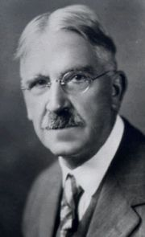

Title: Um markaðshyggju og lýðræði í skólastarfi
Slug: um-markadshyggju-og-lydraedi-i-skolastarfi
Date: 2006-10-10 09:28:00
UID: 100
Lang: is
Author: Kristján K. Stefánsson
Author URL: 
Category: Kennslufræði, Stjórnmálafræði
Tags: 

> Samkvæmt markaðshyggjunni er hver einstaklingur best til þess fallinn að velja það sem honum gagnast best og hentar hverju sinni. Þess vegna á einstaklingurinn sjálfur að velja. Sú spurning vaknar hvort allir foreldrar séu jafn vel í stakk búnir að velja námsleiðir og skóla við hæfi barna sinna. Félagsleg og fjárhagsleg staða fjölskyldna er misjöfn og þessi ólíka staða getur endurspeglast í möguleikum fólks til að velja námsleiðir fyrir börnin sín.  
> <cite>Gunnar E. Finnbogason, 1996.</cite>

Þetta textabrot er úr grein sem var skrifuð sem tilraun til að varpa ljósi á þau áhrif sem straumar markaðshyggjunnar hafa haft og geta haft á íslenska menntakerfið. Þau áhrif sem hér um ræðir komu í kjölfar þeirra frjálshyggjustrauma sem hafa tröllriðið hinum vestræna heimi allt frá stjórnartíð Margaretar Thatcher í Bretlandi og Ronalds Reagan í Bandaríkjunum. Textabrotið og greinin í heild sinni færa að mínu mati gild rök fyrir því að frjálshyggjan varpi ábyrgðinni á námi barnanna á foreldrana og þar með (í mörgum tilfellum) á herðar barnanna sjálfra. Textabrotið setur einnig spurningamerki við hversu vel foreldrar eru í stakk búnir til að velja námsleiðir og skóla við hæfi barna sinna. 

Hvernig eiga foreldrar/nemendur að fara að því að velja besta skólann og bestu námsleið? Það gefur auga leið að einhverskonar gæðamat verður að eiga sér stað, t.d. í formi prófa. Þá erum við komin í athyglisverða stöðu, próf sem í upphafi voru notuð til að jafna aðgang fólks að framgangi í menntakerfinu væru þess í stað notuð til að velja úr yfirstéttarskóla sem síðan myndu auka á misrétti í samfélaginu með mismunandi framgangi í menntakerfinu. 

Jafnframt má tengja þetta lýðræðisumræðunni. Stór meirihluti hins vestræna heims býr við svokallað fulltrúalýðræði. Kjarninn í fulltrúalýðræði gleymist oft í almennri lýðræðisumræðu. Ástæða þess að við kjósum fulltrúa á þing er einmitt sú að við felum þingmönnum að fara með ákvarðanir um hagsmuni heildarinnar. Í þessu felst um leið ákveðin skerðing á lýðræði. Algjört lýðræði felur í raun í sér stjórnleysi þar sem erfitt, ef ekki vonlaust, er að tryggja hagsmuni minnihlutahópa. Ég minnist á þetta þar sem erfitt er að tala um markaðslögmálin og skólastarf án þess að líta á þekkinguna sem afurð sem er til sölu. Slík sýn býður uppá misskiptingu þekkingar á þann hátt að minnihlutahópar eru verr búnir til að taka afstöðu í lýðræðisumræðunni og hinir fáu útvöldu fleyta rjómann af því sem skólakerfið hefur uppá að bjóða.

Opinber stjórnsýsla er byggð utan um jafnan kosningarétt í kerfi þar sem fulltrúalýðræði á að tryggja að raddir minnihlutahópa fái að hljóma þar sem ákvarðanir eru teknar. Með svipuðum hætti hlýtur skólastarf að eiga að vera skipulagt. Ekki með algjörlega frjálsu vali sem býður uppá misjafna dreifingu þekkingar heldur takmörkuðu vali með hvata til þróunar innan stofnana. Rétturinn til jafns aðgangs að grunnþekkingu hlýtur að lúta sömu lögum og jafn kosningaréttur.

Þegar rætt er um lýðræði og skólastarf er vert að minnast á heimspekinginn, sálfræðinginn og umbótasinnann í skólamálum John Dewey (1859-1952) sem var í skrifum sínum ötull við að minna á tenginguna milli lýðræðis og skólastarfs:

> Democracy as a personal, and individual, way of life involves nothing fundamentally new. But when applied it puts a new practical meaning in old ideas. Put into effect it signifies that powerful present enemies of democracy can be successfully met only by the creation of personal attitudes in individual human beings; that we must get over our tendency to think that its defense can be found in any external means whatever, whether military or civil, if they are separated from individual attitudes so deep-seated as to constitute personal character.“  
> <cite>(Dewey, 1939).</cite>

Þetta textabrot var skrifað árið 1939 þar sem lýðræði átti verulega undir högg að sækja í heiminum. Það er óhjákvæmilegt að setja Hitler og Stalín í spor „öflugra andófsmanna lýðræðis“. Í textanum er byrjað á því að benda á að í tali um lýðræði sé ekki verið að finna upp hjólið og er þar væntanlega verið að vísa allt aftur til lýðræðis frjálsra karlmanna í Grikklandi hinu forna. Að sama skapi er bent á að lýðræði sé alltaf nýtt því að lýðurinn er aldrei sá sami heldur tekur breytingum frá degi til dags. Jafnframt er augljóslega verið að blása fólki kapp í kinn þar sem vísað er til ákveðins sofandaháttar í baráttunni við andófsmenn lýðræðisins og varað við þeirri tilhneigingu að lýðræðið sé sjálfvirk vél sem ekkert þarf að hugsa um. Í textabrotinu kristallast það viðhorf kenningarsmiðsins að reynsla og menntun miði að því að búa einstaklinginn undir að skapa sér persónuleg viðhorf sem síðan er komið á framfæri í lýðræðislegri umræðu. Hún endurspeglar þessa einlægu trú á skynsemi meðaljónsins ef frumskilyrði um málfrelsi og lífsviðurværi eru uppfyllt. 

Að mínu mati má hér greina þau tengsl á milli lýðræðis og menntunnar sem ég færði áður rök fyrir með tilvísun í skrif Gunnars Finnbogasonar. Lýðræði getur ekki þrifist án jafns aðgangs að menntun og menntunin verður að vera þannig gerð að einstaklingurinn sé í stakk búinn til að taka þátt í samfélagslegri umræðu og myndað sér persónuleg viðhorf _„sem eru svo inngróin að þau mynda manngerð einstaklingsins“._ (Þýðing Ólafs Páls Jónssonar á fyrrgreindum texta Deweys.) Markaðshyggja í skólastarfi, í sinni tærustu mynd, getur óumdeilt haft áhrif á jafnrétti til náms. Það má svo um það deila hvort ákveðin markaðshyggja í skipulagi stofnana geti, ef hófs er gætt, virkað sem hvati til góðra verka í einstökum tilfellum. 

Takmarkanir lýðræðis eru fjölmargar. Sem dæmi má nefna að án lýðræðis má bregðast mun hraðar við ýmiskonar vá sem að steðjar. En við takmörkunum er reynt að bregðast með því að kjósa fulltrúa til að fara með ýmis þau embætti þar sem ekki rúm fyrir alla þegna þjóðfélagsins að koma að máli. Setja má spurningamerki við hvernig hægt er að kenna lýðræði í jafn ólýðræðislegri stofnun sem íslenska skólakerfinu. Ef röksemdarfærslur Deweys eru hafðar til hliðsjónar kemur svarið kannski að sjálfu sér. Ef starfsmenn skólans, kennarar og skólameistari (sem úrslitavald hefur) eru með lýðræðið sem inngróið í manngerð sína hlýtur það að koma fram í samskiptum þeirra við nemendur sína óháð því hvernig stofnunin sem slík virkar með sínum boðum og bönnum.

---

#### Heimildir

* Dewey, J. (1939). Creative Democracy. Í L. A. Hickman & T. M. Alexander (Eds.), _The Essential Dewey_ (Vol. 1): Indiana University Press.
* Gunnar E. Finnbogason. (1996). Skólastarf og markaðslögmálin. Valddreifing, aukið valfrelsi og einkavæðing. _Uppeldi og menntun,_ 5. árg., 63-76.

