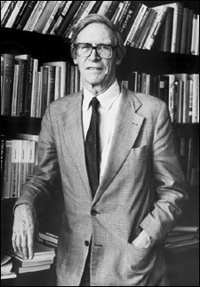
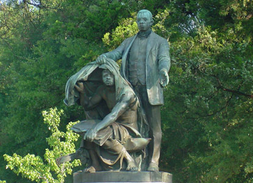

Title: Um réttlætiskenningu John Rawls
Slug: um-rettlaetiskenningu-john-rawls
Date: 2007-09-27 12:53:00
UID: 183
Lang: is
Author: Jón Heiðar Gunnarsson
Author URL: 
Category: Heimspeki
Tags: John Rawls, stjórnspeki, réttlæti, Samfélag, fávísisfeldur, fjalldalaregla, siðferði, fjölhyggja, stjórnskipulag, Heimspeki, einstaklingshyggja

Þann 24. nóvember næstkomandi verða 5 ár liðin frá því að stjórnspekingurinn John Rawls féll frá. Af því tilefni er nánast lífsnauðsynlegt fyrir allt hugsandi fólk að fræðast örlítið um þennan merka hugsuð sem skipar sér klárlega í flokk með áhrifaríkustu og mikilvægustu stjórnspekingum allra tíma.

Rawls gerði kenninguna að ævistarfi sínu og hún var í sífelldri endurbyggingu og endurskoðun allt til dauðadags hans. Eins og gefur að skilja mun ég aðeins getað stiklað á stóru í þessari grein sökum plássleysis og því eingöngu fjallað um helstu aðalatriðin, toppinn á ísjakanum.

Rawls taldi réttlæti vera mikilvægasta gildi samfélagsins og að flestir menn hefðu einhverja hugmynd um réttlæti og einhvern skilning á því að nauðsynlegt sé að búa við samfélagsreglur. Rawls trúði ekki á breytilegt réttlæti á milli samfélaga heldur trúði hann að til væri algilt réttlæti sem væri til óháð tíma og rúmi og næði yfir alla menn. Kenning hans er tilraun hans til að nálgast þetta eina „sanna“ algilda réttlæti.

Rawls skilgreindi réttlætiskennd sem ríkjandi tilhneigingu til að breyta eftir lögmálum réttlætisins. Fólk öðlast réttlætiskennd í gegnum uppeldi sitt, þar sem fjölskyldan er mikilvægust og þar á eftir menntastofnarnir. Með kærleiksríku fjölskyldulífi er hægt að innleiða börnum sjálfsvirðingu og réttlætiskennd. Tengslin á milli foreldris og barns eru af náttúrulegum toga og því lítur Rawls á að réttlætiskenndin sé manninum eðlislæg.

Í kenningu Rawls má aldrei ganga á rétt einstaklingsins til frelsis og þeirra tækifæra sem að réttlætið hefur tryggt honum þó svo að það geti aukið heildarvelferð almennings. Rawls vildi skapa aðferðafræðilegar aðstæður sem myndu stuðla að algjörum jöfnuði og algjöru réttlæti fyrir alla menn án þess að brjóta gegn almennri réttlætis- og siðferðiskennd og eins og með allar góðar hugmyndir þá var hugmynd Rawls frekar einföld.

Rawls kynnti okkur fyrir hugartilraun sem að getur, a.m.k. fræðilega séð, stuðlað að jöfnuði einstaklinga. Rawls sá fyrir sér svokallaða upphafsstöðu þar sem hópur af skynsömu fólki kemur saman og leggst undir svokallaðan „fávísisfeld“ (veil of ignorance, einstaklega skemmtileg íslensk þýðing þar sem orðið feldur hefur frekar verið valið í staðinn fyrir orðið slæða, orðið hefur þannig beina skírskotun í Þorgeir ljósvettningargoða) og semur þar saman nýjar samfélagsreglur. Þessi fávísisfeldur  er sannkallað galdratæki því einstaklingur sem liggur undir slíkum feldi missir alla þekkingu um sína eigin stöðu í samfélaginu en heldur hins vegar eftir góðri almennri þekkingu um efnahagslega, sálfræðilega og félagslega þætti mannlegs lífs. Með öðrum orðum þá missir einstaklingurinn t.d. alla vitneskju sína er varðar hvaða stétt, kyn eða kynþætti hann tilheyrir og hvaða hæfileika hann búi yfir en heldur eftir almennri þekkingu um hvað henti mannlegu samfélagi.

Þessir samningsaðilar koma því ekki til með að vita hvar þeir munu lenda í samfélaginu sem þeir skapa og því „neyðast þeir“, sökum eiginhagsmuna,  til að skapa sanngjarnt og réttlátt samfélag þar sem að fóki er ekki mismunað eftir handahófskenndum vöggugjöfum líkt og fæðingarstað og hæfileikum. Viðkomandi samningsaðili gæti nefnilega sjálfur tilheyrt einhverjum minnihlutahópi þegar að hann stígur undan feldinum, gæti t.d. verið greindarskertur sjónvarpsmaður í fátækrahverfi Kazakhstan. Allir þessir skynsömu einstaklingar sem að liggja undir feldunum verða svo að koma sér saman um sanngjarnar grunnreglur fyrir samfélagið sín á milli.

Upphafsstaðan og fávísisfeldurinn eiga þannig að stuðla að fullkomnu réttlæti og að fullkomnum jöfnuði allra og eiga að koma í veg fyrir að sumir hafi ósanngjarnt forskot í réttlátu samfélagi.  Rawls tekur það fram að það sé ekki hægt að þvinga, blekkja eða neyða einstaklingana í upphafstöðunni. Grunnur samfélagsins verður því byggður algjörlega frjálsum og jöfnum borgurum og þannig reynir Rawls að nálgast hið eina sanna algilda réttlæti.

Rawls telur að í þessari upphafstöðu myndu einstaklingarnir koma sér saman um eina megin reglu, hina svokölluðu fjalldalareglu. Hún kveður á um að lágmarkið sé hámarkað eða eins og Þorsteinn Gylfason þýddi svo skemmtilega: „að fjöllin mega hvorki vera hærri né tignarlegri en þarf til þess að dalirnir séu sem blómlegastir.“ Hún gengur út á það að hvar sem þess er kostur skuli velja að hið versta verði sem skást.

Af fjalldalareglunni dregur Rawls tvö meginlögmál:
Fyrra lögmálið er svo hljóðandi: Hver þegn skal hafa sama rétt og hinir til fyllsta frelsis sem er samrýmanlegt sama frelsi hvers manns.

Síðara lögmálið segir til um hvenær félagslegur og fjárhagslegur ójöfnuður er réttlætanlegur. Lögmálið er tvíþætt, í fyrsta lagi er slíkur ójöfuður eingöngu réttlætanlegur ef að hann er bundinn stöðum og embættum þar sem að allir hafa sömu tækifæri til að sækja um. Í öðru lagi þá er er líka ójöfnuður réttlætanlegur þegar að hann er þeim til hagsbóta sem að eru lægst settir í samfélaginu.

Kenning Rawls er því ekki altæk siðferðiskenning og hún á einungis að vera grunndvallarskipulag fyrir samfélagið. Kenningin á við um nútíma fjölhyggjusamfélag þar sem leita þarf samkomulags um grundvallarréttindi milli mismunandi hópa með ólík lífsviðhorf og mismunandi gildi.  Mismunandi borgarar eru sammála um sameiginlegt grundvallar stjórnarskipulag en hafa svo ólík lífsgildi þar fyrir utan t.d. mismunandi trúarskoðanir og allskonar menningarmun og eru frjálsir til að lifa lífi sínu eins og þeir kjósa. Kenningin setur einstaklingum og stofnunum einungis ytri mörk og aðhald en það er gríðarlega mikilvægt að inn á við lúta þau eigin markmiðum og stefnum.

Rawls leit á að náttúruleg og félagsleg misskipting gæða væri einfaldlega náttúruleg staðreynd sem að yrði ekki breytt þar sem að það er nánast ómögulegt að breyta því að einhver fæðist t.d. fatlaður , fátækur eða hæfileikaríkur. Rawls aðhyllist hinsvegar jafnaðarstefnu og samkvæmt henni þá er allur náttúrulegur og félagslegur ójöfnuður bæði óréttlætanlegur og ósanngjarn.  Það á enginn að líða á ósanngjarnan hátt fyrir óheppni sína og enginn að hagnast á ósanngjarnan hátt fyrir heppni sína í vöggugjafa-happdrættinu. Það verður því að skapa samfélag þar sem fullkomlega jöfn tækifæri eru fyrir alla og þessvegna þarf samfélagið að bæta einstaklingnum upp mismikla náttúrulega hæfileika og félagslega misskiptingu af því að enginn á meðfædda hæfileika sína eða félagsleg forréttindi skilið. Velgengi manna á því að ráðast af eigin ákvörðunum við jöfn tækifæri en ekki af tilviljunnarkenndri slembilukku.

Réttlætið kemur fyrst til sögunnar þegar stofnanir samfélagsins reyna að bregðast við þessum náttúrulegu staðreyndum og reyna að bæta fólki upp fyrir óheppni í lukkuhjóli lífsins. Rawls telur sanngjarnast að mannlegir hæfileikar séu sameign allra manna og eigi að vera öllum til hagsbóta en ekki einkaeign þess sem að var svo heppinn að fæðast með þá.

Rawls hefur bæði verið gagnrýndur og lofaður fyrir kenningu sína og þrátt fyrir að vera umdeildur þá er hann óumdeilanlega einn merkasti stjórnspekingur allra tíma. Að mínu mati er stærsti kosturinn við kenningu Rawls sá að kenningin getur staðið gegn og séð í gegnum  ríkjandi strauma og tíðaranda hverju sinni. Kenningin nær einnig að nýta sér eðlislæga einstaklingshyggju mannsins í nyt á snilldarlegan hátt, þar sem að Rawls notar fávísisfeldinn sem tæki til að beina mannlegri eiginhagsmunarsemi í farveg fyrir réttlæti og sanngirni heildarinnar. Að þessu leiti tel ég aðferðina vera ein besta aðferð sem fram hefur komið til að geta gert sér grein fyrir hvað felist í orðum um réttláta og jafna samfélagsskipan.

Eins og áður hefur verið bent á þá er þetta eingöngu hugartilraun og hún sýnir okkur mjög vel hvað einstaklingar í raunveruleikanum virðast hafa eðlislæga tilhneigingu til að vera litaðir af mótandi þáttum líkt og t.d. uppruna, uppeldi í afstöðu sinni. Kaldur raunveruleikinn er því miður sá að hinn algerlega hlutlausi maður er einfaldlega ekki til en aðferð Rawls hjálpar okkur tvímælalaust að reyna til að rísa upp yfir þessa hluti og gefur okkur smá innsýn í hvernig sannarlega jafnir og frjálsir borgarar myndu hugsa. Það tel ég vera hollt fyrir alla menn þar sem að misskipting gæða á milli jarðarbúa er gríðarleg og hæstu fjöllinn drepa og níðast á blómunum sem voru það óheppin að vaxa neðst í dalnum.

---

#### Heimildir

* Kymlicka, Will.  _Contemorary political philosophy — an introduction_,  Clarendon Press, Oxford. 1997.
* Kymlicka, Will.  _Justice in political philosophy II_,  Aldershot, Elgar,  c 1992.
* Rawls, John. _A Theory of justice_, Clarendon Press, Oxford. 1972.
* Rawls, John. _A theory of Justice_, Oxford University Press, Oxford. 1999.
* Vilhjálmur Árnason, „Í leit að lýðræði“. 1991. Í:  _Skírnir ný tíðindi hins íslenzka bókmenntafélags_, 165. ár, haust, 1991, s. 474-479.
* Vilhjálmur Árnason 1953 „Smíðsgripir Rawls og Kants : viðbragð við erindi Halldórs Guðjónssonar, "Gagnrýni opinberrar skynsemi,"“ á vegum Siðfræðistofnunar Háskóla Íslands, Odda 101, 13. maí 1997. 1997. Í:  _Hugur_, 9. ár, 1997, s. 104-108.
* Þorsteinn Gylfason 1942-2005 „Hvað er réttlæti? : handa Halldóri Laxness áttræðum“. 1984. Í:  _Skírnir ný tíðindi hins íslenzka bókmenntafélags_, 158. ár, 1984, s. 159-222.
