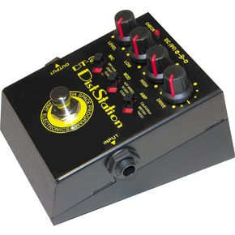

Title: Um skemmdarverk þýðenda
Slug: um-skemmdarverk-thydenda
Date: 2008-07-10 10:55:21
UID: 352
Lang: is
Author: Tinna Ásgeirsdóttir
Author URL: 
Category: Þýðingafræði
Tags: Antoine Berman, trials of the foreign, þýðingar, aflagandi tilhneigingar

Í síðustu grein var farið yfir hugmyndir Berman úr fyrri hluta greinar hans “Trans&shy;lation and the trials of the foreign” um hlutverk þýðinga og þann eilífa vanda sem felst í þýðingum og rök&shy;greiningar&shy;að&shy;ferðina sem hann hefur þróað til að greina það sem miður fer í þýðinga&shy;ferlinu. Berman greinir í nútíma&shy;þýðingum mismunandi tilhneigingar sem aflaga þýðingar og hér er fjallað um síðari hluta greinarinnar þar sem til&shy;hneigingar&shy;nar eru taldar upp og Berman útlistar hvaða áhrif þær hafa.

Ein tilhneigingin er hagræðing sem hefur áhrif á setningar&shy;fræði&shy;lega byggingu. Í prósa er greinar&shy;merkja&shy;setning mjög inni&shy;halds&shy;ríkur og breytilegur þáttur en hagræðing hefur m.a. í för með sér að setningar eru endurbyggðar og þeim endurraðað samkvæmt ákveðinni hugmynd um röklega röð. Þar sem setninga&shy;bygging er tiltölulega frjáls er hætta á að henni verði hagrætt. Hagræðing eyðileggur m.a. að mati Berman lagskiptingu prósans, fjölrökkerfi tungumála og það með hvaða hætti prósinn kafar ofan í djúpin og vill hann því meina að hagræðing aflagi frumgerðina með því að eyða grund&shy;vallar&shy;til&shy;hneigingu hennar.

Önnur aflagandi tilhneiging er skýring sem virðist í augum margra þýðenda og rithöfunda vera sjálfgefið lögmál og kemur fram í þýðingum annars vegar sem birting einhvers sem er falið eða bælt í frumgerðinni, kjarni sem þýðing dregur fram, og hins vegar sem skýring á því sem ekki er útskýrt í frumgerðinni, útskýring á því sem ekki vill verða skýrt. Hreyfing frá margræðni til tærleika er ein gerð af skýringu og þýðing sem umorðar eða útskýrir er önnur.

Víkkun er sú gerð aflögunar sem teygir á frumgerðinni. Hverri þýðingu hættir til að verða lengri en frumgerðin og er það að hluta til afleiðing hinna tveggja fyrrnefndu aflagana, hagræðingar og skýringar. Hagræðing og skýring krefjast nefnilega víkkunar, opnunar á því sem er „lokað“ í frumgerðinni. Frá sjónarhorni frumtextans má hins vegar skilgreina þessa víkkun sem „tóma“ og segist Berman meina að viðbótin bæti engu við, hún auki bara heildarmassa textans og sé blaður hannað til að kæfa eigin rödd verksins. Útskýringar geta gert textann „skýrari,“ en í rauninni gera þær hans eigin gerð af skýrleika óskýrari. Enn fremur teygir víkkunin og dregur úr þannig að hrynjandi verksins skaðast og er þetta því oft kallað að ofþýða.

Göfgun er enn ein gerðin af aflögun. Í ljóðlist birtist göfgun í því að ljóðið er gert “ljóðrænna” en í prósa felst göfgun frekar í „orðfimi“ eða „málsnilld.“ Frumtextinn er þá notaður sem hráefni í fágaðra málfar. Göfgun er endurskrift og æfing í stílbrögðum sem grundvallast á frumgerðinni. Þetta tíðkast bæði í bók&shy;mennta&shy;geiranum og í hugvísindum þar sem framleiddir eru textar sem eru læsilegri og lausir við upprunalegan klaufaskap og flækjur. Ein hliðstæða göfgunar en jafnframt rökleg andstæða hennar er þegar texti hefur verið ranglega metinn sem „að&shy;gengi&shy;legur“ en þá er gripið til þess að þýða með gervislangri eða talmáli til að auka aðgengi&shy;leikann.

Þegar hugtökum, framsetningum og mynstrum er skipt út fyrir eitthvað sem hefur ekki sömu fyllingu eða sambærilegan íburð kallar Berman það eigind&shy;leika&shy;rýringu. Til dæmis má þýða perúska orðið chuchumeca með pute (hóra) og merkingin kemst til skila en hljóð&shy;fræði&shy;legur merkingar&shy;sann&shy;leikur orðsins gerir það ekki. Ef þessi háttur er hafður á heilu verki þá er stórum hluta af merkingar&shy;að&shy;ferð þess og tjáningar&shy;hætti eytt, einmitt því sem lætur verk tala til okkar.

Aflögun sem veldur svokallaðri lesrýrnun nefnist megind&shy;leika&shy;rýring. Prósaverk inniheldur fjöldann allan af táknum og táknkeðjum sem eru að ákveðnu leyti óstöðug þar sem mörg tákn geta vísað til þess sem táknað er. Ef þýðandi tekur ekki eftir táknheimi verksins og þýðing inniheldur færri tákn en frumgerðin þá er hún um leið rýrari. Þýðing sem hugar hins vegar að lesáferð verks og leshætti þess stækkar það. Það að eitthvað glatist samrýmist líka vel þeirri aukningu í magni eða massa textans sem fylgir víkkun.

Enn önnur gerð aflögunar er eyðilegging á hrynjandi en Berman telur prósa ekki hafa minni hrynjandi en ljóð. Þvert á móti innihaldi skáldsagan margskonar hrynjandi. En Berman telur skáldsöguna vera á hreyfingu sem erfitt er að eyðileggja í þýðingu. Þetta segir Berman vera eina af skýringum þess hvers vegna góð en jafnframt illa þýdd skáldsaga getur samt sem áður gagntekið okkur. Hins vegar eru ljóðlist og leiklist viðkvæmari fyrir þessari aflögun. Aflagandi þýðing getur þó haft töluverð áhrif á hrynjandi í skáldsögu eins og ef greinar&shy;merkja&shy;setning er endurskoðuð með geð&shy;þótta&shy;kenndum hætti.

Bókmenntaverk hefur að geyma falda vídd, texta sem liggur að baki, þar sem ákveðin tákn kallast á, tengjast og mynda alls kyns kerfi undir yfirborði augljósa textans, þess sem er lesinn. Þessar undir&shy;liggjandi keðjur mynda eina hlið á hrynjandi og táknaðferð textans og ein gerð aflögunar er eyðilegging á þessu undir&shy;liggjandi kerfi merkingar. Ákveðin orð geta komið með löngu millibili, til dæmis ákveðnar gerðir sagnorða sem mynda ákveðið kerfi. Höfundur getur notað ákveðin sagnorð, lýsingarorð og nafnorð þótt hann forðist önnur. Ef slíkum kerfum eru ekki gerð skil þá er ákveðin táknaðferð verksins eyðilögð.

Kerfisbundið eðli texta nær til fleira en tákna, myndhvarfa og þess háttar. Það nær líka yfir setninga&shy;gerðir og það hvaða gerðir setninga&shy;byggingar eru notaðar og ein gerð aflögunar er eyðilegging á mynstri tungumáls. Hagræðing, skýring, víkkun og fleiri aflaganir eyðileggja kerfisbundið eðli texta með því að bæta við þáttum sem eðlislægt kerfið á í raun að útiloka. Afleiðingarnar eru þær að þegar þýddur texti er einsleitari en frumgerðin (eða þegar stíllinn er betri eins og það heitir) þá er hann jafnframt sundurlausari og á ákveðinn hátt misleitari og ósamkvæmari. Hann verður misleitur samtíningur mismunandi skrifa þýðandans og því á þýðing á hættu að virka á sama tíma einsleit og sundurlaus. Vönduð textagreining á frumtexta og þýðingu hans sýnir að þýðingar&shy;skrifin eru ókerfisbundin eins og skrif nýgræðings. En í tilfelli þýðinga þá er þetta ókerfisbundna eðli ekki augljóst því það er falið bakvið það sem enn stendur eftir af tungu&shy;mála&shy;mynstri frumtextans. En að baki þessum leifum skortir þýðinguna helstu einkenni texta, þá aðallega kerfisbundið eðli hans. Eyðilegging á mynstri tungumálsins, setninga&shy;gerðum og setninga&shy;byggingu, hlýtur þá að hafa í för með sér að hrunið er algjört. Textinn verður enn sundurlausari og hefur ekki einu sinni yfirbragð kerfisbundins texta.
Önnur algeng aflögun er eyðilegging sértungukerfa eða framand&shy;gerving þeirra. Prósi á sér yfirleitt rætur í sértungu eða þjóðtungu og eyðing eða aflögun sértungu er því alvarlegt skemmdarverk á texta prósaverks. Hin hefðbundna aðferð við að geyma þjóðtungur er að framandgera þær og getur framand&shy;gervingin falist í skástrikun sem ekki er í frumtextanum eða í því að sérstök áhersla er lögð á sértunguna til að gera þýðinguna meira sannfærandi. Einnig er algengt að þýða erlenda sértungu með innlendri en að mati Berman heldur sértunga fast í rætur sínar og það er ekki hægt að þýða hana yfir á aðra sértungu.

Prósi er yfirfullur af orðtökum, myndum, málsháttum og þvíumlíku sem rekja má að einhverju leyti til sértungu og eyðilegging á orðtökum og málfari er ein gerð aflögunar. Flest á sér hliðstæðu í öðrum tungumálum og það reynist þá auðvelt að þýða. En jafnvel þótt merking sé sú sama þá er augljóst að það að þýða málfar með jafngildu málfari er þjóðhverfa. Það að leika sér með jafngildi felur að mati Berman í sér árás á frumtextann. Auðvitað getur málsháttur átt sér hliðstæður í öðrum tungumálum en þessar hliðstæður þýða ekki málsháttinn. Að þýða er ekki að leita að jafngildi eða hliðstæðum. Berman vill jafnframt meina að við höfum máls&shy;háttar&shy;vitund sem þekkir samstundis ekta málshátt þótt ókunnur sé og að hægt sé að stækka og auðga máls&shy;háttar&shy;heim okkar með að þýða málshætti í stað þess að finna hliðstæður þeirra.

Síðasta aflögunin sem Berman tiltekur er eyðing á lagskiptingu tungumáls. Lagskipting tungumála í skáldsögu felst til að mynda í sambandi mállýsku og almenns máls og þessari lagskiptingu getur staðið ógn af þýðingu. Það gætir tilhneigingar til að eyða blöndunni af spennu og samþættingu sem er á milli undir&shy;liggjandi máls og yfirborðsmáls og þýðandi þarf því að yfirvega textann mjög vandlega. Hvert einasta bókmenntaverk einkennist af þessari lagskiptingu tungumálsins og safnar saman margvíslegum orðræðum, margvíslegum málum og margvíslegum röddum.

Þessar tilhneigingar skarast augljóslega margar hverjar og stundum er erfitt að sjá mikinn mun á þeim og af hverju til&shy;hneigingarnar eru tólf en ekki tíu eða jafnvel sex en þessi útlistun er auðvitað stuttaraleg og skautað hratt yfir efnið. Einnig læðist að manni sá grunur að Berman hafi svo margt út á þýðingar að setja að ekki sé til sú þýðing sem raunverulega stenst kröfur hans og að líklega væri ógerlegt að þýða skáldverk þannig að Berman þóknaðist það og lesandi hefði einnig af því ánægju. Það breytir hins vegar ekki því að flest það sem hann tiltekur um vanda þýðinga og þær aflaganir sem hann telur upp eru raunveruleg vandamál sem steðja að þýðingum á öllum málsvæðum og á hverjum tíma fyrir sig og er nokkuð sem þýðendur eiga að vera meðvitaðir um ætli þeir sér að takast á við þraut hins framandi og þýða svo vel sé gert.
