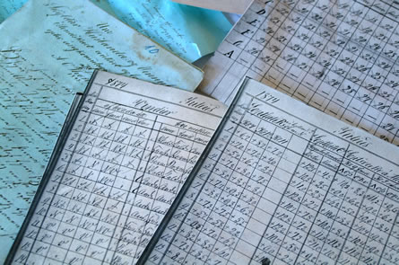

Title: Um skoplegar firrur, hjávísindi og vanþekkingu héraðsskjalavarðar
Slug: um-skoplegar-firrur-hjavisindi-og-vanthekkingu-heradsskjalavardar
Date: 2008-01-22 14:20:00
UID: 209
Lang: is
Author: Óli Gneisti Sóleyjarson
Author URL: 
Category: Í umræðunni, Bókasafns- og upplýsingafræði
Tags: 

Ég fór ekki á fyrirlestur Hrafns Svein&shy;bjarnar&shy;sonar hjá Sagn&shy;fræðinga&shy;félaginu um skjalavörslu „Syndaflóðið kemur“ þann 15. janúar síðastliðinn en þegar ég heyrði af óánægju meðal bókasafns- og upplýsinga&shy;fræðinga ákvað ég að lesa yfir hið skrifaða eintak fyrir&shy;lestursins  sem aðgengilegt er á [heima&shy;síðu Sagn&shy;fræðinga&shy;félagsins](http://www.sagnfraedingafelag.net). Í fyrir&shy;lestrinum er Hrafn stórorður um marga hluti. Einna harðorðastur er hann í garð skjalastjóra. Þetta er greinilega hræðilegt fólk sem gerir mikinn „óskunda“. Ég er ekki alveg með á hreinu hvaðan Hrafn hefur heimildir sínar um nám í skjalastjórn innan bókasafns- og uppl&shy;ýsinga&shy;fræði sem hann kallar „hjávísindi“, en allavega virðist hann hafa afar þokukenndar hugmyndir um það.[^1]

Tökum hér dæmi af því hvernig Hrafn fjallar um skiptingu skjala í virk og óvirk skjöl. Hann segir:

> „Þess vegna finnst skjalavörðum svolítið skoplegt þegar fólki dettur sú firra í hug að skipta skjölum í virk og óvirk skjöl eftir aldri, eins og einhver geti séð fram í tímann og ákveðið þetta í eitt skipti fyrir öll.“

Nú veit ég ekki hvað Hrafn heldur að þessi hugtök sem við bókasafns- og upp&shy;lýsinga&shy;fræðingar notum þýði en það er nú frekar einfalt. Virk skjöl eru þau sem eru í daglegri notkun og þarf að vera hægt að nálgast á örfáum mínútum. Óvirk (og hálfvirk) skjöl eru þau sem ekki er verið að nota dagsdaglega og má geyma þar sem tekur lengri tíma að nálgast þau. Ekkert kemur í veg fyrir að óvirk skjöl verði aftur flokkuð sem virk. 

Aldur er síðan ekkert höfuðatriði í þessum málum en vissulega eru eldri skjöl yfirleitt minna notuð en yngri. Þetta er þessi „skoplega“ „firra“ sem Hrafn talar um.

Hrafni finnst líka ákaflega slæmt að í skjalastjórn í bókasafns- og upp&shy;lýsinga&shy;fræði sé haldið fram kostum tölukerfa með óendanlegum út&shy;víkkunar&shy;mögu&shy;leikum þar sem Þjóð&shy;skjala&shy;safnið vilji ekki slíkt. Hrafn lítur alveg framhjá því að kostir hins óendanlega kerfis eru ótvíræðir og alþjóðlegur staðall um upplýsingar, skjalfestingu og skjalastjórn _ISO 15489_ sýnir dæmi um þess háttar kerfi. Tölukerfi með óendanlega stækkunar&shy;mögu&shy;leika gerir mönnum kleyft að bæta sífellt við nýjum flokkum eftir því sem þarfir breytast. Þjóð&shy;skjala&shy;safnið kýs frekar tugstafakerfi (sem er reyndar líka kennt í bókasafns- og upp&shy;lýsinga&shy;fræði) sem hefur takmarkaða stækkunar&shy;mögu&shy;leika. Það er sama hve vel er staðið að gerð skjalakerfa fyrir lifandi skjalasafn, enginn getur séð framtíðina fyrir og því er betra að vera ekki innilokaður með kerfi sem hefur takmarkaða stækkunar&shy;mögu&shy;leika. Hvers vegna ætti ekki að halda á lofti kostum kerfis sem er einfaldlega betra?

Uppspretta misskilnings Hrafns er að mörgu leyti sá að hann virðist ekki átta sig á að nám í skjalastjórn á að undirbúa bókasafns- og upp&shy;lýsinga&shy;fræðinga undir að starfa bæði hjá hinu opinbera og einkaaðilum. 

Þetta skýrir líklega að í fyrirlestri sem fjallar að mestu um varðveislu opinberra skjala talar hann um grisjunar&shy;áætlanir sem eiga bara við þegar um skjalasöfn einkaaðila er að ræða. Það er rétt að leggja áherslu á það að það hefur aldrei verið kennt annað í bókasafns- og upp&shy;lýsinga&shy;fræði en að fara eigi eftir lögum um varðveislu gagna í opinberum söfnum. Í raun er lögð mjög mikil áherslu á þetta atriði. Einnig er nemendum kynnt stefna Þjóð&shy;skjala&shy;safns og farið í heimsókn á safnið. Hrafn segir hins vegar að kennt sé að „eðlilegt [sé] að grisja 95% af þeim skjölum sem mynduð eru [og að h]in 5 prósentin [séu] svokölluð söguleg skjöl“ eins og þetta eigi við um skjalastjórn hjá opinberum stofnunum. Það er bara alls ekki rétt.

Mig grunar reyndar að hjá einka&shy;fyrir&shy;tækjum gæti það verið rétt að 5-10% séu söguleg skjöl (þumal&shy;putta&shy;reglu um hve stórt hlutfall skjala hafa sérstakt gildi). Þetta þýðir ekki að öllum öðrum gögnum sé sjálfkrafa eytt. Ég tel hins vegar að grisjun sé ákaflega mikilvæg í skjalasöfnum fyrirtækja. Ef við tökum dæmi af verslunum þá er stór hluti af þeim skjölum sem verða til þar kassastrimlar sem þarf að geyma í sjö ár lögum samkvæmt. Nú get ég ekki útilokað að einhver sagnfræðingur fram&shy;tíðarinnar gæti haft gagn og gaman af því að rúlla þeim í sundur og skoða hvernig innkaupin voru í fortíðinni en mig grunar að þær hafi hvort eð er fölnað um of áður en til þess kemur. Þessum gögnum er eðlilegt að eyða. Síðan má líka nefna að mörg skjöl eru til í margriti og ekkert að því að eyða auka eintökum. Allt slíkt er hluti af eðlilegri grisjun skjalasafna fyrirtækja.

Þetta eru nú aðalatriðin sem ég vildi gera athugasemdir við og ég leyfi ekki ergelsi mínu að taka völdin af mér þannig að ég fari að tína til allar sneiðarnar sem komu frá Hrafni í fyrir&shy;lestrinum.

Það er samt rétt hjá Hrafni að það eru margar hættur sem þeir sem starfa að skjala&shy;stjórn/skjala&shy;vörslu verða að vera meðvitaðir um. Yfirleitt er það vegna þess að enginn hefur umsjón með skjala&shy;söfnunum eða einfaldlega vegna þess að þau eru neðarlega í for&shy;gangs&shy;röðinni. Það þarf samstarf til að leysa þessi mál og ég vona að sagn&shy;fræði&shy;menntaðir skjalaverðir séu jafn tilbúnir í slíkt og bókasafns- og upp&shy;lýsinga&shy;fræði&shy;menntaðir skjala&shy;stjórar. Það er allavega ljóst að það gerir engum gagn að ráðast á stétt manna og fræðigrein með rógi og vanþekkingu að vopni, slíkt eitrar bara fyrir gagnlegri samvinnu. Mál&shy;flutningurinn lyktar líka af því að höfuðmarkmið Hrafns sé að reyna að koma á einokun sagnfræðinga á skjala&shy;sviðinu. En ef samvinna kemur ekki til greina hjá Hrafni ætti hann allavega að halda sig við heiðarlega samkeppni hugmynda, þekkingar og kunnáttu á sviðinu en láta ósannindin vera.

[^1]: Fyrir óinnvígða er væntanlega erfitt að skilja muninn á skjalavörslu og skjalastjórn. Í Háskóla Íslands eru þetta tvær aðskildar greinar. Í sagnfræði er kennd skjalavarsla en skjalastjórn er innan bókasafns- og upp&shy;lýsinga&shy;fræðinnar. Skjalastjórn á sinn sess innan bókasafns- og upp&shy;lýsinga&shy;fræðinnar á heimsvísu, Norður-Ameríku, Evrópu og Ástralíu. Fyrir utan þá tvo fimm eininga kúrsa sem fjalla einungis um skjalastjórn eru fjölmörg skyld námskeið í boði s.s. lyklun, skráning og flokkun. Einnig er boðið upp á sérstaka aukagrein: Upplýsinga- og skjalastjórn hjá skipu&shy;lags&shy;heildum.

