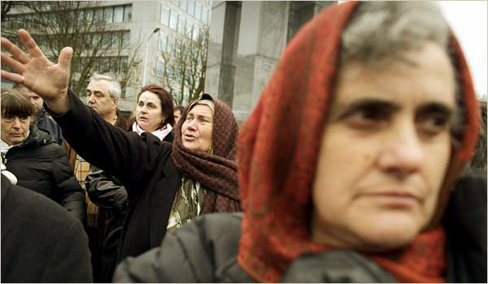
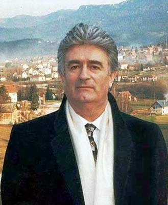

Title: Umfjöllun um bókina They Would Never Hurt a Fly eftir Slavenku Drakulić
Slug: umfjollun-um-bokina-they-would-never-hurt-a-fly
Date: 2008-10-21 12:21:12
UID: 720
Part: 1/2
Lang: is
Author: Svanhildur Anja Ástþórsdóttir
Category: Bókmenntir, Sagnfræði
Tags: Balkanskagi, Serbía, Króatía, Bosnía, Hersegóvína, Makedónía, Svartfjallaland, Slóvenía, Tito, Joseph Tito, They Would Never Hurt a Fly, Júgóslavía, Slavenka Drakulić, stríðsglæpir, stríðsglæpadómstóll, Haag, nauðganir, stríð, borgarastríð, minningar, sameiginlegar minningar, minni, collective memory, söguskoðun, sögumótun, stríðsglæparéttarhöld, Sameinuðu Þjóðirnar, Radovan Karadžić, þjóðarmorð, Franjo Tudjman, goðsagnir, Kommúnismi, þjóðerni, þjóðernishyggja, hryðjuverk, NATÓ, Gorans Jelisic, múslimar, Albert Eichman, Nürnbergréttarhöldin, Christophers Browning, Ordinary Man

Söguskoðun í ríkjum fyrrum Júgóslavíu og áhrif hennar á afstöðuna til stríðsglæpa og ímynd stríðsglæpadómstólsins í Haag.

## 1. hluti 

Stríðið á Balkaskaga á tíunda áratug síðustu aldar hefur mótað söguskoðun ríkjanna sem byggðu Júgóslavíu: Serbíu, Króatíu, Bosníu og Hersegóvínu, F.J.L. Makedóníu, Svartfjallalands, Slóveníu og Kósóvó. Þrátt fyrir að eining og bræðralag hafi einkennt sambýlið á tímum leiðtogans Jóseps Tito og árin eftir að hann lést árið 1980 urðu þau þjóðernisstefnu að bráð og upp úr sauð á milli landanna og stríð braust út árið 1991. Í bókinni _They Would Never Hurt a Fly_ sem kom út árið 2004 eftir Slavenku Drakulić er fjallað um það frá ýmsum hliðum hvernig ríki fyrrum Júgóslavíu takast á við minningar stríðsins einkum er varða stríðsglæpi er framdir voru af öllum þjóðarbrotum á stríðstímanum. Þá ræðir hún einnig þá mynd sem ríkin í fyrrum Júgóslavíu draga upp af stríðinu og ímynd þeirra á stríðsglæpadómstólnum í Haag. Drakulić sem er króatískur rithöfundur og blaðakona hefur gefið út nokkrar bækur sem fjalla um stríðið í fyrrum Júgóslavíu en lagt áherslu á reynsluheim fórnarlamba, til dæmis fjallar bókin _S._ frá árinu 2000 um múslimskar konur sem voru fórnarlömb skipulagðra nauðgana í Bosníu á stríðstímanum. Í bókinni _They Would Never Hurt a Fly_ er athyglin á gerendum en hún dvaldi í fimm mánuði í Haag og fylgdist með réttarhöldum yfir stríðsglæpamönnum. Það sem vakti fyrir henni þegar bókin var skrifuð var fyrst og fremst að koma í veg fyrir það að glæpirnir er voru framdir féllu í gleymsku og mótmæla því sem hún telur of ráðandi í sögumótun ríkja fyrrum Júgóslavíu, að breiða yfir og gleyma því ljóta.

Bók Slavenku Drakulić og stríðið í fyrrum Júgóslavíu rifjaðist upp þann 21. júlí 2008 þegar fyrrum forseti Serbíu, Radovan Karadžić var handtekinn í Belgrad rúmum þrettán árum eftir að ákæra var gefin út á hendur honum af stríðsglæpadómstól Sameinuðu þjóðanna um stríðsglæpi framda í stríðinu í Júgóslavíu (ICTY). Í fréttatilkynningu dómstólsins í kjölfar handtökunnar var meðal annars greint frá því að þessi handtaka væri stór áfangi þar sem Karadžić er í hópi þeirra sem taldir eru hafa skipulagt stríðsglæpi með beinum hætti. Handtakan var einnig sögð stórt skref í átt að helsta markmiði dómstólsins, að ná fram réttlæti til handa fórnarlömbum stríðsins.

30\. júlí var Karadžić framseldur til stríðsglæpadómstólsins sem hefur aðsetur í Haag í Hollandi þar sem ákæran á hendur honum um þjóðarmorð, glæpi gegn mannkyni og stríðsglæpi verður tekin fyrir. Hann hefur kosið að verja sig sjálfur og vill ekki viðurkenna lögsögu stríðsglæpadómstólsins.

### Er sökin allra?

Í upphafi bókarinnar ræðir Slavenka Drakulić hver eigi í raun sök á stríðinu í fyrrum Júgóslavíu og það sem svo margir hafa reynt að fá svar við, hvernig slíkt stríð gat brotist út í Evrópu þegar það átti að heita óhugsandi. Hún vill meina að almenningur hafi átt mjög stóran þátt í því að stríðið hófst, með því að taka þátt í aðgerðum, óviljugur eða viljugur – það skipti ekki máli á meðan fólk hafi spilað með og þannig gert stríð mögulegt. Það er grundvallaratriði að mati Slavenku að venjulegt fólk hafi gert stríðið mögulegt, ekki nokkrir brjálaðir einstaklingar. Í framhaldi spyr hún þeirrar spurningar hvort að það sé ef til vill of auðveld leið að senda ákveðinn fjölda einstaklinga fyrir stríðaglæpadómstólinn í Haag? En það er eitt helsta markmið dómstólsins, að ná til þeirra sem skipulögðu stríðsglæpina með beinum hætti og hann gefur aðeins út ákærur á hendur einstaklingum þar sem lögð er á það áhersla í markmiðslýsingu dómstólsins að koma í veg fyrir það að heil þjóð álíti sig seka um stríðsglæpi. En Drakul? spyr hvernig líta megi á almenning sem tileinkaði sér eða studdi þá hugmyndafræði sem varð til þess að mikill fjöldi lét lífið eða lifir nú í skugga stríðsins sem fórnarlömb eða aðstandandi þeirra. Og hvað um þann fjölda einstaklinga sem studdu aðgerðir ekki beint en mótmæltu svo sannarlega ekki? Ef það er rétt að ekki sé til sameiginleg sök, er þá til eitthvað sem heitir sameiginlegt sakleysi? Almenningur í ríkjum fyrrum Júgóslavíu er ekki sekur sem slíkur þó að hann beri nokkra ábyrgð á því ástandi sem skapaðist og gerði stríð mögulegt. Í þessu sambandi bendir höfundur á að í Serbíu hafi Slobodan Miloševi? tvisvar verið kjörinn forseti og Króatar jafnframt kosið Franjo Tudjman í tvennum kosningum. Úr því að Þjóðverjar hafi verið taldir ábyrgir fyrir því að Hitler komst til valda, gildi þá ekki það sama í Króatíu og Serbíu? Geta Króatar og Serbar, líkt og Þjóðverjar skýlt sér á bak við það að þeir hafi ekki vitað hvað átti sér stað? Drakulić vill meina að fólk hafi vitað og það sé einkum ástæða þess að það vilji ekki ræða stríðsglæpina sem voru framdir eða stríðið almennt. Það hafi allir haft val og langflestir einfaldlega valið vitlaust. 

### Mótun söguskoðunar

Er einhver saga réttari en önnur? Þetta er spurning sem Drakulić varpar fram í framhaldi af þeirri staðreynd að almennt eigi ríkin í fyrrum Júgóslavíu erfitt með að gera upp fortíðina og þess í stað sé tilhneigingin að breiða yfir og byrja upp á nýtt. Saga þessa svæðis sé blönduð goðsögnum, áróðri stjórnmálaafla og einkennist umfram allt af þöggun. Frá því að stríðinu lauk árið 1995 hafi höfundur séð að enn hafi átt að „núllstilla“ söguna. Í fyrstu hafi þetta gerst eftir lok seinni heimsstyrjaldar, þá eftir kommúnísku byltinguna, því næst eftir að kommúnisminn hrundi er allir áttu að gleyma því sem hann hafi staðið fyrir og hefja nýtt upphaf með árið 1990 sem byrjunarreit. Í Króatíu vilji fólk helst ekki ræða stríðið og láti eins og ekkert hafi gerst. Stjórnmálamenn tali um að „snúa við blaðinu og byrja með hreinan skjöld“. Líkt og hún sjálf upplifði að geta ekki spurt spurninga á sínu æskuheimili er tengdust seinni heimsstyrjöldinni fái komandi kynslóðir ekki svör við sínum spurningum og verði að púsla saman brotum ýmissa sagna sem margar hverjar eru tilbúnar, ýktar eða afskræmdar. Þannig verði ekki til nein saga, heldur aðeins minni.

Kennslubækur í Króatíu munu sjálfsagt fjalla um stríðið sem var háð fyrir heimalandið, sem varnarstríð. Og þar sem það var háð í vörn, hafi króatískir hermenn ekki getað framið stríðsglæpi. Í það minnsta sé þetta sú söguskoðun sem hafi viðgengist og hafi ekki breyst þrátt fyrir dauða forsetans þjóðernissinnaða Franjos Tudjman árið 1999. Stúlka í Serbíu verði vafalaust alin upp í sömu afneitun ef hún spyr spurninga tengdar stríðinu. Trúlega fengi hún þó að vita allt um árásir NATO á Serbíu og þeirra eigin stríð gegn hryðjuverkum í Kósóvó.

---

#### Heimildir:

* _Ársskýrslur International Criminal Tribunal for the Former Yugoslavia 1994-2007___ (Annual Reports) á vefslóðinni: http://www.un.org/icty/publications-e/index.htm
* Drakulic, Slavenka: _They Would Never Hurt a Fly_ (London: Viking, 2004).
* Scharf, Michael P. Og William A. Schabas: _Slobodan Milosevic on Trial: A Companion_ (New York: Continuum, 2002). 
* Simpson, Eileen: „Stop the Hague: Internal versus external factors suppressing the advancement of the rule of law in Serbia“ _Georgetown Journal of International Law_, 36, 4 (sumar 2005), bls. 1255-1287. 
* _Statute of the International Criminal Tribunal for the Former Yugoslavia_ á vefslóðinni: http://www.un.org/icty/legaldoc-e/basic/statut/stat11-2004.htm#2 
* Upplýsingar  ICTY um mál Radovan Karadžić á vefslóðinni: http://www.un.org/icty/latest-e/pressindex.htm
* Wald, Patricia M.: „General Radislav Krstic: A War Crimes Case Study“ _The Georgetown Journal of Legal Ethics_, 16, 3 (vor 2003), bls. 445-472. 
* Wilson, Richard Ashby: „Judging History: the Historical Record of the International Criminal tribunal for the Former Yugoslavia“ _Human Rights Quarterly_, 27, 3 (ágúst 2003), bls. 908-942.
* Zoglin, Katie: „The Future of War Crimes Prosecutions in the Former Ygoslavia: Accountability or Junk Justice?“ _Human Rights Quarterly_, 27, 1 (febrúar 2005), bls. 42-77.

