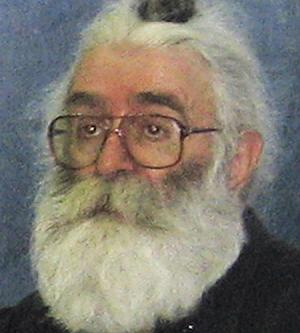

Title: Umfjöllun um bókina They Would Never Hurt a Fly eftir Slavenku Drakulić
Slug: umfjollun-um-bokina-they-would-never-hurt-a-fly
Date: 2008-10-23 11:14:30
UID: 732
Lang: is
Part: 2/2
Author: Svanhildur Anja Ástþórsdóttir
Category: Bókmenntir, Sagnfræði
Tags: They Would Never Hurt a Fly, Slavenka Drakulić, Júgóslavía, Bosnía, Þýskaland, nauðganir, stríð, borgarastríð, stríðsglæpir, S, Adolf Eichman, Haag, stríðsglæpadómstóll, Goran Jelisic, Br?ko, Hersegóvína, Hanna Arendt, Report on the banality of evil, Nürnbergréttarhöldin, Christopher Browning, Ordinary Man, Pólland, Heimstyrjöldin síðari, Radovan Karadžić, Dragan Dabić, Belgrad, Srebrenica, Slobodan Milosevic, Tudjman, Króatía, Serbía, Sameinuðu Þjóð

Söguskoðun í ríkjum fyrrum Júgóslavíu og áhrif hennar á afstöðuna til stríðsglæpa og ímynd stríðsglæpadómstólsins í Haag.

## 2. hluti 

### Skrímsli, hetjur eða venjulegt fólk?

Í bók sinni _They Would Never Hurt a Fly_ skrifar Slavenka Drakulić út frá gerendum en ekki fórnarlömbum stríðsins í fyrrum Júgóslavíu á árunum 1991-1995. Áður hafði hún fyrst og fremst fjallað um stríðið út frá fórnarlömbum og taldi að slík umfjöllun ein gæti varpað ljósi á hörmungarnar sem fylgja stríði. Þegar höfundurinn var í Þýskalandi að kynna bók sína _S_. sem fjallar um konur sem voru fórnarlömb skipulagðra nauðgana í stríðinu, varpaði einn áheyrenda fram þeirri spurningu hvort að hún hefði aldrei hugsað sér að skrifa út frá sjónarhóli gerenda. Svarið sem var: „Nei, það myndi ég aldrei gera“. Viðbrögð hennar sjálfrar vöktu hana til umhugsunar um það hvort að það væri hægt að skilja gerðir stríðsglæpamanna og hvort að það ætti á annað borð að reyna það? Einnig fjallar hún um tilhneigingu fólks almennt til að vilja stimpla stríðsglæpamenn sem ófreskjur, manneskjur sem fremji slík brot geti ekki verið verið eins og við hin. Ef við viljum trúa því að gerendurnir séu skrímsli er það vegna þess að við viljum búa til sem mesta fjarlægð milli þeirra og okkar sjálfra. 

Titill bókarinnar er tilvísun í réttarhöld við stríðsglæpadómstólinn í Haag í máli hins serbneska Gorans Jelisic, sem var dæmdur í fjörutíu ára fangelsi fyrir stríðsglæpi gegn múslimum er voru framdir í Br?ko, bæ nyrst í Bosníu og Hersegóvínu árið 1992. Vitni sem var eitt af þeim er leitt var fyrir dóminn til varnar við Jelisic taldi hann ekki þá manngerð sem hefði getað gert flugu mein, hvað þá mannfólkinu.  Þetta er raunin í málum margra stríðsglæpamanna og það sem Slavenka leggur áherslu á, hvernig geta venjulegar manneskjur skipulagt eða framkvæmt slíka glæpi?

Þar sem sagan virðist því miður oftar en ekki endurtaka sig má sjá að þessi tilhneiging er ekki ný af nálinni. Dæmi um slíkt er til dæmis bók Hönnu Arendt Eichmann in Jerusalem: _A Report on the Banality of Evil_ sem fjallar um réttarhöldin yfir þýska stríðsglæpamanninum Adolf Eichmann, einnig var dregin upp ómannlega mynd af stríðsglæpamönnum sem voru sakfelldir í Nürnbergréttarhöldunum sem haldin voru eftir seinni heimsstyrjöld. Sama meginstef er í bók bandaríska sagnfræðingsins Christophers Browning _Ordinary Man_ sem fjallar um sveitir þýskra hermanna í seinni heimsstyrjöldinni og fjöldamorð er framin voru í Póllandi í seinni heimsstyrjöldinni. Hið sama má sjá í máli Karadžić, sem hafði tekið upp nýtt nafn og hafið nýtt líf sem Dragan Dabić, síðhærður og fúlskeggjaður læknir sem stundaði óhefðbundnar lækningar í Belgrad. Engan hafði grunað að þar færi maðurinn sem hafði fengið viðurnefnið „bosníski slátrarinn“ og er meðal annars talinn hafa skipulagt fjöldamorð á 7000 múslimskum karlmönnum í Srebrenica árið 1995. Eftir handtökuna voru birt viðtöl við fólk sem hafði kynnst Dragan Dabić eða jafnvel aðeins séð til hans í Belgrad. Í þessum viðtölum var einkum reynt að draga fram hvort þessu fólki hefði ekki þótt eitthvað athugavert við manninn, stríðsglæpamaður hlyti að vera frábrugðinn okkur hinum þrátt fyrir dulargervi. En enginn hafði orðið var við neitt undarlegt, hvað þá horn og hala! Fólki fannst hann óvenju hárprúður það var allt. Slavenka Drakulić ræðir í bók sinni fáránleika þessarar „skrímslatúlkunar“ og viðurkennir að sjálf hafi hún staðið sig að því að reyna að afskræma mannlegt eðli þeirra einstaklinga sem voru sakfelldir í þeim málum sem hún fylgdist með í Haag. Það hafi verið erfitt að horfa á þessa einstaklinga í dómsalnum og sjá að þetta var ósköp venjulegt fólk, en ekki blóðþyrst illmenni. Undantekningin hafi þó verið í tilviki fyrrum forseta Serbíu Slobodans Miloševi? sem hafi uppfyllt þessi ímynduðu skilyrði algerlega. Höfundur telur þessa þörf okkar til að búa til ófreskjur úr þessum aðilum tilkomna vegna þess að við viljum ekki viðurkenna að venjulegt fólk geti skipulagt eða framkvæmt svo hrottalega glæpi. Við viljum geta verið viss um að það sé meðfætt óeðli manneskjunnar sem verði til þess að hún geti skipulagt eða framkvæmt nokkuð svo hrottalegt eins og þá glæpi sem framdir hafa verið í stríðum. Við viljum ekki horfast í augu við það að við ákveðnar aðstæður, líkt og skapast í stríði geti ósköp venjulegt fólk framkvæmt hroðalegustu hluti. Hvað myndi ég gera ef ég yrði sett í sömu stöðu spyr Drakulić sjálfa sig og lesanda? Svarinu er erfitt að kyngja: við getum ekki vitað það. 

Í ljósi þeirrar söguskoðunar sem ríkir enn meðal íbúa fyrrum Júgóslavíu kemur ekki á óvart að stríðsglæpamenn séu af mörgum álitnir hetjur heima fyrir. Handtöku og framsali Radovans Karadžić var til að mynda mótmælt harðlega af þjóðernissinnum í Belgrad síðastliðið sumar. Á forsetatíma Tudjman í Króatíu á árunum 1990 til dauða hans árið 1999 var rekinn áróður fyrir því að þeir sem væru eftirlýstir af stríðsglæpadómstólnum væru í raun hetjur. Framsal yfirvalda á meintum stríðsglæpamönnum ætti ekki að túlka sem viðurkenningu yfirvalda á sekt þeirra, heldur eftirgjöf vegna mikils utanaðkomandi þrýstings. Það að standa með þessum aðilum sem grunaðir voru um stríðsglæpi og viðurkenna ekki lögsögu stríðsglæpadómstólsins hefur orðið einkenni föðurlandsástar. Slavenka vill meina það að þessi átök milli réttlætisins og sannleikans hafi miklar stjórnmálalegar afleiðingar, einkum í Serbíu og Króatíu. Vandinn er einnig sá að hluti þeirra sem hafa verið sakfelldir eða eru eftirlýstir af stríðsglæpadómstólnum í Haag trúa því ekki að þeir hafi framið stríðsglæpi heldur hafi verið að þjóna hagsmunum föðurlandsins. Á meðan ekki er almennur vilji í þessum ríkjum til þess að fletta ofan af hlutunum má ekki vænta mikilla breytinga.

### Réttlætið í gíslingu pólitískra hagsmuna

Stríðsglæpadómstóll Sameinuðu þjóðanna sem fer með mál fyrrum Júgóslavíu var stofnaður árið 1993 og hefur ávallt verið mjög umdeildur meðal þjóðanna í fyrrum Júgóslavíu, einkum Króatíu, Serbíu og Bosníu. Samvinnan hefur þó aukist síðustu ár fyrst og fremst vegna pólitískra hagsmuna en það er eitt af skilyrðum fyrir inngöngu í Evrópusambandið að ríkin sýni betri samvinnu og gangi harðar fram í því að handsama þá sem eftirlýstir eru fyrir stríðsglæpi og framselja til Haag. 

Þannig hefur mörgum, einkum fórnarlömbum stríðsins sviðið það að réttlætið sem stríðsglæpadómstóllinn hefur að markmiði að ná fram sé svo bundið stjórnmálalegum hagsmunum og innanríkismálum ríkjanna. 

Flestir eru á þeirri skoðun að nauðsynlegt hafi verið að setja stríðsglæpadómstólinn á stofn vegna þess að yfirvöld í fyrrum ríkjum Júgóslavíu hafi verið ófær eða óviljug að ákæra þá aðila sem grunaðir voru um að hafa skipulagt eða framið stríðsglæpi og dæma í málum þeirra. Dómskerfi þessara ríkja hefur einkennst af spillingu og stjórnmálalegum þrýstingi auk þess sem almenningur ber almennt ekki mikið traust til dómstóla. Það er einnig vandamál að víða í fyrrum Júgóslavíu eru þeir sem eru grunaðir um stríðsglæpi enn starfandi innan opinbera kerfisins. Það er því nokkuð ljóst að það mun ekki verða auðvelt að færa lögsöguna frá Haag til dómstóla heima fyrir eins og stefnt er að árið 2010 þegar áætlað er að stríðglæpadómstóllinn ljúki störfum. Það má setja spurningarmerki við það, hvort að það ár sé raunhæft lokamarkmið í ljósi þess að þeir sem hafa fjallað um málið eru yfirleitt á þeirri skoðun að staðan í ríkjum fyrrum Júgóslavíu hafi ekki breyst nægilega mikið til þess að geta tekist á við þessi mál. En þetta snýst ekki bara um lög og reglur og mannlegi þátturinn virðist oft hverfa í þessari umfjöllun fræðimanna, sem verður oftar en ekki mjög „klínísk“, lagaflækjur raktar eða önnur formsatriði. Tæknilegum atriðum í dómsal er lýst í þaula, líkt og verið sé að fjalla um tæknisýningu og öllum þeim hörmungum sem urðu til þess að stríðsglæpadómstóllinn var settur á stofn fá litla umfjöllun. Í bók Slavenku Drakulić verður þessi grundvallarþáttur þó aldrei út undan en hún vill meina að á meðan fórnarlömb stríðsins fái ekki nægilega athygli og aðstoð sé ekki verið að gera rétt. Hún álítur stríðsglæpadómstólinn í Haag nauðsynlegt tæki í þá átt að réttlæti nái fram að ganga en líkt og svo margir sem hafa fjallað um efnið telur hún kerfið ekki gallalaust og á meðan dómstóllinn hafi lítil sem engin áhrif heima fyrir muni þjóðirnar ekki takast á við þá sögulegu endurskoðun sem hún segir brýna þörf á.

Lokaorð Slavenku Drakulić í bókinni eru í senn sorgleg og kaldhæðnisleg þegar hún segir frá því að í Scheveningen-fangelsinu í Haag sitji fangarnir saman sem jafningjar, þeir sömu aðilar sem voru svarnir óvinir í stríðinu. Aðeins þar sé bræðralag og eining gömlu Júgóslavíu í gildi, á meðan ákvarðanir þeirra urðu til þess að þessi einkunnarorð urðu að engu heima fyrir og til varð sú mikla sorgarsaga sem enn hefur engan endi. 

---

#### Heimildir:

* _Ársskýrslur International Criminal Tribunal for the Former Yugoslavia 1994-2007___ (Annual Reports) á vefslóðinni: http://www.un.org/icty/publications-e/index.htm
* Drakulic, Slavenka: _They Would Never Hurt a Fly_ (London: Viking, 2004).
* Scharf, Michael P. Og William A. Schabas: _Slobodan Milosevic on Trial: A Companion_ (New York: Continuum, 2002). 
* Simpson, Eileen: „Stop the Hague: Internal versus external factors suppressing the advancement of the rule of law in Serbia“ _Georgetown Journal of International Law_, 36, 4 (sumar 2005), bls. 1255-1287. 
* _Statute of the International Criminal Tribunal for the Former Yugoslavia_ á vefslóðinni: http://www.un.org/icty/legaldoc-e/basic/statut/stat11-2004.htm#2 
* Upplýsingar  ICTY um mál Radovan Karadžić á vefslóðinni: http://www.un.org/icty/latest-e/pressindex.htm
* Wald, Patricia M.: „General Radislav Krstic: A War Crimes Case Study“ _The Georgetown Journal of Legal Ethics_, 16, 3 (vor 2003), bls. 445-472. 
* Wilson, Richard Ashby: „Judging History: the Historical Record of the International Criminal tribunal for the Former Yugoslavia“ _Human Rights Quarterly_, 27, 3 (ágúst 2003), bls. 908-942.
* Zoglin, Katie: „The Future of War Crimes Prosecutions in the Former Ygoslavia: Accountability or Junk Justice?“ _Human Rights Quarterly_, 27, 1 (febrúar 2005), bls. 42-77.

